---

# Aris

1. 自我介绍
    - 我是 Aris.

2. 你认为你会完成本次残酷学习吗？
    - 有点困难,不过应该能完成.

## Notes

<!-- Content_START -->

### 2024.09.23

#### 学习内容 第01节
 - 01HelloWeb3.sol 创建 helloWeb3 程序,并在 remix 上进行编译和部署

 - 代码部分

- 

 - 在根目录创建 contracts 目录,创建 .sol 文件,放入上面代码

 - 使用 nodejs 安装 remixd

 - ```
    npm install -g @remix-project/remixd

 - node 安装
   - 下载地址: https://nodejs.org/en/download/prebuilt-installer/current
   - 查看 node 仓库源 `npm config  get registry`
   - 修改 node 仓库源 `npm config set registry https://registry.npmmirror.com`

 - 创建脚本`remix.sh`, 让 `https://remix.ethereum.org` 网站能关联本地文档

 - ```
    DIR=$(cd "$(dirname "$0")"; pwd)
    contracts=${DIR}/contracts
    echo '合约地址:' ${contracts} 
    remixd -s ${contracts} --remix-ide https://remix.ethereum.org
    ```

 - 执行remix.sh

 - ```
    ./remix.sh

 - 编译和部署
   - 使用Google Chrome打开`https://remix.ethereum.org`,左侧 workspace 中选择 `connect to localhost`
   - 然后点击 `connect` 按钮,就会加载出本地 `contracts`目录下的 .sol 文件
   - 点击 `01HelloWeb3.sol`进入文件,然后 `cmd + s`, 会进行编译
   - 点击左侧 `deploy & run transactions` 按钮,点击 `高亮`的 Depoly 按钮
   - 左侧会出现部署结果,点击 `_string` 出现 `'Hi Web3'`,表示成功.

- 也可以在 https://remix.ethereum.org 直接编写代码,然后编译和部署,但是我习惯在本地编写代码^_^

- 第01节测验得分: 100, 答案: BBABCCBA

    ---

### 2024.09.24

#### 学习内容 第02 节: 值类型 第03节:函数类型

- 第02 节: 值类型
  - 值类型: Value Type 
  - 引用类型: Reference Type
  - 映射类型: Mapping Type
  
- 值类型:
  - 布尔型
    - 与`&&`,或`||`,非`!` 等于`=`,不等于`!=`
    - `&&` 和` ||` 遵循短路规则
  - 整形
    - `int`整数, `uint` 正整数, `uint256` 256位正整数
    - 比较运算符: <=, <, >=, >, ==, !=
    - 算数运算符: `+`,` -` , `*` ,`/`, `%`, `**`
  - 地址类型
    - 普通地址: address, 存储一个 20 字节的值(以太坊)
    - payable address: 用于接收转账,有 transfer 和 send 方法
  - 定长字节数组
    - 定长字节数组时值类型,数组长度在声明以后不能改变,分为 bytes1,bytes8,bytes32等,最大bytes 32
  - 枚举 enum
    - 为uint 分配名称,从 0 开始.
  
- 合约部署截图

- 

- 第节: 函数类型

- `function <function name>(<parameter types>) {internal|external|public|private} [pure|view|payable] [returns (<return types>)]`
  - function: 函数声明的固定写法
  - name: 函数名
  - 函数可见性修饰符 (必须指定)
    - public: 内部: 可以, 外部: 可以, 继承: 可以
    - private: 内部: 可以, 外部: 不可以, 继承: 不可以
    - external: 内部: 不可以(通过 `this.f()`调用), 外部: 可以, 继承: 可以
    - internal: 内部: 可以, 外部: 不可以, 继承: 可以
  - 权限关键字
    - pure: 外部变量,不能读,不能写 | 无 gas 消耗 | 注意: 调用任何非标记 pure/view 函数需要支付 gas 费
    - view: 外部变量,能读,不能写 | 无 gas 消耗 | 注意: 调用任何非标记 pure/view 函数需要支付 gas 费
    - payable: 调用函数可以转入 ETH (下面截图中,调用`minusPayable()` 传入了1 个 ETH,合约余额就受到了 1ETH)
  - retuns: 函数返回的变量类型和名称
  
- 合约部署截图

- 

- 第 02 节测验得分 100,答案:C,D,C,B,D

- 第 03 节测验得分 100,答案:

  ---

### 2024.09.25

#### 学习内容 第 04 节:4. 函数输出

1. 返回值: return 和 returns
    - return:函数主体,返回指定变量
    - returns:函数名后面,声明返回的变量类型及变量名

2. 命名式返回
    - 在 returns 中标明返回变量的名称
    - solidity 会初始化这些变量,并且自动返回这些函数的值,无需 return.
    - 也可以在命名式返回中用 retrun 来返回变量

3. 解构赋值
    - 读取所有返回值:声明变量,在`()`中按顺序逗号隔开
    - 读取部分返回值:声明要读取的变量,按顺序,不读的空着.

4. 合约部署
    - 

5. 第 04 节测验得分:100, 答案: ABCBABCB

    ---

### 2024.09.26

#### 学习内容 第 05 节: 5. 变量数据存储和作用域 storage/memory/calldata

1. solidity 中的引用类型
   - 变量类型复杂,占用内存空间大,必须声明变量的存储位置,包括 数组和结构体
2. 数据位置
   - 存储位置有 3 类,storage, memory,calldata
     - storage: 存储在链上,消耗 gas 多,合约的状态变量默认是 storage
     - memory: 函数里的参数和临时变量一般用 memory,存储在内存中,不上链,消耗 gas 少;
       - 如果返回数据类型是变长的情况,必须加 memory 修饰,如 string,bytes,array 和 自定义结构体

     - calldata:存储在内存中,不上链,消耗 gas 少.
       - calldata 变量不能修改(immutable),一般用于函数参数.

   - 数据位置和赋值规则
     - 赋值本质上是创建引用指向本体
     - storage(合约状态变量) 赋值给 storage(函数中变量),会创建引用,同步发生改变.(连体)
     - memory 赋值给 memory 会创建引用,同步发生改变.
     - 其他情况: 赋值创建的是本体副本,修改变量不会影响对方
3. 变量作用域
   - 状态变量
     - 状态变量时声明存储在链上的变量,所有合约函数都可以访问,gas 消耗高

   - 局部变量
     - 局部变量仅在执行过程中的有效变量,函数退出后变量无效,存储在内存中,不上链.

   - 全局变量
     - 全局变量时全局范围内工作的变量,是 solidity 预留关键字,可以在函数内不声明即可使用.
     - blockhash 给定区块的哈希值
     - block.coinbase 当前区块矿工的地址
     - block.gaslimit 当前区块的 gaslimit
     - block.number 当前区块的 number
     - block.timstamp 当前区块的时间戳(unix,秒)
     - gaseleft() 剩余 gas
     - msg.data 完整的 calldata 数据
     - msg.sender 消息发送着
     - msg.sig calldata 的前 4 个字节,就是方法的 hash
     - msg.value 当前发送来的 eth 数量,单位是wei
     - block.blobbasefee 当前区块的 blob 基础费用
     - blobhash(index) 根当前交易关联的目标索引 blob的版本哈希值

   - 全局变量-以太单位与时间单位
     - wei: 1
     - gwei: 1000000000
     - ether: 1000000000000000000
     - seconds: 1
     - minutes: 60 seconds = 60
     - hours: 60 minutes  = 3600
     - days: 24hours = 86400
     - weeks: 7days = 604800
4. 合约部署
   - 
   - 
5. 第 05 节测验得分: 100, 答案: DBACDABA

---

### 2024.09.27

#### 学习内容 第 06 节: 6. 引用类型, array, struct

1. 数组 array
    - 存储一组数据(整数,字节,地址等),分为2 种
        - 固定长度数组:在生命时指定长度
        - 可变长度数组:不指定数组长度
        - 注意: bytes 比较特殊,是数组,但是不另外加`[]` ; 
        - 另外,不能用 byte[]声明单字节数组,可用 bytes 或者 bytes1[]
        - bytes 比 bytes1[] 省 gas
    - 创建数组的规则
        - momery 修饰的动态数组,可以用 new 创建,必须声明长度,声明后长度不可变.
        - 数组字面数(方括号初始化的一种方式),每一个元素类型以第一个元素为准
            - `[1,2,3]` 中所有元素是 `uint8`类型(默认最小单位的类型,这里是 uint8)
            - `[uint(1),2,3]` 所有元素类型是 uint
    - 数组成员
        - length(): 数组长度,memory 数组的长度在创建后是固定的;
        - push(): 动态数组方法,在数组最后添加 0 元素,并返回该元素的引用;
        - push(x): 动态数组方法,在数组最后添加 x 元素;
        - pop(): 动态数组方法,移除最后一个元素;
2. 结构体 struct
    - solidity 支持通过构造结构体的形式定义新的类型;
    - 结构体中的元素可以是原始类型,也可以是引用类型;
    - 结构体可以作为数组或映射的元素
    - 结构体赋值 4 种方法:
        - 在函数中创建 storage 的结构体引用
        - 直接引用专状态变量的结构体
        - 函数构造方式
        - 键值对方式
3. 合约部署-数组
    - 
4. 合约部署-结构体
    - 
5. 第 06 节测验得分: 100, 答案: BCCBCA

---

### 2024.09.28

#### 学习内容 7. 映射类型 mapping

1. 映射 Mapping

    - solidity 中的存储键值对的数据结构(可以理解为哈希表)

2. 映射规则

    - 规则 1:映射的 key 的数据类型只能选择 solidity 内置的值类型,比如 uint, address,不能用结构体;value 的数据列席可以使用自定义类型

        - ```solidity
            struct Student {
            	uint256 id;
            	uint256 score;
            }
            mapping(Student => uint) public testVar; // 报错
            ```

    - 规则 2:映射的存储位置必须是storage,因此可以用于状态变量;不能用于 public 函数的参数或者返回结果中;因为映射记录的是一种键值对关系!!!一种键值对关系!!!一种键值对关系!!!

    - 规则 3:如果映射声明为public,那么,solidity 会自动创建一个 getter 函数,可以通过 key 来查询对应的 value;

    - 规则 4:给映射新增键值对的语法为 `_var[_key] = _val` _var:映射变量名;_key,_val 对应键值对;

3. 映射的原理:

    - 原理 1: 映射不存储任何键(key)的信息,也没有 length 信息;
    - 原理 2: 映射使用 `keccak256(abi.encodePacked(key, slot))`当成 offset 存取 value,这里的 slot 是映射变量定义所在的插槽位置;
    - 原理 3: 因为 Ethereum 会定义所有未使用的空间为 0,所以,未赋值的键初始值是对应数据类型的默认值(例如 uint 的默认值是 0)

4. 合约部署

    - 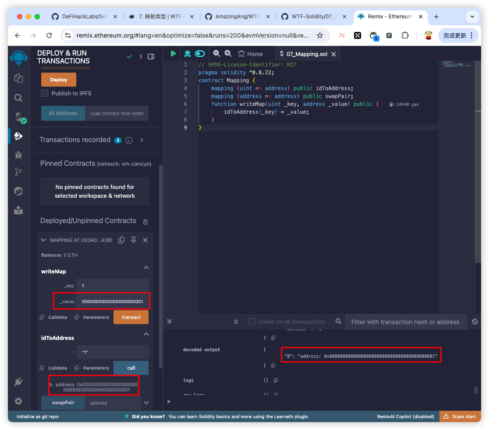

5. 第 07 节测验得分: 100, 答案: BADABB

---

### 2024.09.29

#### 学习内容 8. 变量初始值

在 solidity 中,声明但是没复制的变量都有默认值(初始值)

1. 值类型:
    - boolean: fasle
    - string: ""
    - int: 0
    - uint: 0
    - enum: 第一个元素
    - addres: 0x000000000000000000000000000000 (addres(0))
    - function: 
        - internal: 空白函数
        - external: 空白函数
2. 引用类型:
    - 映射 mapping:其value值数据类型的默认值
    - 结构体 struct:其成员值数据类型的默认值
    - 静态数组: 定长,其成员值数据类型的默认值
    - 动态数组: []
3. delete 操作符
    - delete 操作符会让变量值变为其默认值
4. 合约部署
    - 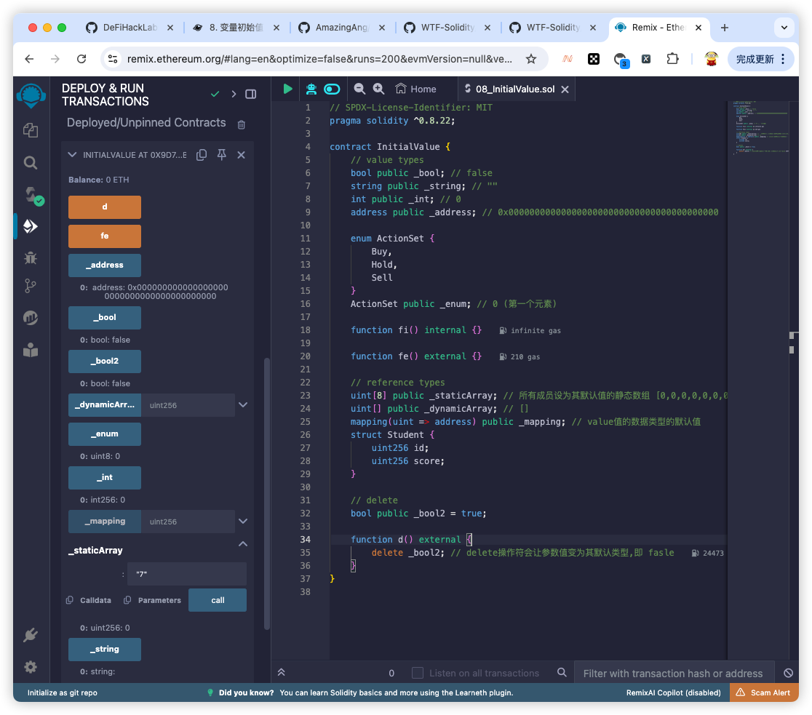
5. 第 08 节测验得分: 100, 答案: CBDDA

#### 学习内容 9. 常数 constant和immutable

1. constant(常量),immutable(不变量)
    - 状态变量声明这两个变量以后,不能在初始化之后再更改;
    - 提升合约安全性
    - 节省 gas 费用
    - 只有数值变量可以声明为 constant 和 immutable
    - string 和 bytes 可以声明为 constant,不能为 immutable
2. constant
    - constant 必须在声明的时候初始化,之后不可变
3. immutable
    - immutable 变量可在声明时或者构造函数中初始化
4. 合约部署
    - 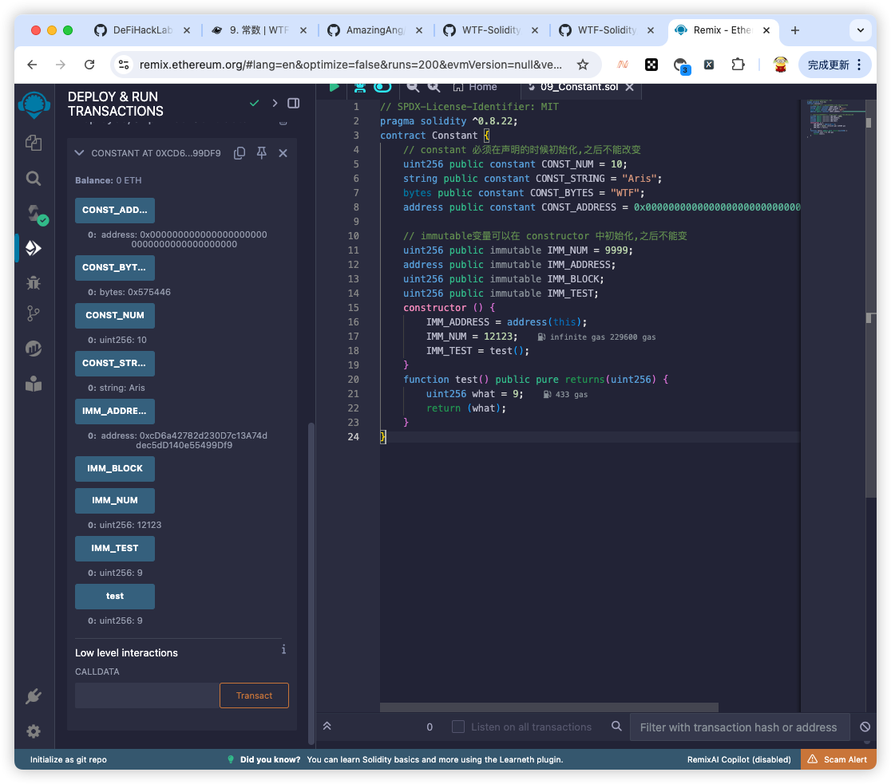
5. 第 09 节测验得分: 100, 答案:ACDDC

---

### 2024.09.30

#### 学习内容 10. 控制流，用Solidity实现插入排序

1. 控制流

    - if-else

    - for

    - while

    - do-while

    - 三元运算符

    - 循环中有 continue 和 break 关键字

2. solidity 插入排序

    - solidity 中 uint 是正整数,无法取到负值,否则报 underflow 错误

    - ```solidity
        function insertionSort(
                uint[] memory a
            ) public pure returns (uint[] memory) {
                for (uint i = 1; i < a.length; i++) {
                    uint temp = a[i];
                    uint j = i;
                    while ((j >= 1) && (temp < a[j - 1])) {
                        a[j] = a[j - 1];
                        j--;
                    }
                    a[j] = temp;
                }
                return (a);
            }
        ```

    - 

3. 合约部署

    - 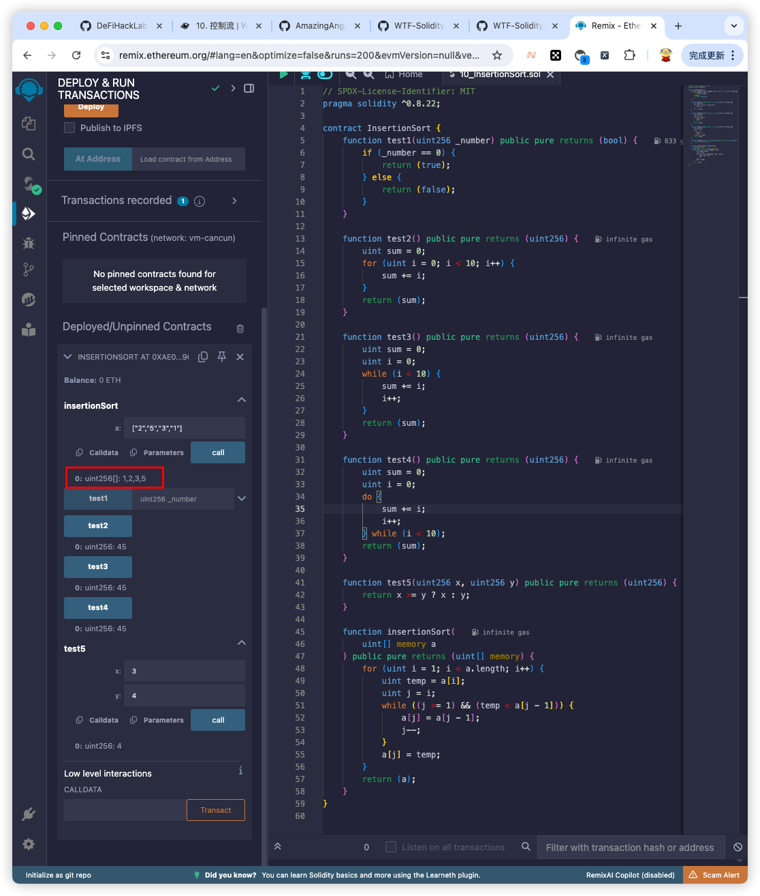

4. 第 10 节测验得分: 100, 答案: CBAEDABC

#### 学习内容 11. 构造函数和修饰器

1. 构造函数

    - constructor,特殊函数,合约中只有一个,且部署合约时只允许一次;

    - 构造函数中可以初始化合约的参数;

2. 修饰器

    - modifier,声明函数拥有的特性,见到代码冗余

    - ```solidity
        // 定义modifier
        modifier onlyOwner {
           require(msg.sender == owner); // 检查调用者是否为owner地址
           _; // 如果是的话，继续运行函数主体；否则报错并revert交易
        }
        ```

    - 

3. 合约部署

    - 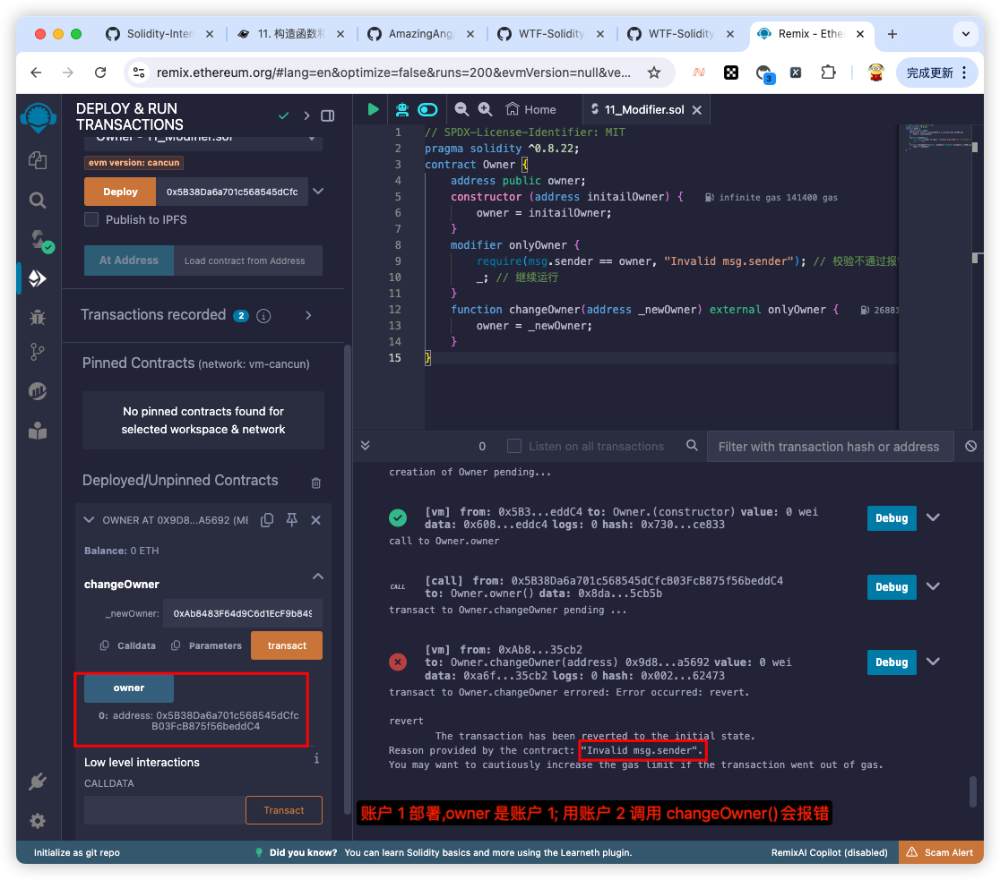

4. 第 11 节测验得分: 100, 答案: BBADB

---

### 2024.10.01

#### 学习内容 12. 事件

1. 事件

    - solidity 中的事件是 evm 上日志的抽象

        - 响应: 应用程序可以通过 RPC 接口订阅和监听这些事件,并做出相应;

        - 经济: 事件是 EVM 上比较经济的存储数据的方式,每个大约消耗 2000gas;(链上存储一个新变量最少 20000gas)

    - 声明事件

        - 事件的声明由 event 关键字开头,事件名,括号中是变量类型和变量名;

        - ```solidity
            event Transfer(address indexed from, address indexed to, uint256 value);
            ```

            - from: 代币转账地址
            - to: 代币接收地址
            - value: 转账数量

        - indexed 关键字: 保存在 EVM 日志的 topics 中,方便检索;

    - 释放事件

        - 使用 emit 释放事件

        - ```solidity
            emit Transfer(from, to, amount);
            ```

2. EVM 日志 Log

    - 日志包含 主题topics 和数据(data)两部分

    - 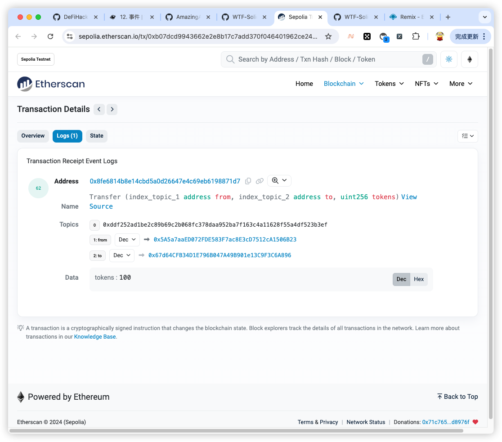

    - 主题 topics

        - 日志第一部分是主题数组,用于描述事件,最大 4;

            - 第一个元素是事件签名哈希

                - ```solidity
                    keccak256("Transfer(address,address,uint256)")
                    //0xddf252ad1be2c89b69c2b068fc378daa952ba7f163c4a11628f55a4df523b3ef
                    ```

            - 主题能包含最多 3 个 indexed 参数 (事件参数中标记 indexed 的from,to)

            - indexed 标记的参数是索引"键",方便搜索.

            - 每个 indexed 参数大小固定 256 比特,超过(例如字符串)则自动计算哈希存储在主题中;

    - 数据 data

        - 事件中不带 indexed 的参数存储在 data 部分,可以理解为"值";
        - data 变量不能被直接检索,但可以存储任意大小的数据;
        - 因此一般 data 部分可以存储复杂的数据结构(例如数组,字符串)
            - 因为这些数据超过了256比特，即使存储在事件的 `topics` 部分中，也是以哈希的方式存储。

        - data 部分的变量数据存储消耗的 gas 比 topics 少.

3. 合约部署

    - 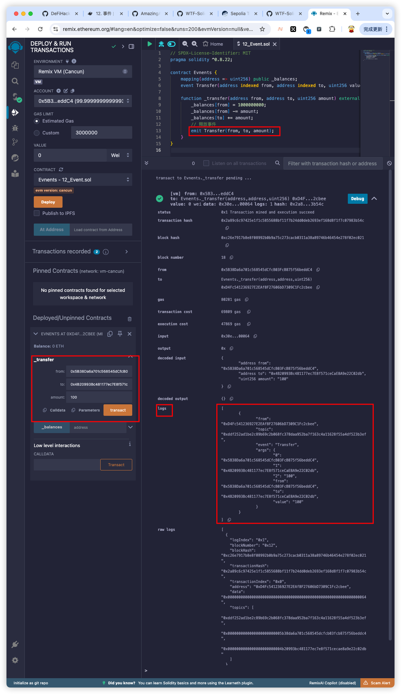

4. 第 12 节测验得分: 100, 答案: CABBA

    - 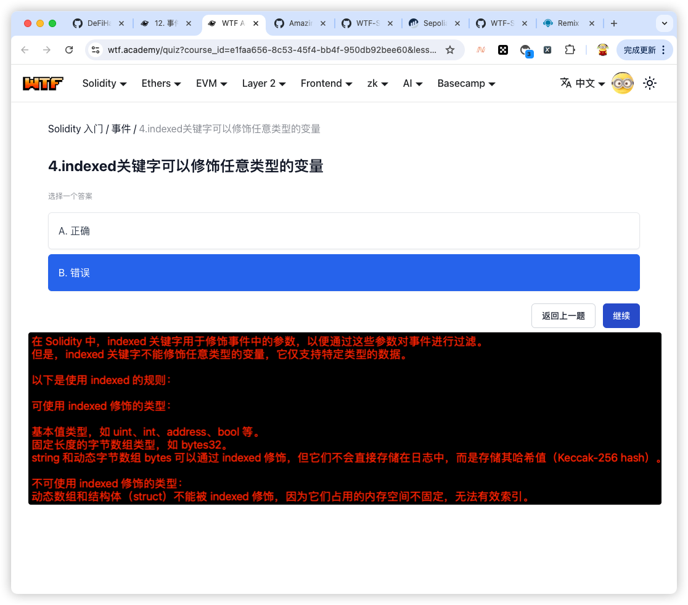


---

### 2024.10.02

#### 学习内容 13. 继承

1. 继承规则

    - virturl:父合约中的函数,如果希望子合约重写,需要加上 virtual 关键字

    - override:子合约重写了父合约中的函数,需要加上 override 关键字

    - 用 override 修饰 public 变量,会重写与变量同名的 getter 函数

        - ```solidity
            mapping(address => uint256) public override balanceOf;
            ```

2. 简单继承

    - Yeye合约,方法添加 virtual 关键字
    - `contract Baba is Yeye` Baba 合约使用 `is` 关键字

3. 多重继承

    - solidity 中合约可以继承多个合约
    - 继承时,按辈分高低从左向右排列 `contract Erzi is Yeye, Baba`
    - 如果某函数在多个继承合约都存在,则子合约中必须重写
    - 子合约重写`父合约中都重名的函数`时,override 关键字后面加上所有父合约名字 `override(Yeye,Baba)`

4. 修饰器的继承

    - Modifier可以被继承,添加 virtual 和 override 关键字;
    - 子合约也可以在代码中修改Modifier

5. 构造函数的继承

    - ```solidity
        // 构造函数的继承
        abstract contract A {
            uint public a;
        
            constructor(uint _a) {
                a = _a;
            }
        }
        ```

    - ```solidity
    // 在继承时声明父构造函数的参数   
        contract B is A(1) {}
      ```

    - ```solidity
        // 在子合约的构造函数中声明构造函数的参数
        contract C is A {
            constructor(uint _c) A(_c * _c) {}
        }
        ```
        
    - 

6. 调用父合约的函数

    - 直接调用: `父合约名.函数名()`
    - super 关键字: `super.函数名()` ,super 是最右边的父合约(继承关系最近)

7. 钻石继承

    - 钻石继承（菱形继承）指一个派生类同时有两个或两个以上的基类
    - 在多重+菱形继承链条上使用`super`关键字时，需要注意的是使用`super`会调用继承链条上的每一个合约的相关函数，而不是只调用最近的父合约。
    - 钻石顶部的合约只被调用一次.
        - 原因是`Solidity`借鉴了Python的方式，强制一个由基类构成的DAG（有向无环图）使其保证一个特定的顺序

8. 合约部署-继承

    - 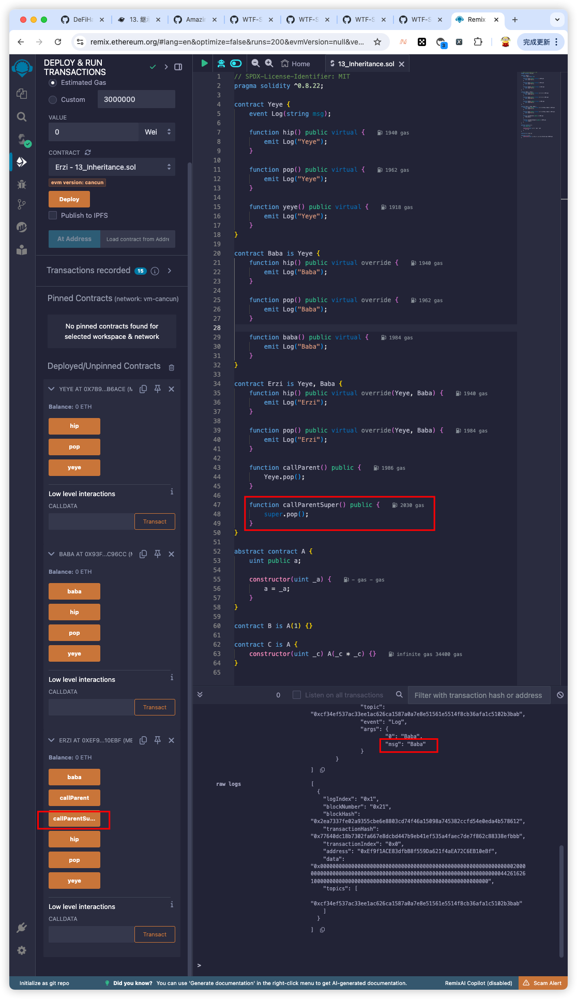

9. 合约部署-修饰器

    - 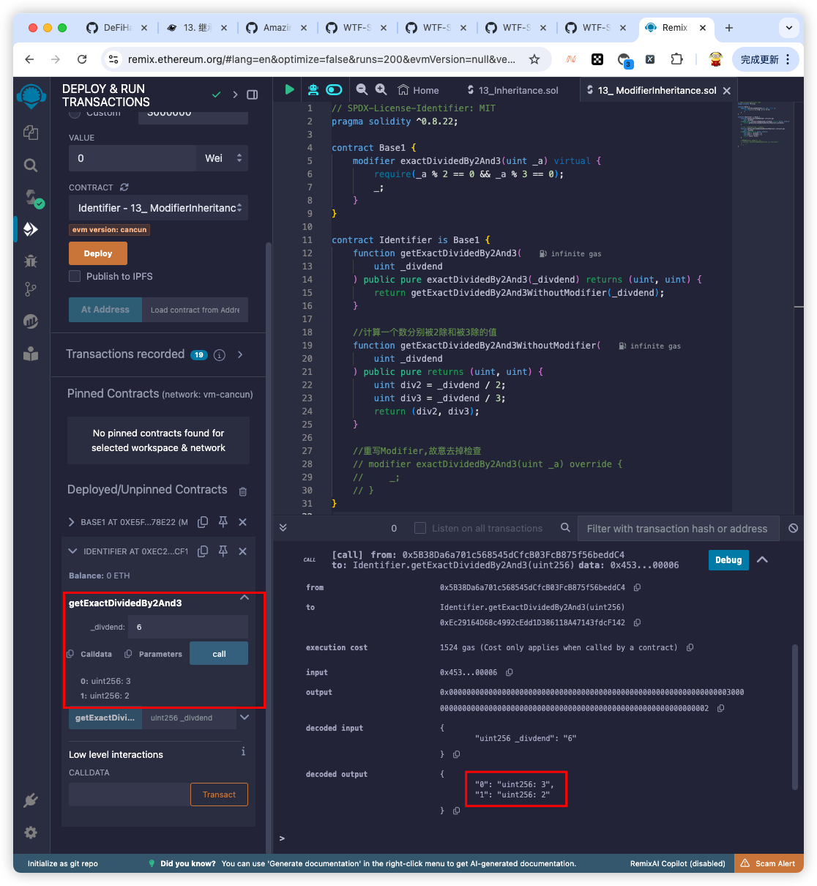

10. 合约部署-钻石继承

    - 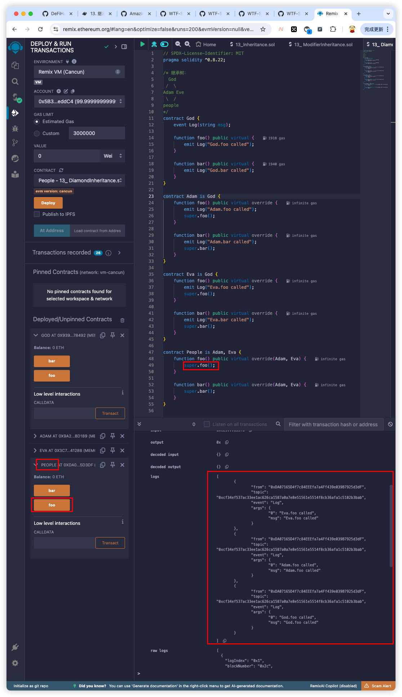

11. 第 13 节测验得分: 100, 答案: ABBBACC

---

### 2024.10.03

#### 学习内容 14. 抽象合约和接口

1. 抽象合约
    - 如果一个智能合约里至少有一个未实现的函数，即某个函数缺少主体`{}`中的内容，则必须将该合约标为`abstract`，不然编译会报错;

    - 未实现的函数需要加`virtual`，以便子合约重写;

2. 接口
    - 不能包含状态变量
    - 不能包含构造函数
    - 不能继承除接口外的其他合约
    - 所有函数都必须是external且不能有函数体
    - 继承接口的非抽象合约必须实现接口定义的所有功能
    - 虽然接口不实现任何功能，但它非常重要。接口是智能合约的骨架，定义了合约的功能以及如何触发它们
        - 合约里每个函数的`bytes4`选择器，以及函数签名`函数名(每个参数类型）`;
        - 接口id

    - 接口与合约`ABI`（Application Binary Interface）等价，可以相互转换;

3. IERC721 事件
    - `ransfer`事件：在转账时被释放，记录代币的发出地址`from`，接收地址`to`和`tokenId`。
    - `Approval`事件：在授权时被释放，记录授权地址`owner`，被授权地址`approved`和`tokenId`。
    - `ApprovalForAll`事件：在批量授权时被释放，记录批量授权的发出地址`owner`，被授权地址`operator`和授权与否的`approved`。

4. IERC721 接口
    - `balanceOf`：返回某地址的NFT持有量`balance`。
    - `ownerOf`：返回某`tokenId`的主人`owner`。
    - `transferFrom`：普通转账，参数为转出地址`from`，接收地址`to`和`tokenId`。
    - `safeTransferFrom`：安全转账（如果接收方是合约地址，会要求实现`ERC721Receiver`接口）。参数为转出地址`from`，接收地址`to`和`tokenId`。
    - `approve`：授权另一个地址使用你的NFT。参数为被授权地址`approve`和`tokenId`。
    - `getApproved`：查询`tokenId`被批准给了哪个地址。
    - `setApprovalForAll`：将自己持有的该系列NFT批量授权给某个地址`operator`。
    - `isApprovedForAll`：查询某地址的NFT是否批量授权给了另一个`operator`地址。
    - `safeTransferFrom`：安全转账的重载函数，参数里面包含了`data`。

5. 什么时候使用接口
    - 如果我们知道一个合约实现了标准接口，我们不需要知道它具体代码实现，就可以与它交互。

6. 合约部署-接口
    - 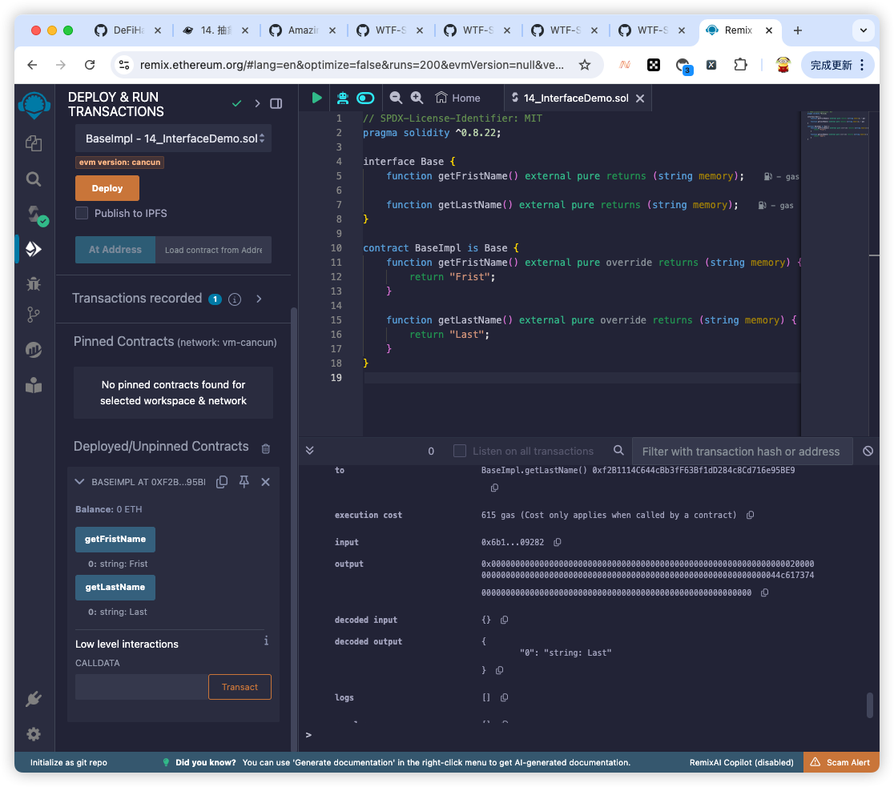

7. 合约部署-抽象合约
    - 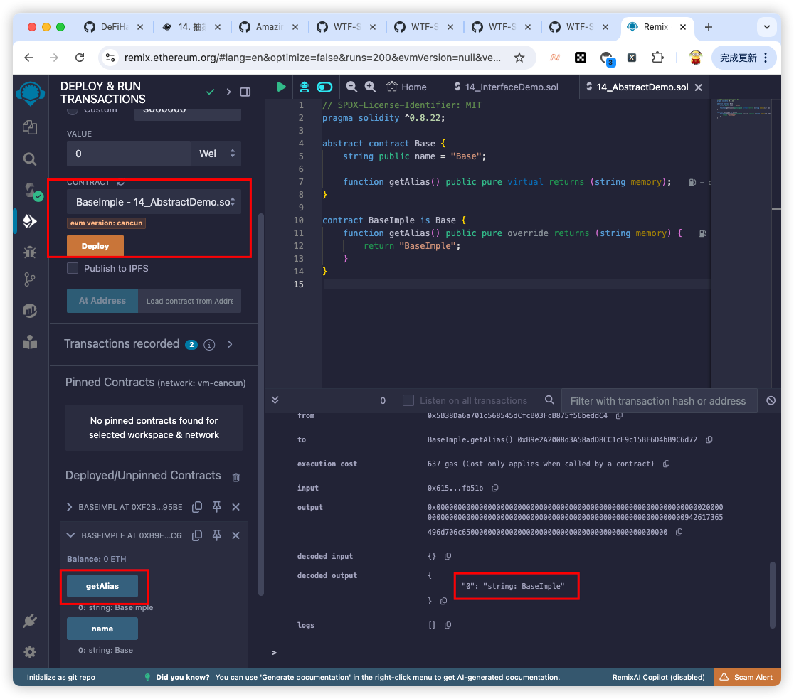

8. 第 14 节测验得分: 100, 答案: ABEEAAA

#### 学习内容 15. 异常

1. Error

    - ```solidity
        error TransferNotOwner(); // 自定义error
        error TransferNotOwner(address sender); // 自定义的带参数的error
        revert TransferNotOwner(); // 在执行当中，error必须搭配revert（回退）命令使用。
        ```

    - gas消耗: 24446 (版本 solidity ^0.8.22 日期:2024-10-03)

2. Require

    - `require(检查条件，"异常的描述")`，当检查条件不成立的时候，就会抛出异常;
    - 唯一的缺点就是`gas`随着描述异常的字符串长度增加，比`error`命令要高;
    - gas消耗: 24739 (版本 solidity ^0.8.22 日期:2024-10-03)

3. Assert

    - `assert(检查条件）`，当检查条件不成立的时候，就会抛出异常;
    - 不能解释抛出异常的原因（比`require`少个字符串）;
    - gas消耗: 24460 (版本 solidity ^0.8.22 日期:2024-10-03)

4. 比较

    - `error`方法`gas`最少，其次是`assert`，`require`方法消耗`gas`最多
    - `error`性价比最高,既可以告知用户抛出异常的原因，又能省`gas`

5. 合约部署

    - 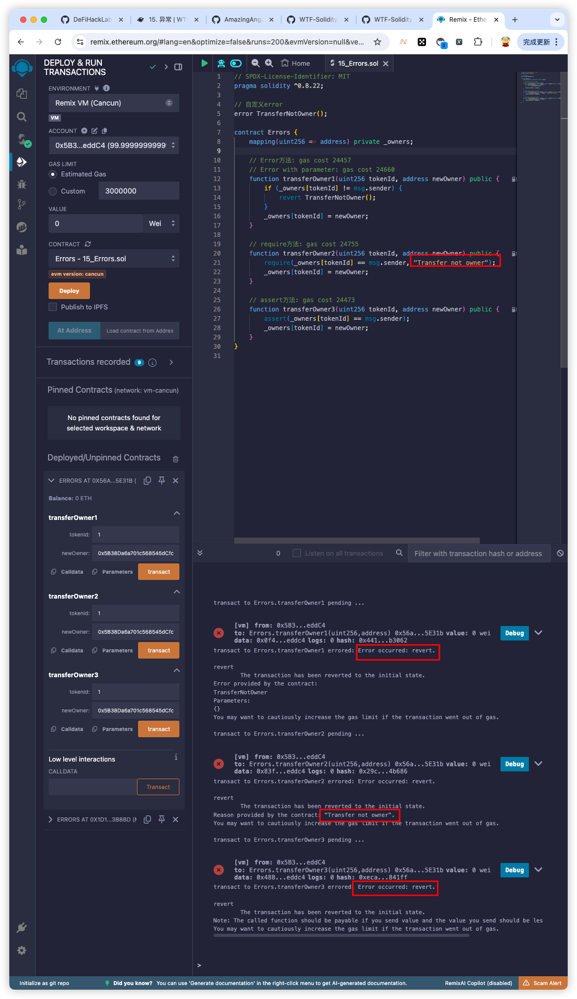

6. 第 15 节测验得分: 100, 答案: DBAABCB

7. solidity101入门课程全部完成

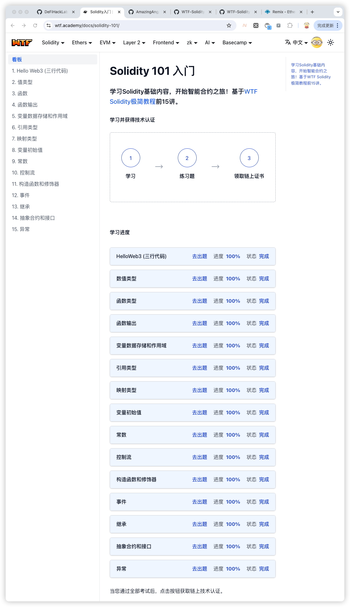

---

### 2024.10.04

#### 学习内容 16. 函数重载

1. 重载

    - overloading,名字相同但输入参数类型不同的函数可以同时存在,被视为不同函数;
    - modifier 不能重载;

2. 函数重载

    - ```solidity
        function saySomething() public pure returns(string memory){
            return("Nothing");
        }
        
        function saySomething(string memory something) public pure returns(string memory){
            return(something);
        }
        ```

    - 因为有不同的参数类型,所以函数选择器不同;

3. 实参匹配

    - 在调用重载函数时，会把输入的实际参数和函数参数的变量类型做匹配。 
    - 如果出现多个匹配的重载函数，则会报错。

4. 合约部署

    - 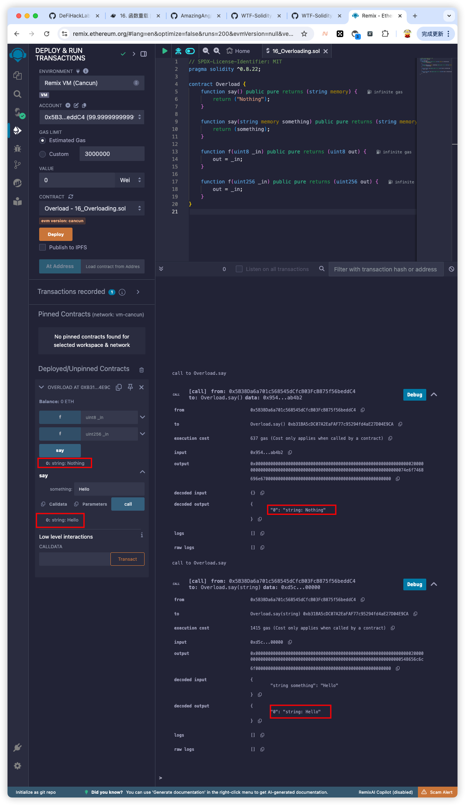

5. 第 16 节测验得分: 100, 答案: ABBBB

#### 学习内容 17. 库合约 站在巨人的肩膀上

1. 库合约

    - 特殊合约,代码复用,减少 gas 消耗
    - 一些列函数合集

2. 与普通合约的不同点

    - 不能存在状态变量
    - 不能继承或者被继承
    - 不能接受以太币
    - 不可以被销毁

3. 注意点:

    - 库合约中的函数如果是 public 或者 external,则 调用函数时会触发一次 delegatecall
    - 如果是 internal,则不会触发delegatecall
    - 如果是 private,仅库合约内部可见,其他合约不能调用

4. 使用

    - `using A for B;`

        - ```solidity
            // 利用using for指令
            using Strings for uint256;
            function getString1(uint256 _number) public pure returns(string memory){
                // 库合约中的函数会自动添加为uint256型变量的成员
                return _number.toHexString();
            }
            ```

    - 库合约名称调用函数

        - ```solidity
            // 直接通过库合约名调用
            function getString2(uint256 _number) public pure returns(string memory){
                return Strings.toHexString(_number);
            }
            ```

5. 常用库合约

    - [openzeppelin-Strings](https://github.com/OpenZeppelin/openzeppelin-contracts/blob/4a9cc8b4918ef3736229a5cc5a310bdc17bf759f/contracts/utils/Strings.sol): 将`uint256`转换为`String`
    - [OpenZeppelin-Address](https://github.com/OpenZeppelin/openzeppelin-contracts/blob/4a9cc8b4918ef3736229a5cc5a310bdc17bf759f/contracts/utils/Address.sol): 判断某个地址是否为合约地址
    - [OpenZeppelin-Create2](https://github.com/OpenZeppelin/openzeppelin-contracts/blob/4a9cc8b4918ef3736229a5cc5a310bdc17bf759f/contracts/utils/Create2.sol): 更安全的使用`Create2 EVM opcode`
    - [OpenZeppeli-Arrays](https://github.com/OpenZeppelin/openzeppelin-contracts/blob/4a9cc8b4918ef3736229a5cc5a310bdc17bf759f/contracts/utils/Arrays.sol): 数组相关的库合约

6. 合约部署

    - 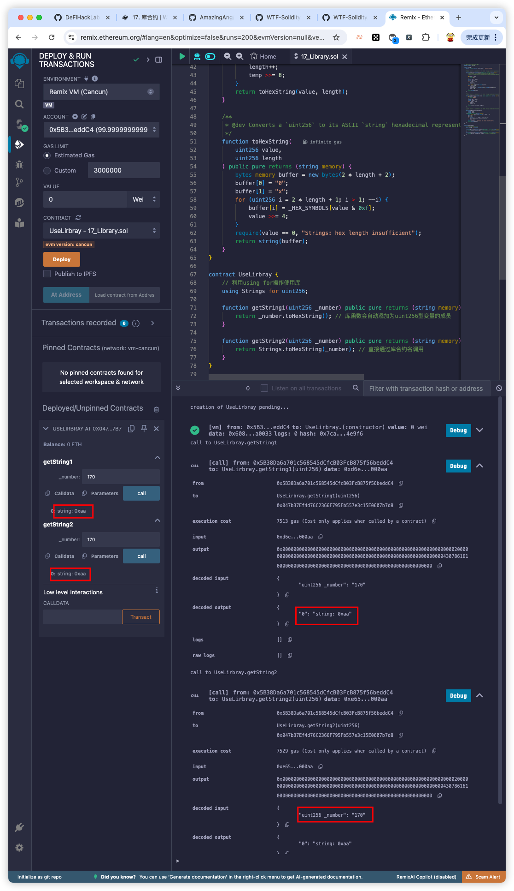

7. 第 17 节测验得分: 100, 答案: DACEC

#### 学习内容 18. Import

1. import

    - 在一个文件中引用另一个文件的内容
    - import在声明版本号之后，在其余代码之前

2. 用法:

    - 通过源文件相对位置导入

        - ```solidity
            文件结构
            ├── Import.sol
            └── Yeye.sol
            
            // 通过文件相对位置import
            import './Yeye.sol';
            ```

    - 通过源文件网址导入网上的合约的全局符号

        - ``` solidity
            import 'https://github.com/OpenZeppelin/openzeppelin-contracts/blob/master/contracts/utils/Address.sol';
            ```

    - 通过`npm`的目录导入

        - ```solidity
            import '@openzeppelin/contracts/access/Ownable.sol';
            ```

    - 通过指定`全局符号`导入合约特定的全局符号

        - ```solidity
            import {Yeye} from './Yeye.sol';
            ```

3. 合约部署:

    - 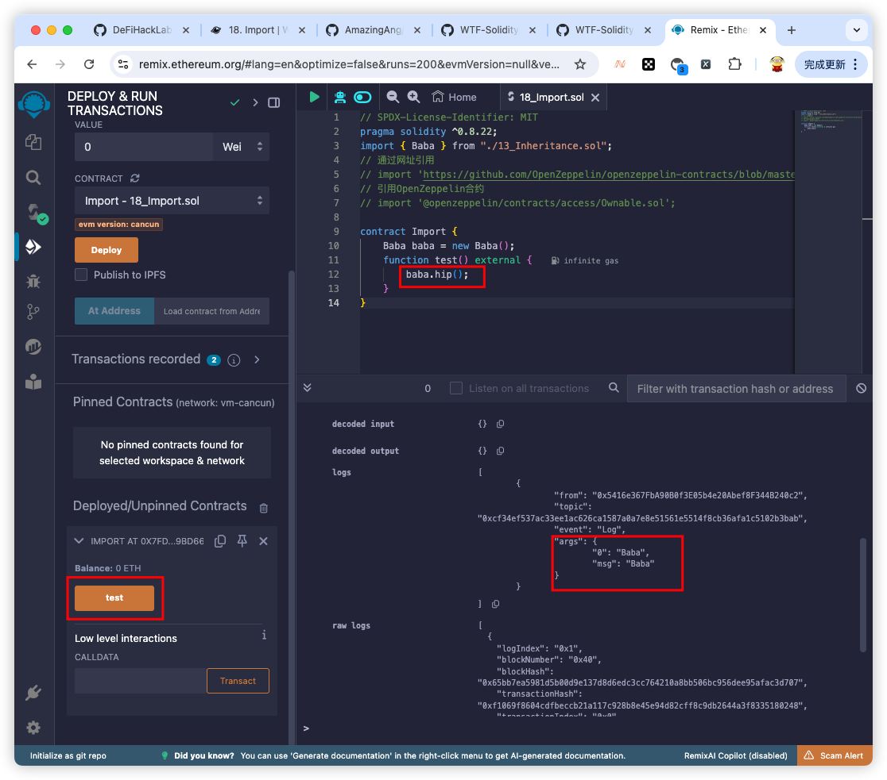

4. 第 18 节测验得分: 100, 答案: CDADC

---


<!-- Content_END -->
