---

# Aris

1. 自我介绍
    - 我是 Aris.

2. 你认为你会完成本次残酷学习吗？
    - 有点困难,不过应该能完成.

## Notes

<!-- Content_START -->

### 2024.09.23

#### 学习内容 第01节
 - 01HelloWeb3.sol 创建 helloWeb3 程序,并在 remix 上进行编译和部署

 - 代码部分

- 

 - 在根目录创建 contracts 目录,创建 .sol 文件,放入上面代码

 - 使用 nodejs 安装 remixd

 - ```
    npm install -g @remix-project/remixd

 - node 安装
   - 下载地址: https://nodejs.org/en/download/prebuilt-installer/current
   - 查看 node 仓库源 `npm config  get registry`
   - 修改 node 仓库源 `npm config set registry https://registry.npmmirror.com`

 - 创建脚本`remix.sh`, 让 `https://remix.ethereum.org` 网站能关联本地文档

 - ```
    DIR=$(cd "$(dirname "$0")"; pwd)
    contracts=${DIR}/contracts
    echo '合约地址:' ${contracts} 
    remixd -s ${contracts} --remix-ide https://remix.ethereum.org
    ```

 - 执行remix.sh

 - ```
    ./remix.sh

 - 编译和部署
   - 使用Google Chrome打开`https://remix.ethereum.org`,左侧 workspace 中选择 `connect to localhost`
   - 然后点击 `connect` 按钮,就会加载出本地 `contracts`目录下的 .sol 文件
   - 点击 `01HelloWeb3.sol`进入文件,然后 `cmd + s`, 会进行编译
   - 点击左侧 `deploy & run transactions` 按钮,点击 `高亮`的 Depoly 按钮
   - 左侧会出现部署结果,点击 `_string` 出现 `'Hi Web3'`,表示成功.

- 也可以在 https://remix.ethereum.org 直接编写代码,然后编译和部署,但是我习惯在本地编写代码^_^

- 第01节测验得分: 100, 答案: BBABCCBA

---

### 2024.09.24

#### 学习内容 第02 节: 值类型 第03节:函数类型

- 第02 节: 值类型
  - 值类型: Value Type 
  - 引用类型: Reference Type
  - 映射类型: Mapping Type
  
- 值类型:
  - 布尔型
    - 与`&&`,或`||`,非`!` 等于`=`,不等于`!=`
    - `&&` 和` ||` 遵循短路规则
  - 整形
    - `int`整数, `uint` 正整数, `uint256` 256位正整数
    - 比较运算符: <=, <, >=, >, ==, !=
    - 算数运算符: `+`,` -` , `*` ,`/`, `%`, `**`
  - 地址类型
    - 普通地址: address, 存储一个 20 字节的值(以太坊)
    - payable address: 用于接收转账,有 transfer 和 send 方法
  - 定长字节数组
    - 定长字节数组时值类型,数组长度在声明以后不能改变,分为 bytes1,bytes8,bytes32等,最大bytes 32
  - 枚举 enum
    - 为uint 分配名称,从 0 开始.
  
- 合约部署截图

- 

- 第节: 函数类型

- `function <function name>(<parameter types>) {internal|external|public|private} [pure|view|payable] [returns (<return types>)]`
  - function: 函数声明的固定写法
  - name: 函数名
  - 函数可见性修饰符 (必须指定)
    - public: 内部: 可以, 外部: 可以, 继承: 可以
    - private: 内部: 可以, 外部: 不可以, 继承: 不可以
    - external: 内部: 不可以(通过 `this.f()`调用), 外部: 可以, 继承: 可以
    - internal: 内部: 可以, 外部: 不可以, 继承: 可以
  - 权限关键字
    - pure: 外部变量,不能读,不能写 | 无 gas 消耗 | 注意: 调用任何非标记 pure/view 函数需要支付 gas 费
    - view: 外部变量,能读,不能写 | 无 gas 消耗 | 注意: 调用任何非标记 pure/view 函数需要支付 gas 费
    - payable: 调用函数可以转入 ETH (下面截图中,调用`minusPayable()` 传入了1 个 ETH,合约余额就受到了 1ETH)
  - retuns: 函数返回的变量类型和名称
  
- 合约部署截图

- 

- 第 02 节测验得分 100,答案:C,D,C,B,D

- 第 03 节测验得分 100,答案:

---

### 2024.09.25

#### 学习内容 第 04 节:4. 函数输出

1. 返回值: return 和 returns
    - return:函数主体,返回指定变量
    - returns:函数名后面,声明返回的变量类型及变量名

2. 命名式返回
    - 在 returns 中标明返回变量的名称
    - solidity 会初始化这些变量,并且自动返回这些函数的值,无需 return.
    - 也可以在命名式返回中用 retrun 来返回变量

3. 解构赋值
    - 读取所有返回值:声明变量,在`()`中按顺序逗号隔开
    - 读取部分返回值:声明要读取的变量,按顺序,不读的空着.

4. 合约部署
    - 

5. 第 04 节测验得分:100, 答案: ABCBABCB

---

### 2024.09.26

#### 学习内容 第 05 节: 5. 变量数据存储和作用域 storage/memory/calldata

1. solidity 中的引用类型
   - 变量类型复杂,占用内存空间大,必须声明变量的存储位置,包括 数组和结构体
2. 数据位置
   - 存储位置有 3 类,storage, memory,calldata
     - storage: 存储在链上,消耗 gas 多,合约的状态变量默认是 storage
     - memory: 函数里的参数和临时变量一般用 memory,存储在内存中,不上链,消耗 gas 少;
       - 如果返回数据类型是变长的情况,必须加 memory 修饰,如 string,bytes,array 和 自定义结构体

     - calldata:存储在内存中,不上链,消耗 gas 少.
       - calldata 变量不能修改(immutable),一般用于函数参数.

   - 数据位置和赋值规则
     - 赋值本质上是创建引用指向本体
     - storage(合约状态变量) 赋值给 storage(函数中变量),会创建引用,同步发生改变.(连体)
     - memory 赋值给 memory 会创建引用,同步发生改变.
     - 其他情况: 赋值创建的是本体副本,修改变量不会影响对方
3. 变量作用域
   - 状态变量
     - 状态变量时声明存储在链上的变量,所有合约函数都可以访问,gas 消耗高

   - 局部变量
     - 局部变量仅在执行过程中的有效变量,函数退出后变量无效,存储在内存中,不上链.

   - 全局变量
     - 全局变量时全局范围内工作的变量,是 solidity 预留关键字,可以在函数内不声明即可使用.
     - blockhash 给定区块的哈希值
     - block.coinbase 当前区块矿工的地址
     - block.gaslimit 当前区块的 gaslimit
     - block.number 当前区块的 number
     - block.timstamp 当前区块的时间戳(unix,秒)
     - gaseleft() 剩余 gas
     - msg.data 完整的 calldata 数据
     - msg.sender 消息发送着
     - msg.sig calldata 的前 4 个字节,就是方法的 hash
     - msg.value 当前发送来的 eth 数量,单位是wei
     - block.blobbasefee 当前区块的 blob 基础费用
     - blobhash(index) 根当前交易关联的目标索引 blob的版本哈希值

   - 全局变量-以太单位与时间单位
     - wei: 1
     - gwei: 1000000000
     - ether: 1000000000000000000
     - seconds: 1
     - minutes: 60 seconds = 60
     - hours: 60 minutes  = 3600
     - days: 24hours = 86400
     - weeks: 7days = 604800
4. 合约部署
   - 
   - 
5. 第 05 节测验得分: 100, 答案: DBACDABA

---

### 2024.09.27

#### 学习内容 第 06 节: 6. 引用类型, array, struct

1. 数组 array
    - 存储一组数据(整数,字节,地址等),分为2 种
        - 固定长度数组:在生命时指定长度
        - 可变长度数组:不指定数组长度
        - 注意: bytes 比较特殊,是数组,但是不另外加`[]` ; 
        - 另外,不能用 byte[]声明单字节数组,可用 bytes 或者 bytes1[]
        - bytes 比 bytes1[] 省 gas
    - 创建数组的规则
        - momery 修饰的动态数组,可以用 new 创建,必须声明长度,声明后长度不可变.
        - 数组字面数(方括号初始化的一种方式),每一个元素类型以第一个元素为准
            - `[1,2,3]` 中所有元素是 `uint8`类型(默认最小单位的类型,这里是 uint8)
            - `[uint(1),2,3]` 所有元素类型是 uint
    - 数组成员
        - length(): 数组长度,memory 数组的长度在创建后是固定的;
        - push(): 动态数组方法,在数组最后添加 0 元素,并返回该元素的引用;
        - push(x): 动态数组方法,在数组最后添加 x 元素;
        - pop(): 动态数组方法,移除最后一个元素;
2. 结构体 struct
    - solidity 支持通过构造结构体的形式定义新的类型;
    - 结构体中的元素可以是原始类型,也可以是引用类型;
    - 结构体可以作为数组或映射的元素
    - 结构体赋值 4 种方法:
        - 在函数中创建 storage 的结构体引用
        - 直接引用专状态变量的结构体
        - 函数构造方式
        - 键值对方式
3. 合约部署-数组
    - 
4. 合约部署-结构体
    - 
5. 第 06 节测验得分: 100, 答案: BCCBCA

---

### 2024.09.28

#### 学习内容 7. 映射类型 mapping

1. 映射 Mapping

    - solidity 中的存储键值对的数据结构(可以理解为哈希表)

2. 映射规则

    - 规则 1:映射的 key 的数据类型只能选择 solidity 内置的值类型,比如 uint, address,不能用结构体;value 的数据列席可以使用自定义类型

        - ```solidity
            struct Student {
            	uint256 id;
            	uint256 score;
            }
            mapping(Student => uint) public testVar; // 报错
            ```

    - 规则 2:映射的存储位置必须是storage,因此可以用于状态变量;不能用于 public 函数的参数或者返回结果中;因为映射记录的是一种键值对关系!!!一种键值对关系!!!一种键值对关系!!!

    - 规则 3:如果映射声明为public,那么,solidity 会自动创建一个 getter 函数,可以通过 key 来查询对应的 value;

    - 规则 4:给映射新增键值对的语法为 `_var[_key] = _val` _var:映射变量名;_key,_val 对应键值对;

3. 映射的原理:

    - 原理 1: 映射不存储任何键(key)的信息,也没有 length 信息;
    - 原理 2: 映射使用 `keccak256(abi.encodePacked(key, slot))`当成 offset 存取 value,这里的 slot 是映射变量定义所在的插槽位置;
    - 原理 3: 因为 Ethereum 会定义所有未使用的空间为 0,所以,未赋值的键初始值是对应数据类型的默认值(例如 uint 的默认值是 0)

4. 合约部署

    - 

5. 第 07 节测验得分: 100, 答案: BADABB

---

### 2024.09.29

#### 学习内容 8. 变量初始值

在 solidity 中,声明但是没复制的变量都有默认值(初始值)

1. 值类型:
    - boolean: fasle
    - string: ""
    - int: 0
    - uint: 0
    - enum: 第一个元素
    - addres: 0x000000000000000000000000000000 (addres(0))
    - function: 
        - internal: 空白函数
        - external: 空白函数
2. 引用类型:
    - 映射 mapping:其value值数据类型的默认值
    - 结构体 struct:其成员值数据类型的默认值
    - 静态数组: 定长,其成员值数据类型的默认值
    - 动态数组: []
3. delete 操作符
    - delete 操作符会让变量值变为其默认值
4. 合约部署
    - 
5. 第 08 节测验得分: 100, 答案: CBDDA

---

#### 学习内容 9. 常数 constant和immutable

1. constant(常量),immutable(不变量)
    - 状态变量声明这两个变量以后,不能在初始化之后再更改;
    - 提升合约安全性
    - 节省 gas 费用
    - 只有数值变量可以声明为 constant 和 immutable
    - string 和 bytes 可以声明为 constant,不能为 immutable
2. constant
    - constant 必须在声明的时候初始化,之后不可变
3. immutable
    - immutable 变量可在声明时或者构造函数中初始化
4. 合约部署
    - 
5. 第 09 节测验得分: 100, 答案:ACDDC

---

### 2024.09.30

#### 学习内容 10. 控制流，用Solidity实现插入排序

1. 控制流

    - if-else

    - for

    - while

    - do-while

    - 三元运算符

    - 循环中有 continue 和 break 关键字

2. solidity 插入排序

    - solidity 中 uint 是正整数,无法取到负值,否则报 underflow 错误

    - ```solidity
        function insertionSort(
                uint[] memory a
            ) public pure returns (uint[] memory) {
                for (uint i = 1; i < a.length; i++) {
                    uint temp = a[i];
                    uint j = i;
                    while ((j >= 1) && (temp < a[j - 1])) {
                        a[j] = a[j - 1];
                        j--;
                    }
                    a[j] = temp;
                }
                return (a);
            }
        ```

    - 

3. 合约部署

    - 

4. 第 10 节测验得分: 100, 答案: CBAEDABC

---

#### 学习内容 11. 构造函数和修饰器

1. 构造函数

    - constructor,特殊函数,合约中只有一个,且部署合约时只允许一次;

    - 构造函数中可以初始化合约的参数;

2. 修饰器

    - modifier,声明函数拥有的特性,见到代码冗余

    - ```solidity
        // 定义modifier
        modifier onlyOwner {
           require(msg.sender == owner); // 检查调用者是否为owner地址
           _; // 如果是的话，继续运行函数主体；否则报错并revert交易
        }
        ```

    - 

3. 合约部署

    - 

4. 第 11 节测验得分: 100, 答案: BBADB

---

### 2024.10.01

#### 学习内容 12. 事件

1. 事件

    - solidity 中的事件是 evm 上日志的抽象

        - 响应: 应用程序可以通过 RPC 接口订阅和监听这些事件,并做出相应;

        - 经济: 事件是 EVM 上比较经济的存储数据的方式,每个大约消耗 2000gas;(链上存储一个新变量最少 20000gas)

    - 声明事件

        - 事件的声明由 event 关键字开头,事件名,括号中是变量类型和变量名;

        - ```solidity
            event Transfer(address indexed from, address indexed to, uint256 value);
            ```

            - from: 代币转账地址
            - to: 代币接收地址
            - value: 转账数量

        - indexed 关键字: 保存在 EVM 日志的 topics 中,方便检索;

    - 释放事件

        - 使用 emit 释放事件

        - ```solidity
            emit Transfer(from, to, amount);
            ```

2. EVM 日志 Log

    - 日志包含 主题topics 和数据(data)两部分

    - 

    - 主题 topics

        - 日志第一部分是主题数组,用于描述事件,最大 4;

            - 第一个元素是事件签名哈希

                - ```solidity
                    keccak256("Transfer(address,address,uint256)")
                    //0xddf252ad1be2c89b69c2b068fc378daa952ba7f163c4a11628f55a4df523b3ef
                    ```

            - 主题能包含最多 3 个 indexed 参数 (事件参数中标记 indexed 的from,to)

            - indexed 标记的参数是索引"键",方便搜索.

            - 每个 indexed 参数大小固定 256 比特,超过(例如字符串)则自动计算哈希存储在主题中;

    - 数据 data

        - 事件中不带 indexed 的参数存储在 data 部分,可以理解为"值";
        - data 变量不能被直接检索,但可以存储任意大小的数据;
        - 因此一般 data 部分可以存储复杂的数据结构(例如数组,字符串)
            - 因为这些数据超过了256比特，即使存储在事件的 `topics` 部分中，也是以哈希的方式存储。

        - data 部分的变量数据存储消耗的 gas 比 topics 少.

3. 合约部署

    - 

4. 第 12 节测验得分: 100, 答案: CABBA

    - 


---

### 2024.10.02

#### 学习内容 13. 继承

1. 继承规则

    - virturl:父合约中的函数,如果希望子合约重写,需要加上 virtual 关键字

    - override:子合约重写了父合约中的函数,需要加上 override 关键字

    - 用 override 修饰 public 变量,会重写与变量同名的 getter 函数

        - ```solidity
            mapping(address => uint256) public override balanceOf;
            ```

2. 简单继承

    - Yeye合约,方法添加 virtual 关键字
    - `contract Baba is Yeye` Baba 合约使用 `is` 关键字

3. 多重继承

    - solidity 中合约可以继承多个合约
    - 继承时,按辈分高低从左向右排列 `contract Erzi is Yeye, Baba`
    - 如果某函数在多个继承合约都存在,则子合约中必须重写
    - 子合约重写`父合约中都重名的函数`时,override 关键字后面加上所有父合约名字 `override(Yeye,Baba)`

4. 修饰器的继承

    - Modifier可以被继承,添加 virtual 和 override 关键字;
    - 子合约也可以在代码中修改Modifier

5. 构造函数的继承

    - ```solidity
        // 构造函数的继承
        abstract contract A {
            uint public a;
        
            constructor(uint _a) {
                a = _a;
            }
        }
        ```

    - ```solidity
    // 在继承时声明父构造函数的参数   
        contract B is A(1) {}
      ```

    - ```solidity
        // 在子合约的构造函数中声明构造函数的参数
        contract C is A {
            constructor(uint _c) A(_c * _c) {}
        }
        ```
        
    - 

6. 调用父合约的函数

    - 直接调用: `父合约名.函数名()`
    - super 关键字: `super.函数名()` ,super 是最右边的父合约(继承关系最近)

7. 钻石继承

    - 钻石继承（菱形继承）指一个派生类同时有两个或两个以上的基类
    - 在多重+菱形继承链条上使用`super`关键字时，需要注意的是使用`super`会调用继承链条上的每一个合约的相关函数，而不是只调用最近的父合约。
    - 钻石顶部的合约只被调用一次.
        - 原因是`Solidity`借鉴了Python的方式，强制一个由基类构成的DAG（有向无环图）使其保证一个特定的顺序

8. 合约部署-继承

    - 

9. 合约部署-修饰器

    - 

10. 合约部署-钻石继承

    - 

11. 第 13 节测验得分: 100, 答案: ABBBACC

---

### 2024.10.03

#### 学习内容 14. 抽象合约和接口

1. 抽象合约
    - 如果一个智能合约里至少有一个未实现的函数，即某个函数缺少主体`{}`中的内容，则必须将该合约标为`abstract`，不然编译会报错;

    - 未实现的函数需要加`virtual`，以便子合约重写;

2. 接口
    - 不能包含状态变量
    - 不能包含构造函数
    - 不能继承除接口外的其他合约
    - 所有函数都必须是external且不能有函数体
    - 继承接口的非抽象合约必须实现接口定义的所有功能
    - 虽然接口不实现任何功能，但它非常重要。接口是智能合约的骨架，定义了合约的功能以及如何触发它们
        - 合约里每个函数的`bytes4`选择器，以及函数签名`函数名(每个参数类型）`;
        - 接口id

    - 接口与合约`ABI`（Application Binary Interface）等价，可以相互转换;

3. IERC721 事件
    - `ransfer`事件：在转账时被释放，记录代币的发出地址`from`，接收地址`to`和`tokenId`。
    - `Approval`事件：在授权时被释放，记录授权地址`owner`，被授权地址`approved`和`tokenId`。
    - `ApprovalForAll`事件：在批量授权时被释放，记录批量授权的发出地址`owner`，被授权地址`operator`和授权与否的`approved`。

4. IERC721 接口
    - `balanceOf`：返回某地址的NFT持有量`balance`。
    - `ownerOf`：返回某`tokenId`的主人`owner`。
    - `transferFrom`：普通转账，参数为转出地址`from`，接收地址`to`和`tokenId`。
    - `safeTransferFrom`：安全转账（如果接收方是合约地址，会要求实现`ERC721Receiver`接口）。参数为转出地址`from`，接收地址`to`和`tokenId`。
    - `approve`：授权另一个地址使用你的NFT。参数为被授权地址`approve`和`tokenId`。
    - `getApproved`：查询`tokenId`被批准给了哪个地址。
    - `setApprovalForAll`：将自己持有的该系列NFT批量授权给某个地址`operator`。
    - `isApprovedForAll`：查询某地址的NFT是否批量授权给了另一个`operator`地址。
    - `safeTransferFrom`：安全转账的重载函数，参数里面包含了`data`。

5. 什么时候使用接口
    - 如果我们知道一个合约实现了标准接口，我们不需要知道它具体代码实现，就可以与它交互。

6. 合约部署-接口
    - 

7. 合约部署-抽象合约
    - 

8. 第 14 节测验得分: 100, 答案: ABEEAAA

---

#### 学习内容 15. 异常

1. Error

    - ```solidity
        error TransferNotOwner(); // 自定义error
        error TransferNotOwner(address sender); // 自定义的带参数的error
        revert TransferNotOwner(); // 在执行当中，error必须搭配revert（回退）命令使用。
        ```

    - gas消耗: 24446 (版本 solidity ^0.8.22 日期:2024-10-03)

2. Require

    - `require(检查条件，"异常的描述")`，当检查条件不成立的时候，就会抛出异常;
    - 唯一的缺点就是`gas`随着描述异常的字符串长度增加，比`error`命令要高;
    - gas消耗: 24739 (版本 solidity ^0.8.22 日期:2024-10-03)

3. Assert

    - `assert(检查条件）`，当检查条件不成立的时候，就会抛出异常;
    - 不能解释抛出异常的原因（比`require`少个字符串）;
    - gas消耗: 24460 (版本 solidity ^0.8.22 日期:2024-10-03)

4. 比较

    - `error`方法`gas`最少，其次是`assert`，`require`方法消耗`gas`最多
    - `error`性价比最高,既可以告知用户抛出异常的原因，又能省`gas`

5. 合约部署

    - 

6. 第 15 节测验得分: 100, 答案: DBAABCB

7. solidity101入门课程全部完成


---

### 2024.10.04

#### 学习内容 16. 函数重载

1. 重载

    - overloading,名字相同但输入参数类型不同的函数可以同时存在,被视为不同函数;
    - modifier 不能重载;

2. 函数重载

    - ```solidity
        function saySomething() public pure returns(string memory){
            return("Nothing");
        }
        
        function saySomething(string memory something) public pure returns(string memory){
            return(something);
        }
        ```

    - 因为有不同的参数类型,所以函数选择器不同;

3. 实参匹配

    - 在调用重载函数时，会把输入的实际参数和函数参数的变量类型做匹配。 
    - 如果出现多个匹配的重载函数，则会报错。

4. 合约部署

    - 

5. 第 16 节测验得分: 100, 答案: ABBBB

---

#### 学习内容 17. 库合约 站在巨人的肩膀上

1. 库合约

    - 特殊合约,代码复用,减少 gas 消耗
    - 一些列函数合集

2. 与普通合约的不同点

    - 不能存在状态变量
    - 不能继承或者被继承
    - 不能接受以太币
    - 不可以被销毁

3. 注意点:

    - 库合约中的函数如果是 public 或者 external,则 调用函数时会触发一次 delegatecall
    - 如果是 internal,则不会触发delegatecall
    - 如果是 private,仅库合约内部可见,其他合约不能调用

4. 使用

    - `using A for B;`

        - ```solidity
            // 利用using for指令
            using Strings for uint256;
            function getString1(uint256 _number) public pure returns(string memory){
                // 库合约中的函数会自动添加为uint256型变量的成员
                return _number.toHexString();
            }
            ```

    - 库合约名称调用函数

        - ```solidity
            // 直接通过库合约名调用
            function getString2(uint256 _number) public pure returns(string memory){
                return Strings.toHexString(_number);
            }
            ```

5. 常用库合约

    - [openzeppelin-Strings](https://github.com/OpenZeppelin/openzeppelin-contracts/blob/4a9cc8b4918ef3736229a5cc5a310bdc17bf759f/contracts/utils/Strings.sol): 将`uint256`转换为`String`
    - [OpenZeppelin-Address](https://github.com/OpenZeppelin/openzeppelin-contracts/blob/4a9cc8b4918ef3736229a5cc5a310bdc17bf759f/contracts/utils/Address.sol): 判断某个地址是否为合约地址
    - [OpenZeppelin-Create2](https://github.com/OpenZeppelin/openzeppelin-contracts/blob/4a9cc8b4918ef3736229a5cc5a310bdc17bf759f/contracts/utils/Create2.sol): 更安全的使用`Create2 EVM opcode`
    - [OpenZeppeli-Arrays](https://github.com/OpenZeppelin/openzeppelin-contracts/blob/4a9cc8b4918ef3736229a5cc5a310bdc17bf759f/contracts/utils/Arrays.sol): 数组相关的库合约

6. 合约部署

    - 

7. 第 17 节测验得分: 100, 答案: DACEC

---

#### 学习内容 18. Import

1. import

    - 在一个文件中引用另一个文件的内容
    - import在声明版本号之后，在其余代码之前

2. 用法:

    - 通过源文件相对位置导入

        - ```solidity
            文件结构
            ├── Import.sol
            └── Yeye.sol
            
            // 通过文件相对位置import
            import './Yeye.sol';
            ```

    - 通过源文件网址导入网上的合约的全局符号

        - ``` solidity
            import 'https://github.com/OpenZeppelin/openzeppelin-contracts/blob/master/contracts/utils/Address.sol';
            ```

    - 通过`npm`的目录导入

        - ```solidity
            import '@openzeppelin/contracts/access/Ownable.sol';
            ```

    - 通过指定`全局符号`导入合约特定的全局符号

        - ```solidity
            import {Yeye} from './Yeye.sol';
            ```

3. 合约部署:

    - 

4. 第 18 节测验得分: 100, 答案: CDADC

---

### 2024.10.05

#### 学习内容 19. 接收ETH receive和fallback

1. receive() 和 fallback() 是回调函数

    - 接收 ETH

    - 处理合约中不存在的函数(代理合约)

2. 接受 ETH 函数 receive

    - `receive()`函数是在合约收到`ETH`转账时被调用的函数;
    - 一个合约最多有一个`receive()`函数;
    - `receive() external payable { ... }`
        - 不需要`function`关键字;
        - 函数不能有任何的参数，不能返回任何值;
        - 必须包含`external`和`payable`;
    - `receive()`不要执行太多的逻辑因为如果别人用`send`和`transfer`方法发送`ETH`的话，`gas`会限制在`2300`，`receive()`太复杂可能会触发`Out of Gas`报错
    - 如果用`call`就可以自定义`gas`执行更复杂的逻辑

3. 回退函数 fallback

    - `fallback()`函数会在调用合约不存在的函数时被触发
    - 可用于接收ETH;
    - 可以用于代理合约`proxy contract`
    - `fallback() external payable { ... }`
        - 不需要`function`关键字;
        - 函数不能有任何的参数，不能返回任何值; (一般没有参数吧?)
        - 必须由`external`修饰，一般也会用`payable`修饰 (所以说 payable 不是必须的?)

4. 区别

    - ```
        触发fallback() 还是 receive()?
                   接收ETH
                      |
                 msg.data是空？
                    /  \
                  是    否
                  /      \
        receive()存在?   fallback()
                / \
               是  否
              /     \
        receive()   fallback()
        ```

    - 合约接收`ETH`时，`msg.data`为空且存在`receive()`时，会触发`receive()`;

    - `msg.data`不为空或不存在`receive()`时，会触发`fallback()`，此时`fallback()`必须为`payable`。

5. 其他

    - `receive()`和`fallback() payable`均不存在的时候，向合约**直接**发送`ETH`将会报错
    - 如果合约中有`payable`的函数,则可以调用该函数向合约发送`ETH` 

6. 合约部署

    - 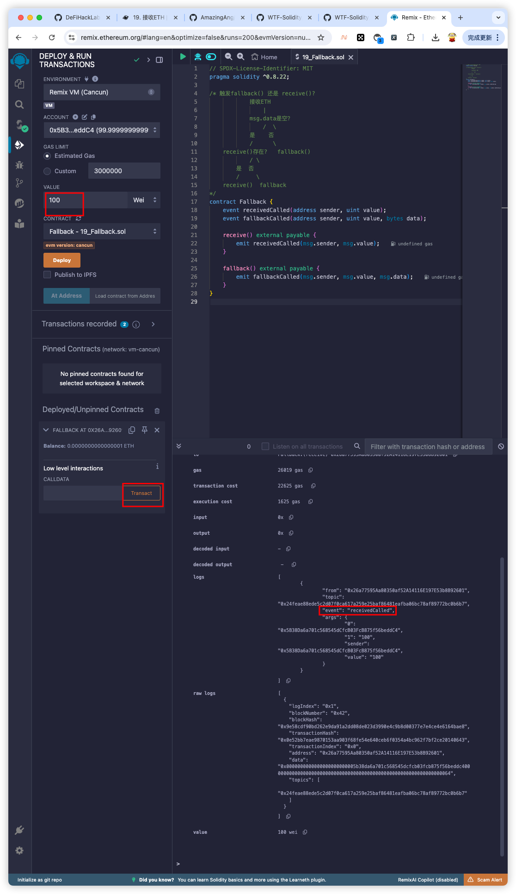
    - 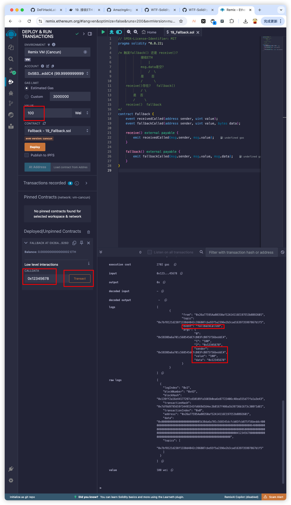

7. 第 19 节测验得分: 100, 答案: ABBCA

---

### 2024.10.06

#### 学习内容 20. 发送ETH

1. Solidity有三种方法向其他合约发送ETH
    - transfer: `接收方地址.transfer(发送ETH数额)` **不建议使用**
        - 返回值: **无**
        - gas 限制: 2300, `fallback()`或`receive()`函数,**不支持**实现复杂逻辑
        - 失败,**会** revert 交易

    - send:`接收方地址.send(发送ETH数额)` **次选使用**
        - 返回值: **bool**,代表成功 or 失败
        - gas 限制: 2300, `fallback()`或`receive()`函数,**不支持**实现复杂逻辑
        - 失败,**不会** revert 交易

    - call:`接收方地址.call{value: 发送ETH数额}("")` **优选使用**
        - 返回值: **(bool, bytes)**,bool:成功 or 失败, bytes:返回的数据
        - gas 限制: **无**, `fallback()`或`receive()`函数,**支持**实现复杂逻辑
        - 失败,**不会** revert 交易

2. 合约部署
    - 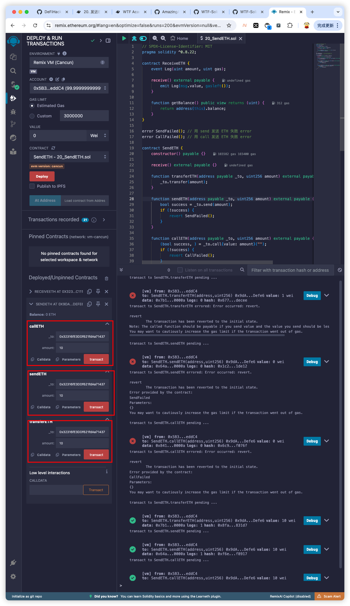

3. 第 20 节测验得分: 100, 答案: CAAAAAA

---

### 2024.10.07

#### 学习内容 21. 调用其他合约

1. 传入合约地址

    - 函数里传入目标合约地址，生成目标合约的引用，然后调用目标函数;

    - ```solidity
        function callSetX(address _address, uint256 x) external {
            OtherContract(_address).setX(x);
        }
        ```

2. 传入合约变量

    - 在函数里传入合约的引用，只需要把上面参数的`address`类型改为目标合约名

    - 参数`OtherContract _Address`底层类型仍然是`address`

    - ```solidity
        function callGetX(OtherContract _address) external view returns (uint x) {
            x = _address.getX();
        }
        ```

3. 创建合约变量

    - 创建合约变量，然后通过它来调用目标函数

    - ```solidity
        function callGetX2(address _address) external view returns (uint x) {
            OtherContract oc = OtherContract(_address);
            x = oc.getX();
        }
        ```

4. 调用合约并发送ETH

    - 合约的函数必须是`payable`
    - `Name(_Address).f{value: _Value}()`
    - 其中`_Name`是合约名，`_Address`是合约地址，`f`是目标函数名，`_Value`是要转的`ETH`数额（以`wei`为单位）

5. 合约部署

    - 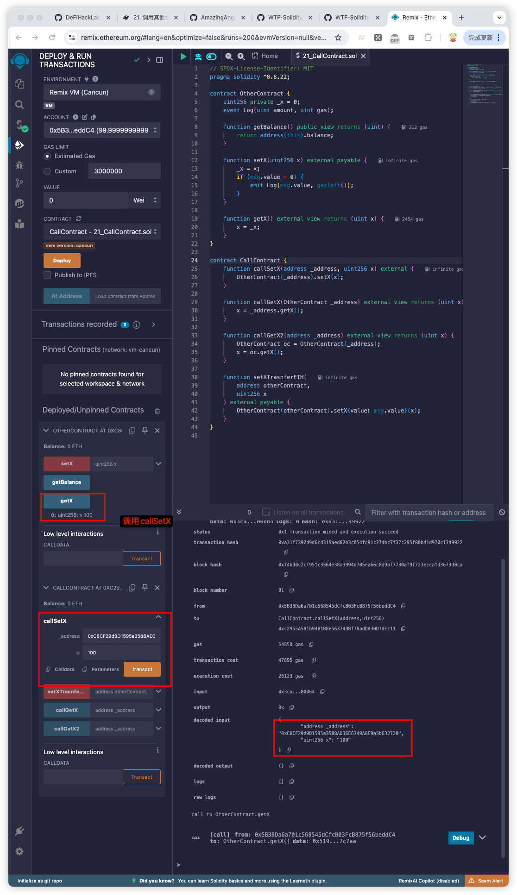
    - 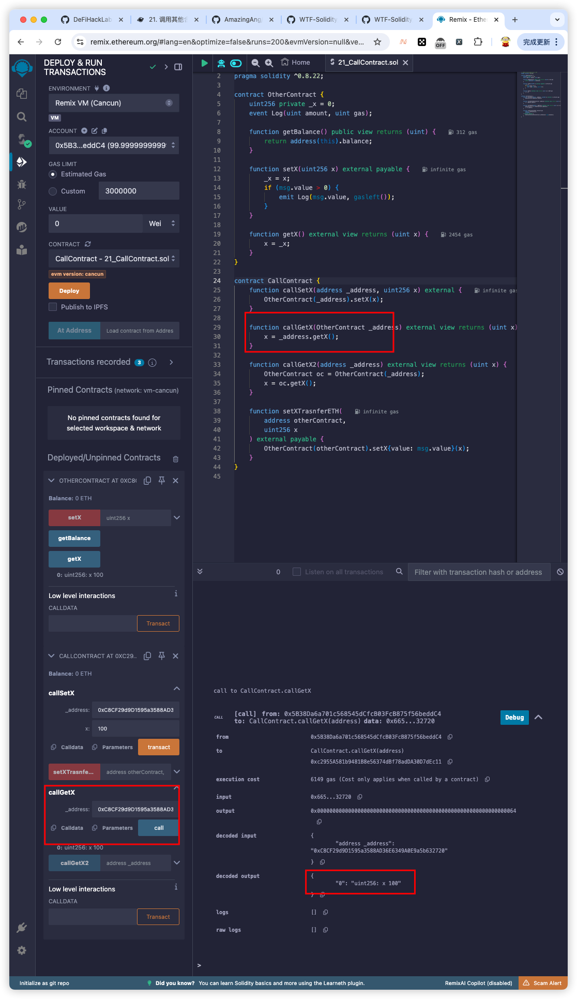
    - 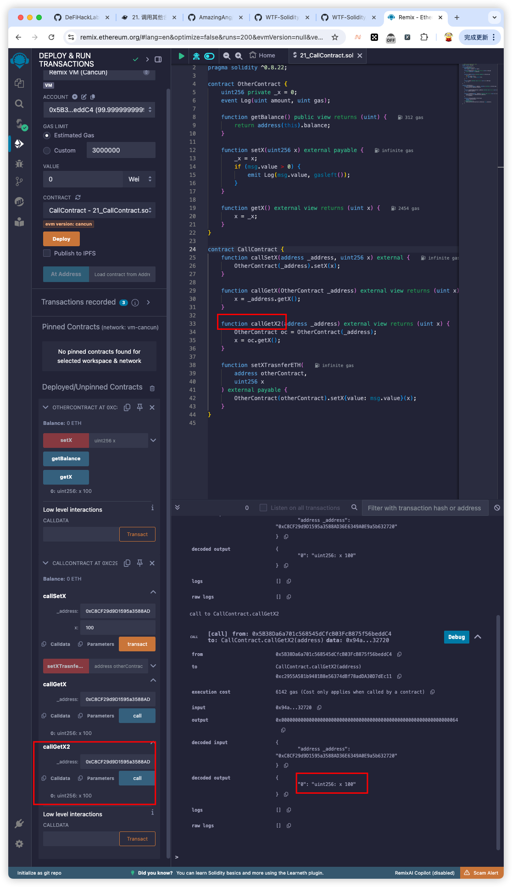
    - 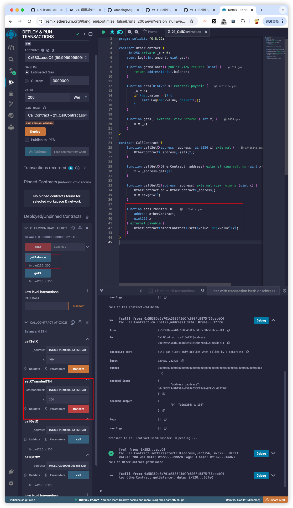

6. 第 21 节测验得分: 100, 答案: ADDBD

---

### 2024.10.08

#### 学习内容 22. Call

1. Call
    - `call` 是`address`类型的低级成员函数，它用来与其他合约交互;
    - 返回值为`(bool, bytes memory)`，分别对应`call`是否成功以及目标函数的返回值;
    - `call`是`Solidity`官方推荐的通过触发`fallback`或`receive`函数发送`ETH`的方法
    - 不推荐用`call`来调用另一个合约;
        - 因为当你调用不安全合约的函数时，你就把主动权交给了它;
        - 推荐的方法仍是声明合约变量后调用函数;

    - 当我们不知道对方合约的源代码或`ABI`，就没法生成合约变量；这时，我们仍可以通过`call`调用对方合约的函数;(很有用)

2. 使用规则
    - `目标合约地址.call(字节码);`
    - 字节码
        - `abi.encodeWithSignature("函数签名", 逗号分隔的具体参数)`
        - abi.encodeWithSignature("f(uint256,address)", _x, _addr);

    - 可以指定交易发送的`ETH`数额和`gas`数额
        - `目标合约地址.call{value:发送数额, gas:gas数额}(字节码)`

3. 合约部署
    - 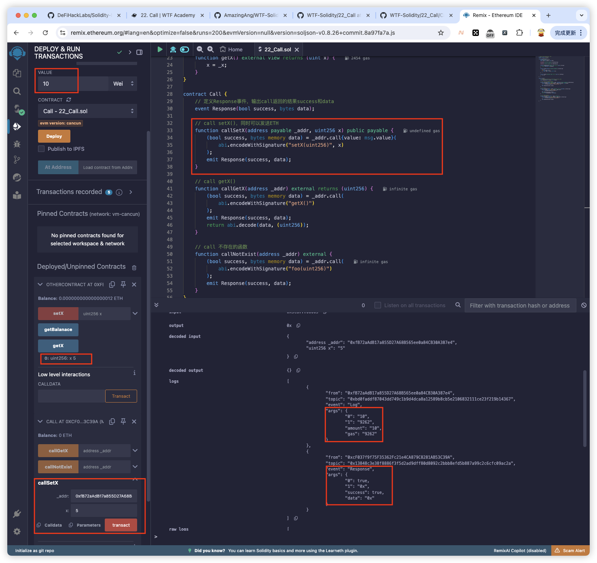
    - 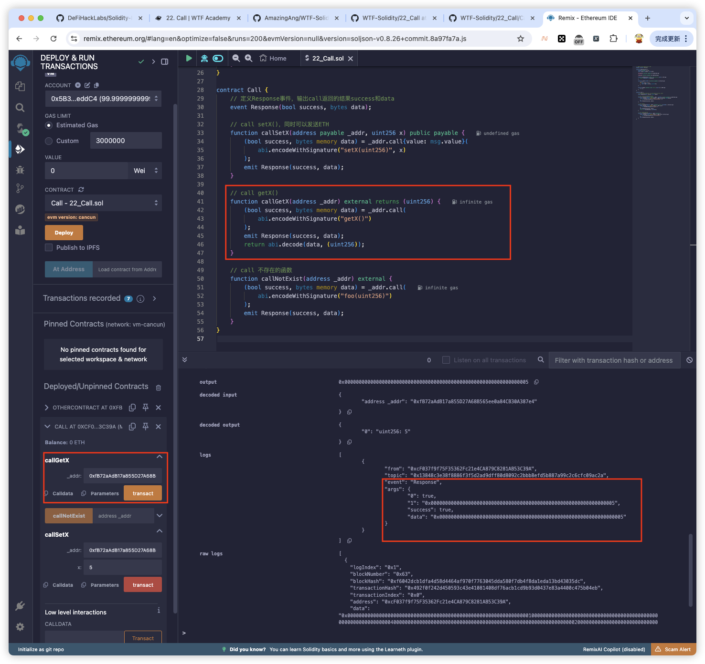
    - 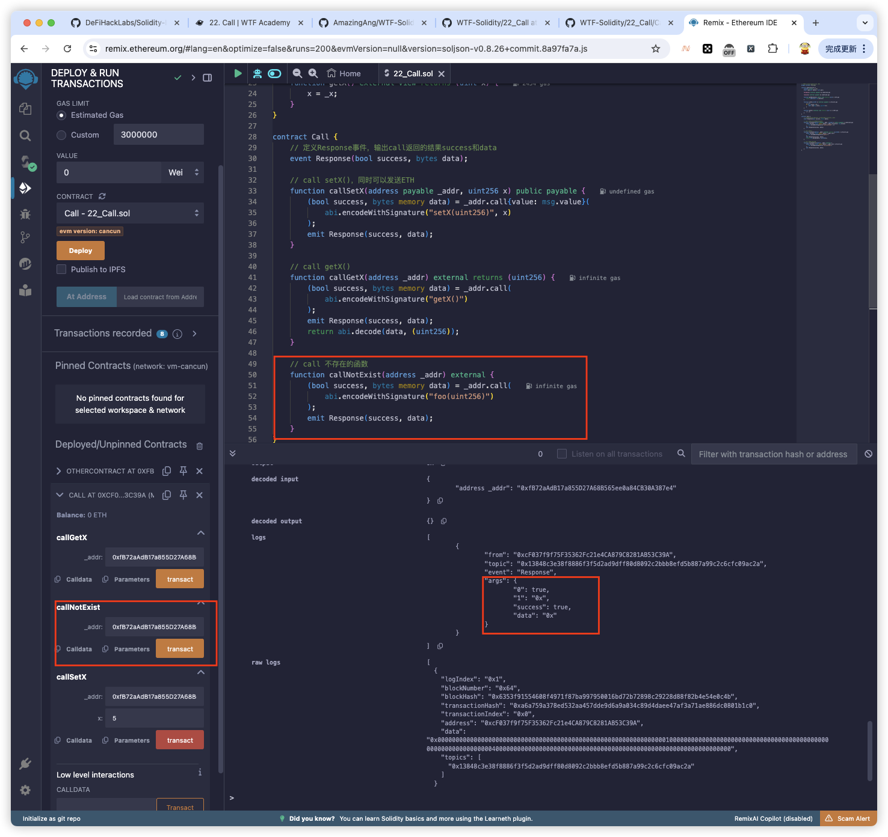

4. 第 22 节测验得分: 100, 答案: ABACAC

#### 学习内容 23. Delegatecall

1. Delegatecall
    - `Solidity`中**地址类型**的低级成员函数;
    - 当用户`A`通过合约`B`来`call`合约`C`的时候，执行的是合约`C`的函数，`上下文`(`Context`，可以理解为包含变量和状态的环境)也是合约`C`的：`msg.sender`是`B`的地址，并且如果函数改变一些状态变量，产生的效果会作用于合约`C`的变量上。
        - 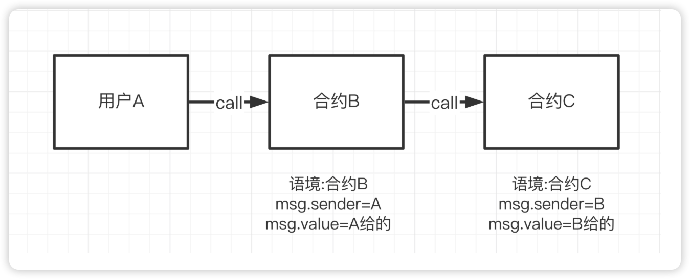
    - 而当用户`A`通过合约`B`来`delegatecall`合约`C`的时候，执行的是合约`C`的函数，但是`上下文`仍是合约`B`的：`msg.sender`是`A`的地址，并且如果函数改变一些状态变量，产生的效果会作用于合约`B`的变量上。
        - 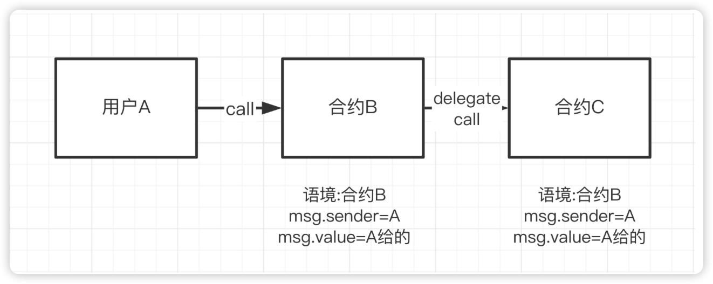
    - 语法: `目标合约地址.delegatecall(二进制编码);`
        - 二进制编码: `abi.encodeWithSignature("函数签名", 逗号分隔的具体参数)`
    - 注意点:
        - `delegatecall`在调用合约时可以指定交易发送的`gas`，但不能指定发送的`ETH`数额!
        - `delegatecall`有安全隐患!!!
            - 使用时要保证当前合约和目标合约的状态变量存储结构相同!!!
            - 目标合约安全，不然会造成资产损失!!!
2. 应用场景
    - 代理合约（`Proxy Contract`）:将智能合约的存储合约和逻辑合约分开
        - 代理合约（`Proxy Contract`）存储所有相关的变量，并且保存逻辑合约的地址;
        - 所有函数存在逻辑合约（`Logic Contract`）里，通过`delegatecall`执行;
        - 升级时，只需要将代理合约指向新的逻辑合约即可;
    - EIP-2535 Diamonds（钻石）
        - 一个支持构建可在生产中扩展的模块化智能合约系统的标准;
        - 具有多个实施合约的代理合约;
3. 合约部署
    - 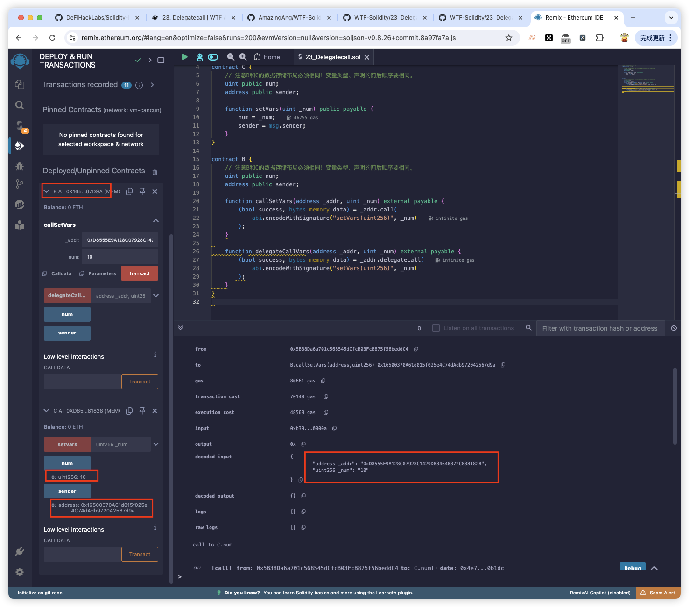
    - 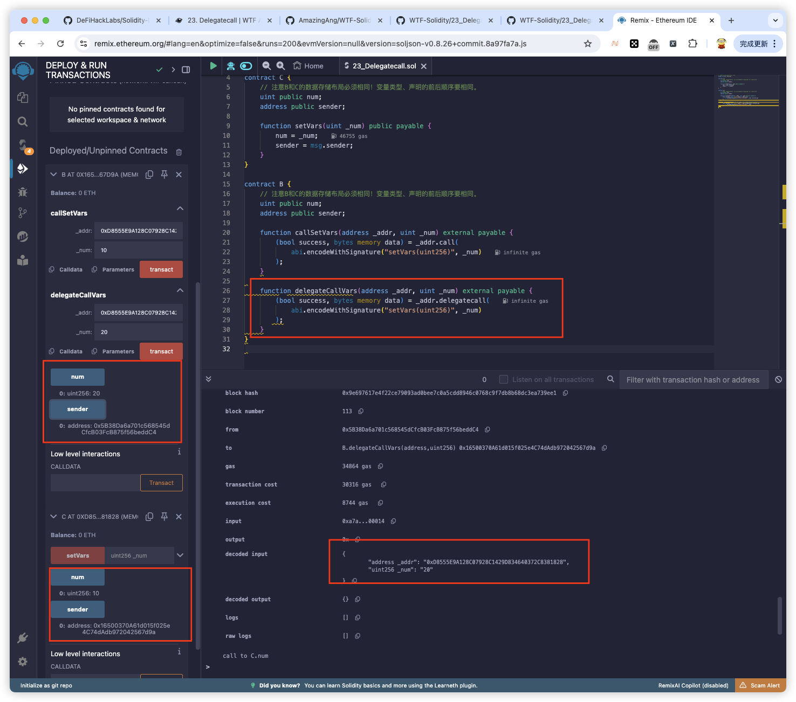
4. 第 23 节测验得分: 100, 答案:AABBAA
    - 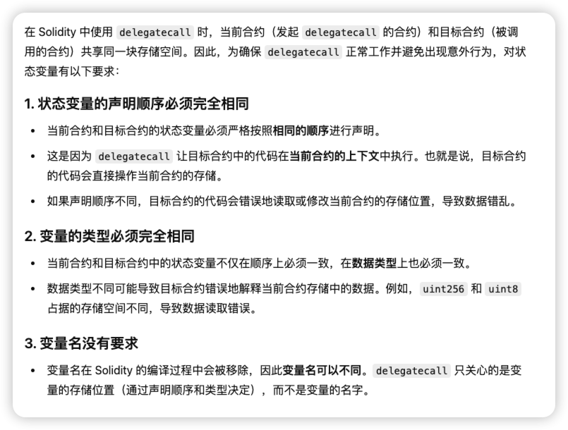

---

### 2024.10.09

#### 学习内容 24. 在合约中创建新合约

1. create

    - 语法: `Contract x = new Contract{value: _value}(params)`
        - `Contract`是要创建的合约名，`x`是合约对象（地址）
        - 如果构造函数是`payable`，可以创建时转入`_value`数量的`ETH`(**当前合约发送给新创建的合约的 ETH**)
        - `params`是新合约构造函数的参数

2. code

    - ```solidity
        // SPDX-License-Identifier: MIT
        pragma solidity ^0.8.22;
        
        contract Pair {
            address public factory;
            address public token0;
            address public token1;
        
            constructor() payable {
                factory = msg.sender; // 调用该构造函数的账户或合约地址!!!
            }
        
            function init(address _token0, address _token1) external {
                require(msg.sender == factory, "forbidden");
                token0 = _token0;
                token1 = _token1;
            }
        }
        contract PairFactory {
            mapping(address => mapping(address => address)) public getPair;
            address[] public allPairs;
        
            function createPair(
                address tokenA,
                address tokenB
            ) external returns (address pairAddr) {
                Pair pair = new Pair(); // 创建币对合约(对象)
                pair.init(tokenA, tokenB); // 调用初始化方法
                pairAddr = address(pair); // 获得合约(对象)地址
                allPairs.push(pairAddr);
                getPair[tokenA][tokenB] = pairAddr;
                getPair[tokenB][tokenA] = pairAddr;
            }
        }
        ```

        

3. 合约部署

    - 

4. 第 24 节测验得分: 100, 答案:DACCB

---

#### 学习内容 25. CREATE2

1. CREATE2

    - 在智能合约部署在以太坊网络之前就能预测合约的地址
    - 让合约地址独立于未来的事件

2. `CREATE`如何计算地址

    - **新地址 = hash(创建者地址, nonce)**
    - 创建者地址:通常为部署的钱包地址或者合约地址
    - nonce:
        - 钱包地址:发送交易的总数
        - 合约地址:创建的合约总数(新创建一个则 nonce++)
    - `nonce`可能会随时间而改变，因此用`CREATE`创建的合约地址不好预测

3. `CREATE2`如何计算地址

    - **新地址 = hash("0xFF",创建者地址, salt, initcode)**
    - `0xFF`：一个常数，避免和`CREATE`冲突
    - `CreatorAddress`: 调用 CREATE2 的当前合约（创建合约）地址。
    - `salt`（盐）：一个创建者指定的`bytes32`类型的值，它的主要目的是用来影响新创建的合约的地址。
    - `initcode`: 新合约的初始字节码（合约的Creation Code和构造函数的参数）。

4. CREATE2使用

    - ```solidity
        Contract x = new Contract{salt: _salt, value: _value}(params)
        ```

    - `Contract`是要创建的合约名

    - `x`是合约对象（地址）

    - `_salt`是指定的盐

        - ```solidity
            bytes32 salt = keccak256(abi.encodePacked(token0, token1));
            ```

        - 

    - 如果构造函数是`payable`，可以创建时转入`_value`数量的`ETH`(**当前合约发送给新创建的合约的 ETH**)

    - `params`是新合约构造函数的参数

    - ```solidity
        function calculateAddr(
                address tokenA,
                address tokenB
            ) public view returns (address predicatedAddress) {
                require(tokenA != tokenB, "identical address");
                // 排序
                (address token0, address token1) = tokenA < tokenB
                    ? (tokenA, tokenB)
                    : (tokenB, tokenA);
                // salt
                bytes32 salt = keccak256(abi.encodePacked(token0, token1));
                predicatedAddress = address(
                    uint160(
                        uint(
                            keccak256(
                                abi.encodePacked(
                                    bytes1(0xff),
                                    address(this),
                                    salt,
                                    keccak256(type(Pair).creationCode)
                                )
                            )
                        )
                    )
                );
            }
        ```

5. 应用场景

    - 交易所为新用户预留创建钱包合约地址
    - 减少跨合约调用

6. 合约部署

    - 

7. 第 25 节测验得分: 100, 答案:ABCE

---

#### 学习内容 26. 删除合约

1. selfdestruct

    - 删除智能合约，并将该合约剩余`ETH`转到指定地址
    - 在一些情况下它会导致预期之外的合约语义，但由于目前还没有代替方案（有警告）

2. EIP-6780

    - 减少了`SELFDESTRUCT`操作码的功能
    - 当前`SELFDESTRUCT`仅会被用来将合约中的ETH转移到指定地址
    - 原先的删除功能只有在`合约创建-自毁`这两个操作处在同一笔交易时才能生效
        - 已经部署的合约无法被`SELFDESTRUCT`
        - 如果要使用原先的`SELFDESTRUCT`功能，必须在同一笔交易中创建并`SELFDESTRUCT`

3. 使用

    - `selfdestruct(_addr)；`
        - 其中`_addr`是接收合约中剩余`ETH`的地址
        - `_addr` 地址不需要有`receive()`或`fallback()`也能接收`ETH`

4. 转移ETH功能

    - 坎昆升级前，合约会被自毁。

    - 坎昆升级后，合约依然存在，只是将合约包含的ETH转移到指定地址，而合约依然能够调用。

    - ```solidity
        function demo() public payable returns (DemoResult memory) {
            DeleteContract del = new DeleteContract{value: msg.value}();
            DemoResult memory res = DemoResult({
                addr: address(del),
                balance: del.getBalance(),
                value: del.value()
            });
            del.deleteContract();
            return res;
        }
        ```

5. 注意点

    - 对外提供合约销毁接口时，最好设置为只有合约所有者可以调用，可以使用函数修饰符`onlyOwner`进行函数声明。
    - 当合约中有`selfdestruct`功能时常常会带来安全问题和信任问题
    - 合约中的selfdestruct功能会为攻击者打开攻击向量
    - 此功能还会降低用户对合约的信心

6. 合约部署

    - 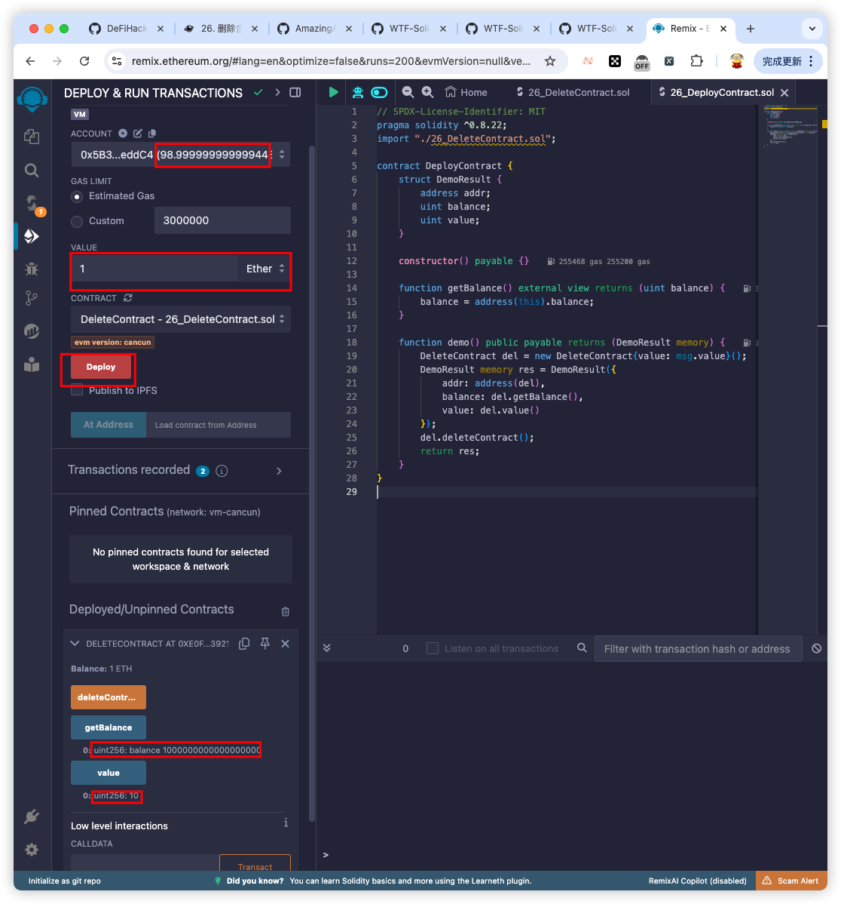
    - 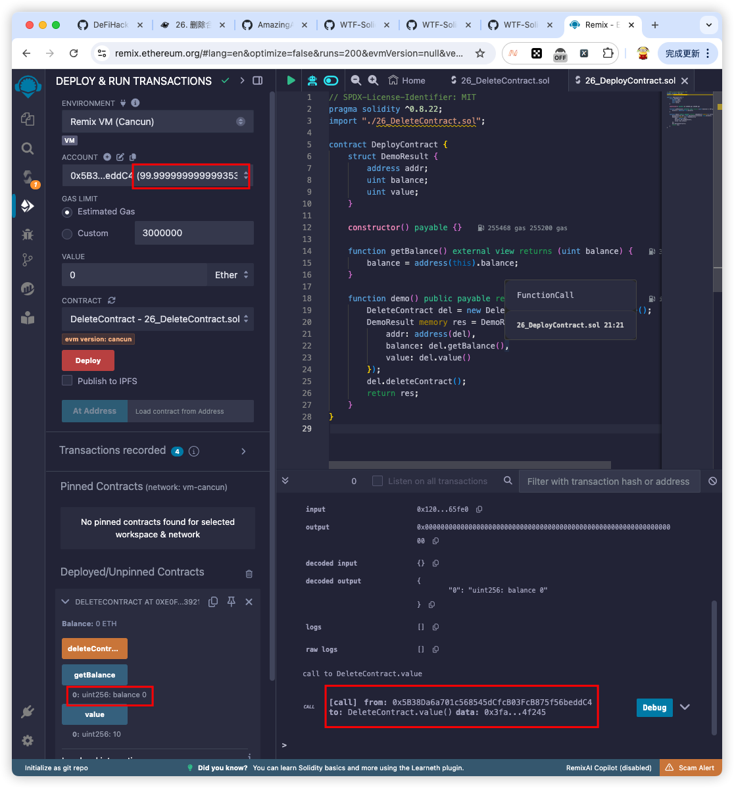

7. 第 26 节测验得分: 100, 答案: 

---

### 2024.10.10

#### 学习内容 27. ABI编码解码

1. ABI

    - Application Binary Interface，应用二进制接口
    - 与以太坊智能合约交互的标准
    - 数据基于他们的类型编码
    - 由于编码后不包含类型信息，解码时需要注明它们的类型

2. abi编码-abi.encode

    - ```solidity
        abi.encode(x, addr, name, array)
        ```

    - 将每个参数填充为32字节的数据，并拼接在一起

    - `0x000000000000000000000000000000000000000000000000000000000000000a0000000000000000000000007a58c0be72be218b41c608b7fe7c5bb630736c7100000000000000000000000000000000000000000000000000000000000000a00000000000000000000000000000000000000000000000000000000000000005000000000000000000000000000000000000000000000000000000000000000600000000000000000000000000000000000000000000000000000000000000043078414100000000000000000000000000000000000000000000000000000000`

    - abi.encode将每个数据都填充为32字节，中间有很多0

3. abi编码-abi.encodePacked

    - ```solidity
        abi.encodePacked(x, addr, name, array)
        ```

    - 将给定参数根据其所需最低空间编码,会把其中填充的很多`0`省略

    - 比如，只用1字节来编码`uint8`类型

    - `abi.encodePacked`对编码进行了压缩，长度比`abi.encode`短很多

4. abi编码-abi.encodeWithSignature

    - ```solidity
        abi.encodeWithSignature("foo(uint256,address,string,uint256[2])", x, addr, name, array)
        ```

    - 第一个参数为`函数签名`

    - 同于在`abi.encode`编码结果前加上了4字节的`函数选择器`

5. abi编码-abi.encodeWithSelector

    - ```solidity
        abi.encodeWithSelector(bytes4(keccak256("foo(uint256,address,string,uint256[2])")), x, addr, name, array)
        ```

    - 第一个参数为`函数选择器`,是`函数签名`Keccak哈希的前4个字节

    - 结果与`abi.encodeWithSignature`结果一样

6. abi解码-abi.decode

    - ```solidity
        (dx, daddr, dname, darray) = abi.decode(data, (uint, address, string, uint[2]));
        ```

    - 解码时需要注明对应顺序和类型!!!

7. 使用场景

    - 合约开发,ABI常配合call来实现对合约的底层调用;

        - ```solidity
            bytes4 selector = contract.getValue.selector;
            
            bytes memory data = abi.encodeWithSelector(selector, _x);
            (bool success, bytes memory returnedData) = address(contract).staticcall(data);
            require(success);
            
            return abi.decode(returnedData, (uint256));
            ```

    - ethers.js中常用ABI实现合约的导入和函数调用;

        - ```javascript
            const wavePortalContract = new ethers.Contract(contractAddress, contractABI, signer);
            const waves = await wavePortalContract.getAllWaves();
            ```

    - 对不开源合约进行反编译后，某些函数无法查到函数签名，可通过ABI进行调用;

        - ```solidity
            bytes memory data = abi.encodeWithSelector(bytes4(0x533ba33a));
            
            (bool success, bytes memory returnedData) = address(contract).staticcall(data);
            require(success);
            
            return abi.decode(returnedData, (uint256));
            ```

8. 合约部署

    - 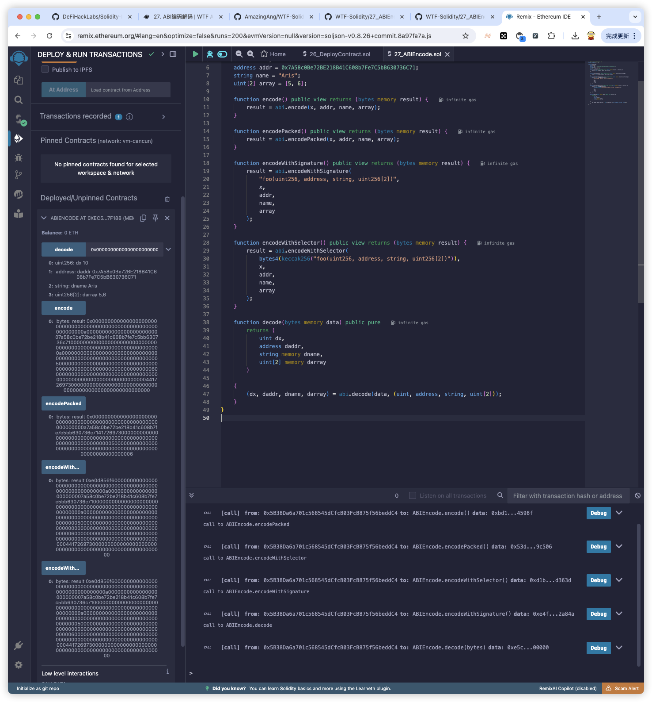

9. 第 27 节测验得分: 100, 答案: EBAD

    - 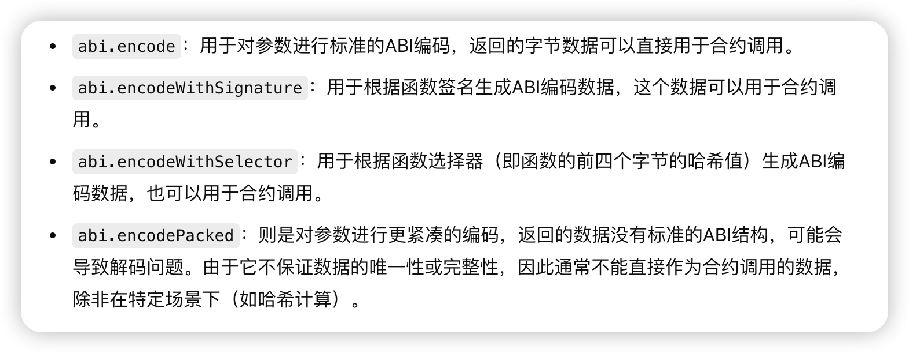


---

#### 学习内容 28. Hash

1. 哈希函数

    - 将任意长度的消息转换为一个固定长度的值

2. hash 性质

    - 单向性：从输入的消息到它的哈希的正向运算简单且唯一确定，而反过来非常难，只能靠暴力枚举。
    - 灵敏性：输入的消息改变一点对它的哈希改变很大。
    - 高效性：从输入的消息到哈希的运算高效。
    - 均一性：每个哈希值被取到的概率应该基本相等。
    - 抗碰撞性：
        - 弱抗碰撞性：给定一个消息`x`，找到另一个消息`x'`，使得`hash(x) = hash(x')`是困难的。
        - 强抗碰撞性：找到任意`x`和`x'`，使得`hash(x) = hash(x')`是困难的。

3. hash 应用

    - 生成数据唯一标识
    - 加密签名
    - 安全加密

4. keccak256

    - ```solidity
        哈希 = keccak256(数据);
        ```

5. Keccak256和sha3

    - Ethereum和Solidity智能合约代码中的SHA3是指Keccak256
    - 不是标准的NIST-SHA3(区别:SHA3最终完成标准化时，NIST调整了填充算法)
    - **所以SHA3就和keccak计算的结果不一样**

6. 生成数据唯一标识

    - ```solidity
        function hash(
            uint _num,
            string memory _string,
            address _addr
            ) public pure returns (bytes32) {
            return keccak256(abi.encodePacked(_num, _string, _addr));
        }
        ```

7. 弱抗碰撞性

    - 给定一个消息`x`，找到另一个消息`x'`，使得`hash(x) = hash(x')`是困难的

8. 强抗碰撞性

    - 任意不同的`x`和`x'`，使得`hash(x) = hash(x')`是困难的

9. 合约部署

    - 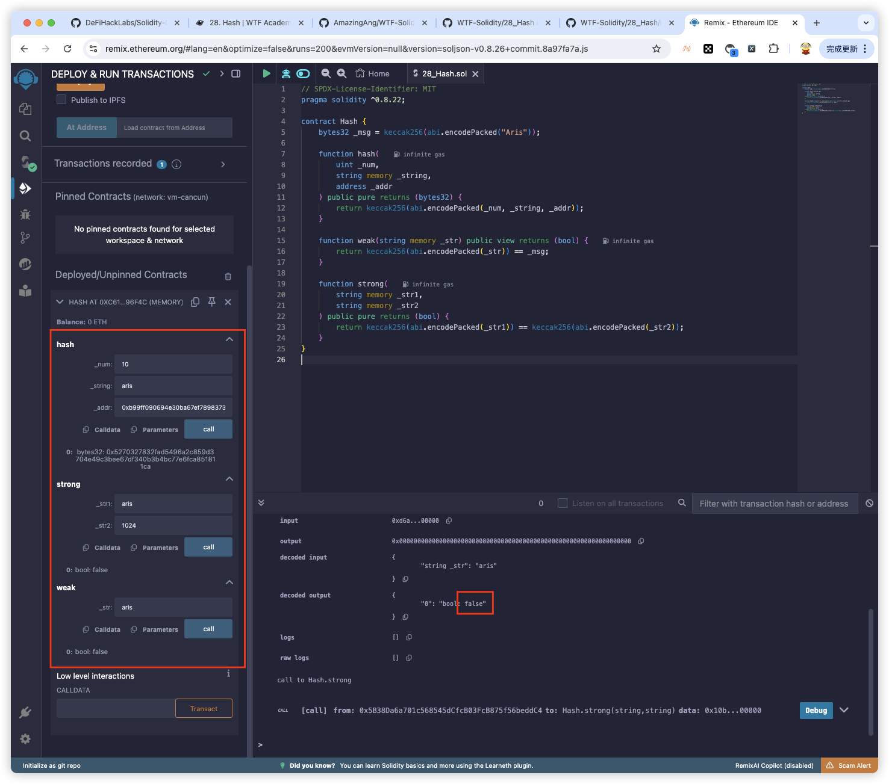

10. 第 28 节测验得分: 100, 答案:DCDBA

---

#### 学习内容 29. 函数选择器Selector

1. 函数选择器

    - 当我们调用智能合约时，本质上是向目标合约发送了一段`calldata`
    - `calldata`中前4个字节是`selector`（函数选择器）
    - msg.data `0x6a6278420000000000000000000000002c44b726adf1963ca47af88b284c06f30380fc78`

2. 函数的id、selector和签名

    - id:`函数签名`的`Keccak`哈希后的前4个字节 

        - ```solidity
            bytes4(keccak256("mint(address)"))
            ```

    - 当`selector`与`method id`相匹配时，即表示调用该函数

    - 函数签名:`函数名（逗号分隔的参数类型)`

    - 在同一个智能合约中，不同的函数有不同的函数签名

3. 计算`method id`时，需要通过函数名和函数的参数类型来计算

    - `bytes4(keccak256("函数名(参数类型1,参数类型2,...)"))`
    - 基础类型参数
        - **bytes4**(keccak256("selectorElementaryParam(uint256,bool)"));
    - 固定长度类型参数
        - **bytes4**(keccak256("selectorFixedSizeParam(uint256[3])"));
    - 可变长度类型参数
        - **bytes4**(keccak256("selectorNoFixedSizeParam(uint256[],string)"));
    - 映射类型参数
        - **bytes4**(keccak256("selectorMappingParam(address,(uint256,bytes),uint256[],uint8)"));

4. 使用selector

    - ```solidity
        (bool success1, bytes memory data1) = address(this).call(abi.encodeWithSelector(0x3ec37834, 1, 0));
        ```

5. 合约部署

    - 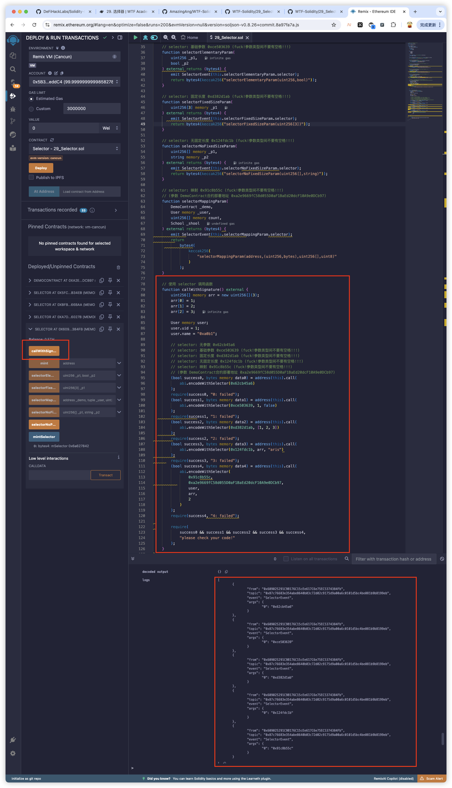

6. 第 29 节测验得分: 100, 答案:DDCBD

---

#### 学习内容: 30. Try Catch

1. try-catch

   - 只能用于 external 函数 或者 创建合约时 constructor 函数
   - ```solidity
     try externalContract.f() returns(returnType val){
         // call成功的情况下 运行一些代码
     } catch {
         // call失败的情况下 运行一些代码
     }
     ```
   - `externalContract.f()` 是某个外部合约调用,调用成功执行 try 函数体,失败 catch 函数体
   - 也可以 this.f(),因为被视为外部调用,但是不能在构造函数中使用;
   - 如果 f() 有返回值,必须在 后面声明 returns(类型 变量)

     - try 函数体可以使用返回的变量
     - 如果是创建合约,则返回值时合约的变量(实例)

   - catch 模块支持捕获特殊的异常原因

     - ```solidity
       try externalContract.f() returns(returnType){
           // call成功的情况下 运行一些代码
       } catch Error(string memory /*reason*/) {
           // 捕获revert("reasonString") 和 require(false, "reasonString")
       } catch Panic(uint /*errorCode*/) {
           // 捕获Panic导致的错误 例如assert失败 溢出 除零 数组访问越界
       } catch (bytes memory /*lowLevelData*/) {
           // 如果发生了revert且上面2个异常类型匹配都失败了 会进入该分支
           // 例如revert() require(false) revert自定义类型的error
       }
       ```

     - catch Error(string memory reason) 捕获revert("reasonString") 和 require(false, "reasonString")

     - catch Panic(uint errorCode) 捕获Panic导致的错误 例如assert失败 溢出 除零 数组访问越界

     - catch (bytes memory lowLevelData)  其他异常(兜底)

2. 合约部署

   - 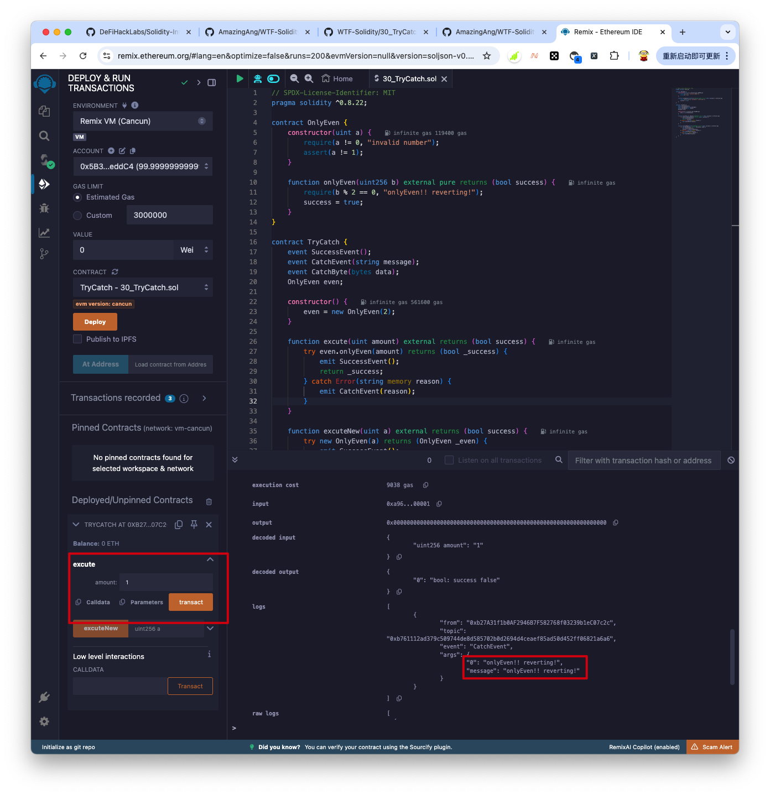
   - 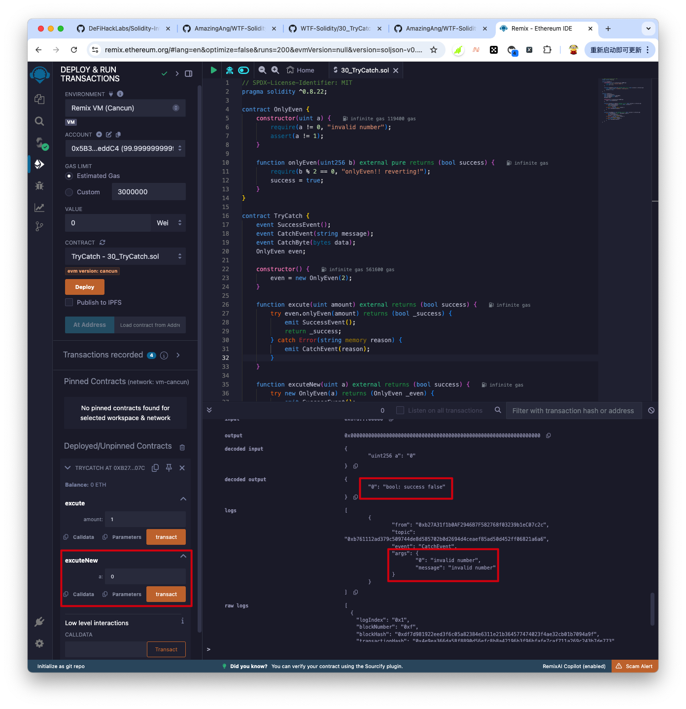
   - 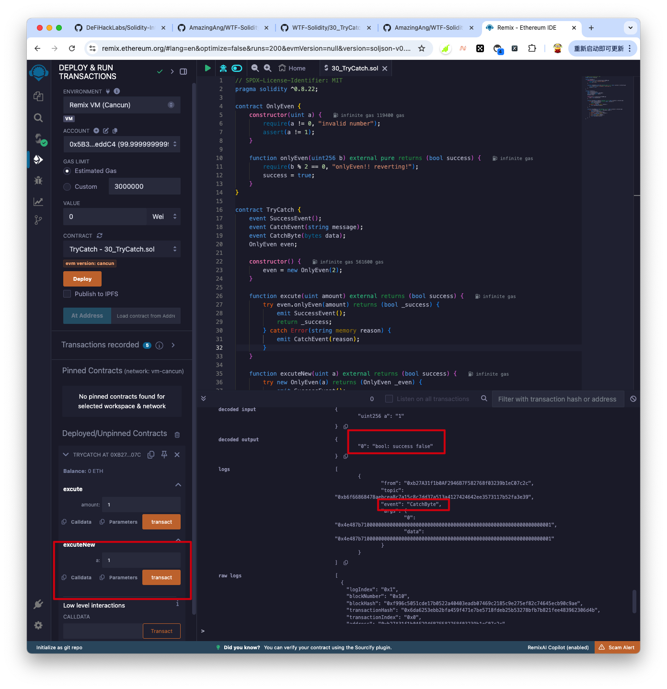

3. 第 30 节测验得分: 100, 答案:DCBB (我觉得第2题的答案是 A)

   - 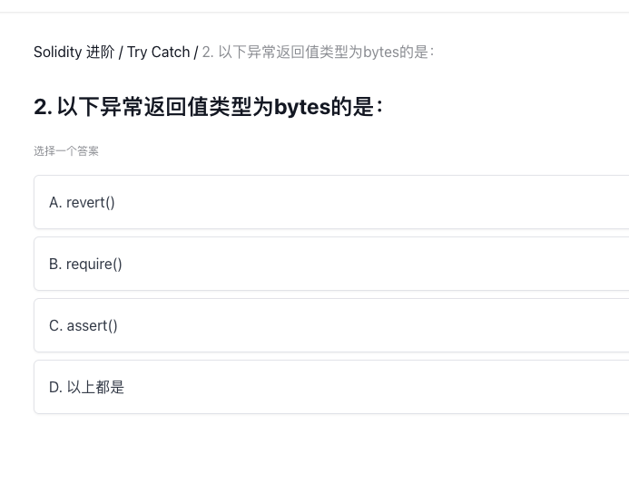
   - 

4. 至此 102 全部完成

   - 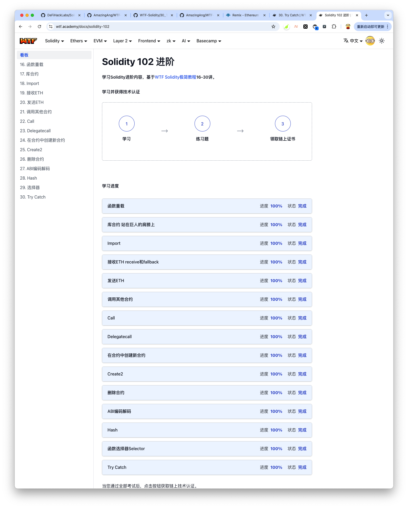


---

### 2024.10.11

#### 学习内容 31. ERC20

1. ERC20

    - `ERC20`是以太坊上的代币标准
    - 账户余额 balanceOf()
    - 转账 transfer()
    - 授权转账 transferFrom()
    - 授权 approve()
    - 代币总供给 totalSupply()
    - 授权转账额度 allowance()
    - 代币信息
        - 名称,代号,小数位数

2. IERC20

    - `IERC20`是 `ERC20`代币标准的接口合约,规定 ERC20 代币需要实现的函数和事件(就是规范)

3. 事件

    - Transfer事件: 转账时释放

        - ```solidity
            /**
             * @dev 释放条件：当 `value` 单位的货币从账户 (`from`) 转账到另一账户 (`to`)时.
             */
            event Transfer(address indexed from, address indexed to, uint256 value);
            ```

    - Approval事件: 授权时释放

        - ```solidity
            /**
             * @dev 释放条件：当 `value` 单位的货币从账户 (`owner`) 授权给另一账户 (`spender`)时.
             */
            event Approval(address indexed owner, address indexed spender, uint256 value);
            ```

4. 函数

    - totalSupply() 代币总供给 (池子总共有多少代币)

        - ```solidity
            // 返回代币总供给.
            function totalSupply() external view returns (uint256);
            ```

    - balanceOf() 账户的代币余额 (你代币还有多少)

        - ```solidity
            // 返回账户 account 所持有的代币数.
            function balanceOf(address account) external view returns (uint256);
            ```

    - transfer() 转账 (从你账户给 to 账户)

        - ```solidity
            /**
             * @dev 转账 `amount` 单位代币，从调用者账户到另一账户 `to`.
             *
             * 如果成功，返回 `true`.
             *
             * 释放 {Transfer} 事件.
             */
            function transfer(address to, uint256 amount) external returns (bool);
            ```

    - allowance() 授权额度 (给花钱的人授权额度)

        - ```solidity
            /**
             * @dev 返回`owner`账户授权给`spender`账户的额度，默认为0。
             *
             * 当{approve} 或 {transferFrom} 被调用时，`allowance`会改变.
             */
            function allowance(address owner, address spender) external view returns (uint256);
            ```

    - approve() 授权 (给花钱的人多少代币)

        - ```solidity
            /**
             * @dev 调用者账户给`spender`账户授权 `amount`数量代币。
             *
             * 如果成功，返回 `true`.
             *
             * 释放 {Approval} 事件.
             */
            function approve(address spender, uint256 amount) external returns (bool);
            ```

    - transferFrom() 授权转账 (from 给 to 转 amount 数量代币)

        - ```solidity
            /**
             * @dev 通过授权机制，从`from`账户向`to`账户转账`amount`数量代币。转账的部分会从调用者的`allowance`中扣除。
             *
             * 如果成功，返回 `true`.
             *
             * 释放 {Transfer} 事件.
             */
            function transferFrom(address from,address to,uint256 amount) external returns (bool);
            ```

5. 合约部署

    - 下面图片中的 transferFrom()方法错了,应该是

    - ```solidity
        function transferFrom(
            address from,
            address to,
            uint256 amount
        ) external override returns (bool) {
            allowance[from][msg.sender] -= amount;
            balanceOf[from] -= amount;
            balanceOf[to] += amount;
            emit Transfer(from, to, amount);
            return true;
        }
        ```

    - 


---

#### 学习内容32. 代币水龙头

1. 代币水龙头

    - 代币水龙头就是让用户免费领代币的网站/应用

2. ERC20水龙头合约

    - ```solidity
        // SPDX-License-Identifier: MIT
        pragma solidity ^0.8.22;
        import "./lib/IERC20.sol";
        
        contract Faucet {
            uint256 public amountAllowed = 100;
            address public tokenAddress;
            mapping(address => bool) public requestedAddress;
            event SendToken(address indexed receiver, uint256 indexed amount);
        
            constructor(address _token) {
                tokenAddress = _token;
            }
        
            function requestTokens() external {
                require(
                    !requestedAddress[msg.sender],
                    "Each address can only be collected once."
                );
                IERC20 token = IERC20(tokenAddress); // 创建合约对象
                bool valid = token.balanceOf(address(this)) >= amountAllowed;
                require(valid, "Faucet is Empty.");
                token.transfer(msg.sender, amountAllowed); // 领水
                requestedAddress[msg.sender] = true; // 记录
                emit SendToken(msg.sender, amountAllowed); // 释放事件
            }
        }
        ```

    - 状态变量

        - uint256 public amountAllowed = 100; // 一次领多少个
        - address public tokenAddress; // token 代币合约地址
        - mapping(address => bool) public requestedAddress; // 记录已领取的钱包地址

    - 事件

        - event SendToken(address indexed receiver, uint256 indexed amount); // 领水事件

    - 函数

        - requestTokens()
        - 检查 1: 不能多次领水
        - 检查 2: 水龙头合约的持有代币睡了要足够领水

3. 合约部署

    - 先部署31 课的 ERC20 合约,得到地址后,再部署 faucet 合约
        - ERC20:`0x36C32B5bc196DFB77C4A123Ec9C9E49356Cca07B`
        - faucet: `0xE58469710853b35Dae8635EDA1484D4f404eaEa0`
        - 合约部署者: `0x5B38Da6a701c568545dCfcB03FcB875f56beddC4`
        - 领水者: `0xAb8483F64d9C6d1EcF9b849Ae677dD3315835cb2`
    - 先在 `ERC20` 合约中 `mint` 10000 个给合约部署者
    - 接着,在 `ERC20` 合约中 `transfer` 1000 个给 faucet 合约
    - 然后,领水者调用`faucet`合约 的领水函数 `requestTokens()`
    - 最后,在`ERC20` 合约中领水者调用 `balanceOf()` 检查自己的代币数量
    - 数量为 100,则领水成功!
    - 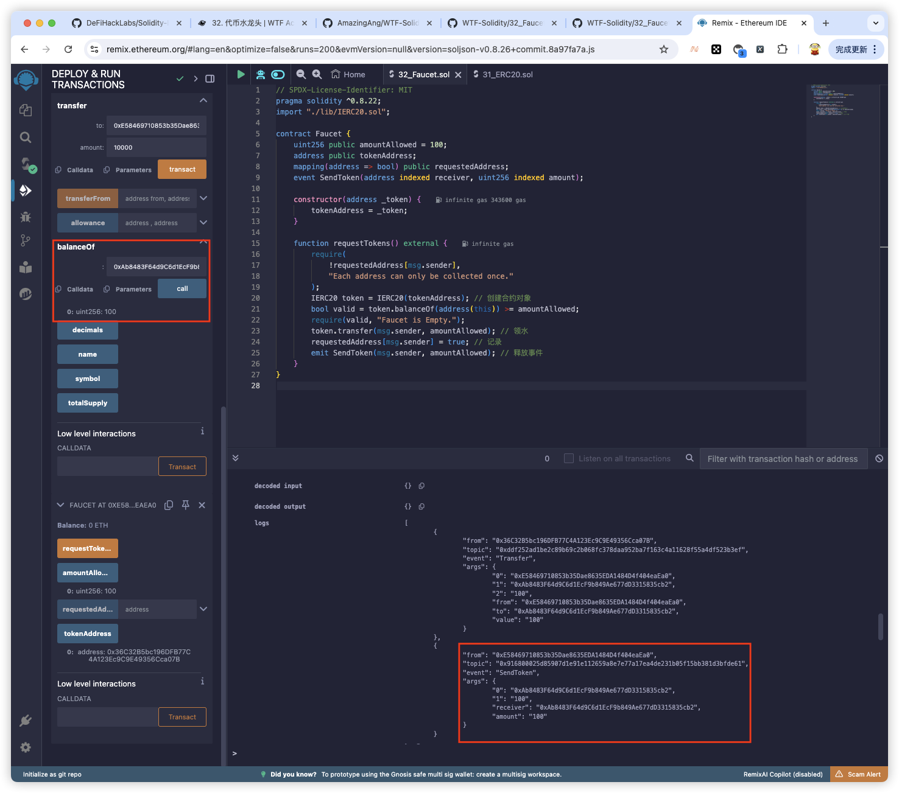

---

#### 学习内容33. 空投合约

1. 空投 Arisdrop

    - 空投是币圈中一种营销策略，项目方将代币免费发放给特定用户群体。
    - 为了拿到空投资格，用户通常需要完成一些简单的任务，如测试产品、分享新闻、介绍朋友等。
    - 项目方通过空投可以获得种子用户，而用户可以获得一笔财富，两全其美。
    - 利用智能合约批量发放`ERC20`代币，可以显著提高空投效率。

2. 代码

    1. multiTransferToken() 空投代币

        - ```solidity
            // 多个地址转账 ERC20 代币
            function multiTransferToken(
                address _token,
                address[] calldata _addresses,
                uint256[] calldata _amounts
            ) external {
                // 1. 检查 二者长度
                require(_addresses.length == _amounts.length, "Addresses and amounts arrays are not equal in length.");
                // 2. 检查 授权额度
                IERC20 token = IERC20(_token);
                uint sum = getSum(_amounts);
                require(token.allowance(msg.sender, address(this)) >= sum, "ERC20 token authorization amount is insufficient.");
                // 3. 遍历转账代币(空投 代币)
                for (uint i = 0; i < _addresses.length; i++) {
                    token.transferFrom(msg.sender, _addresses[i], _amounts[i]);
                }
            
            }
            ```

    2. multiTransferETH() 空投 ETH

        - ```solidity
            // 多个地址转账 ETH (payable)
            function multiTransferETH(
                address[] calldata _addresses,
                uint256[] calldata _amounts
            ) external payable {
                // 1. 检查 二者长度
                require(_addresses.length == _amounts.length, "Addresses and amounts arrays are not equal in length.");
                // 2. 检查 转入 ETH数量与要发送的 ETH 总数量 是否相等 (少了不行,多了浪费)
                uint sum = getSum(_amounts);
                require(msg.value == sum, "Transfer amount error");
                // 3. 遍历 转入 ETH (空投 EHT)
                for (uint i = 0; i < _addresses.length; i++) {
                    // 转账ETH 的方法有 transfer,send,call 推荐用 call (第 20 节课 SendETH)
                    (bool success, ) = _addresses[i].call{value: _amounts[i]}("");
                    if (!success) {
                        failTransferList[_addresses[i]] = _amounts[i]; // 记录转账失败的地址 (人性化一点!!!)
                    }
                }
            }
            ```

3. 合约部署

    - 先部署31 课的 ERC20 合约,得到地址后,再部署 airdrop 合约
        - 部署者:0x5B38Da6a701c568545dCfcB03FcB875f56beddC4
        - ERC20 合约: 0xd20977056F58b3Fb3533b7C2b9028a19Fbcd2358
        - airdrop 合约 0x9Dfc8C3143E01cA01A90c3E313bA31bFfD9C1BA9
        - 领空投地址: ["0xAb8483F64d9C6d1EcF9b849Ae677dD3315835cb2", "0x4B20993Bc481177ec7E8f571ceCaE8A9e22C02db"]
        - 领 EHT 地址: ["0x5c6B0f7Bf3E7ce046039Bd8FABdfD3f9F5021678", "0x03C6FcED478cBbC9a4FAB34eF9f40767739D1Ff7"]
    - 部署者在 ERC20合约 mint 10000 代币,然后授权 10000 代币给airdrop合约
    - 部署者调用 airdrop multiTransferToken()方法 空投代币
    - 部署者调用 airdrop multiTransferETH()方法 空投ETH
    - 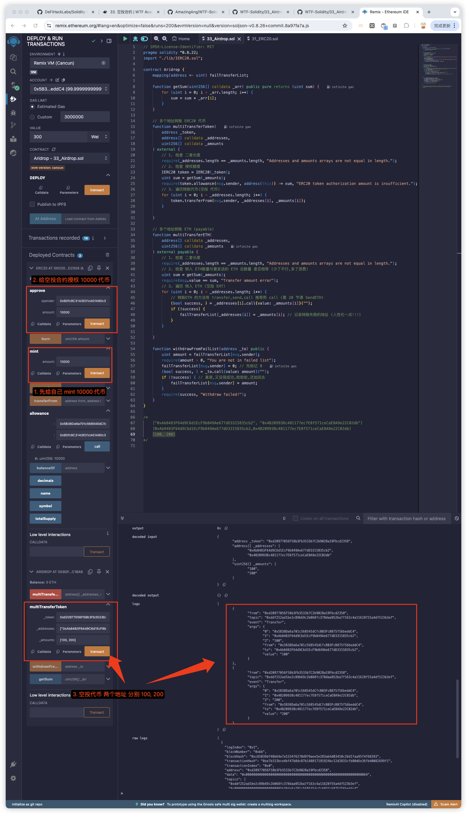
    - 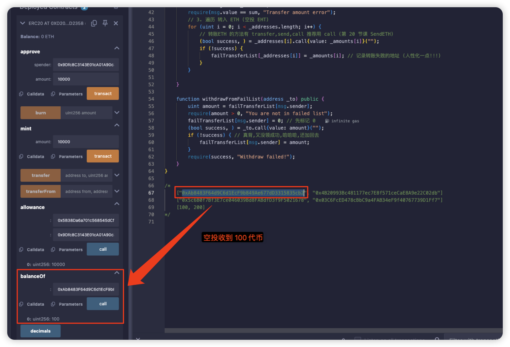
    - 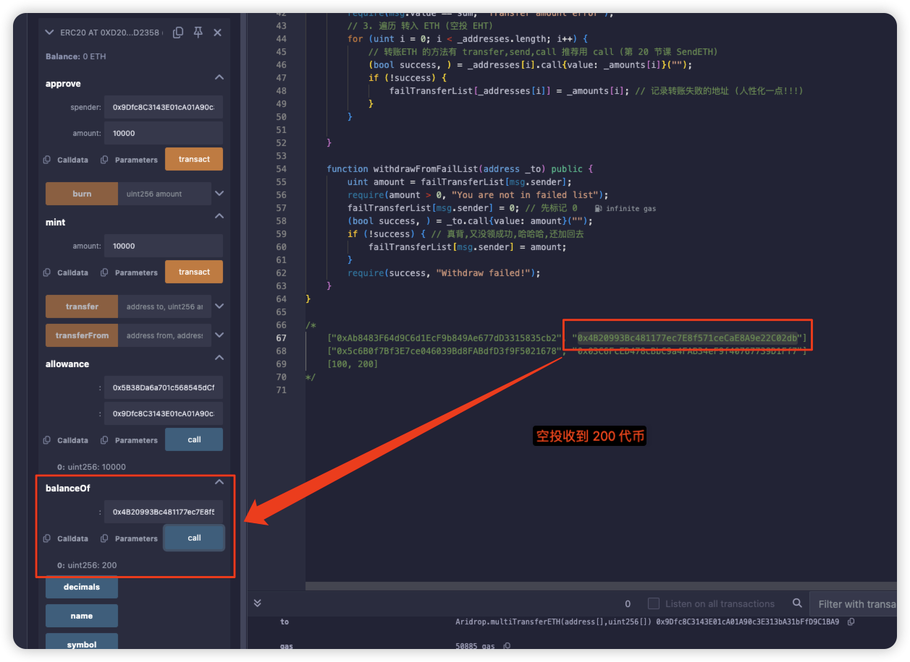
    - 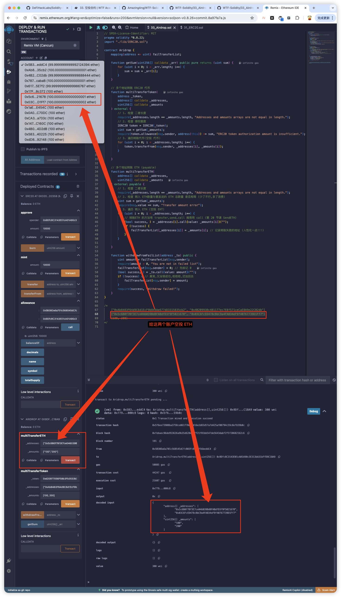

---

### 2024.10.12

#### 学习内容 34. ERC721

1. ERC721

    - `BTC`和`ETH`这类代币都属于同质化代币
    - 世界中很多物品是不同质的，其中包括房产、古董、虚拟艺术品等等，这类物品无法用同质化代币抽象
    - `ERC721`标准，来抽象非同质化的物品
    - NFT:`Non-Fungible Token`

2. EIP与ERC

    - EIP: 以太坊改进建议 `Ethereum Improvement Proposals`
    - ERC: 以太坊意见征求稿 `Ethereum Request For Comment`
    - EIP包含ERC

3. ERC165

    - 智能合约可以声明它支持的接口，供其他合约检查

    - ```solidity
        interface IERC165 {
            /**
             * @dev 如果合约实现了查询的`interfaceId`，则返回true
             * 规则详见：https://eips.ethereum.org/EIPS/eip-165#how-interfaces-are-identified[EIP section]
             *
             */
            function supportsInterface(bytes4 interfaceId) external view returns (bool);
        }
        ```

    - ```solidity
        function supportsInterface(bytes4 interfaceId) external pure override returns (bool)
        {
            return
                interfaceId == type(IERC721).interfaceId ||
                interfaceId == type(IERC165).interfaceId;
        }
        ```

4. IERC721事件

    - `Transfer`事件：在转账时被释放，记录代币的发出地址`from`，接收地址`to`和`tokenid`。
    - `Approval`事件：在授权时释放，记录授权地址`owner`，被授权地址`approved`和`tokenid`。
    - `ApprovalForAll`事件：在批量授权时释放，记录批量授权的发出地址`owner`，被授权地址`operator`和授权与否的`approved`。

5. IERC721函数

    - `balanceOf`：返回某地址的NFT持有量`balance`。
    - `ownerOf`：返回某`tokenId`的主人`owner`。
    - `transferFrom`：普通转账，参数为转出地址`from`，接收地址`to`和`tokenId`。
    - `safeTransferFrom`：安全转账（如果接收方是合约地址，会要求实现`ERC721Receiver`接口）。参数为转出地址`from`，接收地址`to`和`tokenId`。
    - `approve`：授权另一个地址使用你的NFT。参数为被授权地址`approve`和`tokenId`。
    - `getApproved`：查询`tokenId`被批准给了哪个地址。
    - `setApprovalForAll`：将自己持有的该系列NFT批量授权给某个地址`operator`。
    - `isApprovedForAll`：查询某地址的NFT是否批量授权给了另一个`operator`地址。
    - `safeTransferFrom`：安全转账的重载函数，参数里面包含了`data`。

6. IERC721Receiver

    - NFT 可以转给钱包也可以转给合约

    - 接收 NFT 合约必须实现IERC721Receiver接口,防止转入黑洞

    - ```solidity
        // ERC721接收者接口：合约必须实现这个接口来通过安全转账接收ERC721
        interface IERC721Receiver {
            function onERC721Received(
                address operator,
                address from,
                uint tokenId,
                bytes calldata data
            ) external returns (bytes4);
        }
        ```

7. IERC721Metadata

    - `ERC721`的拓展接口
    - `name()`：返回代币名称。
    - `symbol()`：返回代币代号。
    - `tokenURI()`：通过`tokenId`查询`metadata`的链接`url`，`ERC721`特有的函数。

8. 合约部署 

    - 


---


<!-- Content_END -->
