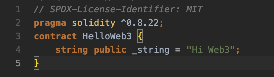
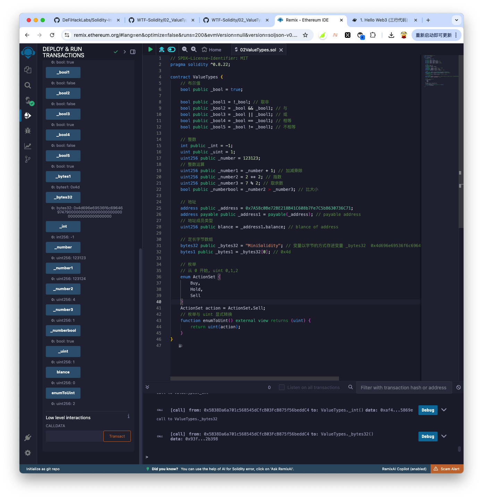
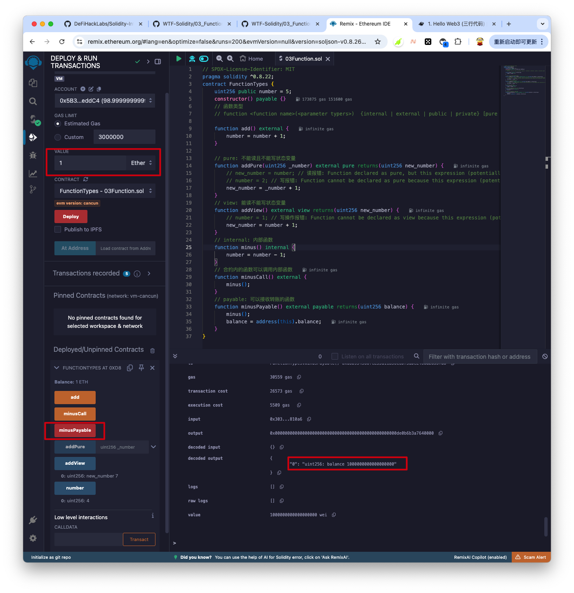
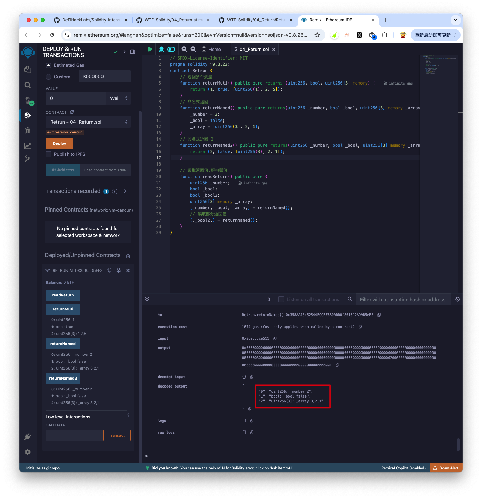
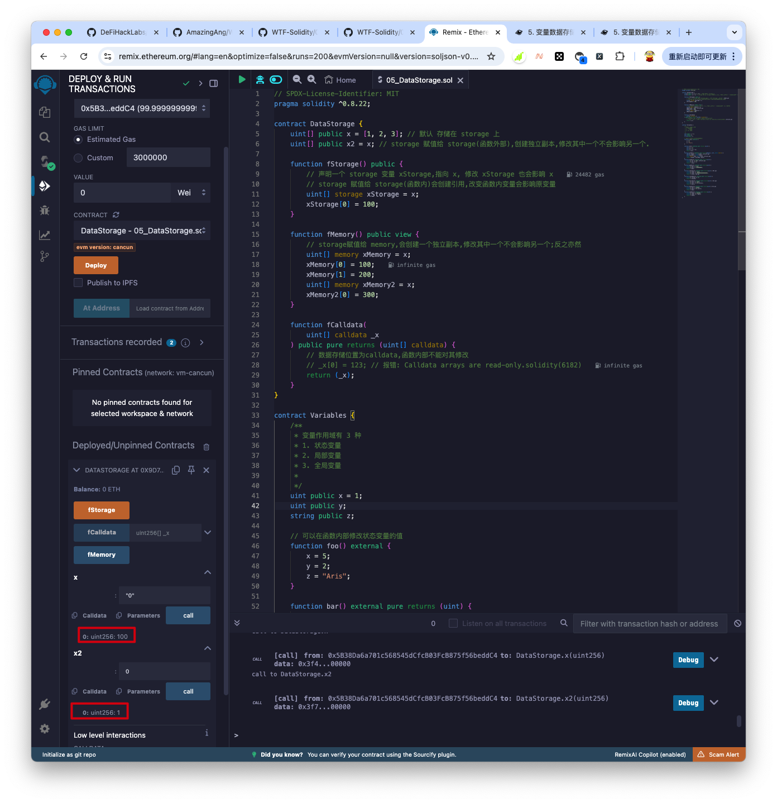
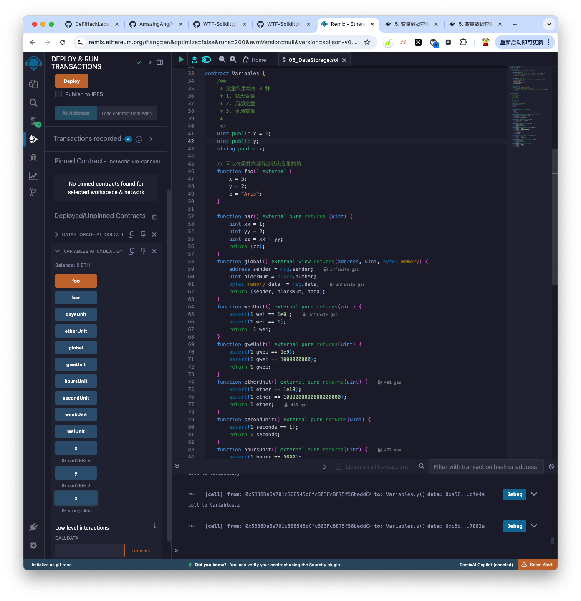
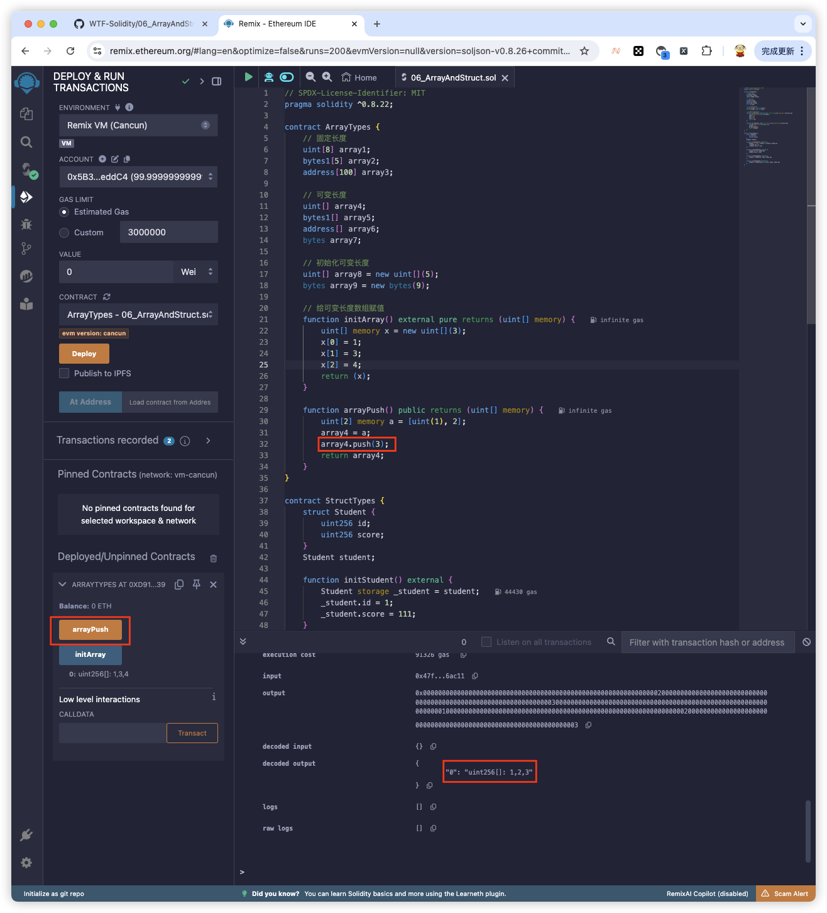
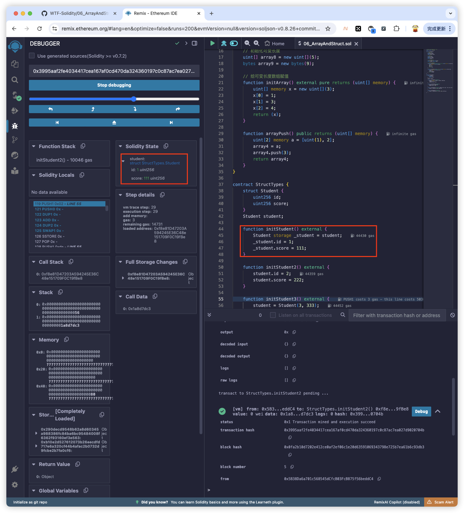

---

# Aris

1. 自我介绍
    - 我是 Aris.

2. 你认为你会完成本次残酷学习吗？
    - 有点困难,不过应该能完成.

## Notes

<!-- Content_START -->

### 2024.09.23

#### 学习内容 第01节
 - 01HelloWeb3.sol 创建 helloWeb3 程序,并在 remix 上进行编译和部署

 - 代码部分

- 

 - 在根目录创建 contracts 目录,创建 .sol 文件,放入上面代码

 - 使用 nodejs 安装 remixd

 - ```
    npm install -g @remix-project/remixd

 - node 安装
   - 下载地址: https://nodejs.org/en/download/prebuilt-installer/current
   - 查看 node 仓库源 `npm config  get registry`
   - 修改 node 仓库源 `npm config set registry https://registry.npmmirror.com`

 - 创建脚本`remix.sh`, 让 `https://remix.ethereum.org` 网站能关联本地文档

 - ```
    DIR=$(cd "$(dirname "$0")"; pwd)
    contracts=${DIR}/contracts
    echo '合约地址:' ${contracts} 
    remixd -s ${contracts} --remix-ide https://remix.ethereum.org
    ```

 - 执行remix.sh

 - ```
    ./remix.sh

 - 编译和部署
   - 使用Google Chrome打开`https://remix.ethereum.org`,左侧 workspace 中选择 `connect to localhost`
   - 然后点击 `connect` 按钮,就会加载出本地 `contracts`目录下的 .sol 文件
   - 点击 `01HelloWeb3.sol`进入文件,然后 `cmd + s`, 会进行编译
   - 点击左侧 `deploy & run transactions` 按钮,点击 `高亮`的 Depoly 按钮
   - 左侧会出现部署结果,点击 `_string` 出现 `'Hi Web3'`,表示成功.

- 也可以在 https://remix.ethereum.org 直接编写代码,然后编译和部署,但是我习惯在本地编写代码^_^

- 第01节测验得分: 100, 答案: BBABCCBA

    ---

### 2024.09.24

#### 学习内容 第02 节: 值类型 第03节:函数类型

- 第02 节: 值类型
  - 值类型: Value Type 
  - 引用类型: Reference Type
  - 映射类型: Mapping Type
  
- 值类型:
  - 布尔型
    - 与`&&`,或`||`,非`!` 等于`=`,不等于`!=`
    - `&&` 和` ||` 遵循短路规则
  - 整形
    - `int`整数, `uint` 正整数, `uint256` 256位正整数
    - 比较运算符: <=, <, >=, >, ==, !=
    - 算数运算符: `+`,` -` , `*` ,`/`, `%`, `**`
  - 地址类型
    - 普通地址: address, 存储一个 20 字节的值(以太坊)
    - payable address: 用于接收转账,有 transfer 和 send 方法
  - 定长字节数组
    - 定长字节数组时值类型,数组长度在声明以后不能改变,分为 bytes1,bytes8,bytes32等,最大bytes 32
  - 枚举 enum
    - 为uint 分配名称,从 0 开始.
  
- 合约部署截图

- 

- 第节: 函数类型

- `function <function name>(<parameter types>) {internal|external|public|private} [pure|view|payable] [returns (<return types>)]`
  - function: 函数声明的固定写法
  - name: 函数名
  - 函数可见性修饰符 (必须指定)
    - public: 内部: 可以, 外部: 可以, 继承: 可以
    - private: 内部: 可以, 外部: 不可以, 继承: 不可以
    - external: 内部: 不可以(通过 `this.f()`调用), 外部: 可以, 继承: 可以
    - internal: 内部: 可以, 外部: 不可以, 继承: 可以
  - 权限关键字
    - pure: 外部变量,不能读,不能写 | 无 gas 消耗 | 注意: 调用任何非标记 pure/view 函数需要支付 gas 费
    - view: 外部变量,能读,不能写 | 无 gas 消耗 | 注意: 调用任何非标记 pure/view 函数需要支付 gas 费
    - payable: 调用函数可以转入 ETH (下面截图中,调用`minusPayable()` 传入了1 个 ETH,合约余额就受到了 1ETH)
  - retuns: 函数返回的变量类型和名称
  
- 合约部署截图

- 

- 第 02 节测验得分 100,答案:C,D,C,B,D

- 第 03 节测验得分 100,答案:

  ---

### 2024.09.25

#### 学习内容 第 04 节:4. 函数输出

1. 返回值: return 和 returns
    - return:函数主体,返回指定变量
    - returns:函数名后面,声明返回的变量类型及变量名

2. 命名式返回
    - 在 returns 中标明返回变量的名称
    - solidity 会初始化这些变量,并且自动返回这些函数的值,无需 return.
    - 也可以在命名式返回中用 retrun 来返回变量

3. 解构赋值
    - 读取所有返回值:声明变量,在`()`中按顺序逗号隔开
    - 读取部分返回值:声明要读取的变量,按顺序,不读的空着.

4. 合约部署
    - 

5. 第 04 节测验得分:100, 答案: ABCBABCB

    ---

### 2024.09.26

#### 学习内容 第 05 节: 5. 变量数据存储和作用域 storage/memory/calldata

1. solidity 中的引用类型
   - 变量类型复杂,占用内存空间大,必须声明变量的存储位置,包括 数组和结构体
2. 数据位置
   - 存储位置有 3 类,storage, memory,calldata
     - storage: 存储在链上,消耗 gas 多,合约的状态变量默认是 storage
     - memory: 函数里的参数和临时变量一般用 memory,存储在内存中,不上链,消耗 gas 少;
       - 如果返回数据类型是变长的情况,必须加 memory 修饰,如 string,bytes,array 和 自定义结构体

     - calldata:存储在内存中,不上链,消耗 gas 少.
       - calldata 变量不能修改(immutable),一般用于函数参数.

   - 数据位置和赋值规则
     - 赋值本质上是创建引用指向本体
     - storage(合约状态变量) 赋值给 storage(函数中变量),会创建引用,同步发生改变.(连体)
     - memory 赋值给 memory 会创建引用,同步发生改变.
     - 其他情况: 赋值创建的是本体副本,修改变量不会影响对方
3. 变量作用域
   - 状态变量
     - 状态变量时声明存储在链上的变量,所有合约函数都可以访问,gas 消耗高

   - 局部变量
     - 局部变量仅在执行过程中的有效变量,函数退出后变量无效,存储在内存中,不上链.

   - 全局变量
     - 全局变量时全局范围内工作的变量,是 solidity 预留关键字,可以在函数内不声明即可使用.
     - blockhash 给定区块的哈希值
     - block.coinbase 当前区块矿工的地址
     - block.gaslimit 当前区块的 gaslimit
     - block.number 当前区块的 number
     - block.timstamp 当前区块的时间戳(unix,秒)
     - gaseleft() 剩余 gas
     - msg.data 完整的 calldata 数据
     - msg.sender 消息发送着
     - msg.sig calldata 的前 4 个字节,就是方法的 hash
     - msg.value 当前发送来的 eth 数量,单位是wei
     - block.blobbasefee 当前区块的 blob 基础费用
     - blobhash(index) 根当前交易关联的目标索引 blob的版本哈希值

   - 全局变量-以太单位与时间单位
     - wei: 1
     - gwei: 1000000000
     - ether: 1000000000000000000
     - seconds: 1
     - minutes: 60 seconds = 60
     - hours: 60 minutes  = 3600
     - days: 24hours = 86400
     - weeks: 7days = 604800
4. 合约部署
   - 
   - 
5. 第 05 节测验得分: 100, 答案: DBACDABA

---

### 2024.09.27

#### 学习内容 第 06 节: 6. 引用类型, array, struct

1. 数组 array
    - 存储一组数据(整数,字节,地址等),分为2 种
        - 固定长度数组:在生命时指定长度
        - 可变长度数组:不指定数组长度
        - 注意: bytes 比较特殊,是数组,但是不另外加`[]` ; 
        - 另外,不能用 byte[]声明单字节数组,可用 bytes 或者 bytes1[]
        - bytes 比 bytes1[] 省 gas
    - 创建数组的规则
        - momery 修饰的动态数组,可以用 new 创建,必须声明长度,声明后长度不可变.
        - 数组字面数(方括号初始化的一种方式),每一个元素类型以第一个元素为准
            - `[1,2,3]` 中所有元素是 `uint8`类型(默认最小单位的类型,这里是 uint8)
            - `[uint(1),2,3]` 所有元素类型是 uint
    - 数组成员
        - length(): 数组长度,memory 数组的长度在创建后是固定的;
        - push(): 动态数组方法,在数组最后添加 0 元素,并返回该元素的引用;
        - push(x): 动态数组方法,在数组最后添加 x 元素;
        - pop(): 动态数组方法,移除最后一个元素;
2. 结构体 struct
    - solidity 支持通过构造结构体的形式定义新的类型;
    - 结构体中的元素可以是原始类型,也可以是引用类型;
    - 结构体可以作为数组或映射的元素
    - 结构体赋值 4 种方法:
        - 在函数中创建 storage 的结构体引用
        - 直接引用专状态变量的结构体
        - 函数构造方式
        - 键值对方式
3. 合约部署-数组
    - 
4. 合约部署-结构体
    - 
5. 第 06 节测验得分: 100, 答案: BCCBCA

<!-- Content_END -->
