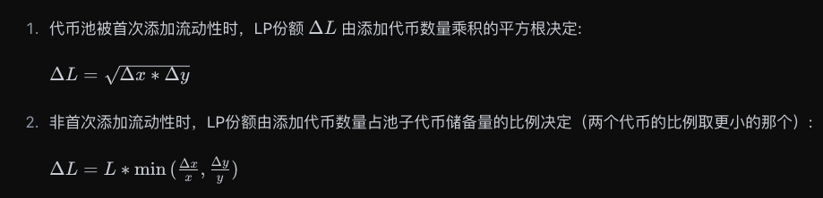
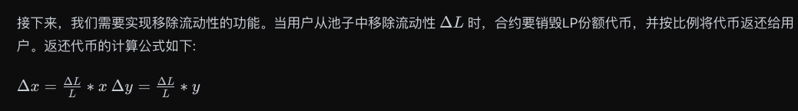

# Thurendous

1. 自我介绍
   Hi, 我是 Thurendous。30 岁开始转行，现在在做 Web3 相关的开发工作。喜欢新的领域，新的想法。
   希望通过学习巩固自己的已经知道的 Solidity 知识。同时能够培养自己的学习习惯。共勉进步！

2. 你认为你会完成本次残酷学习吗？
   会尽力而为，不中途放弃。培养习惯，提高自己。

## Notes

<!-- Content_START -->

### 2024.09.23

(Day 1)

今天开始复习 solidity 的内容。残酷共学的初衷和学习方式个人非常地喜欢！加油！一起！

学习笔记

#### Hello Web3 (三行代码)

- 学习了 solidity 就可以看懂合约代码，不会的话在区块链世界就会很 low（圈重点）。
- 写智能合约的话，需要做这些事情：
  - 写一个 license
    - License 是有各种各样的版本，MIT 是一个比较宽松和常见的。MIT 意味着任何人可以以任何方式使用，复制，修改，分发。甚至是商用你写的代码。还有一个 GPL 也是宽松的版本控制，但是他是要求你写的代码的源码必须公开。
  - 写版本
  - 写 import
  - 写合约的内容
- 可以使用 Remix 来进行智能合约的书写。
  - 在 Solidity Editor 中写代码
  - 在 Solidity Compiler 中编译
  - 然后进行部署按 deploy 按键
  - 然后就会有一个智能合约的 interaction 的界面，可以进行交互了。

#### 数据类型

值类型

- 布尔型
  - 只有两个值：true 和 false
  - 默认值是 false
- 整型
  - uint 无符号整数，正整数
  - int 有符号整数，正整数和负整数
  - uint 和 int 后面可以跟数字，表示这个整数有多少位。比如 uint8 就是 8 位，uint256 就是 256 位。uint 和 int 的取值范围是 0 到 2^n - 1。比如 uint8 的取值范围是 0 到 255，uint256 的取值范围是 0 到 2^256 - 1。
  - uint 和 int 默认是 uint256 和 int256。
- 地址类型
  - address 是一个 160 位的整数，表示一个以太坊地址。
  - address 可以用来表示一个账户的地址，也可以用来表示一个合约的地址。
  - 可以添加 payable 关键字，表示这个地址可以接收以太币。
- 定长字节数组
  - bytes1 到 bytes32，分别表示 1 到 32 个字节的字节数组。
  - 定长的 bytes 可以节省一些 gas。
  - 定长字节数组的长度是固定的，不能改变。
- 变长字节数组
  - bytes 是一个可变长度的字节数组。
  - bytes 的长度可以改变，可以存储任意长度的数据。
- 枚举 enum
  - 枚举类型是一个用户自定义的类型，可以用来表示一组有限的值。
  - 枚举（enum）是 Solidity 中用户定义的数据类型。它主要用于为 uint 分配名称，使程序易于阅读和维护。它与 C 语言 中的 enum 类似，使用名称来代替从 0 开始的 uint。
  - 枚举可以显式地和 uint 相互转换，并会检查转换的正整数是否在枚举的长度内，

另外的引用类型和映射类型以后会介绍到。

### 2024.09.24

(Day 2)

学习笔记

#### 函数

1. 函数

- 下边就是函数的知识点的全部。

```solidity
function <function name>(<parameter types>) {internal|external|public|private} [pure|view|payable] [returns (<return types>)]
```

- 需要一个 function 的关键词定义
- name 就是函数名称
- <parameter types>就是参数
- 函数可见性说明
  - internal 是内部可见性，只能在当前合约内访问，不能被外部访问。
  - external 是外部可见性，只能被外部访问，不能在当前合约内访问。
  - public 是公共可见性，可以在当前合约内访问，也可以被外部访问。
  - private 是私有可见性，只能在当前合约内访问，不能被外部访问。
- 函数类型说明
  - pure 是纯函数，不能读取也不能写入状态变量。
  - view 是视图函数，不能写入状态变量，可以读取状态变量。
  - payable 是可支付函数，可以接收以太币。
  - 定义函数需要明确指出可见性。没有默认值。
- 函数返回值

  - 返回值是可选的，可以有返回值，也可以没有返回值。

2. 什么是 pure 和 view

因为区块链上需要支付燃气费用。而 pure 和 view 的函数被外部调用的话，是不需要支付燃气费用的。

以下动作在区块链上是被认为是修改链上的状态的。

- 修改状态变量
- 发出事件
- 创建其他合约
- 使用 selfdestruct 销毁合约
- 发送以太币
- 发送以太坊币
- 调用任何为标记 view 和 pure 的函数
- 使用低级调用（low-level calls）
- 使用包含某些操作码的内联汇编

- pure 函数

  - 不能读取也不能写入状态变量。
  - 不能使用 this
  - 不能访问当前合约的 storage、memory 或 calldata

- view 函数
  - 不能写入状态变量。
  - 可以读取状态变量。

如果函数被标记为乐 pure 或者 view，那这个函数就不能修改链上的状态。如果修改了，就会报错。

3. 什么是 payable 函数

payable 函数可以接收以太币。

4. 什么是 internal 函数

internal 函数是内部可见性，只能在当前合约内访问，不能被外部访问。

5. 什么是 external 函数

external 函数是外部可见性，只能被外部访问，不能在当前合约内访问。

6. 什么是 public 函数

public 函数是公共可见性，可以在当前合约内访问，也可以被外部访问。

7. 什么是 private 函数

private 函数是私有可见性，只能在当前合约内访问，不能被外部访问。

8. 什么是 returns

returns 是返回值，可以有返回值，也可以没有返回值。

#### 函数输出

1. return 和 returns

- returns：跟在函数名后面，用于声明返回的变量类型及变量名。
- return：用于函数主体中，返回指定的变量。

- 还可以同时返回多个变量

```solidity
// 返回多个变量
function returnMultiple() public pure returns(uint256, bool, uint256[3] memory){
    return(1, true, [uint256(1),2,5]);
}
```

这里的数组返回值的`uint256[3] memory`，memory 表示这个数组是存储在内存中的，不是存储在区块链上的。这个必须写上去。

这个数组之中的元素如果是[1,2,3]的话，会被默认称为 uint8 类型的变量。我们需要把第一个元素声明称为 uint256 类型的变量。

返回值的时候还可以如此声明和使用返回值：

```solidity
// 命名式返回
function returnNamed() public pure returns(uint256 _number, bool _bool, uint256[3] memory _array){
    _number = 2;
    _bool = false;
    _array = [uint256(3),2,1];
}
```

当然了，你也可以这样来赋值了：

```solidity
// 命名式返回，依然支持return
function returnNamed2() public pure returns(uint256 _number, bool _bool, uint256[3] memory _array){
    return(1, true, [uint256(1),2,5]);
}
```

2. 结构式赋值

solidity 支持结构式赋值，可以同时返回多个变量。

- 用，隔开值的变量名称，然后赋值。

```solidity
uint256 _number;
bool _bool;
uint256[3] memory _array;
(_number, _bool, _array) = returnNamed();
```

- 还可以这样来赋值。如此赋值的话，就可以只取其中的某一个变量。

```solidity
(, _bool2, ) = returnNamed();
```

### 2024.09.25

(Day 3)

学习笔记

#### 变量数据存储和作用域 storage/memory/calldata

solidity 中的引用类型（Reference Type）

- array 数组、struct 结构体
- 由于这种数据类型比较复杂，占用的存储空间比较大。我们在使用的时候要声明数据的存储的位置。

- 数据的存储位置有三类

  - storage：永久存储在区块链上，直到合约被销毁。
  - memory：临时存储在内存中，函数调用结束后销毁。
  - calldata：只读，用于函数参数，不能修改。

- 数据存储位置的声明

```solidity
function fCalldata(uint[] calldata _x) public pure returns(uint[] calldata){
    //参数为calldata数组，不能被修改
    // _x[0] = 0 //这样修改会报错
    return(_x);
}
```

- 数据的位置和赋值规则
- 赋值本质上是创建引用指向本体，因此修改本体或者是引用，变化可以被同步：
  - storage（合约的状态变量）赋值给本地 storage（函数里的）时候，会创建引用，改变新变量会影响原变量。例子：
  - memory 赋值给 memory，会创建引用，改变新变量会影响原变量。

```solidity
uint[] x = [1,2,3]; // 状态变量：数组 x

function fStorage() public{
    //声明一个storage的变量 xStorage，指向x。修改xStorage也会影响x
    uint[] storage xStorage = x;
    xStorage[0] = 100;
}
```

变量的作用域
solidity 之中作用域分成三种。分别是状态变量（state variable）、局部变量（local variable）、全局变量（global variable）。

- 状态变量（state variable）：合约的状态变量，永久存储在区块链上，直到合约被销毁。消耗 gas 比较高。
- 局部变量（local variable）：函数内部的变量，临时存储在内存中，函数调用结束后销毁。消耗 gas 比较低。
- 全局变量（global variable）：全局变量，这是 solidity 预留的关键字，他们在函数内不许要声明就可以直接食用。

```solidity
function global() external view returns(address, uint, bytes memory){
    address sender = msg.sender;
    uint blockNum = block.number;
    bytes memory data = msg.data;
    return(sender, blockNum, data);
}
```

在上面例子里，我们使用了 3 个常用的全局变量：msg.sender，block.number 和 msg.data，他们分别代表请求发起地址，当前区块高度，和请求数据。

全局变量 - 以太的单位和时间

- 以太单位
  Solidity 中不存在小数点，以 0 代替为小数点，来确保交易的精确度，并且防止精度的损失，利用以太单位可以避免误算的问题，方便程序员在合约中处理货币交易。

- wei: 1
- gwei: 1e9 = 1000000000
- ether: 1e18 = 1000000000000000000

- 时间单位
  可以在合约中规定一个操作必须在一周内完成，或者某个事件在一个月后发生。这样就能让合约的执行可以更加精确，不会因为技术上的误差而影响合约的结果。因此，时间单位在 Solidity 中是一个重要的概念，有助于提高合约的可读性和可维护性。

- seconds: 1
- minutes: 60 seconds = 60
- hours: 60 minutes = 3600
- days: 24 hours = 86400
- weeks: 7 days = 604800

### 2024.09.26

(Day 4)

学习笔记

#### 引用类型

- 数组 array
  - 数组是 solidity 的常用的一种变量，用来存储一组数据（整数、字节、地址等等）。数组分为固定长度数组和可变长度数组两种：
- 固定长度数组：数组的长度是固定的，不能改变。用｀ T[k]｀表示，T 是数组类型，k 是数组长度。

```solidity
uint256[8] array1; // 8个元素的数组，元素类型为uint256
bytes1[5] array2; // 5个元素的数组，元素类型为bytes1
address[100] array3; // 100个元素的数组，元素类型为address
```

- 可变长度数组：数组的长度是可变的，可以随时改变。用 `T[]`表示，`T` 是数组类型。

```solidity
uint256[] array4; // 可变长度的数组，元素类型为uint256
bytes1[] array5; // 可变长度的数组，元素类型为bytes1
address[] array6; // 可变长度的数组，元素类型为address
bytes array7; // 可变长度的数组，元素类型为bytes
```

`bytes`很特殊，是一个数组。但是不用加 `[]`。

- 创建数组的规则：

  - 对于 memory 修饰的动态数组。可以使用 new 操作符来创建。但是必须声明长度。并且声明后长度不能改变。
  - 例子：

```solidity
uint256[] memory array8 = new uint256[](3); // 创建一个长度为3的数组，元素类型为uint256
bytes memory array9 = new bytes(5); // 创建一个长度为5的数组，元素类型为bytes
```

- 数组字面常数(Array Literals)是写作表达式形式的数组，用方括号包着来初始化 array 的一种方式，并且里面每一个元素的 type 是以第一个元素为准的，例如[1,2,3]里面所有的元素都是 uint8 类型，比如`[1,2,3]`里面所有的元素都是 uint8 类型。
- solidity 中，如果一个值没有置顶 type 的话，会根据上下文推断出元素的类型。默认就是最小单位的 type。

```solidity
// SPDX-License-Identifier: GPL-3.0
pragma solidity >=0.4.16 <0.9.0;

contract C {
    function f() public pure {
        g([uint(1), 2, 3]);
    }
    function g(uint[3] memory _data) public pure {
        // ...
    }
}
```

这里的 `uint(1), 2, 3` 是字面常数，`[uint(1), 2, 3]` 是数组字面常数。

```solidity
uint[] memory x = new uint[](3);
x[0] = 1;
x[1] = 3;
x[2] = 4;
```

- 动态数组可以用以上的方式来赋值。

- 结构体 struct
  - 结构体是用户自定义的复合类型，可以用来表示一组相关的数据。

```solidity
// 结构体
struct Student{
    uint256 id;
    uint256 score;
}

Student student; // 初始一个student结构体
```

结构体赋值的 4 种方式：

- 直接赋值

```solidity
//  给结构体赋值
// 方法1:在函数中创建一个storage的struct引用
function initStudent1() external{
    Student storage _student = student; // assign a copy of student
    _student.id = 11;
    _student.score = 100;
}
```

记住这里必须使用 storage 的指定方式。否则这里会出现问题的。有的 Defi 协议就因此被黑了。

- 直接引用状态变量的 struct

```solidity
// 方法2:直接引用状态变量的struct
function initStudent2() external{
    student.id = 1;
    student.score = 80;
}
```

- 构造函数式

```solidity
// 方法3:构造函数式
function initStudent3() external {
}
```

- key value 赋值

```solidity
// 方法4:key value
function initStudent4() external {
    student = Student({id: 4, score: 60});
}
```

### 2024.09.27

(Day 5)

学习笔记

#### 映射 mapping

- 映射是 solidity 中的一种数据类型，用来存储一组键值对。
- 映射的类型是 `mapping(_KeyType => _ValueType)`。
- 映射的值类型可以是任何类型，包括数组、结构体、映射等。
- 映射的键类型不能是映射类型。

注：现在的映射可以支持用变量名进行声明。

```solidity
// 映射
mapping(address wallet => string name) students;
```

映射的规则：

- 映射的类型需要使用 solidity 内置的基本类型。比如 uint256、address、string、bytes 等。不可以使用自定义类型。而 value 可以使用自定义类型。
- 映射的存储位置必须是 storage。因此可以使用合约的状态变量。
- 如果映射为 public，那么 solidity 会给你创建一个 getter 函数，可以通过 key 来查询对应的 value。
- 给映射新增的键值对的语法是`var[key]=value`。其中 var 是一个映射变量。

#### 变量初始值

- solidity 中， 声明但没有赋值的变量都有一个默认的初始值。

  - boolean: false
  - string: ""
  - int: 0
  - uint: 0
  - enum: 枚举中的第一个元素
  - address: 0x0000000000000000000000000000000000000000 (或 address(0))
  - function

    - internal: 空白函数
    - external: 空白函数

- mapping：初始值都是所有元素的默认值
- 结构体 struct：所有元素的默认值
- 数组 array：所有元素的默认值

我们来验证初始值是否正确：

```solidity
// Reference Types
uint[8] public _staticArray; // 所有成员设为其默认值的静态数组[0,0,0,0,0,0,0,0]
uint[] public _dynamicArray; // `[]`
mapping(uint => address) public _mapping; // 所有元素都为其默认值的mapping
// 所有成员设为其默认值的结构体 0, 0
struct Student{
    uint256 id;
    uint256 score;
}
Student public student;
```

delete 操作符会让这个变量变为初始值。

```solidity
// delete操作符
bool public _bool2 = true;
function d() external {
    delete _bool2; // delete 会让_bool2变为默认值，false
}
```

#### 常数

solidity 的合约之中，通常有两个关键字：constant 和 immutable。

- constant

  - 常数在合约编译时就确定了，不能修改。
  - 常数必须被初始化，不能在函数中初始化。
  - 常数可以被声明为 public，solidity 会自动创建一个 getter 函数，可以通过 key 来查询对应的 value。

- immutable

  - immutable 是不可变的，在合约编译时就确定了，不能修改。
  - immutable 可以被声明为 public，solidity 会自动创建一个 getter 函数，可以通过 key 来查询对应的 value。
  - 如果一个变量在声明时初始化，又在 constructor 之中初始化，那么会优先 constructor 的初始化。

- constant 和 immutable 的区别

  - constant 在合约写下来的时候就确定了，不能修改。
  - immutable 在合约部署时的构造函数之中初始化，之后不能修改，更加的灵活。

- constant 变量初始化之后，尝试改变它的值，会编译不通过并抛出 TypeError: Cannot assign to a constant variable.的错误。
- immutable 变量初始化之后，尝试改变它的值，会编译不通过并抛出 TypeError: Immutable state variable already initialized.的错误。

### 2024.09.28

Holiday

### 2024.09.29

(Day 6)

学习笔记

#### 控制流

Solidity的控制流和其他语言类似。主要包含以下几种。

1. if else 语句

```solidity
if (condition) {
    // 执行代码
} else if (condition) {
    // 执行代码
} else {
    // 执行代码
}
```

2. for 循环

```solidity
for (uint i = 0; i < 10; i++) {
    // 执行代码
}
```

3. while 循环

```solidity
while (condition) {
    // 执行代码
}
```

4. do while 循环

```solidity
do {
    // 执行代码
} while (condition);
```

5. 三元运算符

```solidity
condition ? expression1 : expression2
```

6. break 和 continue也可以使用。


创建一个排序的算法在soliidty之中的时候，会碰到一个坑。这个坑就是

问题的代码：

```solidity
    // 插入排序 错误版
function insertionSortWrong(uint[] memory a) public pure returns(uint[] memory) {    
    for (uint i = 1;i < a.length;i++){
        uint temp = a[i];
        uint j=i-1;
        while( (j >= 0) && (temp < a[j])){
            a[j+1] = a[j];
            j--;
        }
        a[j+1] = temp;
    }
    return(a);
}
```

正确的代码：

```solidity
// 插入排序 正确版
function insertionSort(uint[] memory a) public pure returns(uint[] memory) {
    // note that uint can not take negative value
    for (uint i = 1;i < a.length;i++){
        uint temp = a[i];
        uint j=i; // use `i` not `i-1`
        while( (j >= 1) && (temp < a[j-1])){
            a[j] = a[j-1];
            j--;
        }
        a[j] = temp;
    }
    return(a);
}
```

这里的错误主要是：

- j的值可能会取到赋值，而这里的j是uint类型的，就会出现一个underflow的错误。所以必须要按照正确的代码的样式来写代码才能正常运行。


#### 构造函数和修饰器

- 构造函数
  - 构造函数是一个特殊的函数，他只会在被部署的时候运行一次。用来初始化我们的函数。
  - 注意，构造函数在不同的solidity的版本之中有不同的运行规则的。语法也不太一样的。
-> 构造函数在不同的Solidity版本中的语法并不一致，在Solidity 0.4.22之前，构造函数不使用 constructor 而是使用与合约名同名的函数作为构造函数而使用，由于这种旧写法容易使开发者在书写时发生疏漏（例如合约名叫 Parents，构造函数名写成 parents），使得构造函数变成普通函数，引发漏洞，所以0.4.22版本及之后，采用了全新的 constructor 写法。

构造函数的旧写法代码示例：
```solidity
pragma solidity =0.4.21;
contract Parents {
    // 与合约名Parents同名的函数就是构造函数
    function Parents () public {
    }
}
```

构造函数的最新写法代码示例：

```solidity
pragma solidity >=0.4.22;
contract Parents {
    constructor() public {
    }
}
```


- 修饰器

修饰器是一种特殊的函数，它可以在函数执行之前或之后执行一些额外的代码。修饰器通常用于验证函数调用者的权限、检查某些条件是否满足等。

修饰器的语法如下：

```solidity
modifier onlyOwner() {
    require(msg.sender == owner, "Only the owner can call this function");
    _;
}

function someFunction() public onlyOwner {
    // 只有所有者可以调用这个函数
}
```

### 2024.09.30

(Day 7)

学习笔记

#### 事件

事件就是solidity中的events。这个event是EVM上的一个日志的抽象。
它具有两个特点：
- 响应：event可以被区块链之外的工具所响应。比如可以被前端应用所响应。前端可以通过rpc订阅这个event，然后做出响应。
- 经济：事件是EVM之上比较经济的存储数据的方式。每个大概消耗2,0000gas。相比之下，链上存储一个数据起码要消耗20,000gas。

事件的语法：

```solidity
event Transfer(address indexed from, address indexed to, uint256 value);

// 定义_transfer函数，执行转账逻辑
function _transfer(
    address from,
    address to,
    uint256 amount
) external {

    _balances[from] = 10000000; // 给转账地址一些初始代币

    _balances[from] -=  amount; // from地址减去转账数量
    _balances[to] += amount; // to地址加上转账数量

    // 释放事件
    emit Transfer(from, to, amount);
}
```

- 其中from和to前面带有indexed关键字，他们会保存在以太坊虚拟机日志的topics中，方便之后检索。
- 事件的名称：Transfer
- 事件的参数：address indexed from, address indexed to, uint256 value

主题（topics）

日志的第一部分是主题的数组。用于描述事件，长度不超过4。他的第一个元素是事件的签名。

当我们看这个Transfer的event在etherscan之上的时候，我们看到的是：
- 0是这个event的哈希。
- 1是这个from的地址
- 2是这个to的地址
- data之中时这个转账的value的值

#### 继承

继承是面向对象编程的一个重要的组成。可以显著减少代码。

- 规则
  - virtual: 父合约中的函数，如果希望子合约重写，需要加上virtual关键字。
  - override：子合约重写了父合约中的函数，需要加上override关键字。

- 语法

```solidity
// 父合约
contract Parent {
    function inheritFunction() public virtual returns (string memory);
}

// 子合约
contract Child is Parent {
    function inheritFunction() public override returns (string memory) {
        return "Child function";
    }
}
```

多重继承
- Solidity的合约可以继承多个合约。规则：

继承时要按辈分最高到最低的顺序排。比如我们写一个`Erzi`合约，继承`Yeye`合约和`Baba`合约，那么就要写成`contract Erzi is Yeye, Baba`，而不能写成`contract Erzi is Baba, Yeye`，不然就会报错。

如果某一个函数在多个继承的合约里都存在，比如例子中的`hip()`和`pop()`，在子合约里必须重写，不然会报错。

重写在多个父合约中都重名的函数时，override关键字后面要加上所有父合约名字，例如override(Yeye, Baba)。

修饰起的继承

```solidity
contract Base1 {
    modifier exactDividedBy2And3(uint _a) virtual {
        require(_a % 2 == 0 && _a % 3 == 0);
        _;
    }
}

contract Identifier is Base1 {

    //计算一个数分别被2除和被3除的值，但是传入的参数必须是2和3的倍数
    function getExactDividedBy2And3(uint _dividend) public exactDividedBy2And3(_dividend) pure returns(uint, uint) {
        return getExactDividedBy2And3WithoutModifier(_dividend);
    }

    //计算一个数分别被2除和被3除的值
    function getExactDividedBy2And3WithoutModifier(uint _dividend) public pure returns(uint, uint){
        uint div2 = _dividend / 2;
        uint div3 = _dividend / 3;
        return (div2, div3);
    }
}
```

Identifier合约可以直接使用这个修饰起了。

```solidity
modifier exactDividedBy2And3(uint _a) override {
    _;
    require(_a % 2 == 0 && _a % 3 == 0);
}
```

构造函数的继承

```solidity
// 构造函数的继承
abstract contract A {
    uint public a;

    constructor(uint _a) {
        a = _a;
    }
}
```

构造函数有两种继承方式：
1. 在继承的时候声明父构造函数的参数，例如：`contract C is A(2)`
2. 在构造函数中声明父构造函数的参数，例如下面的代码：

```solidity
contract C is A {
    constructor(uint _c) A(_c * _c) {}
}
```

调用父合约的函数
- 子合约有两种方式调用父合约的函数，直接调用和利用super关键字。

- 直接调用：子合约可以直接用父合约名.函数名()的方式来调用父合约函数，例如Yeye.pop()

```solidity
function callParent() public{
    Yeye.pop();
}
```


很重要的点：
- **super关键字：子合约可以利用super.函数名()来调用最近的父合约函数。Solidity继承关系按声明时从右到左的顺序是：contract Erzi is Yeye, Baba，那么Baba是最近的父合约，super.pop()将调用Baba.pop()而不是Yeye.pop()：**

```solidity

function callParentSuper() public{
    // 将调用最近的父合约函数，Baba.pop()
    super.pop();
}
```

钻石继承

```solidity
// SPDX-License-Identifier: MIT
pragma solidity ^0.8.13;

/* 继承树：
  God
 /  \
Adam Eve
 \  /
people
*/

contract God {
    event Log(string message);

    function foo() public virtual {
        emit Log("God.foo called");
    }

    function bar() public virtual {
        emit Log("God.bar called");
    }
}

contract Adam is God {
    function foo() public virtual override {
        emit Log("Adam.foo called");
        super.foo();
    }

    function bar() public virtual override {
        emit Log("Adam.bar called");
        super.bar();
    }
}

contract Eve is God {
    function foo() public virtual override {
        emit Log("Eve.foo called");
        super.foo();
    }

    function bar() public virtual override {
        emit Log("Eve.bar called");
        super.bar();
    }
}

contract people is Adam, Eve {
    function foo() public override(Adam, Eve) {
        super.foo();
    }

    function bar() public override(Adam, Eve) {
        super.bar();
    }
}
```

这个合约之中，如果呼叫bar函数的话，那么会先呼叫Eve合约的bar，然后是Adam合约的bar，最后是God合约的bar。

### 2024.10.1

(Day 8)

学习笔记

#### 抽象合约和接口

- 抽象合约

抽象合约里边有一个函数没有被实现。即这个函数缺少主体的{}内容。那么这个合约就应该被定义为抽象合约（abstract），否则编译器会报错。

未实现的函数必须加上一个关键字：`virtual`。以便合约重写。比如以下的例子：

```solidity
abstract contract A {
    function f() public virtual returns (string memory);
}
```

- 接口

接口和抽象合约很像，但是接口之中的函数都是没有实现的。接口之中的函数都是抽象的。接口之中的函数都是没有实现的。接口之中的函数都是没有实现的。

- 不能有状态变量
- 不能有构造函数
- 不能继承除了接口之外的其他合约
- 不能有函数实现
- 所有函数都需要是external且不能有函数体
- 继承接口的非抽象合约必须实现接口定义的所有的功能

举例：
```solidity
interface I {
    function f() external returns (string memory);
}
```

接口合约虽然不能实现任何功能，但是他非常的重要。接口是智能合约的骨架，定义了合约的功能以及如何触发他们：如果合约实现了某接口，那么其他的Dapps和智能合约就知道该如何与之交互了。因为接口提供了两个重要的信息：

1. 合约中每个函数的bytes4的函数选择器，以及函数签名`function(type argumentName)`.
2. 接口的id

另外，接口和ABI等价，可以互相转换：编译接口可以得到合约的ABI，ABI也可以转换为接口的sol文件。


#### 异常
这一讲我们讲3种solidity的抛出异常的方法：

1. error
2. require
3. assert


1. Error

error是solidity 0.8.4引入的新的异常处理方式。方便高效，节省gas。可以给用户解释操作失败的原因。方便开发者调试。

```solidity
error NotEnoughBalance(uint256 balance, uint256 required);

function withdraw(uint256 amount) public {
    if (balance < amount) {
        revert NotEnoughBalance({balance: balance, required: amount});
    }
}
```


2. Require

require的命令是0.8.0之前的抛出异常的方式。目前很多的主流的合约仍然在使用它。很好用。
唯一的缺点就是gas随着描述异常的字符串长度增加而增加。

使用方法：require(检查条件，"异常的描述")，当检查条件不成立的时候，就会抛出异常。

```solidity
function transferOwner2(uint256 tokenId, address newOwner) public {
    require(_owners[tokenId] == msg.sender, "Transfer Not Owner");
    _owners[tokenId] = newOwner;
}
```

3. Assert

assert的命令是用于检查内部错误。比如，当一个变量应该总是为真的时候，就可以使用assert。

assert命令一般用于程序员写程序debug，因为它不能解释抛出异常的原因（比require少个字符串）。它的用法很简单，assert(检查条件），当检查条件不成立的时候，就会抛出异常。


```solidity
function transferOwner3(uint256 tokenId, address newOwner) public {
    assert(_owners[tokenId] == msg.sender);
    _owners[tokenId] = newOwner;
}
```

- 三种方法的gas比较

1. error: 24457(加入参数后的gas消耗: 24660)
2. require: 24755
3. assert: 24473

我们可以看到，这里的error方法的gas是最少的。其次是assert，require方法消耗的gas最多！
assert在0.8.0之后的版本之中，不会消耗掉所有的剩余gas而是和revert一样，回滚然后返还gas给用户。

#### 函数重载

函数重载是指在同一个合约中，可以有多个函数名相同但参数类型或数量不同的函数。

```solidity
function myFunction(uint256 a) public pure returns (uint256) {
    return a * 2;
}
```

注意solidity不允许修饰器重载。

如果两个函数名相同，但是参数类型不同，那么这两个函数就是不同的函数。因为最终重载函数在经过编译器编译后，由于不同的参数类型，都变成了不同的函数选择器（selector）。


- 实参匹配（Argument Matching）
在调用重载函数时，会把输入的实际参数和函数参数的变量类型做匹配。 如果出现多个匹配的重载函数，则会报错。下面这个例子有两个叫f()的函数，一个参数为uint8，另一个为uint256

```solidity
function f(uint8 a) public pure returns (uint8) {
    return a * 2;
}

function f(uint256 a) public pure returns (uint256) {
    return a * 2;
}
```
我们调用f(50)，因为50既可以被转换为uint8，也可以被转换为uint256，因此会报错。


### 2024.10.2

(Day 9)

学习笔记

#### 库合约

库合约是一种特殊的合约，为了提升Solidity代码的复用性和减少gas而存在。

库合约是solidity中的一种合约类型，它和普通的合约不同，库合约不能被继承，也不能被销毁。库合约的目的是提供一些常用的函数，可以在多个合约中复用。

库合约的语法：

```solidity
library Math {
    function add(uint256 a, uint256 b) public pure returns (uint256) {
        return a + b;
    }
}
```

他和普通合约主要有以下几点不同：

- 不能存在状态变量
- 不能够继承或被继承
- 不能接收以太币
- 不可以被销毁

需要注意的是，库合约重的函数可见性如果被设置为public或者external，则在调用函数时会触发一次delegatecall。而如果被设置为internal，则不会引起。对于设置为private可见性的函数来说，其仅能在库合约中可见，在其他合约中不可用。

Strings合约库

```solidity
library Strings {
    bytes16 private constant _HEX_SYMBOLS = "0123456789abcdef";

    /**
     * @dev Converts a `uint256` to its ASCII `string` decimal representation.
     */
    function toString(uint256 value) public pure returns (string memory) {
        // Inspired by OraclizeAPI's implementation - MIT licence
        // https://github.com/oraclize/ethereum-api/blob/b42146b063c7d6ee1358846c198246239e9360e8/oraclizeAPI_0.4.25.sol

        if (value == 0) {
            return "0";
        }
        uint256 temp = value;
        uint256 digits;
        while (temp != 0) {
            digits++;
            temp /= 10;
        }
        bytes memory buffer = new bytes(digits);
        while (value != 0) {
            digits -= 1;
            buffer[digits] = bytes1(uint8(48 + uint256(value % 10)));
            value /= 10;
        }
        return string(buffer);
    }

    /**
     * @dev Converts a `uint256` to its ASCII `string` hexadecimal representation.
     */
    function toHexString(uint256 value) public pure returns (string memory) {
        if (value == 0) {
            return "0x00";
        }
        uint256 temp = value;
        uint256 length = 0;
        while (temp != 0) {
            length++;
            temp >>= 8;
        }
        return toHexString(value, length);
    }

    /**
     * @dev Converts a `uint256` to its ASCII `string` hexadecimal representation with fixed length.
     */
    function toHexString(uint256 value, uint256 length) public pure returns (string memory) {
        bytes memory buffer = new bytes(2 * length + 2);
        buffer[0] = "0";
        buffer[1] = "x";
        for (uint256 i = 2 * length + 1; i > 1; --i) {
            buffer[i] = _HEX_SYMBOLS[value & 0xf];
            value >>= 4;
        }
        require(value == 0, "Strings: hex length insufficient");
        return string(buffer);
    }
}
```

这里我们来理解一下这个`toString`函数吧。
- 首先函数检查这里的函数输入值是否为0，如果为0，那么直接返回"0"。
- 如果不为0，那么函数会进行一个循环，这个循环的目的是计算出这个输入值有多少位数。比如12345，那么他的位数就是5。使用除以10的方式来计算的。
- 然后，函数会创建一个bytes类型的变量，这个变量的长度就是输入值的位数。
- 接下来，从个位开始，逐位构建字符串：
```solidity
   while (value != 0) {
       digits -= 1;
       buffer[digits] = bytes1(uint8(48 + uint256(value % 10)));
       value /= 10;
   }
```

- value % 10 得到当前位的数字（0-9）
- 48 + uint256(value % 10) 将数字转换为对应的ASCII码（'0'的ASCII码是48）
- bytes1(uint8(...)) 将ASCII码转换为单个字节
- 从buffer的末尾开始填充，因为我们是从个位开始处理的
- 最后，函数返回这个bytes变量。


- 如何使用库合约
  - 利用using for指令
```solidity
// 利用using for指令
using Strings for uint256;
function getString1(uint256 _number) public pure returns(string memory){
    // 库合约中的函数会自动添加为uint256型变量的成员
    return _number.toHexString();
}
```
  - 库合约的函数调用
```solidity
// 直接通过库合约名调用
function getString2(uint256 _number) public pure returns(string memory){
    return Strings.toHexString(_number);
}
```
Some usually used library contracts:

- Strings：将uint256转换为String
- Address：判断某个地址是否为合约地址
- Create2：更安全的使用Create2 EVM opcode
- Arrays：跟数组相关的库合约


### 2024.10.3

(Day 10)

学习笔记

#### import
在Solidity中，import语句可以帮助我们在一个文件中引用另一个文件的内容，提高代码的可重用性和组织性。本教程将向你介绍如何在Solidity中使用import语句。

- import 的用法
  - import 可以在源文件之中使用，导入另一个文件。
  - 通过源文件网址导入网上的合约的全局符号

```solidity
// 通过网址引用
import 'https://github.com/OpenZeppelin/openzeppelin-contracts/blob/master/contracts/utils/Address.sol';
```

  - 通过npm的目录导入，例子：

```solidity
import "@openzeppelin/contracts/token/ERC20/IERC20.sol";
```

- 通过指定全局符号导入合约特定的全局符号，例子：
```solidity
import {Yeye} from './Yeye.sol';
```

### 2024.10.5


(Day 11)

学习笔记

#### 接受ETH

Solidity支持两种特殊的回调函数，receive()和fallback()，他们主要在两种情况下被使用：

接收ETH
处理合约中不存在的函数调用（代理合约proxy contract）

注意⚠️：在Solidity 0.6.x版本之前，语法上只有 fallback() 函数，用来接收用户发送的ETH时调用以及在被调用函数签名没有匹配到时，来调用。 0.6版本之后，Solidity才将 fallback() 函数拆分成 receive() 和 fallback() 两个函数。

注意这个receive和fallback函数之中的逻辑不可以太复杂，否则消耗过多的gas会造成很多的bug出现。

- 接受ETH函数的receive

receive()函数是在接受到ETH转账时候被调用的函数。一个合约最多有一个receive函数。

声明方式和一般的函数不同，不需要function关键词。

`receive() external payable { ... }`

- 接受ETH函数的fallback

fallback()函数是在接受到ETH转账时候被调用的函数。一个合约最多有一个fallback函数。

声明方式和一般的函数不同，不需要function关键词。

`fallback() external payable { ... }`

- receive和fallback的区别

```text
触发fallback() 还是 receive()?
           接收ETH
              |
         msg.data是空？
            /  \
          是    否
          /      \
receive()存在?   fallback()
        / \
       是  否
      /     \
receive()   fallback()
```

简单来说，合约接收ETH时，msg.data为空且存在receive()时，会触发receive()；msg.data不为空或不存在receive()时，会触发fallback()，此时fallback()必须为payable。


#### 发送ETH

部署一个合约具有获取ETH的功能。其合约如下：

```solidity
contract ReceiveETH {
    // 收到eth事件，记录amount和gas
    event Log(uint amount, uint gas);
    
    // receive方法，接收eth时被触发
    receive() external payable{
        emit Log(msg.value, gasleft());
    }
    
    // 返回合约ETH余额
    function getBalance() view public returns(uint) {
        return address(this).balance;
    }
}
```

部署ReceiveETH合约后，运行getBalance()函数，可以看到当前合约的ETH余额为0。

我们将实现三种方法向ReceiveETH合约发送ETH。首先，先在发送ETH合约SendETH中实现payable的构造函数和receive()，让我们能够在部署时和部署后向合约转账。

- transfer
  - 用法是`接受方地址.transfer(发送ETH金额)`
  - `transfer`的gas是2300，足够用于转账。但是对方的合约的`fallback`和`receive`函数不可以实现比较复杂的逻辑了。
  - `transfer`函数如果转账失败，会自动revert（回滚交易）。

代码样例，注意里边的`_to`填写`receiveETH`合约的地址，amount是ETH的转账金额。

```solidity
// 用transfer()发送ETH
function transferETH(address payable _to, uint256 amount) external payable{
    _to.transfer(amount);
}
```

- send
  - 用法是`接受方地址.send(发送ETH金额)`
  - `send`的gas是2300，足够用于转账。但是对方的合约的`fallback`和`receive`函数不可以实现比较复杂的逻辑了。
  - `send`函数如果转账失败，会返回false，但是不会revert。

代码样例，注意里边的`_to`填写`receiveETH`合约的地址，amount是ETH的转账金额。


```solidity
error SendFailed(); // 用send发送ETH失败error

// send()发送ETH
function sendETH(address payable _to, uint256 amount) external payable{
    // 处理下send的返回值，如果失败，revert交易并发送error
    bool success = _to.send(amount);
    if(!success){
        revert SendFailed(); // 得手动进行回滚操作才有这个操作
    }
}
```

- call
  - 用法是接收方地址.call{value: 发送ETH数额}("")。
  - call()没有gas限制，可以支持对方合约fallback()或receive()函数实现复杂逻辑。
  - call()如果转账失败，不会revert。
  - call()的返回值是(bool, bytes)，其中bool代表着转账成功或失败，需要额外代码处理一下。

- 总结
这一讲，我们介绍Solidity三种发送ETH的方法：transfer，send和call。

- call没有gas限制，最为灵活，是最提倡的方法；
- transfer有2300 gas限制，但是发送失败会自动revert交易，是次优选择；
- send有2300 gas限制，而且发送失败不会自动revert交易，几乎没有人用它。

#### 调用其他合约

调用别的合约的时候，可以使用合约的代码（和接口）来创建合约的引用来进行合约的呼叫。`Name(address).function()`这样的模式来呼叫合约。

- 1

```solidity
function callSetX(address _Address, uint256 x) external{
    OtherContract(_Address).setX(x);
}
```

- 2

```solidity
function callGetX(OtherContract _Address) external view returns(uint x){
    x = _Address.getX();
}
```

- 3
```solidity
function callGetX2(address _Address) external view returns(uint x){
    OtherContract oc = OtherContract(_Address);
    x = oc.getX();
}
```

- 4

```solidity
function setXTransferETH(address otherContract, uint256 x) payable external{
    OtherContract(otherContract).setX{value: msg.value}(x);
}
```

### 2024.10.6

(Day 12)

学习笔记

#### Call

`call`是`address`类型的一个内置函数，可以用来调用任何合约。返回值是`(bool, bytes memory)`，其中`bool`代表着转账成功或失败，`bytes`是返回值。
- `call`是`Solidity`官方推荐的触发`fallback`和`receive`函数的方法。
- 不推荐`call`来调用另一个合约，因为当你调用不安全合约的函数的时候，你就把主动权给了对方。推荐的方法仍然是声明合约变量后调用函数。
- 当我们不知道对方合约的源代码或者ABI的时候，就没法生成合约变量。这时候，我们仍然可以通过`call`来调用合约。

```solidity
function callGetX(address _Address) external view returns(uint x){
    x = OtherContract(_Address).getX();
}
```

- call的使用规则

```solidity
目标合约地址.call(字节码);
```

```solidity
目标合约地址.call{value: 发送ETH数额}(abi.encodeWithSignature("函数签名", 逗号分隔的具体参数));
```

这样看的话还是有一些复杂。我们看一下这里的合约的内容吧。

```solidity
function callSetX(address payable _addr, uint256 x) public payable {
    // call setX()，同时可以发送ETH
    (bool success, bytes memory data) = _addr.call{value: msg.value}(
        abi.encodeWithSignature("setX(uint256)", x)
    );

    emit Response(success, data); //释放事件
}
```

- 调用不存在的函数
  - 如果我们给call输入的函数不存在于目标合约，那么目标合约的fallback函数会被触发。


### Delegatecall

`delegatecall`和`call`类似，都是`Solidity`中地址类型的一个低级成员函数。

区别在于`delegatecall`使用的是目标合约的存储空间，而`call`使用的是调用者合约的存储空间。
然后`delegatecall`和`call`的context是不同的，其区别在于：

- `call`的context是调用者合约的context，而`delegatecall`的context是目标合约的context。

`delegatecall`的返回值是`(bool, bytes memory)`，其中`bool`代表着转账成功或失败，`bytes`是返回值。

" 注意：delegatecall有安全隐患，使用时要保证当前合约和目标合约的状态变量存储结构相同，并且目标合约安全，不然会造成资产损失。

目前`delegatecall`主要有两个使用场景：

1. 代理合约：将智能合约的存储合约和逻辑合约分开。
2. EIP-2535钻石合约：钻石是一个支持构建可以在生产中扩展的模块化智能合约系统的标准。钻石具有多个实施合约的代理合约。


#### 合约中创建一个新的合约

在以太坊链上，用户（外部账户，EOA）可以创建智能合约，智能合约同样也可以创建新的智能合约。去中心化交易所uniswap就是利用工厂合约（PairFactory）创建了无数个币对合约（Pair）。这一讲，我会用简化版的uniswap讲如何通过合约创建合约。

有两种方法可以在合约中创建新合约，create和create2，这里我们讲create，下一讲会介绍create2。

```solidity
Contract x = new Contract{value: _value}(params)
```

极简Uniswap

```solidity
contract Pair{
    address public factory; // 工厂合约地址
    address public token0; // 代币1
    address public token1; // 代币2

    constructor() payable {
        factory = msg.sender;
    }

    // called once by the factory at time of deployment
    function initialize(address _token0, address _token1) external {
        require(msg.sender == factory, 'UniswapV2: FORBIDDEN'); // sufficient check
        token0 = _token0;
        token1 = _token1;
    }
}
```

构造函数constructor在部署时将factory赋值为工厂合约地址。initialize函数会由工厂合约在部署完成后手动调用以初始化代币地址，将token0和token1更新为币对中两种代币的地址。

```solidity
contract PairFactory{
    mapping(address => mapping(address => address)) public getPair; // 通过两个代币地址查Pair地址
    address[] public allPairs; // 保存所有Pair地址

    function createPair(address tokenA, address tokenB) external returns (address pairAddr) {
        // 创建新合约
        Pair pair = new Pair(); 
        // 调用新合约的initialize方法
        pair.initialize(tokenA, tokenB);
        // 更新地址map
        pairAddr = address(pair);
        allPairs.push(pairAddr);
        getPair[tokenA][tokenB] = pairAddr;
        getPair[tokenB][tokenA] = pairAddr;
    }
}
```

airFactory合约只有一个createPair函数，根据输入的两个代币地址tokenA和tokenB来创建新的Pair合约。其中

```solidity
Pair pair = new Pair();
```


创建了一个Pair合约，并将其地址赋值给pair。


#### Create2

Uniswap V2中，创建新合约使用的是create2，而不是create。

CREATE2如何计算地址
CREATE2的目的是为了让合约地址独立于未来的事件。不管未来区块链上发生了什么，你都可以把合约部署在事先计算好的地址上。用CREATE2创建的合约地址由4个部分决定：

- 0xFF：一个常数，避免和CREATE冲突
- CreatorAddress: 调用 CREATE2 的当前合约（创建合约）地址。
- salt（盐）：一个创建者指定的bytes32类型的值，它的主要目的是用来影响新创建的合约的地址。
- initcode: 新合约的初始字节码（合约的Creation Code和构造函数的参数）。


```solidity
新地址 = hash("0xFF",创建者地址, salt, initcode)
```

极简Uniswap2

跟上一讲类似，我们使用create2来创建极简Uniswap。

`Pair`

```solidity
contract Pair{
    address public factory; // 工厂合约地址
    address public token0; // 代币1
    address public token1; // 代币2

    constructor() payable {
        factory = msg.sender;
    }

    // called once by the factory at time of deployment
    function initialize(address _token0, address _token1) external {
        require(msg.sender == factory, 'UniswapV2: FORBIDDEN'); // sufficient check
        token0 = _token0;
        token1 = _token1;
    }
}
```

`PairFactory`

```solidity
contract PairFactory2{
    mapping(address => mapping(address => address)) public getPair; // 通过两个代币地址查Pair地址
    address[] public allPairs; // 保存所有Pair地址

    function createPair2(address tokenA, address tokenB) external returns (address pairAddr) {
        require(tokenA != tokenB, 'IDENTICAL_ADDRESSES'); //避免tokenA和tokenB相同产生的冲突
        // 用tokenA和tokenB地址计算salt
        (address token0, address token1) = tokenA < tokenB ? (tokenA, tokenB) : (tokenB, tokenA); //将tokenA和tokenB按大小排序.如此一来，tokenA和tokenB的顺序就是固定的，就不会出现重复的同样的两个tokne但是顺序是反过来的情况了。
        bytes32 salt = keccak256(abi.encodePacked(token0, token1));
        // 用create2部署新合约
        Pair pair = new Pair{salt: salt}(); 
        // 调用新合约的initialize方法
        pair.initialize(tokenA, tokenB);
        // 更新地址map
        pairAddr = address(pair);
        allPairs.push(pairAddr);
        getPair[tokenA][tokenB] = pairAddr;
        getPair[tokenB][tokenA] = pairAddr;
    }
}
```

工厂合约（PairFactory2）有两个状态变量getPair是两个代币地址到币对地址的map，方便根据代币找到币对地址；allPairs是币对地址的数组，存储了所有币对地址。

PairFactory2合约只有一个createPair2函数，使用CREATE2根据输入的两个代币地址tokenA和tokenB来创建新的Pair合约。其中


```solidity
// 提前计算pair合约地址
function calculateAddr(address tokenA, address tokenB) public view returns(address predictedAddress){
    require(tokenA != tokenB, 'IDENTICAL_ADDRESSES'); //避免tokenA和tokenB相同产生的冲突
    // 计算用tokenA和tokenB地址计算salt
    (address token0, address token1) = tokenA < tokenB ? (tokenA, tokenB) : (tokenB, tokenA); //将tokenA和tokenB按大小排序
    bytes32 salt = keccak256(abi.encodePacked(token0, token1));
    // 计算合约地址方法 hash()
    predictedAddress = address(uint160(uint(keccak256(abi.encodePacked(
        bytes1(0xff),
        address(this),
        salt,
        keccak256(type(Pair).creationCode)
        )))));
}
```


create2的用途

交易所为新用户预留创建钱包合约地址。

由 CREATE2 驱动的 factory 合约，在Uniswap V2中交易对的创建是在 Factory中调用CREATE2完成。这样做的好处是: 它可以得到一个确定的pair地址, 使得 Router中就可以通过 (tokenA, tokenB) 计算出pair地址, 不再需要执行一次 Factory.getPair(tokenA, tokenB) 的跨合约调用。


#### 删除合约

`selfdestruct`是`address`类型的一个内置函数，可以用来删除合约。selfdestruct命令可以用来删除智能合约，并将该合约剩余ETH转到指定地址。

已经部署的合约无法被SELFDESTRUCT了。
如果要使用原先的SELFDESTRUCT功能，必须在同一笔交易中创建并SELFDESTRUCT。

```solidity
selfdestruct(_address);
```

以下合约在坎昆升级前可以完成合约的自毁，在坎昆升级后仅能实现内部ETH余额的转移。

```solidity
contract DeleteContract {

    uint public value = 10;

    constructor() payable {}

    receive() external payable {}

    function deleteContract() external {
        // 调用selfdestruct销毁合约，并把剩余的ETH转给msg.sender
        selfdestruct(payable(msg.sender));
    }

    function getBalance() external view returns(uint balance){
        balance = address(this).balance;
    }
}
```

当我们调用deleteContract()函数，合约将触发selfdestruct操作。在坎昆升级前，合约会被自毁。但是在升级后，合约依然存在，只是将合约包含的ETH转移到指定地址，而合约依然能够调用。


Demo-同笔交易内实现合约创建-自毁
根据提案，原先的删除功能只有在合约创建-自毁这两个操作处在同一笔交易时才能生效。所以我们需要通过另一个合约进行控制。

对外提供合约销毁接口时，最好设置为只有合约所有者可以调用，可以使用函数修饰符onlyOwner进行函数声明。
当合约中有selfdestruct功能时常常会带来安全问题和信任问题，合约中的selfdestruct功能会为攻击者打开攻击向量(例如使用selfdestruct向一个合约频繁转入token进行攻击，这将大大节省了GAS的费用，虽然很少人这么做)，此外，此功能还会降低用户对合约的信心。
不推荐使用这个代码命令。

### 2024.10.8

(Day 13)

学习笔记

#### ABI编码解码

ABI是Application Binary Interface的缩写，是智能合约与外界交互的接口。ABI编码解码是智能合约与外界交互的重要方式。

Solidity中，ABI编码有4个函数：abi.encode, abi.encodePacked, abi.encodeWithSignature, abi.encodeWithSelector。而ABI解码有1个函数：abi.decode，用于解码abi.encode的数据。这一讲，我们将学习如何使用这些函数。

- 编码

```solidity
abi.encode(参数1, 参数2, 参数3, 参数4, 参数5);
```

`abi.encode`可以编码一些变量，这个函数可以编码然后让这个编码后的内容有很多的0。这是因为他会把一个变量编程一个bytes32的单位。

`abi.encodePacked`可以编码一些变量，这个函数可以编码然后让这个编码后的内容没有很多的0。他是直接把这部分编码后的内容给连接起来。
将给定参数根据其所需最低空间编码。它类似 abi.encode，但是会把其中填充的很多0省略。比如，只用1字节来编码uint8类型。当你想省空间，并且不与合约交互的时候，可以使用abi.encodePacked，例如算一些数据的hash时。


将给定参数利用ABI规则编码。ABI被设计出来跟智能合约交互，他将每个参数填充为32字节的数据，并拼接在一起。如果你要和合约交互，你要用的就是abi.encode。


abi.encodeWithSignature
与abi.encode功能类似，只不过第一个参数为函数签名，比如"foo(uint256,address,string,uint256[2])"。当调用其他合约的时候可以使用。

function encodeWithSignature() public view returns(bytes memory result) {
    result = abi.encodeWithSignature("foo(uint256,address,string,uint256[2])", x, addr, name, array);
}

等同于在abi.encode编码结果前加上了4字节的函数选择器说明。 说明: 函数选择器就是通过函数名和参数进行签名处理(Keccak–Sha3)来标识函数，可以用于不同合约之间的函数调用

abi.encodeWithSelector
与abi.encodeWithSignature功能类似，只不过第一个参数为函数选择器，为函数签名Keccak哈希的前4个字节。

```solidity
function encodeWithSelector() public view returns(bytes memory result) {
    result = abi.encodeWithSelector(bytes4(keccak256("foo(uint256,address,string,uint256[2])")), x, addr, name, array);
}
```

abi.decode
abi.decode用于解码abi.encode生成的二进制编码，将它还原成原本的参数。

```solidity
function decode(bytes memory data) public pure returns(uint dx, address daddr, string memory dname, uint[2] memory darray) {
    (dx, daddr, dname, darray) = abi.decode(data, (uint, address, string, uint[2]));
}
```

ethers.js中常用ABI实现合约的导入和函数调用。

```javascript
const wavePortalContract = new ethers.Contract(contractAddress, contractABI, signer);
/*
* Call the getAllWaves method from your Smart Contract
*/
const waves = await wavePortalContract.getAllWaves();
```

当我们不知道某个函数的签名的时候，反编译出来的是一对乱码的签名。
我们也可以使用这个乱码的签名，对函数进行呼叫。

e.g.我们的函数反编译的签名是这个的话：`0x533ba33a`

```solidity
bytes memory data = abi.encodeWithSelector(bytes4(0x533ba33a));

(bool success, bytes memory returnedData) = address(contract).staticcall(data);
require(success);

return abi.decode(returnedData, (uint256));
```

#### 哈希

Hash的性质
一个好的哈希函数应该具有以下几个特性：

- 单向性：从输入的消息到它的哈希的正向运算简单且唯一确定，而反过来非常难，只能靠暴力枚举。
- 灵敏性：输入的消息改变一点对它的哈希改变很大。
- 高效性：从输入的消息到哈希的运算高效。
- 均一性：每个哈希值被取到的概率应该基本相等。
- 抗碰撞性：
  - 弱抗碰撞性：给定一个消息x，找到另一个消息x'，使得hash(x) = hash(x')是困难的。
  - 强抗碰撞性：找到任意x和x'，使得hash(x) = hash(x')是困难的。

强弱抗碰撞性指的是，如果一个哈希函数是强抗碰撞的，那么它也是弱抗碰撞的。

原因是：强抗碰撞性的要求更高的。弱抗碰撞性的要求比较低，因为自由度低一些。

Hash的应用
生成数据唯一标识

```solidity
function hash(
    uint _num,
    string memory _string,
    address _addr
    ) public pure returns (bytes32) {
    return keccak256(abi.encodePacked(_num, _string, _addr));
}
```
加密签名

```solidity
// 弱抗碰撞性
function weak(
    string memory string1
    )public view returns (bool){
    return keccak256(abi.encodePacked(string1)) == _msg;
}
```

```solidity
// 强抗碰撞性
function strong(
        string memory string1,
        string memory string2
    )public pure returns (bool){
    return keccak256(abi.encodePacked(string1)) == keccak256(abi.encodePacked(string2));
}
```


### 2024.10.9

(Day 14)

学习笔记

#### 函数选择器

当呼叫一个合约的时候，会发送一个calldata。本质上合约的交互就是这样进行的。

calldata的前四个字节是函数的签名的selector（函数选择器）。

msg.data的前四个字节是函数选择器。

```solidity
// event 返回msg.data
event Log(bytes data);

function mint(address to) external{
    emit Log(msg.data);
}
```

当参数为0x2c44b726ADF1963cA47Af88B284C06f30380fC78的时候，输出calldata就是：

```text
0x6a6278420000000000000000000000002c44b726adf1963ca47af88b284c06f30380fc78
```

这段字节码可以这么理解：

```text
前4个字节为函数选择器selector：
0x6a627842

后面32个字节为输入的参数：
0x0000000000000000000000002c44b726adf1963ca47af88b284c06f30380fc78
```

其实calldata就是告诉智能合约，我要调用哪个函数，以及参数是什么。

```solidity
// elementary（基础）类型参数selector
// 输入：param1: 1，param2: 0
// elementaryParamSelector(uint256,bool) : 0x3ec37834
function elementaryParamSelector(uint256 param1, bool param2) external returns(bytes4 selectorWithElementaryParam){
  emit SelectorEvent(this.elementaryParamSelector.selector);
  return bytes4(keccak256("elementaryParamSelector(uint256,bool)"));
}

// fixed size（固定长度）类型参数selector
// 输入： param1: [1,2,3]
// fixedSizeParamSelector(uint256[3]) : 0xead6b8bd
function fixedSizeParamSelector(uint256[3] memory param1) external returns(bytes4 selectorWithFixedSizeParam){
    emit SelectorEvent(this.fixedSizeParamSelector.selector);
    return bytes4(keccak256("fixedSizeParamSelector(uint256[3])"));
}

// non-fixed size（可变长度）类型参数selector
// 输入： param1: [1,2,3]， param2: "abc"
// nonFixedSizeParamSelector(uint256[],string) : 0xf0ca01de
function nonFixedSizeParamSelector(uint256[] memory param1,string memory param2) external returns(bytes4 selectorWithNonFixedSizeParam){
    emit SelectorEvent(this.nonFixedSizeParamSelector.selector);
    return bytes4(keccak256("nonFixedSizeParamSelector(uint256[],string)"));
}

contract DemoContract {
    // empty contract
}

contract Selector{
    // Struct User
    struct User {
        uint256 uid;
        bytes name;
    }
    // Enum School
    enum School { SCHOOL1, SCHOOL2, SCHOOL3 }
    ...
    // mapping（映射）类型参数selector
    // 输入：demo: 0x9D7f74d0C41E726EC95884E0e97Fa6129e3b5E99， user: [1, "0xa0b1"], count: [1,2,3], mySchool: 1
    // mappingParamSelector(address,(uint256,bytes),uint256[],uint8) : 0xe355b0ce
    function mappingParamSelector(DemoContract demo, User memory user, uint256[] memory count, School mySchool) external returns(bytes4 selectorWithMappingParam){
        emit SelectorEvent(this.mappingParamSelector.selector);
        return bytes4(keccak256("mappingParamSelector(address,(uint256,bytes),uint256[],uint8)"));
    }
    ...
}


```

- 使用selector来调用函数

```solidity
    // 使用selector来调用函数
    function callWithSignature() external{
    ...
        // 调用elementaryParamSelector函数
        (bool success1, bytes memory data1) = address(this).call(abi.encodeWithSelector(0x3ec37834, 1, 0));
    ...
    }
```

#### try catch

在Solidity中，try-catch只能被用于external函数或创建合约时constructor（被视为external函数）的调用。基本语法如下：

```solidity
try {
    // 尝试执行的代码
} catch {
    // 捕获异常后的处理代码
}
```

其中externalContract.f()是某个外部合约的函数调用，try模块在调用成功的情况下运行，而catch模块则在调用失败时运行。

catch还支持部或特殊的异常的原因：

```solidity
try externalContract.f() returns(returnType){
    // call成功的情况下 运行一些代码
} catch Error(string memory /*reason*/) {
    // 捕获revert("reasonString") 和 require(false, "reasonString")
} catch Panic(uint /*errorCode*/) {
    // 捕获Panic导致的错误 例如assert失败 溢出 除零 数组访问越界
} catch (bytes memory /*lowLevelData*/) {
    // 如果发生了revert且上面2个异常类型匹配都失败了 会进入该分支
    // 例如revert() require(false) revert自定义类型的error
}
```

### 2024.10.10

(Day 15)

学习笔记

#### 56. 去中心化交易所

恒定乘积做市商。也叫做Constant Product Automated Market Maker(CPAMM)。它是去中心化交易所的核心的机制。

被Uniswap, PancakeSwap, SushiSwap等DEX采用。我们实现一个简单的[Uniswap V2](https://github.com/Uniswap/v2-core)的合约。

自动做市商是一种算法，是在区块链上运行的智能合约。它允许数字资产之间的交易。AMM打开了一种全新的交易模式。无需传统的买家和卖家进行匹配，而是通过一种预设的数学公式（比如，常数乘积公式）创建了一个流动性池子。使得用户可以随时进行讲交易。

x：可乐

y：美元

Δx和Δy：交易对中两种资产的变化量。

L和ΔL：流动性池中总流动性的数量和变化量。

- 恒定总和做市商

恒定总和做市商(Constant Sum Automated Market Maker, CSAMM)是最简单的做市商模型。我们从他开始。

他在交易的时候的约束是：

x + y = k

k是一个常数。

也就是说，在交易的前后市场中，可乐和美元的数量的总和不变。举个例子，市场中流动性有10瓶可乐和10美元。此时k=20。如果一个用户想买可乐，这时k=20，价格是1美元/瓶，这个做市商需要卖出1美元，那么他卖出1美元后，市场中就只有9美元和11瓶可乐。此时保持k=20，价格还是1美元/瓶。没有变化。

这个就是最简单的恒定总和做市商。

CSAMM的优点是可以保证代币的相对价格的不变。这点在稳定币兑换中很重要，大家都希望1USDT总是能够兑换1USDC。它的缺点也很明显了，就是他的流动性非常容易耗尽。我只需要10美元就可以把这个池子的流动性耗尽。其他用户就没发交易然后喝可乐了。

- 恒定乘积做市商

恒定乘积做市商(Constant Product Automated Market Maker, CPAMM)是Uniswap采用的模型。

在CPAMM中，交易对中两种资产的数量乘积总是保持不变。

x * y = k

k是一个常数。

举个例子，市场中流动性有10瓶可乐和10美元。此时k=100。如果一个用户想买可乐，这时k=100，价格是1美元/瓶，这个做市商需要卖出1美元，那么他卖出1美元后，市场中就只有9美元和11瓶可乐。此时保持k=100，价格还是1美元/瓶。没有变化。

这个就是最简单的恒定乘积做市商。

CPAMM的优点是他的流动性不容易耗尽。因为他的流动性是基于两种资产的数量乘积来决定的。

比如，同样的例子，市场中有10瓶可乐和10美元。此时k=100。按照之前的恒定总和的做市商的话，如果一个用户想要买可乐，他买了2瓶可乐。那么市场中就只有8瓶可乐和12美元。此时k=96。常数k不守恒了，所以不对了，所以我们其实是这样计算的，

如果买了两瓶可乐的话，那么，x*y=k还是总是保持不变，那么，x*y=10*10=100，那么，y=100/8=12.5。也就是说，卖出了两瓶可乐的话，那么需要支付的金额是2.5美元。

- 去中心化交易所

下面我们实现一个简单的去中心化交易所。

```solidity
contract SimpleSwap is ERC20 {
    // 代币合约
    IERC20 public token0;
    IERC20 public token1;

    // 代币储备量
    uint public reserve0;
    uint public reserve1;
    
    // 构造器，初始化代币地址
    constructor(IERC20 _token0, IERC20 _token1) ERC20("SimpleSwap", "SS") {
        token0 = _token0;
        token1 = _token1;
    }
}
```

交易所主要有两类参与者：流动性提供者（Liquidity Provider，LP）和交易者（Trader）。下面我们分别实现这两部分的功能。

- 流动性提供

流动性的提供者是给市场提供流动性的人。他们向池子中注入两种资产，成为流动性提供者。

他们提供流动性，并且获得手续费。

我们需要实现这个流动性提供的功能。

根据uniswap v2的实现，LP份额的计算公式是：



因为SimpleSwap合约继承了ERC20合约，所以在计算好了LP份额以后，可以将份额以代币形式铸造给用户。

下面的 addLiquidity() 函数实现了添加流动性的功能，主要步骤如下：

- 将用户添加的代币转入合约，需要用户事先给合约授权。
- 根据公式计算添加的流动性份额，并检查铸造的LP数量。
- 更新合约的代币储备量。
- 给流动性提供者铸造LP代币。
- 释放 Mint 事件。

```solidity
event Mint(address indexed sender, uint amount0, uint amount1);

// 添加流动性，转进代币，铸造LP
// @param amount0Desired 添加的token0数量
// @param amount1Desired 添加的token1数量
function addLiquidity(uint amount0Desired, uint amount1Desired) public returns(uint liquidity){
    // 将添加的流动性转入Swap合约，需事先给Swap合约授权
    token0.transferFrom(msg.sender, address(this), amount0Desired);
    token1.transferFrom(msg.sender, address(this), amount1Desired);
    // 计算添加的流动性
    uint _totalSupply = totalSupply();
    if (_totalSupply == 0) {
        // 如果是第一次添加流动性，铸造 L = sqrt(x * y) 单位的LP（流动性提供者）代币
        liquidity = sqrt(amount0Desired * amount1Desired);
    } else {
        // 如果不是第一次添加流动性，按添加代币的数量比例铸造LP，取两个代币更小的那个比例
        liquidity = min(amount0Desired * _totalSupply / reserve0, amount1Desired * _totalSupply /reserve1);
    }

    // 检查铸造的LP数量
    require(liquidity > 0, 'INSUFFICIENT_LIQUIDITY_MINTED');

    // 更新储备量
    reserve0 = token0.balanceOf(address(this));
    reserve1 = token1.balanceOf(address(this));

    // 给流动性提供者铸造LP代币，代表他们提供的流动性
    _mint(msg.sender, liquidity);
    
    emit Mint(msg.sender, amount0Desired, amount1Desired);
}
```

- 移除流动性

流动性提供者可以随时移除他们的流动性。



下边的removeLiquidity()函数实现了移除流动性的功能，主要步骤如下：

- 获取合约中的代币余额。
- 按LP的比例计算要转出的代币数量。
- 检查代币数量。
- 销毁LP份额。
- 将相应的代币转账给用户。
- 更新储备量。
- 释放 Burn 事件。

```solidity
// 移除流动性，销毁LP，转出代币
// 转出数量 = (liquidity / totalSupply_LP) * reserve
// @param liquidity 移除的流动性数量
function removeLiquidity(uint liquidity) external returns (uint amount0, uint amount1) {
    // 获取余额
    uint balance0 = token0.balanceOf(address(this));
    uint balance1 = token1.balanceOf(address(this));
    // 按LP的比例计算要转出的代币数量
    uint _totalSupply = totalSupply();
    amount0 = liquidity * balance0 / _totalSupply;
    amount1 = liquidity * balance1 / _totalSupply;
    // 检查代币数量
    require(amount0 > 0 && amount1 > 0, 'INSUFFICIENT_LIQUIDITY_BURNED');
    // 销毁LP
    _burn(msg.sender, liquidity);
    // 转出代币
    token0.transfer(msg.sender, amount0);
    token1.transfer(msg.sender, amount1);
    // 更新储备量
    reserve0 = token0.balanceOf(address(this));
    reserve1 = token1.balanceOf(address(this));

    emit Burn(msg.sender, amount0, amount1);
}
```

### 2024.10.12

(Day 17)

学习笔记

- 交易

swap合约中，我们可以一种代币交易另一种代币。我们使用Δx单位的 token0，可以交换多少单位的 token1 ？

根据恒定乘积公式：

k = x * y

交易后有：

(x + Δx) * (y - Δy) = k

交易的前后k的值都不变。联立方程后，得到：

Δy = y - k / (x + Δx)
带入k = x * y 得到：
Δy = k/x - k/(x + Δx)


因此可以交换到的代币的数量为Δy是是由Δx, x, y决定的。

Δx和Δy的值符号是相反的，也就是说，Δx增加，Δy减少，反之亦然。

```solidity
// 给定一个资产的数量和代币对的储备，计算交换另一个代币的数量
function getAmountOut(uint amountIn, uint reserveIn, uint reserveOut) public pure returns (uint amountOut) {
    require(amountIn > 0, 'INSUFFICIENT_AMOUNT');
    require(reserveIn > 0 && reserveOut > 0, 'INSUFFICIENT_LIQUIDITY');
    amountOut = amountIn * reserveOut / (reserveIn + amountIn);
}
```

有了这个核心的公式之后，我们就可以来使用swap函数来实现交易代币的功能了。

主要步骤：

1. 用户在调用函数时，制定用户交换的代币数量，交换的代币的地址，以及换出另一种代币的最低数量。
2. 判断token0和token1的交换是用谁换谁。
3. 利用公式计算交换出的代币的数量
4. 判断交换出的代币是否达到了用户指定的最低数量，这里类似于交易的滑点
5. 讲用户代币转入合约
6. 将交换的代币从合约转给用户
7. 更新合约的代币储备粮
8. 释放swap

```solidity
// swap代币
// @param amountIn 用于交换的代币数量
// @param tokenIn 用于交换的代币合约地址
// @param amountOutMin 交换出另一种代币的最低数量
function swap(uint amountIn, IERC20 tokenIn, uint amountOutMin) external returns (uint amountOut, IERC20 tokenOut){
    require(amountIn > 0, 'INSUFFICIENT_OUTPUT_AMOUNT');
    require(tokenIn == token0 || tokenIn == token1, 'INVALID_TOKEN');
    
    uint balance0 = token0.balanceOf(address(this));
    uint balance1 = token1.balanceOf(address(this));

    if(tokenIn == token0){
        // 如果是token0交换token1
        tokenOut = token1;
        // 计算能交换出的token1数量
        amountOut = getAmountOut(amountIn, balance0, balance1);
        require(amountOut > amountOutMin, 'INSUFFICIENT_OUTPUT_AMOUNT');
        // 进行交换
        tokenIn.transferFrom(msg.sender, address(this), amountIn);
        tokenOut.transfer(msg.sender, amountOut);
    }else{
        // 如果是token1交换token0
        tokenOut = token0;
        // 计算能交换出的token1数量
        amountOut = getAmountOut(amountIn, balance1, balance0);
        require(amountOut > amountOutMin, 'INSUFFICIENT_OUTPUT_AMOUNT');
        // 进行交换
        tokenIn.transferFrom(msg.sender, address(this), amountIn);
        tokenOut.transfer(msg.sender, amountOut);
    }

    // 更新储备量
    reserve0 = token0.balanceOf(address(this));
    reserve1 = token1.balanceOf(address(this));

    emit Swap(msg.sender, amountIn, address(tokenIn), amountOut, address(tokenOut));
}
```


#### Multicall

Multicall可以让你在一个tx之中进行多次的函数调用。

他的优点如下：
1. 方便性
2. 节省gas
3. 原子性:multicall如果让用户在一个tx中执行所有的操作，保证了要么全部成功，要么全部失败。


MultiCall的合约是这样的：

```solidity
// SPDX-License-Identifier: MIT
pragma solidity ^0.8.19;

contract Multicall {
    // Call结构体，包含目标合约target，是否允许调用失败allowFailure，和call data
    struct Call {
        address target;
        bool allowFailure;
        bytes callData;
    }

    // Result结构体，包含调用是否成功和return data
    struct Result {
        bool success;
        bytes returnData;
    }

    /// @notice 将多个调用（支持不同合约/不同方法/不同参数）合并到一次调用
    /// @param calls Call结构体组成的数组
    /// @return returnData Result结构体组成的数组
    function multicall(Call[] calldata calls) public returns (Result[] memory returnData) {
        uint256 length = calls.length;
        returnData = new Result[](length);
        Call calldata calli;
        
        // 在循环中依次调用
        for (uint256 i = 0; i < length; i++) {
            Result memory result = returnData[i];
            calli = calls[i];
            (result.success, result.returnData) = calli.target.call(calli.callData);
            // 如果 calli.allowFailure 和 result.success 均为 false，则 revert
            if (!(calli.allowFailure || result.success)){
                revert("Multicall: call failed");
            }
        }
    }
}
```

这里使用了一个struct的Call的结构体，这个结构体可以保证你的数据都有一个target和callData。

还有一个allowFailure的参数，它是允许这个东西调用失败的，如果不允许的话，就会回滚了。


#### 2024.10.13

(Day 18)

学习笔记

- 跨链桥

跨链桥是一个种区块链的协议，它允许两个或者多个区块链之间进行资产的转移和信息的转移。
但是风险及其巨大，这几年，跨链桥的攻击事件层出不穷。已经造成了超过20亿美金的损失了。

- 跨链桥的种类
  - Burn/Mint 桥
    - 这个方法好处是代币的总量保持不变。
  - Stake/Mint 桥
    - 这个是在源头链上锁定代币，然后再目标链上mint同等数量的代币。源头链上代币被锁定，当代币从目标链上回到源头链上的时候，在解锁源头链上的。
  - Stake/Unstake 桥
    - 在源头链上锁定代币，然后再目标链上释放代币。


- 简单搭建一个跨链桥

```solidity
// SPDX-License-Identifier: MIT
pragma solidity ^0.8.20;

import "@openzeppelin/contracts/token/ERC20/ERC20.sol";
import "@openzeppelin/contracts/access/Ownable.sol";

contract CrossChainToken is ERC20, Ownable {
    
    // Bridge event
    event Bridge(address indexed user, uint256 amount);
    // Mint event
    event Mint(address indexed to, uint256 amount);

    /**
     * @param name Token Name
     * @param symbol Token Symbol
     * @param totalSupply Token Supply
     */
    constructor(
        string memory name,
        string memory symbol,
        uint256 totalSupply
    ) payable ERC20(name, symbol) Ownable(msg.sender) {
        _mint(msg.sender, totalSupply);
    }

    /**
     * Bridge function
     * @param amount: burn amount of token on the current chain and mint on the other chain
     */
    function bridge(uint256 amount) public {
        _burn(msg.sender, amount);
        emit Bridge(msg.sender, amount);
    }

    /**
     * Mint function
     */
    function mint(address to, uint amount) external onlyOwner {
        _mint(to, amount);
        emit  Mint(to, amount);
    }
}
```


以下就是一个监听跨链桥的script版本。他能够监听两条链上的跨链事件，然后在另一条链上进行mint操作。

```javascript
import { ethers } from "ethers";

// 初始化两条链的provider
const providerGoerli = new ethers.JsonRpcProvider("Goerli_Provider_URL");
const providerSepolia = new ethers.JsonRpcProvider("Sepolia_Provider_URL://eth-sepolia.g.alchemy.com/v2/RgxsjQdKTawszh80TpJ-14Y8tY7cx5W2");

// 初始化两条链的signer
// privateKey填管理者钱包的私钥
const privateKey = "Your_Key";
const walletGoerli = new ethers.Wallet(privateKey, providerGoerli);
const walletSepolia = new ethers.Wallet(privateKey, providerSepolia);

// 合约地址和ABI
const contractAddressGoerli = "0xa2950F56e2Ca63bCdbA422c8d8EF9fC19bcF20DD";
const contractAddressSepolia = "0xad20993E1709ed13790b321bbeb0752E50b8Ce69";

const abi = [
    "event Bridge(address indexed user, uint256 amount)",
    "function bridge(uint256 amount) public",
    "function mint(address to, uint amount) external",
];

// 初始化合约实例
const contractGoerli = new ethers.Contract(contractAddressGoerli, abi, walletGoerli);
const contractSepolia = new ethers.Contract(contractAddressSepolia, abi, walletSepolia);

const main = async () => {
    try{
        console.log(`开始监听跨链事件`)

        // 监听chain Sepolia的Bridge事件，然后在Goerli上执行mint操作，完成跨链
        contractSepolia.on("Bridge", async (user, amount) => {
            console.log(`Bridge event on Chain Sepolia: User ${user} burned ${amount} tokens`);

            // 在执行burn操作
            let tx = await contractGoerli.mint(user, amount);
            await tx.wait();

            console.log(`Minted ${amount} tokens to ${user} on Chain Goerli`);
        });

        // 监听chain Goerli的Bridge事件，然后在Sepolia上执行mint操作，完成跨链
        contractGoerli.on("Bridge", async (user, amount) => {
            console.log(`Bridge event on Chain Goerli: User ${user} burned ${amount} tokens`);

            // 在执行burn操作
            let tx = await contractSepolia.mint(user, amount);
            await tx.wait();

            console.log(`Minted ${amount} tokens to ${user} on Chain Sepolia`);
        });
    } catch(e) {
        console.log(e);
    } 
}

main();
```


### 2024.10.14

(Day 19)

学习笔记

#### 闪电贷

闪电贷是web3的东西，web2不存在这个东西。

而在Web3，你可以在DeFi平台（Uniswap，AAVE，Dodo）中进行闪电贷获取资金，就可以在无担保的情况下借100万u的代币，执行链上套利，最后再归还贷款和利息。

闪电贷是通过一个合约来实现调用的。这个合约之中有call闪电贷合约的函数的部分和实现使用闪电贷的逻辑的那一个部分。


#### ERC4626代币化金库的标准

- 金库

金库合约是DeFi乐高中的基础。它允许你把基础的资产质押到合约之中。换取一定的收益。包括以下的应用场景。


### 2024.10.15

(Day 20)

学习笔记

#### 数字签名

我们将简单介绍ECDSA数字签名算法。以及如何使用它进行NFT白名单的发放。

使用opensea的时候会有一个签名的请求。这个请求实际上就是让你签名一个消息然后证明你是这个地址的拥有者。

这个原理其实就是让你使用私钥对一个消息进行签名，然后服务端通过验签来证明你是这个地址的拥有者。

以此，你就证明了你是私钥的拥有者的同时，没有公布这个私钥的任何信息。

以太坊使用数字签名算法叫做椭圆曲线数字签名算法（ECDSA）。基于这个椭圆曲线的（私钥，公钥）的算法。

他有3个作用：

1. 身份证明：证明消息的发送者是某个特定的地址
2. 不可否认：发送方不能否认发送过消息
3. 消息完整性：消息在传输过程中没有被篡改


- 创建签名

1. 打包消息：在以太坊的ECDSA标准中，被签名的消息是一组数据的keccak256哈希。为bytes32类型。我们可以把任何想要签名的内容利用`abi.encodePacked()`函数打包，然后用`keccak256()`函数进行哈希，作为消息。我们的例子中的消息是一个`address`类型的变量和一个`uint256`类型的变量得到的。

```solidity
    /*
     * 将mint地址（address类型）和tokenId（uint256类型）拼成消息msgHash
     * _account: 0x5B38Da6a701c568545dCfcB03FcB875f56beddC4
     * _tokenId: 0
     * 对应的消息msgHash: 0x1bf2c0ce4546651a1a2feb457b39d891a6b83931cc2454434f39961345ac378c
     */
    function getMessageHash(address _account, uint256 _tokenId) public pure returns(bytes32){
        return keccak256(abi.encodePacked(_account, _tokenId));
    }
```

2. 以太坊的签名消息：消息可以是能被执行的交易，也可以是其他的任何的形式。为了避免用户错误签名了恶意交易。`EIP191`提倡在消息的前边加上`\x19Ethereum Signed Message:\n`，然后再加上消息的长度`32`。这样，就能避免用户错误签名了恶意交易。再做一次这个`keccak256`哈希，作为以太坊的签名消息。经过`toEthSignedMessageHash()`函数，就能得到以太坊的签名消息。
这里的恶意消息的意思就是说：如果签名了一个恶意的交易，那么这个交易就会被他人给执行。而这里的这个`toEthSignedMessageHash()`函数所得到的签名消息是无法被执行的。

```solidity
    /**
     * @dev 返回 以太坊签名消息
     * `hash`：消息
     * 遵从以太坊签名标准：https://eth.wiki/json-rpc/API#eth_sign[`eth_sign`]
     * 以及`EIP191`:https://eips.ethereum.org/EIPS/eip-191`
     * 添加"\x19Ethereum Signed Message:\n32"字段，防止签名的是可执行交易。
     */
    function toEthSignedMessageHash(bytes32 hash) public pure returns (bytes32) {
        // 哈希的长度为32
        return keccak256(abi.encodePacked("\x19Ethereum Signed Message:\n32", hash));
    }
```

处理后的消息为：

```
以太坊签名消息: 0xb42ca4636f721c7a331923e764587e98ec577cea1a185f60dfcc14dbb9bd900b
```


可以利用签名来发放白名单。
比如NFT项目可以利用这个ECDSA特性来发放白名单，将tokenId和地址进行一个绑定，然后用owner的私钥对这个地址进行一个签名。

那么用户持有这个签名的话，就可以在合约中进行一个验证之后，对这个地址进行合理的mint请求了。

具体的实现如下：

```solidity
contract SignatureNFT is ERC721 {
    address immutable public signer; // 签名地址
    mapping(address => bool) public mintedAddress;   // 记录已经mint的地址

    // 构造函数，初始化NFT合集的名称、代号、签名地址
    constructor(string memory _name, string memory _symbol, address _signer)
    ERC721(_name, _symbol)
    {
        signer = _signer;
    }

    // 利用ECDSA验证签名并mint
    function mint(address _account, uint256 _tokenId, bytes memory _signature)
    external
    {
        bytes32 _msgHash = getMessageHash(_account, _tokenId); // 将_account和_tokenId打包消息
        bytes32 _ethSignedMessageHash = ECDSA.toEthSignedMessageHash(_msgHash); // 计算以太坊签名消息
        require(verify(_ethSignedMessageHash, _signature), "Invalid signature"); // ECDSA检验通过
        require(!mintedAddress[_account], "Already minted!"); // 地址没有mint过
        _mint(_account, _tokenId); // mint
        mintedAddress[_account] = true; // 记录mint过的地址
    }

    /*
     * 将mint地址（address类型）和tokenId（uint256类型）拼成消息msgHash
     * _account: 0x5B38Da6a701c568545dCfcB03FcB875f56beddC4
     * _tokenId: 0
     * 对应的消息: 0x1bf2c0ce4546651a1a2feb457b39d891a6b83931cc2454434f39961345ac378c
     */
    function getMessageHash(address _account, uint256 _tokenId) public pure returns(bytes32){
        return keccak256(abi.encodePacked(_account, _tokenId));
    }

    // ECDSA验证，调用ECDSA库的verify()函数
    function verify(bytes32 _msgHash, bytes memory _signature)
    public view returns (bool)
    {
        return ECDSA.verify(_msgHash, _signature, signer);
    }
}
```

- 由于签名是链下的，所以节省了gas，比merkle tree更加节省gas。
- 但是由于需要请求中心化接口去获得签名，不可避免的失去了一部分去中心化的方式。
- 额外的还有一个好处就是白名单可以动态变化，而不是提前写死在合约之中了。因为项目方的中心化后端可以接受任何新地址的请求并且给予白名单的签名。


<!-- Content_END -->
