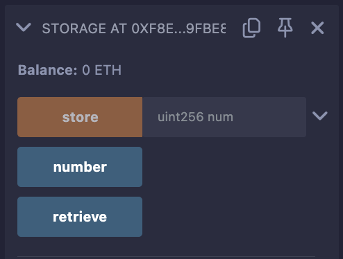
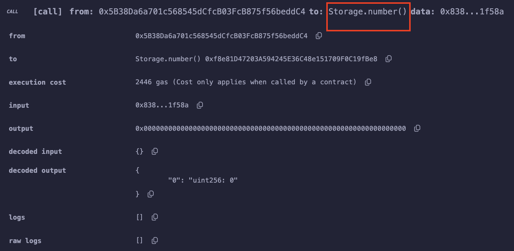
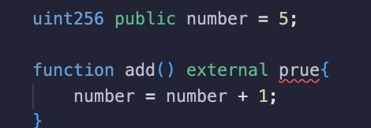
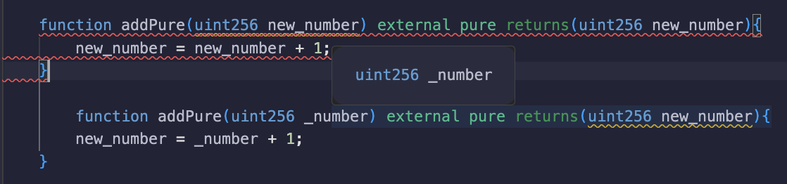
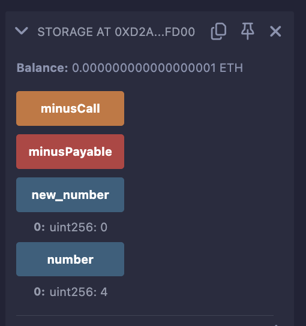
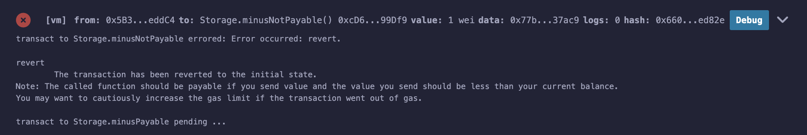

### 3. 函数
---

函數的架構：
  
  ```solidity

    function 函数名(参数类型 参数名) 可见性 pure|view|payable 返回类型 {
        // 函数体
    }
  ```
  - 函數名：函數的名稱，可以自定義。
  - 可見性：函數的可見性，包括 public、internal、external、private。
    - public：所有人可見，包括合約內外。
    - internal：僅合約內部可見,繼承合約可用。
    - external：僅外部合約可見 （但內部可以透過this.f()來調用，f是函數名）。
    - private：僅合約內部可見,繼承合約不可用。
    - [pure|view|payable]：決定函數權限/功能的關鍵字。payable（可支付的）很好理解，帶著它的函數，運行的時候可以給合約轉入ETH
  - 返回類型：函數的返回類型，可以是任意合法的 Solidity 數據類型。

  `注意1`：合約中定義的函數需要明確指定可見性，它們沒有預設值。

  `注意2`：public|private|internal也可用於修飾狀態變數。
    public變數會自動產生同名的getter函數，用於查詢數值。未標明可見性類型的狀態變量，預設為internal。

    以下舉例：

    // SPDX-License-Identifier: GPL-3.0

        pragma solidity >=0.8.2 <0.9.0;

        /**
        * @title Storage
        * @dev Store & retrieve value in a variable
        * @custom:dev-run-script ./scripts/deploy_with_ethers.ts
        */
        contract Storage {

            uint256 public number;

            /**
            * @dev Store value in variable
            * @param num value to store
            */
            function store(uint256 num) public {
                number = num;
            }

            /**
            * @dev Return value 
            * @return value of 'number'
            */
            function retrieve() public view returns (uint256){
                return number;
            }
        }

看 remix 編譯的結果



number 設置 public 後再編譯是一個看得到的 getter 函數

#### 到底什麼是pure和 view？

pure和view關鍵字可能令人費解，因為其他程式語言中沒有類似的關鍵字。
solidity引入這兩個關鍵字主要是因為以太坊交易需要支付氣費（gas fee）。
合約的狀態變數儲存在鏈上，gas fee 很貴，如果計算不改變鏈上狀態，就可以不用付gas。

- pure: pure 函數既不能讀取也不能寫入鏈上的狀態變數。

- view:view 函數能讀取但也不能寫入狀態變數。

在以太坊中，以下語句被視為修改鏈上狀態：

- 寫入狀態變數。
- 釋放事件。
- 創建其他合約。
- 使用selfdestruct.
- 透過調用發送以太幣。
- 呼叫任何未標記 view 或 pure的函數。
- 使用低階呼叫（low-level calls）。
- 使用包含某些操作碼的內聯彙編。

##### 例子
  建立 add function 設置設置外部使用，設置 pure 關鍵字，錯誤呈現
  

  在舉例
  
  可以看到明顯的錯誤顯示

  結論是 pure 和 view 關鍵字的重要性，都不可以修改合約的全域變數。

內部函數和外部函數的區別：
```solidity
// SPDX-License-Identifier: GPL-3.0

pragma solidity >=0.8.2 <0.9.0;

/**
 * @title Storage
 * @dev Store & retrieve value in a variable
 * @custom:dev-run-script ./scripts/deploy_with_ethers.ts
 */
contract Storage {

    uint256 public number = 5;
    uint256 public new_number = 0;

    // internal: 内部函数
    function minus() internal {
        number = number - 1;
    }

    // 合约内的函数可以调用内部函数
    function minusCall() external {
        minus();
    }

    // payable: 递钱，能给合约支付eth的函数
    function minusPayable() external payable returns(uint256 balance) {
        minus();    
        balance = address(this).balance;
    }

}
```


可以看到 internal 並沒有外部看到

特別在說一下
```solidity
    // payable: 递钱，能给合约支付eth的函数
    function minusPayable() external payable returns(uint256 balance) {
        minus();
        balance = address(this).balance;
    }

    function minusNotPayable() external returns(uint256 balance){
        minus();
        balance = address(this).balance;
    }
```
這兩個函數的區別是 payable 和 not payable，payable 是可以給合約支付eth的函數，not payable 是不可以給合約支付eth的函數。
可以試試minusNotPayable 會報錯誤，不可以對沒有寫 payable 的function 傳遞 eth。




### 4. 函数輸出

傳回值：return 和
Solidity 中與函數輸出相關的有兩個關鍵字：return和returns。它們的差別在於：

- returns：跟在函數名後面，用於宣告傳回的變數類型及變數名。
-  return：用於函數主體中，傳回指定的變數。
```solidity
// 返回多个变量
function returnMultiple() public pure returns(uint256, bool, uint256[3] memory){
    return(1, true, [uint256(1),2,5]);
}
```

在上述程式碼中，我們利用returns關鍵字聲明了有多個傳回值的returnMultiple()函數，然後我們在函數主體中使用return(1, true, [uint256(1),2,5])確定了回傳值。

這裡uint256[3]聲明了一個長度為3且類型為的uint256陣列作為傳回值。
因為[1,2,3]會預設為uint8(3)，因此[uint256(1),2,5]中首個元素必須強轉uint256來宣告該陣列內的元素皆為此類型。
`陣列類型回傳值預設必須用memory修飾，在下一個章節會細說變數的儲存和作用域`。

命名式返回：
```
function returnNamed() public pure returns(uint256 _number, bool _bool, uint256[3] memory _array){
    _number = 2;
    _bool = false;
    _array = [uint256(3),2,1];
}
```
賦值：
```
  uint256 _number;
  bool _bool;
  uint256[3] memory _array;
  (_number, _bool, _array) = returnNamed();
  // 讀取部分返回值，解構式賦值
  (, _bool2, ) = returnNamed();
```