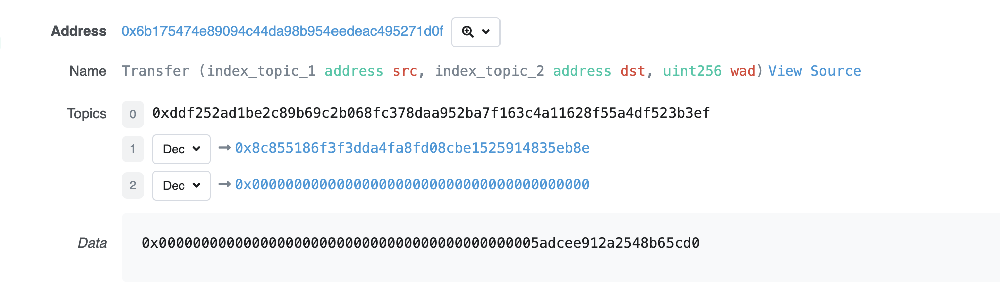

### 12. 事件

#### 什麼是 event？
Solidity中的事件（event）是EVM上日誌的抽象，它有兩個特點：

回應：應用程式（ethers.js）可以透過RPC介面訂閱和監聽這些事件，並在前端回應。
經濟：事件是EVM上比較經濟的儲存資料的方式，每個大概消耗2,000 gas；相較之下，鏈上儲存一個新變數至少需要20,000 gas。

怎們定義,下面是 ERC20 Transfer 的定義：
  `from` 轉帳地址、`to` 接收地址、`value` 轉帳數量

  ```solidity
    event Transfer(address indexed from, address indexed to, uint256 value);
  ```

  帶有 `indexed` 關鍵字，他們會保存在以太坊虛擬機日誌的topics中，方便之後檢索。

#### 如何觸發 `event` ?

在合約中，我們可以透過 `emit` 關鍵字來觸發事件，如下：
```solidity
// 定义_transfer函数，执行转账逻辑
function _transfer(
    address from,
    address to,
    uint256 amount
) external {

    _balances[from] = 10000000; // 给转账地址一些初始代币

    _balances[from] -=  amount; // from地址减去转账数量
    _balances[to] += amount; // to地址加上转账数量

    // 释放事件
    emit Transfer(from, to, amount);
}
```


#### EVMLog

以太坊虛擬機器（EVM）用日誌Log來儲存Solidity事件，每個日誌記錄都包含主題topics 和資料 data 兩部分。



`topics`:

日誌的第一部分是主題數組，用於描述事件，長度不能超過4。它的第一個元素是事件的簽章（哈希）。對於上面的Transfer事件，它的事件哈希就是：

```
keccak256("Transfer(address,address,uint256)")

//0xddf252ad1be2c89b69c2b068fc378daa952ba7f163c4a11628f55a4df523b3ef
```

除了事件哈希，主題還可以包含至3多個indexed參數，也就是Transfer事件中的from和to。

indexed標記的參數可以理解為檢索事件的索引“鍵”，方便之後搜尋。每個indexed參數的大小為固定的256位元，如果參數太大了（例如字串），就會自動計算哈希儲存在主題中。

`data`:

事件中不帶`indexed`的參數會儲存在`data`部分中，可以理解為事件的「值」。

`data`部分的變數不能直接檢索，但可以儲存任意大小的資料。因此一般`data`部分可以用來儲存複雜的資料結構，例如數組和字串等等，因為這些資料超過了256 byte，即使儲存在事件的topics部分中，也是以哈希的方式儲存。另外，data部分的變數在儲存上消耗的gas相比於topics更少。

### 13. 繼承

`Solidity`中的繼承（inheritance），包括簡單繼承，多重繼承，以及修飾器（Modifier）和構造函數（Constructor）的繼承。

规则

`virtual`: 父合约中的函数，如果希望子合约重写，需要加上virtual关键字。

`override`：子合约重写了父合约中的函数，需要加上override关键字。

注意：用override修饰public变量，会重写与变量同名的getter函数，例如：

```solidity
mapping(address => uint256) public override balanceOf;
```


