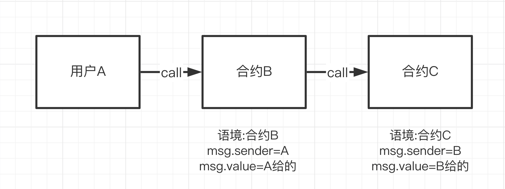

### 21. 呼叫其他合約

`gasleft()` 剩餘`gas`

幾種呼叫方式

1._Name(_Address).f()

_Name 部署合約名稱，帶入部署合約地址，呼叫合約內的函數

OtherContract合約位址_Address和setX的參數x：
```
function callSetX(address _Address, uint256 x) external{
    OtherContract(_Address).setX(x);
}
```
2. 合約地址直接命成型態，給值呼叫

```
function callGetX(OtherContract _Address) external view returns(uint x){
    x = _Address.getX();
}
```
3. 傳入地址，建立合約，比較像是init 物件的方式
```
function callGetX2(address _Address) external view returns(uint x){
    OtherContract oc = OtherContract(_Address);
    x = oc.getX();
}
```
4. 呼叫合約並且給 eth

這樣轉的話會傳送 eth

```
function setXTransferETH(address otherContract, uint256 x) payable external{
    OtherContract(otherContract).setX{value: msg.value}(x);
}
```

### 22. Call

`call`是`address`類型的低階成員函數，它用來與其他合約互動。它的傳回值為`(bool, bytes memory)`，分別對應`call`是否成功以及目標函數的回傳值。

- `call`是Solidity官方推薦的透過觸發fallback或receive函數發送ETH的方法。
- 不建議call用來呼叫另一個合約，因為當你呼叫不安全合約的函數時，你就把主動權交給了它。建議的方法仍是聲明合約變數後呼叫函數，請參閱第21講：呼叫其他合約
- 當我們不知道對方合約的原始碼或ABI，就無法產生合約變數；這時，我們仍可以透過call呼叫對方合約的函數。

用法： 目標合約.call(字節碼)

"字節碼"＝> 可以透過  `abi.encodeWithSignature("函数签名", 逗号分隔的具体参数)` 取得

ex: `abi.encodeWithSignature("f(uint256,address)", _x, _addr)。`

用法
`目标合约地址.call{value:发送数额, gas:gas数额}(字节码);`


### 23. Delegatecall

`Delegatecall`
`delegatecall與call類似`，是Solidity中位址類型的低階成員函數。delegate中是委託/代表的意思，那麼

`delegatecall` 委託了什麼？

當使用者A透過合約B來call合約C的時候，執行的是合約C的函數，上下文( Context，可以理解為包含變量和狀態的環境)也是

合約C的：msg.sender是B的地址，並且如果函數改變一些狀態變量，產生的效果會作用於合約C的變數上。




```solidity
目标合约地址.delegatecall(二进制编码);
```
```solidity
abi.encodeWithSignature("函数签名", 逗号分隔的具体参数)
```

#### 什麼情況下會用到delegatecall

目前`delegatecall`主要有兩個應用場景：

- 代理合約（Proxy Contract）：將智能合約的存儲合約和邏輯合約分開：代理合約（Proxy Contract）存儲所有相關的變量，並且保存邏輯合約的地址；所有函數存在邏輯合約（Logic Contract）裡，通過delegatecall執行。當升級時，只需要將代理合約指向新的邏輯合約即可。

- EIP-2535 Diamonds（鑽石）：鑽石是一個支持建構可在生產中擴展的模組化智慧合約系統的標準。鑽石是具有多個實施合約的代理合約。 更多資訊請查看：鑽石標準簡介。


