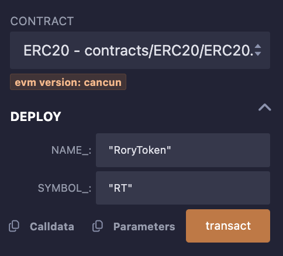
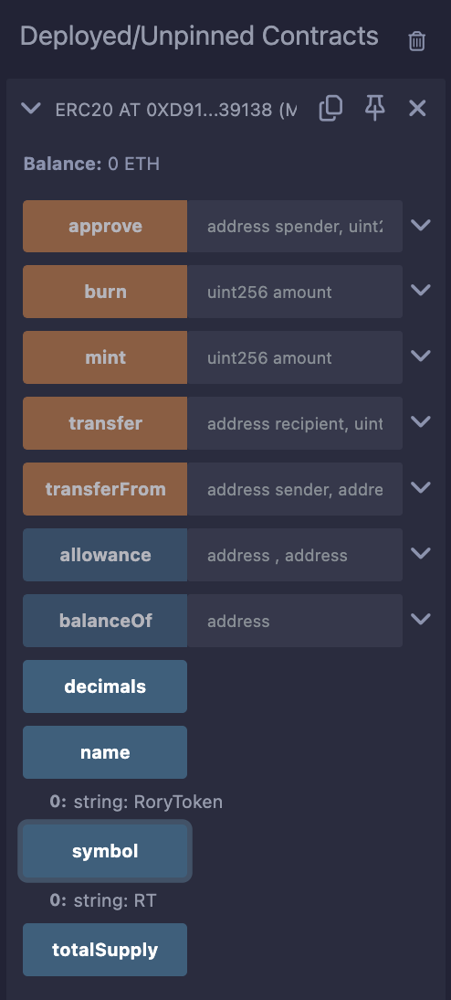
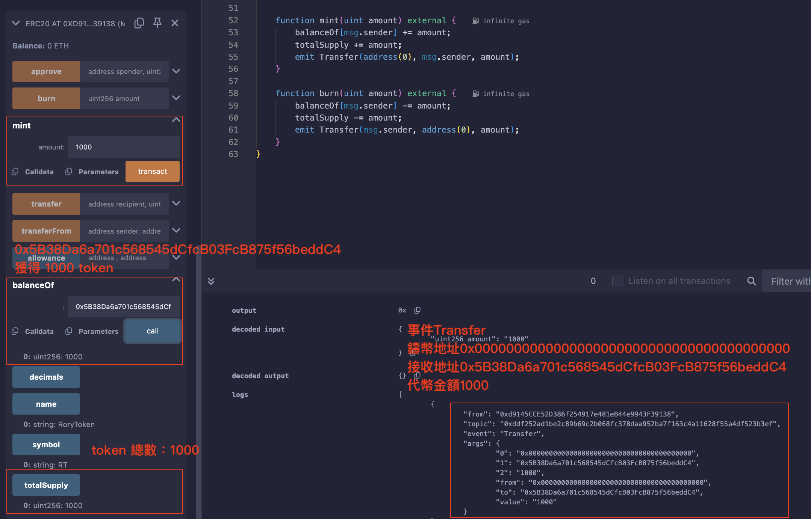
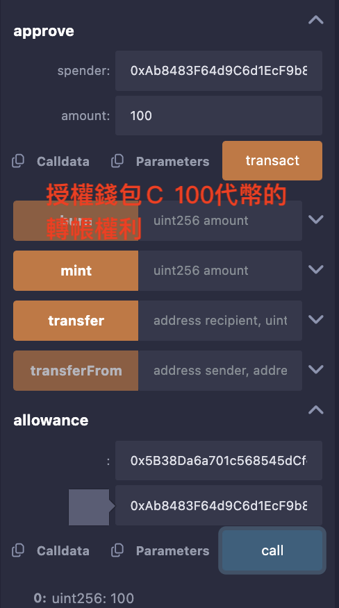
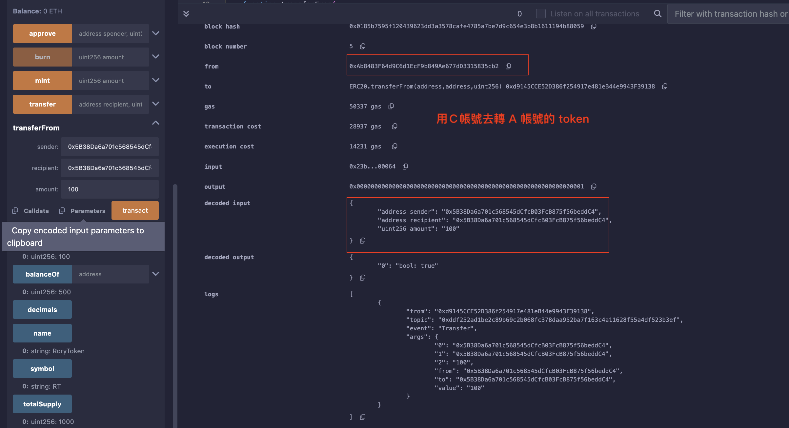

#### 31. ERC20

- ERC20代幣標準，並發行自己的測試代幣。

#### ERC20 標準函數

- 帳戶餘額(balanceOf())
- 轉帳(transfer())
- 授權轉帳(transferFrom())
- 授權(approve())
- 代幣總供給(totalSupply())
- 授權轉帳額度(allowance())
- 代幣資訊（可選）：名稱(name())，代號(symbol())，小數位數(decimals())

IERC20是ERC20代幣標準的介面合約，規定了ERC20代幣需要實現的函數和事件。

之所以需要定義接口，是因為有了規範後，就存在所有的ERC20代幣都通用的函數名稱，輸入參數，輸出參數。 在介面函數中，只需要定義函數名稱，輸入參數，輸出參數，並不關心函數內部如何實現。

由此，函數就分為內部和外部兩個內容，一個重點是實現，另一個是對外接口，約定共同資料。 這就是為什麼需要ERC20.sol和IERC20.sol兩個文件實現一個合約。


IERC20定義了2事件：Transfer事件和Approval事件，分別在轉帳和授權時被釋放

```
/**
 * @dev 释放条件：当 `value` 单位的货币从账户 (`from`) 转账到另一账户 (`to`)时.
 */
event Transfer(address indexed from, address indexed to, uint256 value);

/**
 * @dev 释放条件：当 `value` 单位的货币从账户 (`owner`) 授权给另一账户 (`spender`)时.
 */
event Approval(address indexed owner, address indexed spender, uint256 value);
```

#### 實現 ERC20

`注意`：
用`override`修飾`public`變量，會重寫繼承自父合約的與變數同名的getter函數，例如IERC20中的balanceOf()函數。

1.copry IERC20.sol

2.實現ERC20.sol 使用 IERC20

```solidity

// SPDX-License-Identifier: MIT
pragma solidity ^0.8.21;

import "./IERC20.sol";

contract ERC20 is IERC20 {

    constructor(uint256 initialSupply) {
    }
}

```

此時會出現很多錯誤 `Note: Missing implementation:` 這是因為ERC20合約未實現IERC20介面中的函數。

3.實現IERC20介面中的函數

```solidity

mapping(address => uint256) public override balanceOf;

mapping(address => mapping(address => uint256)) public override allowance;

uint256 public override totalSupply;   // 代币总供给

string public name;   // 名称
string public symbol;  // 代号

uint8 public decimals = 18; // 小数位数

```

首先是基本的代幣資訊，還有兩個mapping變數，balanceOf和allowance，分別用來記錄帳戶餘額和授權額度。

4.實現代幣資訊

```solidity
constructor(string memory name_, string memory symbol_){
    name = name_;
    symbol = symbol_;
}
```

建構函數中，初始化代幣名稱和代號。

5. 實作`transfer`函數

```solidity

function transfer(address recipient, uint amount) public override returns (bool) {
    balanceOf[msg.sender] -= amount;
    balanceOf[recipient] += amount;
    emit Transfer(msg.sender, recipient, amount);
    return true;
}

```

可以看到，`transfer`函數是用來轉帳的，扣除發送者的餘額，增加接收者的餘額，最後釋放`Transfer`事件。

6. 實作`approve`函數

```solidity
function approve(address spender, uint amount) public override returns (bool) {
    allowance[msg.sender][spender] = amount;
    emit Approval(msg.sender, spender, amount);
    return true;
}
```

`approve`函數是用來授權的，設置spender可以從msg.sender轉帳amount數量的代幣，並釋放`Approval`事件。

7. 實作`transferFrom`函數

```solidity
function transferFrom(
    address sender,
    address recipient,
    uint amount
) public override returns (bool) {
    allowance[sender][msg.sender] -= amount;
    balanceOf[sender] -= amount;
    balanceOf[recipient] += amount;
    emit Transfer(sender, recipient, amount);
    return true;
}
```

`transferFrom`函數是用來授權轉帳的，首先授權的事項要減少，然後發送者的餘額要減少，接收者的餘額要增加，最後釋放`Transfer`事件。

做到這裡基本上錯誤已經消失了，但這都是基本實現而已，有些防呆沒坐上去。

WTF 還實作兩個函數 mint 和 burn 鑄造和銷毀代幣。

8. 實作`mint`函數

```solidity
function mint(uint amount) external {
    balanceOf[msg.sender] += amount;
    totalSupply += amount;
    emit Transfer(address(0), msg.sender, amount);
}
```

`minit` 增加發送者 token 數量，將總數增加，釋放`Transfer`事件。

9.  實作`burn`函數

```solidity
function burn(uint amount) external {
    balanceOf[msg.sender] -= amount;
    totalSupply -= amount;
    emit Transfer(msg.sender, address(0), amount);
}
```

`burn` 與 `mint` 相反，減少發送者 token 數量，將總數減少，釋放`Transfer`事件。

10. 部署合約 ERC20.sol

記得要給初始值



檢查



11. 鑄造代幣 1000



上圖還可以看到 使用 `balanceOf` 函數查詢帳戶餘額

12. 授權轉帳



13. 使用 `transferFrom` 函數轉帳

`注意`：要先授權才能轉帳

