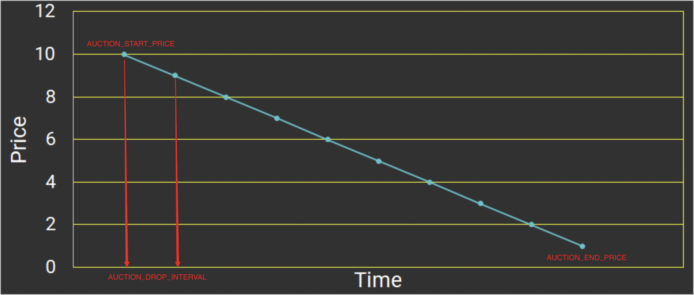

### 34. ERC721

- BTC而ETH這類代幣都屬於同質化代幣，礦工挖出的第1枚BTC與第10000枚BTC並沒有不同，是等價的。

- 但世界中許多物品是不同質的，其中包括房產、古董、虛擬藝術品等等，這類物品無法用同質化代幣抽象化。因此，以太坊`EIP721`提出了`ERC721`標準，來抽象化非同質化的物品。這一講，我們將介紹`ERC721`標準，並基於它發行一款NFT。

EIP 以太坊改進建議

 例如新特性、ERC、協定改進、程式設計工具等等。

ERC: 以太坊意見徵求搞

用以記錄以太坊上應用級的各種開發標準和協議。如典型的

- Token標準( ERC20, ERC721)
- 名字註冊( ERC26, ERC13)
- URI範式( ERC67)
- Library/Package格式( EIP82)
- 錢包格式( EIP75, EIP85)

我自己是看重要“應用”都是 ，現在已經分開了

#### ERC1​​65標準

ERC165就是檢查一個智慧合約 是不是 支援了`ERC721`，`ERC1155` 的介面。

```solidity
interface IERC165 {
    /**
     * @dev 如果合约实现了查询的`interfaceId`，则返回true
     * 规则详见：https://eips.ethereum.org/EIPS/eip-165#how-interfaces-are-identified[EIP section]
     *
     */
    function supportsInterface(bytes4 interfaceId) external view returns (bool);
}
```

ERC721 實現
  
  ```solidity
  interface IERC165 {
    /**
     * @dev 如果合约实现了查询的`interfaceId`，则返回true
     * 规则详见：https://eips.ethereum.org/EIPS/eip-165#how-interfaces-are-identified[EIP section]
     *
     */
    function supportsInterface(bytes4 interfaceId) external view returns (bool);
  }
  ```

  會回傳 true 或 false

  `IERC721`是`ERC721`標準的介面合約，規定了`ERC721`要實現的基本函數。它利用tokenId來表示特定的非同質化代幣，授權或轉帳都要明確`tokenId`；而ERC20只需要明確轉帳的金額即可。

  下面是 `IERC721`的介面：

  ```solidity
  /**
 * @dev ERC721标准接口.
 */
interface IERC721 is IERC165 {
    event Transfer(address indexed from, address indexed to, uint256 indexed tokenId);
    event Approval(address indexed owner, address indexed approved, uint256 indexed tokenId);
    event ApprovalForAll(address indexed owner, address indexed operator, bool approved);

    function balanceOf(address owner) external view returns (uint256 balance);

    function ownerOf(uint256 tokenId) external view returns (address owner);

    function safeTransferFrom(
        address from,
        address to,
        uint256 tokenId,
        bytes calldata data
    ) external;

    function safeTransferFrom(
        address from,
        address to,
        uint256 tokenId
    ) external;

    function transferFrom(
        address from,
        address to,
        uint256 tokenId
    ) external;

    function approve(address to, uint256 tokenId) external;

    function setApprovalForAll(address operator, bool _approved) external;

    function getApproved(uint256 tokenId) external view returns (address operator);

    function isApprovedForAll(address owner, address operator) external view returns (bool);
  }
```

#### IERC721

IERC721包含3個事件，其中`Transfer`和`Approval`事件在`ERC20`中也有。

- Transfer事件：在轉帳時被釋放，記錄代幣的發出地址from，接收地址to和tokenid。
- Approval事件：在授權時釋放，記錄授權地址owner，被授權地址approved和tokenid。
- ApprovalForAll事件：在批次授權時釋放，記錄批量授權的發出地址owner，被授權地址operator和授權與否的approved。(特別注意)

函數：
- balanceOf：返回某地址的NFT持有量balance。
- ownerOf：返回某tokenId的主人owner。
- transferFrom：普通转账，参数为转出地址from，接收地址to和tokenId。
- safeTransferFrom：安全转账（如果接收方是合约地址，会要求实现ERC721Receiver接口）。参数为转出地址from，接收地址to和tokenId。
- approve：授权另一个地址使用你的NFT。参数为被授权地址approve和tokenId。
- getApproved：查询tokenId被批准给了哪个地址。
- setApprovalForAll：将自己持有的该系列NFT批量授权给某个地址operator。
- isApprovedForAll：查询某地址的NFT是否批量授权给了另一个operator地址。
- safeTransferFrom：安全转账的重载函数，参数里面包含了data。

#### IERC721Receiver
確定 ERC721 是否有實現

- ERC721实现了safeTransferFrom()安全转账函数

- 目标合约必须实现了IERC721Receiver接口才能接收ERC721代币，不然会revert。IERC721Receiver接口只包含一个onERC721Received()函数。

```
// ERC721接收者接口：合约必须实现这个接口来通过安全转账接收ERC721
interface IERC721Receiver {
    function onERC721Received(
        address operator,
        address from,
        uint tokenId,
        bytes calldata data
    ) external returns (bytes4);
}
```

#### IERC721Metadata

`IERC721Metadata`是`ERC721`的拓展接口，实现了3个查询`metadata`元数据的常用函数：

```
interface IERC721Metadata is IERC721 {
    function name() external view returns (string memory); // 返回代币名称

    function symbol() external view returns (string memory); // 返回代币符号

    function tokenURI(uint256 tokenId) external view returns (string memory); // tokenId 返回metadata的URI
}
```

#### ERC721主合约

```solidity
// SPDX-License-Identifier: MIT
// by 0xAA
pragma solidity ^0.8.21;

import "./IERC165.sol";
import "./IERC721.sol";
import "./IERC721Receiver.sol";
import "./IERC721Metadata.sol";
import "./String.sol";

contract ERC721 is IERC721, IERC721Metadata{
    using Strings for uint256; // 使用String库，

    // Token名称
    string public override name;
    // Token代号
    string public override symbol;
    // tokenId 到 owner address 的持有人映射
    mapping(uint => address) private _owners;
    // address 到 持仓数量 的持仓量映射
    mapping(address => uint) private _balances;
    // tokenID 到 授权地址 的授权映射
    mapping(uint => address) private _tokenApprovals;
    //  owner地址。到operator地址 的批量授权映射
    mapping(address => mapping(address => bool)) private _operatorApprovals;

    // 错误 无效的接收者
    error ERC721InvalidReceiver(address receiver);

    /**
     * 构造函数，初始化`name` 和`symbol` .
     */
    constructor(string memory name_, string memory symbol_) {
        name = name_;
        symbol = symbol_;
    }

    // 实现IERC165接口supportsInterface
    function supportsInterface(bytes4 interfaceId)
        external
        pure
        override
        returns (bool)
    {
        return
            interfaceId == type(IERC721).interfaceId ||
            interfaceId == type(IERC165).interfaceId ||
            interfaceId == type(IERC721Metadata).interfaceId;
    }

    // 实现IERC721的balanceOf，利用_balances变量查询owner地址的balance。
    function balanceOf(address owner) external view override returns (uint) {
        require(owner != address(0), "owner = zero address");
        return _balances[owner];
    }

    // 实现IERC721的ownerOf，利用_owners变量查询tokenId的owner。
    function ownerOf(uint tokenId) public view override returns (address owner) {
        owner = _owners[tokenId];
        require(owner != address(0), "token doesn't exist");
    }

    // 实现IERC721的isApprovedForAll，利用_operatorApprovals变量查询owner地址是否将所持NFT批量授权给了operator地址。
    function isApprovedForAll(address owner, address operator)
        external
        view
        override
        returns (bool)
    {
        return _operatorApprovals[owner][operator];
    }

    // 实现IERC721的setApprovalForAll，将持有代币全部授权给operator地址。调用_setApprovalForAll函数。
    function setApprovalForAll(address operator, bool approved) external override {
        _operatorApprovals[msg.sender][operator] = approved;
        emit ApprovalForAll(msg.sender, operator, approved);
    }

    // 实现IERC721的getApproved，利用_tokenApprovals变量查询tokenId的授权地址。
    function getApproved(uint tokenId) external view override returns (address) {
        require(_owners[tokenId] != address(0), "token doesn't exist");
        return _tokenApprovals[tokenId];
    }
     
    // 授权函数。通过调整_tokenApprovals来，授权 to 地址操作 tokenId，同时释放Approval事件。
    function _approve(
        address owner,
        address to,
        uint tokenId
    ) private {
        _tokenApprovals[tokenId] = to;
        emit Approval(owner, to, tokenId);
    }

    // 实现IERC721的approve，将tokenId授权给 to 地址。条件：to不是owner，且msg.sender是owner或授权地址。调用_approve函数。
    function approve(address to, uint tokenId) external override {
        address owner = _owners[tokenId];
        require(
            msg.sender == owner || _operatorApprovals[owner][msg.sender],
            "not owner nor approved for all"
        );
        _approve(owner, to, tokenId);
    }

    // 查询 spender地址是否可以使用tokenId（需要是owner或被授权地址）
    function _isApprovedOrOwner(
        address owner,
        address spender,
        uint tokenId
    ) private view returns (bool) {
        return (spender == owner ||
            _tokenApprovals[tokenId] == spender ||
            _operatorApprovals[owner][spender]);
    }

    /*
     * 转账函数。通过调整_balances和_owner变量将 tokenId 从 from 转账给 to，同时释放Transfer事件。
     * 条件:
     * 1. tokenId 被 from 拥有
     * 2. to 不是0地址
     */
    function _transfer(
        address owner,
        address from,
        address to,
        uint tokenId
    ) private {
        require(from == owner, "not owner");
        require(to != address(0), "transfer to the zero address");

        _approve(owner, address(0), tokenId);

        _balances[from] -= 1;
        _balances[to] += 1;
        _owners[tokenId] = to;

        emit Transfer(from, to, tokenId);
    }
    
    // 实现IERC721的transferFrom，非安全转账，不建议使用。调用_transfer函数
    function transferFrom(
        address from,
        address to,
        uint tokenId
    ) external override {
        address owner = ownerOf(tokenId);
        require(
            _isApprovedOrOwner(owner, msg.sender, tokenId),
            "not owner nor approved"
        );
        _transfer(owner, from, to, tokenId);
    }

    /**
     * 安全转账，安全地将 tokenId 代币从 from 转移到 to，会检查合约接收者是否了解 ERC721 协议，以防止代币被永久锁定。调用了_transfer函数和_checkOnERC721Received函数。条件：
     * from 不能是0地址.
     * to 不能是0地址.
     * tokenId 代币必须存在，并且被 from拥有.
     * 如果 to 是智能合约, 他必须支持 IERC721Receiver-onERC721Received.
     */
    function _safeTransfer(
        address owner,
        address from,
        address to,
        uint tokenId,
        bytes memory _data
    ) private {
        _transfer(owner, from, to, tokenId);
        _checkOnERC721Received(from, to, tokenId, _data);
    }

    /**
     * 实现IERC721的safeTransferFrom，安全转账，调用了_safeTransfer函数。
     */
    function safeTransferFrom(
        address from,
        address to,
        uint tokenId,
        bytes memory _data
    ) public override {
        address owner = ownerOf(tokenId);
        require(
            _isApprovedOrOwner(owner, msg.sender, tokenId),
            "not owner nor approved"
        );
        _safeTransfer(owner, from, to, tokenId, _data);
    }

    // safeTransferFrom重载函数
    function safeTransferFrom(
        address from,
        address to,
        uint tokenId
    ) external override {
        safeTransferFrom(from, to, tokenId, "");
    }

    /** 
     * 铸造函数。通过调整_balances和_owners变量来铸造tokenId并转账给 to，同时释放Transfer事件。铸造函数。通过调整_balances和_owners变量来铸造tokenId并转账给 to，同时释放Transfer事件。
     * 这个mint函数所有人都能调用，实际使用需要开发人员重写，加上一些条件。
     * 条件:
     * 1. tokenId尚不存在。
     * 2. to不是0地址.
     */
    function _mint(address to, uint tokenId) internal virtual {
        require(to != address(0), "mint to zero address");
        require(_owners[tokenId] == address(0), "token already minted");

        _balances[to] += 1;
        _owners[tokenId] = to;

        emit Transfer(address(0), to, tokenId);
    }

    // 销毁函数，通过调整_balances和_owners变量来销毁tokenId，同时释放Transfer事件。条件：tokenId存在。
    function _burn(uint tokenId) internal virtual {
        address owner = ownerOf(tokenId);
        require(msg.sender == owner, "not owner of token");

        _approve(owner, address(0), tokenId);

        _balances[owner] -= 1;
        delete _owners[tokenId];

        emit Transfer(owner, address(0), tokenId);
    }

    // _checkOnERC721Received：函数，用于在 to 为合约的时候调用IERC721Receiver-onERC721Received, 以防 tokenId 被不小心转入黑洞。
    function _checkOnERC721Received(address from, address to, uint256 tokenId, bytes memory data) private {
        if (to.code.length > 0) {
            try IERC721Receiver(to).onERC721Received(msg.sender, from, tokenId, data) returns (bytes4 retval) {
                if (retval != IERC721Receiver.onERC721Received.selector) {
                    revert ERC721InvalidReceiver(to);
                }
            } catch (bytes memory reason) {
                if (reason.length == 0) {
                    revert ERC721InvalidReceiver(to);
                } else {
                    /// @solidity memory-safe-assembly
                    assembly {
                        revert(add(32, reason), mload(reason))
                    }
                }
            }
        }
    }

    /**
     * 实现IERC721Metadata的tokenURI函数，查询metadata。
     */
    function tokenURI(uint256 tokenId) public view virtual override returns (string memory) {
        require(_owners[tokenId] != address(0), "Token Not Exist");

        string memory baseURI = _baseURI();
        return bytes(baseURI).length > 0 ? string(abi.encodePacked(baseURI, tokenId.toString())) : "";
    }

    /**
     * 计算{tokenURI}的BaseURI，tokenURI就是把baseURI和tokenId拼接在一起，需要开发重写。
     * BAYC的baseURI为ipfs://QmeSjSinHpPnmXmspMjwiXyN6zS4E9zccariGR3jxcaWtq/ 
     */
    function _baseURI() internal view virtual returns (string memory) {
        return "";
    }
}

```

```
    function _safeTransfer(
        address owner,
        address from,
        address to,
        uint tokenId,
        bytes memory _data
    ) private {
        _transfer(owner, from, to, tokenId);
        _checkOnERC721Received(from, to, tokenId, _data);
    }
```

上面這個函數試圖將 tokenId 代币从 from 转移到 to
原因如下：

因為 _checkOnERC721Received 裡面有 revert ，而觸發之後會發生全部回滾（復原）

而這裡的話 還沒 _transfer 前還沒發生所有權轉移～所以這樣寫看起來怪但是是合理的

#### 實作ERC721

```solidity

// SPDX-License-Identifier: MIT
// by 0xAA
pragma solidity ^0.8.21;

import "./ERC721.sol";

contract WTFApe is ERC721{
    uint public MAX_APES = 10000; // 总量

    // 构造函数
    constructor(string memory name_, string memory symbol_) ERC721(name_, symbol_){
    }

    //BAYC的baseURI为ipfs://QmeSjSinHpPnmXmspMjwiXyN6zS4E9zccariGR3jxcaWtq/ 
    function _baseURI() internal pure override returns (string memory) {
        return "ipfs://QmeSjSinHpPnmXmspMjwiXyN6zS4E9zccariGR3jxcaWtq/";
    }
    
    // 铸造函数
    function mint(address to, uint tokenId) external {
        require(tokenId >= 0 && tokenId < MAX_APES, "tokenId out of range");
        _mint(to, tokenId);
    }
}

```
1. 引用 ERC721 合約
2. 設定 MAX_APES：設定總數
3. 建構函數命名，和短名稱
4. 設定 baseURI
5. 鑄造函數

- ERC625 還有簡潔的寫法

```
IERC721Metadata.name.selector ^ IERC721Metadata.symbol.selector ^ IERC721Metadata.tokenURI.selector
// 作法
bytes4(keccak256(IERC721Metadata.name.selector)) ^ bytes4(keccak256(IERC721Metadata.symbol.selector)) ^ bytes4(keccak256(IERC721Metadata.tokenURI.selector))
```

```
function supportsInterface(bytes4 interfaceId) public view virtual returns (bool) {
        return
            interfaceId == 0x01ffc9a7 || // ERC165 Interface ID for ERC165
            interfaceId == 0x80ac58cd || // ERC165 Interface ID for ERC721
            interfaceId == 0x5b5e139f; // ERC165 Interface ID for ERC721Metadata
}
```
### 35. 荷蘭拍賣


介紹荷蘭拍賣，並透過簡化版的Azuki荷蘭拍賣代碼，講解如何通過荷兰拍卖發售ERC721標準NFT


- 荷蘭拍賣（Dutch Auction）是一種特別的拍賣形式。 亦稱為“減價拍賣”，它是指拍賣標的的競價由高到低依次遞減直到第一個競買人應價（達到或超過底價）時擊槌成交的一種拍賣。



在幣圈，許多NFT透過荷蘭拍賣發售，其中包括Azuki和World of Women，其中Azuki透過荷蘭拍賣籌集了超過8000枚ETH。

專案方非常喜歡這種拍賣形式，主要有兩個原因

- 荷蘭拍賣的價格由最高慢慢下降，能讓專案方獲得最大的收入。

- 拍賣持續較長時間（通常6小時以上），可避免gas war。(gas戰)

- gas war 解釋：當有人要買一個NFT，他會提高價格，其他人也會提高價格，這樣就會有一個gas戰，最後會讓NFT的價格飆升。

#### DutchAuction合约

代码基于`Azuki`的代码简化而成。`DucthAuction`合约继承了之前介绍的`ERC721`和`Ownable`合约：

```solidity
// SPDX-License-Identifier: MIT
pragma solidity ^0.8.21;

import "@openzeppelin/contracts/access/Ownable.sol";
import "https://github.com/AmazingAng/WTF-Solidity/blob/main/34_ERC721/ERC721.sol";

contract DutchAuction is Ownable, ERC721 {
```

#### DutchAuction 狀態

- COLLECTOIN_SIZE：NFT 總數
- AUCTION_START_PRICE：荷蘭拍賣的開始價格，就是最高價格
- AUCTION_END_PRICE：荷蘭拍賣的結束價格，就是最低價格（地板價）
- AUCTION_TIME：持續多少時間
- AUCTION_DROP_INTERVAL：每過多久降價一次
- auctionStartTime：拍賣起始日期 (block.timestamp)

```
    uint256 public constant COLLECTOIN_SIZE = 10000; // NFT总数
    uint256 public constant AUCTION_START_PRICE = 1 ether; // 起拍价(最高价)
    uint256 public constant AUCTION_END_PRICE = 0.1 ether; // 结束价(最低价/地板价)
    uint256 public constant AUCTION_TIME = 10 minutes; // 拍卖时间，为了测试方便设为10分钟
    uint256 public constant AUCTION_DROP_INTERVAL = 1 minutes; // 每过多久时间，价格衰减一次
    uint256 public constant AUCTION_DROP_PER_STEP =
        (AUCTION_START_PRICE - AUCTION_END_PRICE) /
        (AUCTION_TIME / AUCTION_DROP_INTERVAL); // 每次价格衰减步长
    
    uint256 public auctionStartTime; // 拍卖开始时间戳
    string private _baseTokenURI;   // metadata URI
    uint256[] private _allTokens; // 记录所有存在的tokenId 

```

#### DutchAuction 先關函數

- 建構造函數初始拍賣時間，以及使用使用者可以控制拍賣的時間
```solidity
    constructor() ERC721("WTF Dutch Auctoin", "WTF Dutch Auctoin") {
        auctionStartTime = block.timestamp;
    }

    // auctionStartTime setter函数，onlyOwner
    function setAuctionStartTime(uint32 timestamp) external onlyOwner {
        auctionStartTime = timestamp;
    }
```

- 取得拍賣即時價格：`getAuctionPrice()`函數透過當前區塊時間以及拍賣相關的狀態變數來計算即時拍賣價格。

  - 當block.timestamp小於起始時間，價格為最高價AUCTION_START_PRICE；

  - 當block.timestamp大於結束時間，價格為最低價AUCTION_END_PRICE；

  - 當block.timestamp處於兩者之間時，則計算出目前的衰減價格。

  ```
      // 获取拍卖实时价格
    function getAuctionPrice()
        public
        view
        returns (uint256)
    {
        if (block.timestamp < auctionStartTime) {
        return AUCTION_START_PRICE;
        }else if (block.timestamp - auctionStartTime >= AUCTION_TIME) {
        return AUCTION_END_PRICE;
        } else {
        uint256 steps = (block.timestamp - auctionStartTime) /
            AUCTION_DROP_INTERVAL;
        return AUCTION_START_PRICE - (steps * AUCTION_DROP_PER_STEP);
        }
    }
    ```
- 使用者拍賣並鑄造NFT：使用者透過呼叫auctionMint()函數，支付ETH參加荷蘭拍賣並鑄造NFT。


函數首先檢查拍賣是否開始/鑄造是否超出NFT總量。

接著，合約透過`getAuctionPrice()`和`鑄造數量`計算拍賣成本，並檢查用戶支付的ETH是否足夠：如果足夠，則將NFT鑄造給用戶，並退回超額的ETH；反之，則回退交易。

```
    // 拍卖mint函数
    function auctionMint(uint256 quantity) external payable{
        uint256 _saleStartTime = uint256(auctionStartTime); // 建立local变量，减少gas花费
        require(
        _saleStartTime != 0 && block.timestamp >= _saleStartTime,
        "sale has not started yet"
        ); // 检查是否设置起拍时间，拍卖是否开始
        require(
        totalSupply() + quantity <= COLLECTOIN_SIZE,
        "not enough remaining reserved for auction to support desired mint amount"
        ); // 检查是否超过NFT上限

        uint256 totalCost = getAuctionPrice() * quantity; // 计算mint成本
        require(msg.value >= totalCost, "Need to send more ETH."); // 检查用户是否支付足够ETH
        
        // Mint NFT
        for(uint256 i = 0; i < quantity; i++) {
            uint256 mintIndex = totalSupply();
            _mint(msg.sender, mintIndex);
            _addTokenToAllTokensEnumeration(mintIndex);
        }
        // 多余ETH退款
        if (msg.value > totalCost) {
            payable(msg.sender).transfer(msg.value - totalCost); //注意一下这里是否有重入的风险
        }
    }
```

- 專案方取出籌集的ETH：專案方可以透過withdrawMoney()函數提走拍賣籌集的ETH。

```
    // 提款函数，onlyOwner
    function withdrawMoney() external onlyOwner {
        (bool success, ) = msg.sender.call{value: address(this).balance}(""); // call函数的调用方式详见第22讲
        require(success, "Transfer failed.");
    }
```

[text](DutchAuction.sol)

`withdrawMoney` 提領錢錢function 這個也要設立是擁有者才能提領

`mint` 鑄造NFT，有`_addTokenToAllTokensEnumeration` 會越來越長，但是也能接受

主要時間，是部署之後有一個 DateLine 與 block.timestamp 進行比較，依照時間進行拍賣（這就是荷蘭拍賣的精髓）