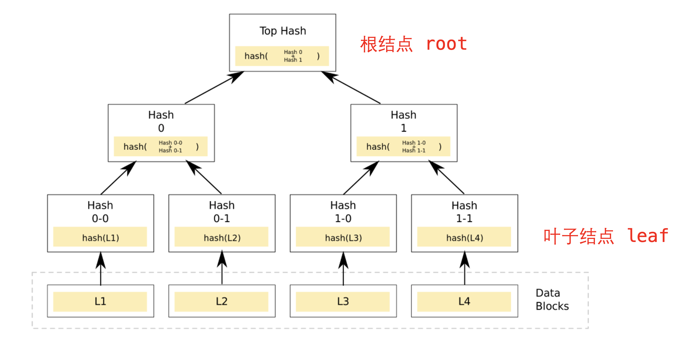
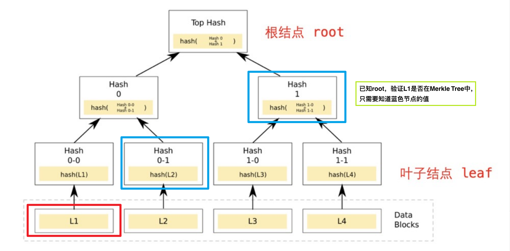
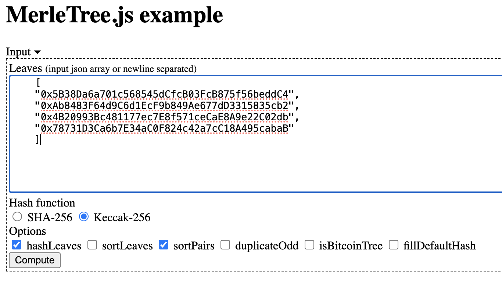
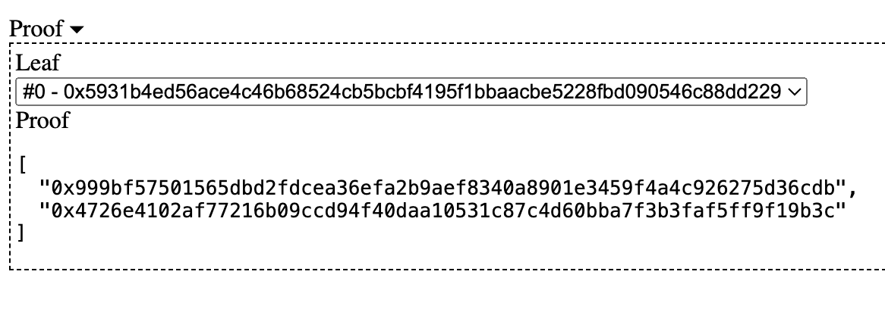
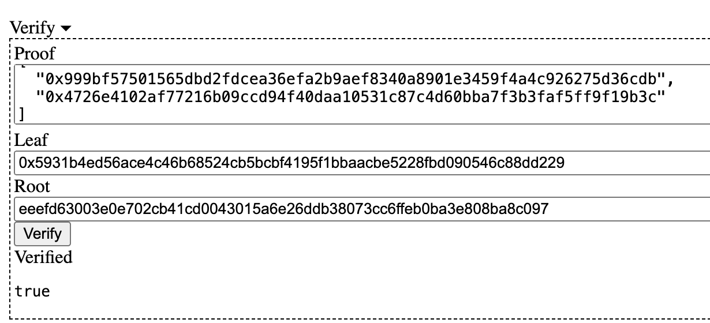

### 36. 梅克爾樹Merkle Tree


介紹`Merkle Tree`，以及如何利用`Merkle Tree`發放`NFT白名單`。

#### Merkle Tree

`Merkle Tree`是一種由下而上建構的加密樹，每個葉子是對應資料的哈希，而每個非葉子為它的2個子節點的哈希。




`Merkle Tree`允許對大型資料結構的內容進行有效且`安全的驗證（Merkle Proof）`

對於有N個葉子結點的Merkle Tree，在已知root根值的情況下，驗證某個資料是否有效（屬於Merkle Tree葉子結點）只需要ceil(log₂N)個資料（也叫proof），非常有效率。

如果資料有誤，或給的proof錯誤，則無法還原出root根植。 下面的例子中，葉子L1的Merkle proof為Hash 0-1和Hash 1：知道這兩個值，就能驗證L1的值是不是在Merkle Tree的葉子中


#### 原因：

- 因為透過葉子L1我們就可以算出Hash 0-0，
- 我們又知道了Hash 0-1，
- 那麼Hash 0-0和Hash 0-1就可以聯合算出Hash 0，
- 然後我們又知道Hash 1，Hash 0和Hash 1就可以聯合算出Top Hash，也就是root節點的hash。



利用 https://lab.miguelmota.com/merkletreejs/example/ 這個網站可以看到Merkle Tree的樣子

輸入如下


```shell
Tree
└─ eeefd63003e0e702cb41cd0043015a6e26ddb38073cc6ffeb0ba3e808ba8c097
   ├─ 9d997719c0a5b5f6db9b8ac69a988be57cf324cb9fffd51dc2c37544bb520d65
   │  ├─ 5931b4ed56ace4c46b68524cb5bcbf4195f1bbaacbe5228fbd090546c88dd229
   │  └─ 999bf57501565dbd2fdcea36efa2b9aef8340a8901e3459f4a4c926275d36cdb
   └─ 4726e4102af77216b09ccd94f40daa10531c87c4d60bba7f3b3faf5ff9f19b3c
      ├─ 04a10bfd00977f54cc3450c9b25c9b3a502a089eba0097ba35fc33c4ea5fcb54
      └─ dfbe3e504ac4e35541bebad4d0e7574668e16fefa26cd4172f93e18b59ce9486
```


#### Merkle Proof

以下是代碼：

```solidity
library MerkleProof {
    /**
     * @dev 当通过`proof`和`leaf`重建出的`root`与给定的`root`相等时，返回`true`，数据有效。
     * 在重建时，叶子节点对和元素对都是排序过的。
     */
    function verify(
        bytes32[] memory proof,
        bytes32 root,
        bytes32 leaf
    ) internal pure returns (bool) {
        return processProof(proof, leaf) == root;
    }

    /**
     * @dev Returns 通过Merkle树用`leaf`和`proof`计算出`root`. 当重建出的`root`和给定的`root`相同时，`proof`才是有效的。
     * 在重建时，叶子节点对和元素对都是排序过的。
     */
    function processProof(bytes32[] memory proof, bytes32 leaf) internal pure returns (bytes32) {
        bytes32 computedHash = leaf;
        for (uint256 i = 0; i < proof.length; i++) {
            computedHash = _hashPair(computedHash, proof[i]);
        }
        return computedHash;
    }

    // Sorted Pair Hash
    function _hashPair(bytes32 a, bytes32 b) private pure returns (bytes32) {
        return a < b ? keccak256(abi.encodePacked(a, b)) : keccak256(abi.encodePacked(b, a));
    }
}
```

MerkleProof庫有三個函數：

- `verify()`函數：利用proof數來驗證leaf是否屬於根為root的Merkle Tree中，如果是，則傳回true。它呼叫了processProof()函數。

- `processProof()`函數：利用proof和leaf依序計算出Merkle Tree的root。它呼叫了_hashPair()函數。

- `_hashPair()`函數：用keccak256()函數計算非根節點對應的兩個子節點的雜湊（排序後）。

我們將地址0的Hash，root和對應的`proof`輸入到`verify()`函數，將返回true。因為地址0的Hash在根為root的Merkle Tree中，且proof正確。如果改變了其中任意一個值，都會傳回false。

如果用網頁就是這樣




#### NFT白名單

一份擁有800個地址的白名單，更新一次所需的gas fee很容易超過1個ETH。而由於Merkle Tree驗證時，leaf和proof可以存在後端，鏈上僅需儲存一個root的值，非常節省gas。

- 介紹如何利用MerkleTree合約發放NFT白名單：


```solidity
contract MerkleTree is ERC721 {
    bytes32 immutable public root; // Merkle树的根
    mapping(address => bool) public mintedAddress;   // 记录已经mint的地址

    // 构造函数，初始化NFT合集的名称、代号、Merkle树的根
    constructor(string memory name, string memory symbol, bytes32 merkleroot)
    ERC721(name, symbol)
    {
        root = merkleroot;
    }

    // 利用Merkle树验证地址并完成mint
    function mint(address account, uint256 tokenId, bytes32[] calldata proof)
    external
    {
        require(_verify(_leaf(account), proof), "Invalid merkle proof"); // Merkle检验通过
        require(!mintedAddress[account], "Already minted!"); // 地址没有mint过
        _mint(account, tokenId); // mint
        mintedAddress[account] = true; // 记录mint过的地址
    }

    // 计算Merkle树叶子的哈希值
    function _leaf(address account) internal pure returns (bytes32)
    {
        return keccak256(abi.encodePacked(account));
    }

    // Merkle树验证，调用MerkleProof库的verify()函数
    function _verify(bytes32 leaf, bytes32[] memory proof) internal view returns (bool)
    {
        return MerkleProof.verify(proof, root, leaf);
    }
}
```
***
- `immutable` 這個別忘了是在部署的時候可以修改數值
- merkleroot 用 bytes32 來儲存
- 記得使用 MerkleProof laibrary 去驗證
- 驗證完會在判定是否已經 mint 過，才真的 mint
- 這樣鏈上只要犯一個 merkleroot 就可以驗證所有的地址，所以少掉很多改狀態的部分，相對 gas fee 就會消耗比較少，這也就是白名單的用意（可以線下管理這個 merkleTree)

完整代碼：
[MerkLeTree](MerkleTree.sol)