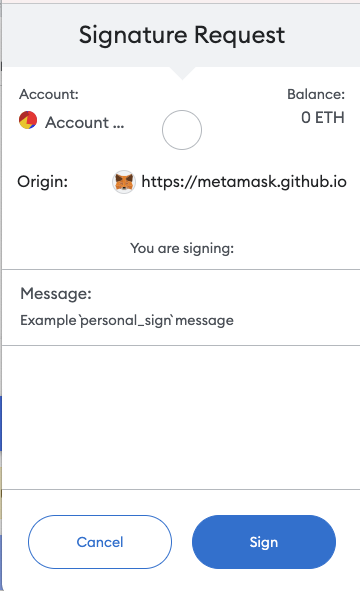

### 37. 數位簽章 (Signature)

介紹以太坊中的數位簽名ECDSA，以及如何利用它發放NFT白名單。

程式碼中的`ECDSA`函式庫由OpenZeppelin的同名函式庫簡化而成。

如果你用過opensea交易NFT，對簽名就不會陌生。下圖是小狐狸（metamask）錢包進行簽名時彈出的窗口，它可以`證明你擁有私鑰的同時不需要對外公佈私鑰`。



以太坊使用的數位簽章演算法叫做雙橢圓曲線數位簽章演算法（ECDSA），基於雙橢圓曲線「私鑰-公鑰」對的數位簽章演算法。它主要起到了三個作用：

- `身分認證`：證明簽章方是私鑰的持有人。
- `不可否認`：發送方不能否認發送過這個訊息。
- `完整性`：透過驗證針對傳輸訊息產生的數位簽名，可以驗證訊息是否在傳輸過程中被竄改。


#### ECDSA 合約

ECDSA

ECDSA標準中包含兩個部分：

1. 簽署者利用私钥（隱私的）對消息（公開的）創建签名（公開的）。
2. 其他人使用消息（公開的）和签名（公開的）恢復簽名者的公钥（公開的）並驗證簽名。

我們將配合ECDSA庫講解這兩個部分。本教程所用的私钥，公钥，消息，以太坊签名消息，签名如下所示：

```solidity
私钥: 0x227dbb8586117d55284e26620bc76534dfbd2394be34cf4a09cb775d593b6f2b
公钥: 0xe16C1623c1AA7D919cd2241d8b36d9E79C1Be2A2
消息: 0x1bf2c0ce4546651a1a2feb457b39d891a6b83931cc2454434f39961345ac378c
以太坊签名消息: 0xb42ca4636f721c7a331923e764587e98ec577cea1a185f60dfcc14dbb9bd900b
签名: 0x390d704d7ab732ce034203599ee93dd5d3cb0d4d1d7c600ac11726659489773d559b12d220f99f41d17651b0c1c6a669d346a397f8541760d6b32a5725378b241c
```

#### 建立簽名

1. 打包訊息：在以太坊的ECDSA標準中，被簽署的消息是一組資料的keccak256哈希，為bytes32類型。我們可以把任何想要簽名的內容利用abi.encodePacked()函數打包，然後用keccak256()計算哈希，作為消息。我們例子中的消息是由一個address類型變數和一個uint256類型變數得到的：

```solidity
    簽名消息 ＝ keccak256(abi.encodePacked(......));
    /*
     * 将mint地址（address类型）和tokenId（uint256类型）拼成消息msgHash
     * _account: 0x5B38Da6a701c568545dCfcB03FcB875f56beddC4
     * _tokenId: 0
     * 对应的消息msgHash: 0x1bf2c0ce4546651a1a2feb457b39d891a6b83931cc2454434f39961345ac378c
     */
    function getMessageHash(address _account, uint256 _tokenId) public pure returns(bytes32){
        return keccak256(abi.encodePacked(_account, _tokenId));
    }
```

2. 計算以太坊簽章訊息

`消息`可以是能被執行的交易，也可以是其他任何形式。

為了避免用戶誤簽了惡意交易，
    1. `EIP191`提倡消息在前加上"\x19Ethereum Signed Message:\n32"字符，
    2. 並再做一次keccak256哈希，作為以太坊签名消息。
    3. 經過`toEthSignedMessageHash()`函數處理後的訊息，不能被用來執行交易:

```solidity
        /**
     * @dev 返回 以太坊签名消息
     * `hash`：消息
     * 遵从以太坊签名标准：https://eth.wiki/json-rpc/API#eth_sign[`eth_sign`]
     * 以及`EIP191`:https://eips.ethereum.org/EIPS/eip-191`
     * 添加"\x19Ethereum Signed Message:\n32"字段，防止签名的是可执行交易。
     */
    function toEthSignedMessageHash(bytes32 hash) public pure returns (bytes32) {
        // 哈希的长度为32
        return keccak256(abi.encodePacked("\x19Ethereum Signed Message:\n32", hash));
    }
```
3-1. 利用錢包簽名

日常操作中，大部分用戶都是透過這種方式進行簽署。

在獲取到需要簽名的訊息之後，我們需要使用metamask錢包進行簽名。

metamask的personal_sign方法會自動把消息轉換為以太坊签名消息，然後發動簽章。

所以我們只需要輸入消息和签名者钱包account即可。

需要注意的是輸入的签名者钱包account需要和metamask目前連接的account一致才能使用。

因此先把例子中的私钥導入到小狐狸錢包，然後打開瀏覽器的`console`頁面：

Chrome菜单-更多工具-开发者工具-Console。

在連接錢包的狀態下（如連接opensea，否則會出現錯誤），依序輸入以下指令進行簽署：
```javascript
ethereum.enable()
account = "0xe16C1623c1AA7D919cd2241d8b36d9E79C1Be2A2"
hash = "0x1bf2c0ce4546651a1a2feb457b39d891a6b83931cc2454434f39961345ac378c"
ethereum.request({method: "personal_sign", params: [account, hash]})
```

3-2. 利用 web3.py

```ptyhon
from web3 import Web3, HTTPProvider
from eth_account.messages import encode_defunct

private_key = "0x227dbb8586117d55284e26620bc76534dfbd2394be34cf4a09cb775d593b6f2b"
address = "0x5B38Da6a701c568545dCfcB03FcB875f56beddC4"
rpc = 'https://rpc.ankr.com/eth'
w3 = Web3(HTTPProvider(rpc))

#打包信息
msg = Web3.solidity_keccak(['address','uint256'], [address,0])
print(f"消息：{msg.hex()}")
#构造可签名信息
message = encode_defunct(hexstr=msg.hex())
#签名
signed_message = w3.eth.account.sign_message(message, private_key=private_key)
print(f"签名：{signed_message['signature'].hex()}")
```

在傳回的結果中（Promise的PromiseResult）可以看到建立好的簽名。不同帳戶有不同的私鑰，創建的簽名值也不同。利用教程的私鑰所建立的簽章如下所示：

```
0x390d704d7ab732ce034203599ee93dd5d3cb0d4d1d7c600ac11726659489773d559b12d220f99f41d17651b0c1c6a669d346a397f8541760d6b32a5725378b241c
```

#### 驗證簽名

為了驗證簽名，驗證者需要擁有

`消息`，`簽名`，和`簽名使用的公鑰`

透過`簽名`和`訊息`恢復`公鑰`：

`簽名`是由數學演算法產生的。這裡我們使用的是`rsv簽名`，`簽名`中包含`r, s, v`三個值的資訊。

而後，我們可以透過`r, s, v`及`以太坊簽名消息`來求得`公钥`。下面的recoverSigner()函數實作了上述步驟，它利用`以太坊簽名消息` `_msgHash和簽名` `_signature恢復公鑰`（使用了簡單的內聯彙編）：

```
    // @dev 从_msgHash和签名_signature中恢复signer地址
    function recoverSigner(bytes32 _msgHash, bytes memory _signature) internal pure returns (address){
        // 检查签名长度，65是标准r,s,v签名的长度
        require(_signature.length == 65, "invalid signature length");
        bytes32 r;
        bytes32 s;
        uint8 v;
        // 目前只能用assembly (内联汇编)来从签名中获得r,s,v的值
        assembly {
            /*
            前32 bytes存储签名的长度 (动态数组存储规则)
            add(sig, 32) = sig的指针 + 32
            等效为略过signature的前32 bytes
            mload(p) 载入从内存地址p起始的接下来32 bytes数据
            */
            // 读取长度数据后的32 bytes
            r := mload(add(_signature, 0x20))
            // 读取之后的32 bytes
            s := mload(add(_signature, 0x40))
            // 读取最后一个byte
            v := byte(0, mload(add(_signature, 0x60)))
        }
        // 使用ecrecover(全局函数)：利用 msgHash 和 r,s,v 恢复 signer 地址
        return ecrecover(_msgHash, v, r, s);
    }
```

其中取數據 `_signature` 長度至關重要。

參數：
```
_msgHash：0xb42ca4636f721c7a331923e764587e98ec577cea1a185f60dfcc14dbb9bd900b
_signature：0x390d704d7ab732ce034203599ee93dd5d3cb0d4d1d7c600ac11726659489773d559b12d220f99f41d17651b0c1c6a669d346a397f8541760d6b32a5725378b241c
```


- 由於簽名是鏈下的，不需要gas，因此這種白名單發放模式比Merkle Tree模式還要經濟；
- 但由於使用者要請求中心化介面去取得簽名，不可避免的犧牲了一部分去中心化；
- 額外還有一個好處是白名單可以動態變化，而不是提前寫死在合約裡面了，因為專案方的中心化後端介面可以接受任何新地址的請求並給予白名單簽名。