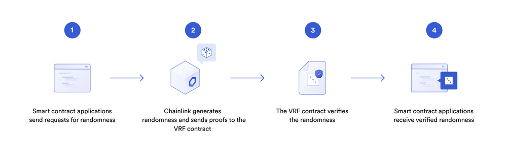
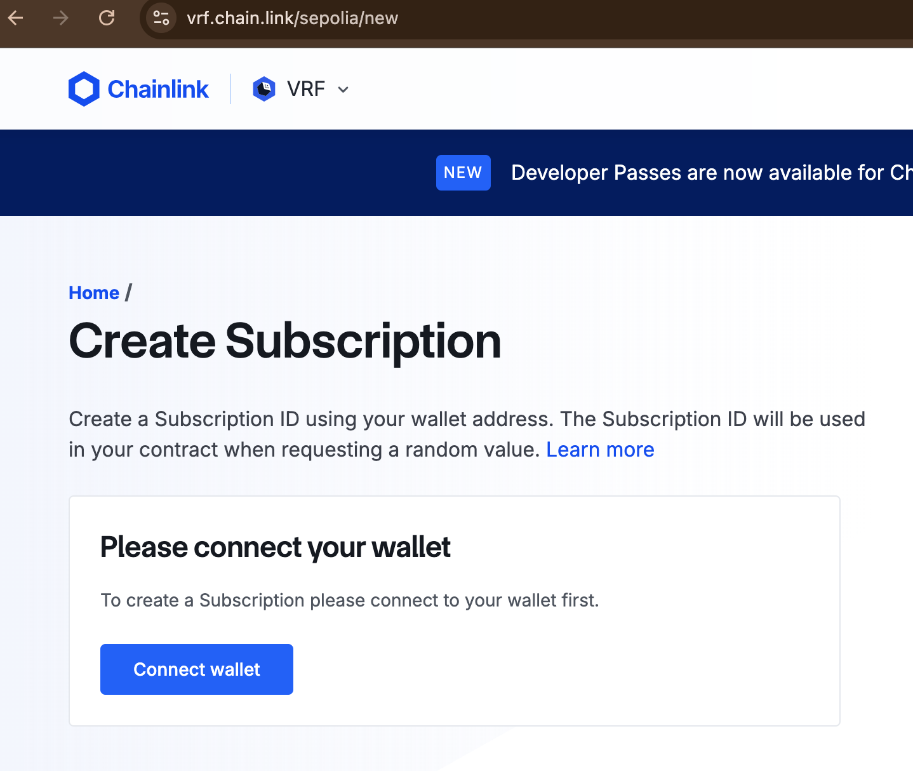
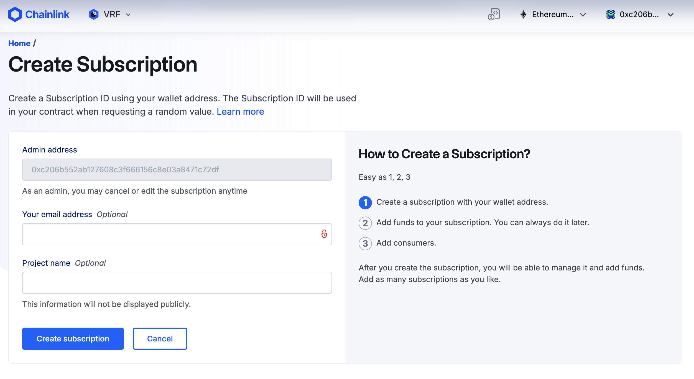
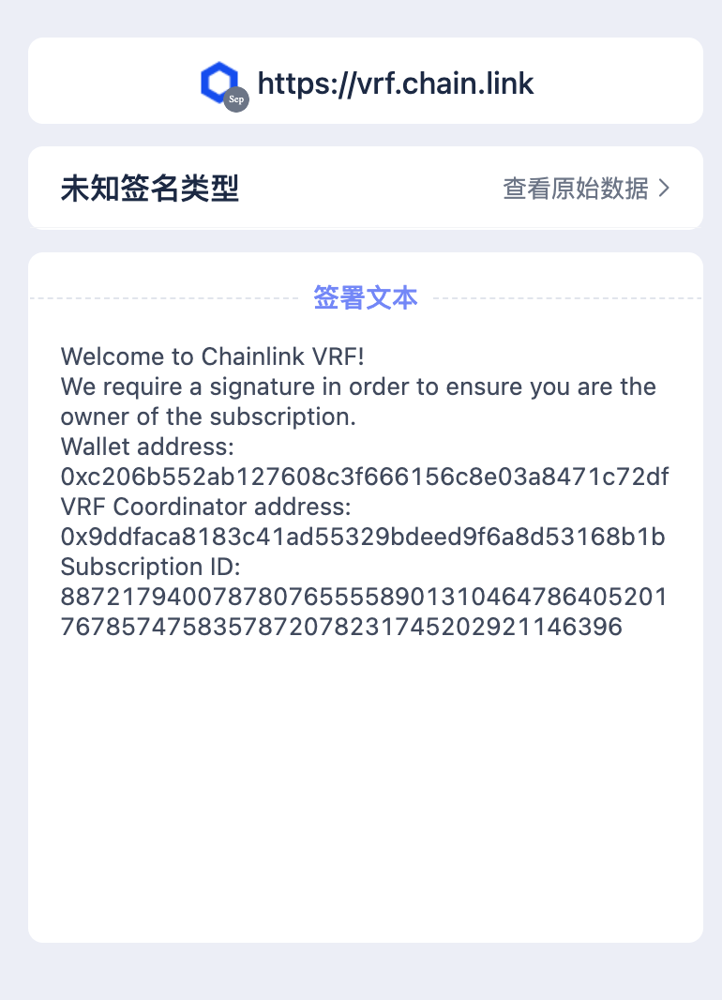
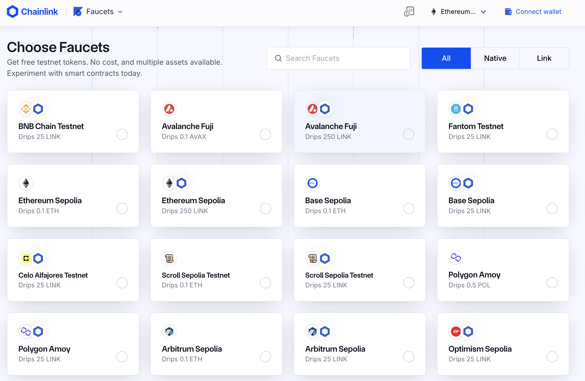

### 39. 鏈上隨機數

例如NFT隨機抽取tokenId、抽盲盒、gamefi戰鬥中隨機分勝負等等。

但由於以太坊上所有資料都是公開透明（public）且確定性（deterministic）的，它"沒辦法"像其他程式語言一樣提供開發者產生隨機數的方法。

這一講我們將介紹鏈上（雜湊函數）和鏈下（chainlink預言機）隨機數產生的兩種方法，並利用它們做一款tokenId隨機鑄造的NFT。

#### 鏈上隨機數

不囉唆直接放程式碼：

```solidity
    /** 
    * 链上伪随机数生成
    * 利用keccak256()打包一些链上的全局变量/自定义变量
    * 返回时转换成uint256类型
    */
    function getRandomOnchain() public view returns(uint256){
        // remix运行blockhash会报错
        bytes32 randomBytes = keccak256(abi.encodePacked(block.timestamp, msg.sender, blockhash(block.number-1)));
        
        return uint256(randomBytes);
    }
```

上面代碼利用 block.timestamp，msg.sender和blockhash(block.number-1)作為種子來取得隨機數

注意:，這個方法並不安全：

首先，block.timestamp，msg.sender和blockhash(block.number-1)這些變數都是公開的，使用者可以預測出用這些種子產生的隨機數，並挑出他們想要的隨機數執行合約。

其次，礦工可以操縱`blockhash`和`block.timestamp`，使得產生的隨機數符合他的利益。
儘管如此，由於這種方法是最便捷的鏈上隨機數生成方法，大量項目方依靠它來產生不安全的隨機數，包括知名的項目meebits，loots等。當然，這些項目也無一例外的被攻擊了：攻擊者可以鑄造任何他們想要的稀​​有NFT，而非隨機抽取。


#### 鏈下隨機數

可以使用鏈下產生隨機數，然後透過預言機上傳到鏈上

`Chainlink` 提供`VRF`（可驗證隨機函數）服務,鏈上開發者可以支付LINK代幣以獲得隨機數。

Chainlink VRF有兩個版本，第二個版本需要官網註冊並預付費，比第一個版本多許多操作，需要花費更多的gas，但取消訂閱後可以拿回剩餘的Link，這裡介紹第二個版本Chainlink VRF V2。

##### Chainlink VRF使用




簡單的合約介紹使用 `Chainlink VRF`的步驟。

`RandomNumberConsumer合約`可以向VRF請求隨機數，並儲存在狀態變數`randomWords`中。

1. 申請Subscription並轉入Link代幣,水龍頭獲取Link代幣









2. 用戶合約繼承VRFConsumerBaseV2

為了使用VRF獲取隨機數，合約需要繼承`VRFConsumerBaseV2`合約，並在構造函數中初始化`VRFCoordinatorV2Interface`和`Subscription Id`。

教程中我們使用Sepolia測試網。

```solidity
// SPDX-License-Identifier: MIT
pragma solidity ^0.8.21;

import "@chainlink/contracts/src/v0.8/interfaces/VRFCoordinatorV2Interface.sol";
import "@chainlink/contracts/src/v0.8/VRFConsumerBaseV2.sol";

contract RandomNumberConsumer is VRFConsumerBaseV2{

    //请求随机数需要调用VRFCoordinatorV2Interface接口
    VRFCoordinatorV2Interface COORDINATOR;
    
    // 申请后的subId
    uint64 subId;

    //存放得到的 requestId 和 随机数
    uint256 public requestId;
    uint256[] public randomWords;
    
    /**
     * 使用chainlink VRF，构造函数需要继承 VRFConsumerBaseV2
     * 不同链参数填的不一样
     * 具体可以看：https://docs.chain.link/vrf/v2/subscription/supported-networks
     * 网络: Sepolia测试网
     * Chainlink VRF Coordinator 地址: 0x8103B0A8A00be2DDC778e6e7eaa21791Cd364625
     * LINK 代币地址: 0x01BE23585060835E02B77ef475b0Cc51aA1e0709
     * 30 gwei Key Hash: 0x474e34a077df58807dbe9c96d3c009b23b3c6d0cce433e59bbf5b34f823bc56c
     * Minimum Confirmations 最小确认块数 : 3 （数字大安全性高，一般填12）
     * callbackGasLimit gas限制 : 最大 2,500,000
     * Maximum Random Values 一次可以得到的随机数个数 : 最大 500          
     */
    address vrfCoordinator = 0x8103B0A8A00be2DDC778e6e7eaa21791Cd364625;
    bytes32 keyHash = 0x474e34a077df58807dbe9c96d3c009b23b3c6d0cce433e59bbf5b34f823bc56c;
    uint16 requestConfirmations = 3;
    uint32 callbackGasLimit = 200_000;
    uint32 numWords = 3;
    
    constructor(uint64 s_subId) VRFConsumerBaseV2(vrfCoordinator){
        COORDINATOR = VRFCoordinatorV2Interface(vrfCoordinator);
        subId = s_subId;
    }
```

2. 用戶合約申請隨機數

使用者可以呼叫從`VRFCoordinatorV2Interface`介面合約中的`requestRandomWords`函數申請隨機數，並傳回申請標識符requestId。這個申請會傳給VRF合約。

注意:合約部署後，需要把合約加入到Subscription的Consumers中，才能發送申請。

```solidity
  /** 
     * 向VRF合约申请随机数 
     */
    function requestRandomWords() external {
        requestId = COORDINATOR.requestRandomWords(
            keyHash,
            subId,
            requestConfirmations,
            callbackGasLimit,
            numWords
        );
    }
```

3. `Chainlink`節點鏈下產生隨機數和數位簽名，並發送給VRF合約

4. VRF合約驗證簽名有效性

5. 使用者合約接收並使用隨機數

在VRF合約驗證簽章有效之後，會自動呼叫使用者合約的回退函數`fulfillRandomness()`，將鏈下產生的隨機數傳送過來。使用者要把消耗隨機數的邏輯寫在這裡。

注意:用戶申請隨機數時調用的`requestRandomness()`和VRF合約返回隨機數時調用的回退函數`fulfillRandomness()`是兩筆交易，調用者分別是用戶合約和VRF合約，後者比前者晚幾分鐘（不同鏈延遲不一樣）。

```solidity
       /**
     * VRF合约的回调函数，验证随机数有效之后会自动被调用
     * 消耗随机数的逻辑写在这里
     */
    function fulfillRandomWords(uint256 requestId, uint256[] memory s_randomWords) internal override {
        randomWords = s_randomWords;
    }
```

#### tokenId隨機鑄造NFT

1. 合約引用 ERC721, VRFConsumerBaseV2

```solidity"
import "https://github.com/AmazingAng/WTF-Solidity/blob/main/34_ERC721/ERC721.sol";
import "@chainlink/contracts/src/v0.8/interfaces/VRFCoordinatorV2Interface.sol";
import "@chainlink/contracts/src/v0.8/VRFConsumerBaseV2.sol";
```

2. 命名參數

- NFT相關
  - totalSupply：NFT總供給。
  - ids：數組，用於計算可供mint的tokenId，請參閱pickRandomUniqueId()函數。
  - mintCount：已經mint的數量。
- Chainlink VRF相關
  - COORDINATOR：呼叫VRFCoordinatorV2Interface介面
  - vrfCoordinator:VRF合約地址
  - keyHash:VRF唯一識別符。
  - requestConfirmations:確認區塊數
  - callbackGasLimit：VRF手續費。
  - numWords:請求的隨機數個數
  - subId：申請的Subscription Id
  - requestId:申請標識符
  - requestToSender：記錄申請VRF用於鑄造的使用者地址。

3. 構造函數

```solidity
    constructor(uint64 s_subId) 
        VRFConsumerBaseV2(vrfCoordinator)
        ERC721("WTF Random", "WTF"){
            COORDINATOR = VRFCoordinatorV2Interface(vrfCoordinator);
            subId = s_subId;
    }
```
s_subId 是申請的`Subscription Id`

4. 其他函數

合約裡還定義了5個函數。

- pickRandomUniqueId()：輸入隨機數，取得可供mint的tokenId。

- getRandomOnchain()：取得鏈上隨機數（不安全）。

- mintRandomOnchain()：利用鏈上隨機數鑄造NFT，調用了`getRandomOnchain()`和`pickRandomUniqueId()`。

- mintRandomVRF()：申請Chainlink VRF用於鑄造隨機數。由於使用隨機數鑄造的邏輯在回調函數`fulfillRandomness()`，而回調函數的呼叫者是VRF合約，而非鑄造NFT的用戶，這裡必須利用`requestToSender`狀態變數記錄VRF申請識別碼對應的用戶位址。

- fulfillRandomWords()：VRF的回調函數，由VRF合約在驗證隨機數真實性後自動調用，用返回的鏈下隨機數鑄造NFT。

```solidity
    /** 
    * 输入uint256数字，返回一个可以mint的tokenId
    * 算法过程可理解为：totalSupply个空杯子（0初始化的ids）排成一排，每个杯子旁边放一个球，编号为[0, totalSupply - 1]。
    每次从场上随机拿走一个球（球可能在杯子旁边，这是初始状态；也可能是在杯子里，说明杯子旁边的球已经被拿走过，则此时新的球从末尾被放到了杯子里）
    再把末尾的一个球（依然是可能在杯子里也可能在杯子旁边）放进被拿走的球的杯子里，循环totalSupply次。相比传统的随机排列，省去了初始化ids[]的gas。
    */
    function pickRandomUniqueId(uint256 random) private returns (uint256 tokenId) {
        //先计算减法，再计算++, 关注(a++，++a)区别
        uint256 len = totalSupply - mintCount++; // 可mint数量
        require(len > 0, "mint close"); // 所有tokenId被mint完了
        uint256 randomIndex = random % len; // 获取链上随机数

        //随机数取模，得到tokenId，作为数组下标，同时记录value为len-1，如果取模得到的值已存在，则tokenId取该数组下标的value
        tokenId = ids[randomIndex] != 0 ? ids[randomIndex] : randomIndex; // 获取tokenId
        ids[randomIndex] = ids[len - 1] == 0 ? len - 1 : ids[len - 1]; // 更新ids 列表
        ids[len - 1] = 0; // 删除最后一个元素，能返还gas
    }

    /** 
    * 链上伪随机数生成
    * keccak256(abi.encodePacked()中填上一些链上的全局变量/自定义变量
    * 返回时转换成uint256类型
    */
    function getRandomOnchain() public view returns(uint256){
        /*
         * 本例链上随机只依赖区块哈希，调用者地址，和区块时间，
         * 想提高随机性可以再增加一些属性比如nonce等，但是不能根本上解决安全问题
         */
        bytes32 randomBytes = keccak256(abi.encodePacked(blockhash(block.number-1), msg.sender, block.timestamp));
        return uint256(randomBytes);
    }

    // 利用链上伪随机数铸造NFT
    function mintRandomOnchain() public {
        uint256 _tokenId = pickRandomUniqueId(getRandomOnchain()); // 利用链上随机数生成tokenId
        _mint(msg.sender, _tokenId);
    }

    /** 
     * 调用VRF获取随机数，并mintNFT
     * 要调用requestRandomness()函数获取，消耗随机数的逻辑写在VRF的回调函数fulfillRandomness()中
     * 调用前，需要在Subscriptions中转入足够的Link
     */
    function mintRandomVRF() public {
        // 调用requestRandomness获取随机数
        requestId = COORDINATOR.requestRandomWords(
            keyHash,
            subId,
            requestConfirmations,
            callbackGasLimit,
            numWords
        );
        requestToSender[requestId] = msg.sender;
    }

    /**
     * VRF的回调函数，由VRF Coordinator调用
     * 消耗随机数的逻辑写在本函数中
     */
    function fulfillRandomWords(uint256 requestId, uint256[] memory s_randomWords) internal override{
        address sender = requestToSender[requestId]; // 从requestToSender中获取minter用户地址
        uint256 tokenId = pickRandomUniqueId(s_randomWords[0]); // 利用VRF返回的随机数生成tokenId
        _mint(sender, tokenId);
    }
  ```

去中心化果然還要一段路，但或許計算的東西還是放在中心化會比較好呢？


