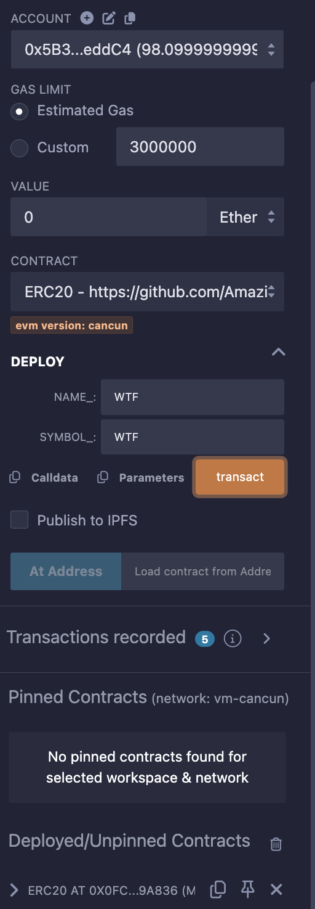
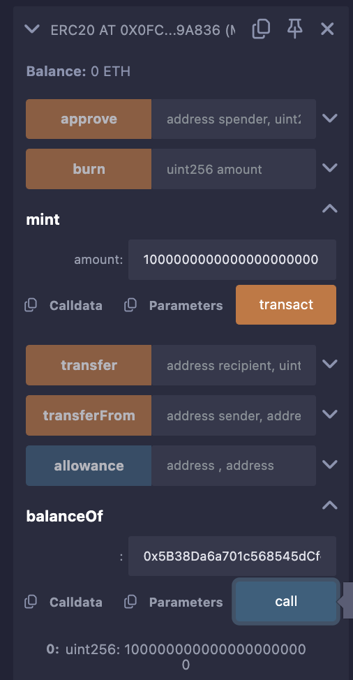
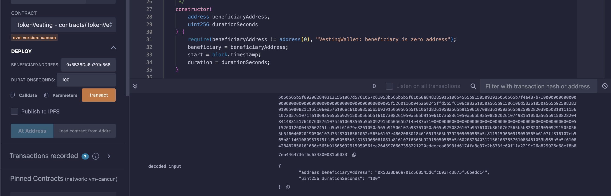
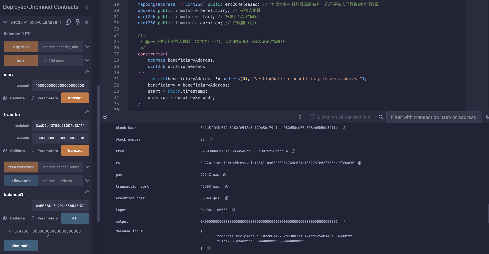
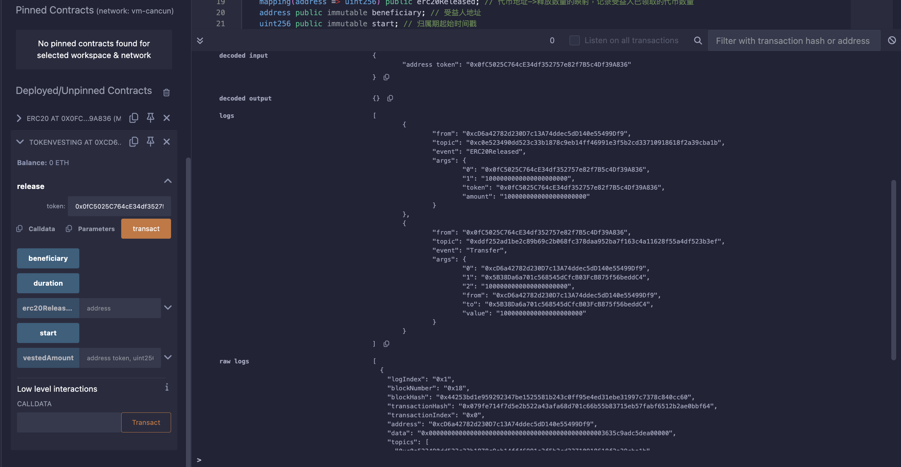

#### 43. 線性釋放

介紹代幣歸屬條款，並寫一個線性釋放ERC20代幣的合約。

`OpenZeppelin`的`VestingWallet合約`簡化而來。

正常：
  在傳統金融領域，有些公司會向員工和管理階層提供股權。

  但大量股權同時釋出會在短期產生拋售壓力，拖累股價。

  因此，公司通常會引入一個“歸屬期來延遲承諾資產的所有權”。

Web3:

在區塊鏈領域，Web3新創公司會給團隊分配代幣，同時也會將代幣低價出售給創投和私募。

如果他們把這些低成本的代幣同時提到交易所變現，幣價將被砸穿，散戶直接成為接盤俠。

所以，專案方一般會約定代幣歸屬條款（token vesting），在歸屬期內逐步釋放代幣，減緩拋壓，並防止團隊和資本方過早躺平。

#### 線性釋放

線性釋放指的是代幣在歸屬期內勻速釋放。

EX: 某私募持有365,000枚ICU代幣，歸屬期為1年（365天），那麼每天會釋放1,000枚代幣。

寫一個鎖倉並線性釋放ERC20代幣的合約TokenVesting。它的邏輯很簡單：

- 項目方規定線性釋放的"起始時間"、"歸屬期"和"受益人"。
- 專案方將`鎖倉的ERC20代幣`轉帳給`TokenVesting`合約。
- 受益人可以呼叫`release`函數，從合約中取出釋放的代幣。

#### 線性釋放合約

##### 事件

  - ERC20Released：提幣事件，當受益人提取釋放代幣時釋放。

  ```solidity
    // 事件
    event ERC20Released(address indexed token, uint256 amount); // 提币事件
  ```

##### 狀態變數


- `beneficiary`：受益人地址。
- `start`：歸屬期起始時間戳記。
- `duration`：歸屬期，單位為秒。
- `erc20Released`：代幣地址->釋放數量的映射，記錄受益人已領取的代幣數量。

```
    // 状态变量
    mapping(address => uint256) public erc20Released; // 代币地址->释放数量的映射，记录已经释放的代币
    address public immutable beneficiary; // 受益人地址
    uint256 public immutable start; // 起始时间戳
    uint256 public immutable duration; // 归属期
```

##### 函數

```solidity
    /**
     * @dev 初始化受益人地址，释放周期(秒), 起始时间戳(当前区块链时间戳)
     */
    constructor(
        address beneficiaryAddress,
        uint256 durationSeconds
    ) {
        require(beneficiaryAddress != address(0), "VestingWallet: beneficiary is zero address");
        beneficiary = beneficiaryAddress;
        start = block.timestamp;
        duration = durationSeconds;
    }

    /**
     * @dev 受益人提取已释放的代币。
     * 调用vestedAmount()函数计算可提取的代币数量，然后transfer给受益人。
     * 释放 {ERC20Released} 事件.
     */
    function release(address token) public {
        // 调用vestedAmount()函数计算可提取的代币数量
        uint256 releasable = vestedAmount(token, uint256(block.timestamp)) - erc20Released[token];
        // 更新已释放代币数量   
        erc20Released[token] += releasable; 
        // 转代币给受益人
        emit ERC20Released(token, releasable);
        IERC20(token).transfer(beneficiary, releasable);
    }

    /**
     * @dev 根据线性释放公式，计算已经释放的数量。开发者可以通过修改这个函数，自定义释放方式。
     * @param token: 代币地址
     * @param timestamp: 查询的时间戳
     */
    function vestedAmount(address token, uint256 timestamp) public view returns (uint256) {
        // 合约里总共收到了多少代币（当前余额 + 已经提取）
        uint256 totalAllocation = IERC20(token).balanceOf(address(this)) + erc20Released[token];
        // 根据线性释放公式，计算已经释放的数量
        if (timestamp < start) {
            return 0;
        } else if (timestamp > start + duration) {
            return totalAllocation;
        } else {
            return (totalAllocation * (timestamp - start)) / duration;
        }
    }
```
- 建構函數：初始化受益人地址，歸屬期(秒），起始時間戳記。 （不可以是0地址）
- release()：受益人提取已釋放的代幣。調用vestedAmount()函數計算可提取的代幣數量，然後轉帳給受益人。
- vestedAmount()：根據線性釋放公式，計算已經釋放的數量。開發者可以通過修改這個函數，自定義釋放方式。

#### 合約部署練習

1. 部署`ERC20`代幣合約，獲取代幣地址，並且發放代幣 10000

  

  

2. 部署`TokenVesting`合約，初始化受益人地址，歸屬期為 100 秒

  

  

3. 受益人地址調用`release`函數，提取已釋放的代幣。

  

總結：
  個人覺得區塊鏈智能合約放到鏈上做線性釋放真的很好，可以保證代幣的安全性，不會一次性釋放，也可以保證代幣的價值，不會一次性釋放導致代幣價值下降。（重點是夠簡單又好明白）