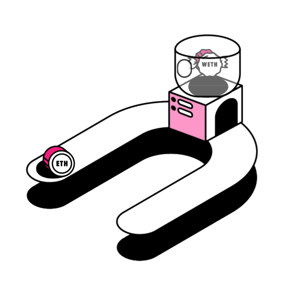

### 41. WETH

`WETH`--带包装的ETH



#### WETH 合約
  `WETH`符合`ERC20`標準，它比普通的`ERC20`多了兩個功能：

  1. 存款：包裝，用戶將`ETH`存入`WETH合約`，並獲得等量的`WETH`。
  2. 提款：拆包裝，用戶`銷毀WETH`，並獲得等量的`ETH`。

  ```solidity
    // SPDX-License-Identifier: MIT
    pragma solidity ^0.8.0;

    import "@openzeppelin/contracts/token/ERC20/ERC20.sol";

    contract WETH is ERC20{
        // 事件：存款和取款
        event  Deposit(address indexed dst, uint wad);
        event  Withdrawal(address indexed src, uint wad);

        // 构造函数，初始化ERC20的名字和代号
        constructor() ERC20("WETH", "WETH"){
        }

        // 回调函数，当用户往WETH合约转ETH时，会触发deposit()函数
        fallback() external payable {
            deposit();
        }
        // 回调函数，当用户往WETH合约转ETH时，会触发deposit()函数
        receive() external payable {
            deposit();
        }

        // 存款函数，当用户存入ETH时，给他铸造等量的WETH
        function deposit() public payable {
            _mint(msg.sender, msg.value);
            emit Deposit(msg.sender, msg.value);
        }

        // 提款函数，用户销毁WETH，取回等量的ETH
        function withdraw(uint amount) public {
            require(balanceOf(msg.sender) >= amount);
            _burn(msg.sender, amount);
            payable(msg.sender).transfer(amount);
            emit Withdrawal(msg.sender, amount);
        }
    }
  ```

重點：

- `WETH`並實現了`WETH合約`。

    它就像是給原生ETH穿了一件智能合約做的衣服：穿上衣服的時候，就變成了WETH，符合ERC20同質化代幣標準，可以"跨鏈"，可以用於dApp；脫下衣服，它可以`1 :1兌換ETH`。

- `_burn()` 函数

    用戶提款時，銷毀WETH，並將等量的ETH轉給用戶。

-  巧妙運用 `fallback()` 和 `receive()` 函数

    用戶轉ETH到WETH合約時，會觸發`fallback()`和`receive()`函數，進行存款操作。