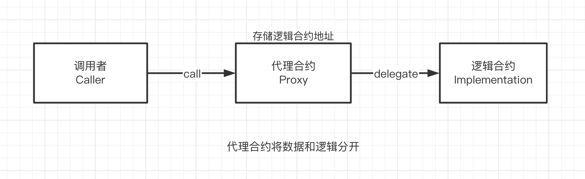
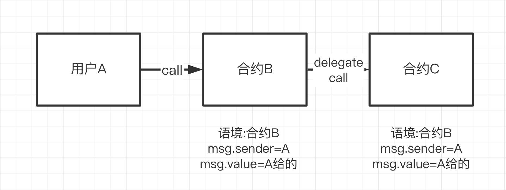
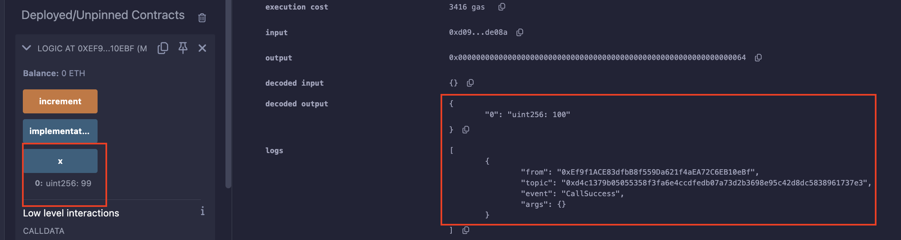
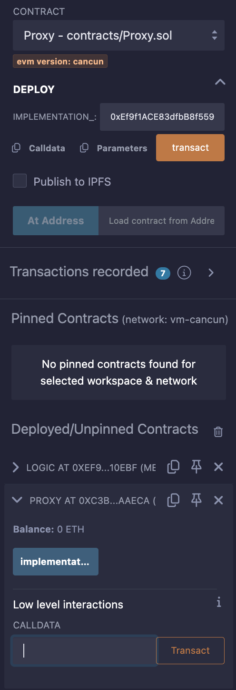
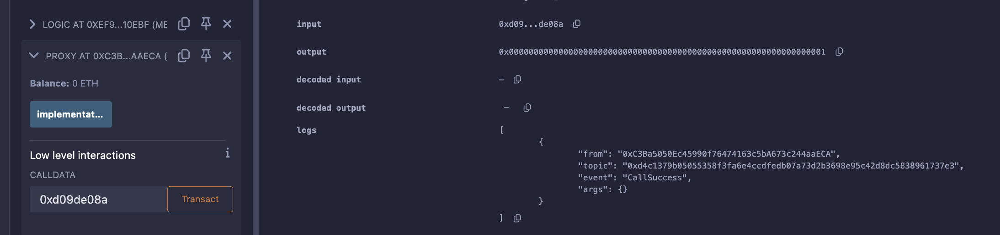
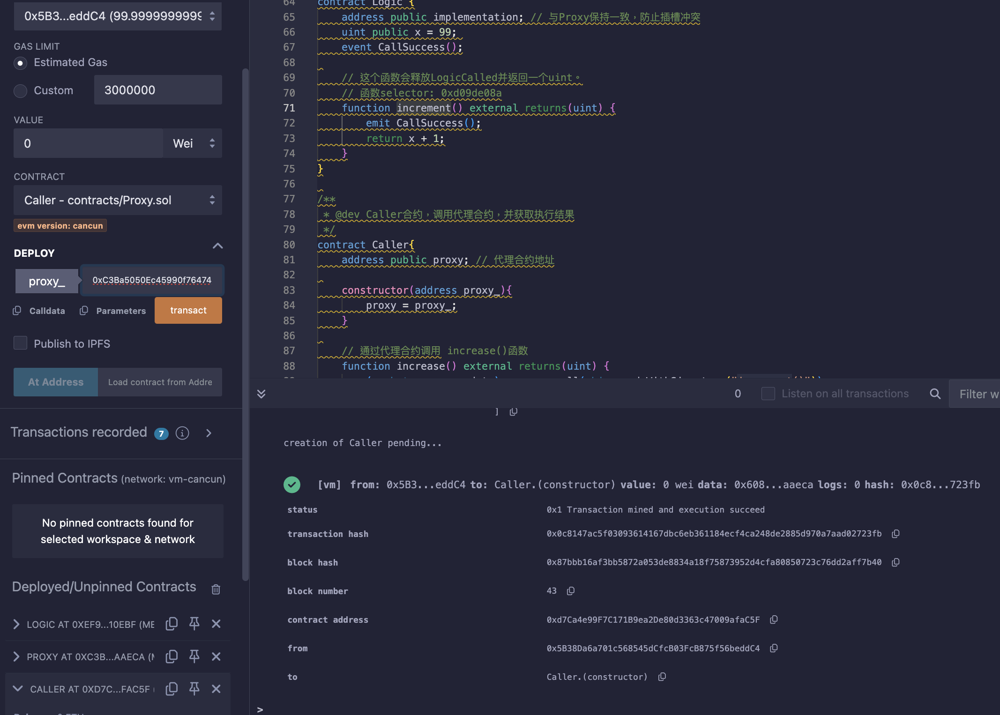
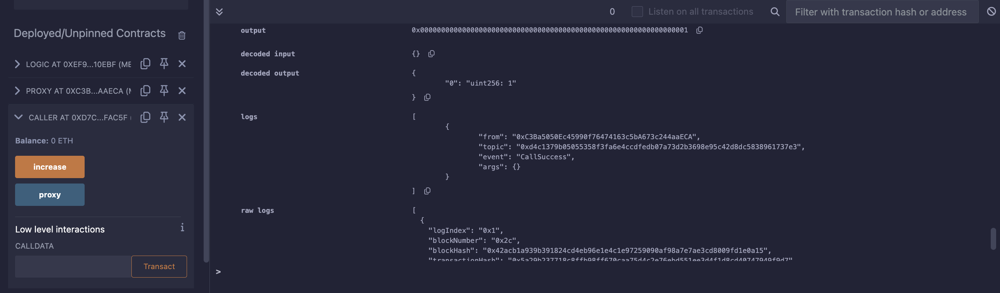

### 46. 代理合約

`Solidity`合約部署在鏈上之後，程式碼是不可變的（immutable）。這樣既有優點，也有缺點：

- 優點：安全，使用者知道會發生什麼（大部分時候）。
- 壞處：就算合約中存在bug，也不能修改或升級，只能部署新合約。
  但是新合約的地址與舊的不一樣，且合約的資料也需要花費大量gas進行遷移。

  有沒有辦法在合約部署後進行修改或升級呢？答案是有的，就是`代理模式`。

#### 代理模式

  就是將資料層和邏輯層分開，分別保存在不同合約中。



代理合約（Proxy）透過`delegatecall`，將函數呼叫全權委託給邏輯合約（Implementation）執行，再把最終的結果回傳給呼叫者（Caller）。


1. 可升級：當我們需要升級合約的邏輯時，只需要將代理合約指向新的邏輯合約。
2. 省gas：如果多個合約重複使用一套邏輯，我們只需部署一個邏輯合約，然後再部署多個只儲存資料的代理合約，指向邏輯合約。

`delegatecall` 是之前有講過的下圖：



#### 代理合約

它有三個部分：
  - 代理合約Proxy
  - 邏輯合約Logic
  - 呼叫範例Caller

邏輯：
  - 首先部署`邏輯合約Logic`。
  - 建立代理`合約Proxy`，`狀態變數implementation`記錄`Logic合約位址`。
  - Proxy合約利用回調函數`fallback`，將所有呼叫`委託給Logic合約`
  - 最後部署呼叫範例`Caller合約`，呼叫`Proxy合約`。

-  ****注意：Logic合約和Proxy合約的狀態變數儲存結構相同，不然delegatecall會產生意想不到的行為，有安全隱患。

#### 代理合約 proxy

`Proxy合約`不長，但是用到了內聯彙編，因此比較難理解。

它只有一個狀態變量，一個建構函數，和一個回調函數。

🧑‍💻 狀態變量`implementation`，在構造函數中初始化，用於保存`Logic合約`位址。

```solidity
contract Proxy {
    address public implementation; // 逻辑合约地址。implementation合约同一个位置的状态变量类型必须和Proxy合约的相同，不然会报错。

    /**
     * @dev 初始化逻辑合约地址
     */
    constructor(address implementation_){
        implementation = implementation_;
    }
```

Proxy 的回呼函數將外部對本合約的呼叫委託給Logic合約。這個回呼函數很別緻，它利用內聯彙編（inline assembly），讓本來不能有回傳值的回呼函數有了回傳值。其中用到的內聯組譯操作碼：

- calldatacopy(t, f, s)：將calldata（輸入資料）從位置f開始複製s位元組到mem（記憶體）的位置t。
- delegatecall(g, a, in, insize, out, outsize)：調用地址a的合約，輸入為mem[in..(in+insize))，輸出為mem[out..(out+outsize))， 提供gwei的以太坊gas。這個操作碼在錯誤時返回0，在成功時返回1。
- returndatacopy(t, f, s)：將returndata（輸出資料）從位置f開始複製s位元組到mem（記憶體）的位置t。
- switch：基礎版if/else，不同的情況case會傳回不同值。可以有一個預設的default情況。
- return(p, s)：終止函數執行, 返回資料mem[p..(p+s))。
- revert(p, s)：終止函數執行, 回滾狀態，傳回資料mem[p..(p+s))。

說真的這裡我沒有很理解。暫時理解成把值編譯好，傳輸。

```solidity
/**
* @dev 回调函数，将本合约的调用委托给 `implementation` 合约
* 通过assembly，让回调函数也能有返回值
*/
fallback() external payable {
    address _implementation = implementation;
    assembly {
        // 将msg.data拷贝到内存里
        // calldatacopy操作码的参数: 内存起始位置，calldata起始位置，calldata长度
        calldatacopy(0, 0, calldatasize())

        // 利用delegatecall调用implementation合约
        // delegatecall操作码的参数：gas, 目标合约地址，input mem起始位置，input mem长度，output area mem起始位置，output area mem长度
        // output area起始位置和长度位置，所以设为0
        // delegatecall成功返回1，失败返回0
        let result := delegatecall(gas(), _implementation, 0, calldatasize(), 0, 0)

        // 将return data拷贝到内存
        // returndata操作码的参数：内存起始位置，returndata起始位置，returndata长度
        returndatacopy(0, 0, returndatasize())

        switch result
        // 如果delegate call失败，revert
        case 0 {
            revert(0, returndatasize())
        }
        // 如果delegate call成功，返回mem起始位置为0，长度为returndatasize()的数据（格式为bytes）
        default {
            return(0, returndatasize())
        }
    }
}
```


#### 邏輯合約 logic

這是一個非常簡單的邏輯合約，只是為了示範代理合約。它包含2個變量，1個事件，1個函數：

- `implementation`：佔位變量，與Proxy合約保持一致，防止插槽衝突。
- `x`：uint變量，被設定為99。
- `CallSuccess`事件：在呼叫成功時釋放。
- `increment()`函數：會被Proxy合約調用，釋放CallSuccess事件，並傳回一個uint，它的selector為0xd09de08a。如果直接呼叫increment()回返回100，但是透過Proxy呼叫它會返回1，大家可以想想為什麼？

```solidity

/**
 * @dev 逻辑合约，执行被委托的调用
 */
contract Logic {
    address public implementation; // 与Proxy保持一致，防止插槽冲突
    uint public x = 99; 
    event CallSuccess(); // 调用成功事件

    // 这个函数会释放CallSuccess事件并返回一个uint。
    // 函数selector: 0xd09de08a
    function increment() external returns(uint) {
        emit CallSuccess();
        return x + 1;
    }
}

```

#### Caller

`Caller`合約約會示範如何呼叫一個代理合約，它也非常簡單。但要理解它，你需要先學習本教程的第22講Call和第27講ABI編碼。

它有1個變量，2個函數：

- `proxy`：狀態變量，記錄代理合約位址。
建構子：部署合約時初始化proxy變數。
- `increase()`：利用call來呼叫代理合約的increment()函數，並傳回一個uint。在呼叫時，我們利用abi.encodeWithSignature()獲取了increment()函數的selector。在返回時，利用abi.decode()將返回值解碼為uint類型。

```solidity
/**
 * @dev Caller合约，调用代理合约，并获取执行结果
 */
contract Caller{
    address public proxy; // 代理合约地址

    constructor(address proxy_){
        proxy = proxy_;
    }

    // 通过代理合约调用increment()函数
    function increment() external returns(uint) {
        ( , bytes memory data) = proxy.call(abi.encodeWithSignature("increment()"));
        return abi.decode(data,(uint));
    }
}
```


實作：
  1. 部署Logic合約，獲取位址。

  

  2. 測試 increment() 函數返回 100，確認x值 99。

  

  3.部署Proxy合約，初始化時填入Logic合約位址。

  

  4. 試著利用Proxy合約低代碼呼叫Logic合約的increment()(0xd09de08a) 函數。

  

  5. 部署Caller合約，初始化時填入Proxy合約位址。 之後為透過 Caller 去呼叫 Proxy -> 再去配合目前設定的 Logic 合約。

  

  6. 呼叫Caller合約increment()函數，返回1。

  

  
  總結：
    - 以邏輯插入的概念來實作的確很不錯，比起如果修改了合約改變一髪動全身(前後端都要修改)，這樣的代理合約的概念就是很好的解決方案。

    - 但就要思緒清楚 邏輯合約->代理合約->Caller合約 之間的關係，才能更好的去理解。
