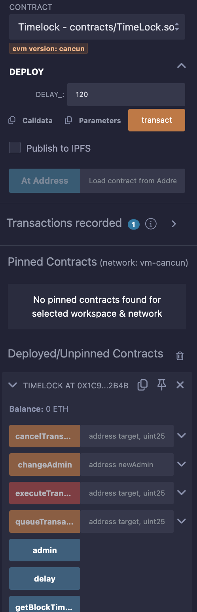
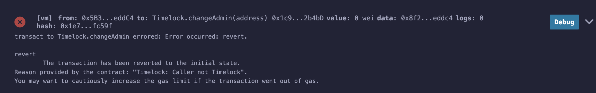
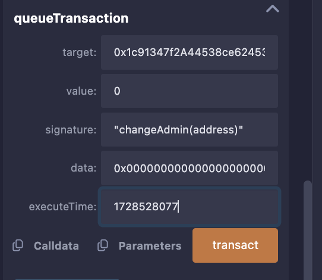
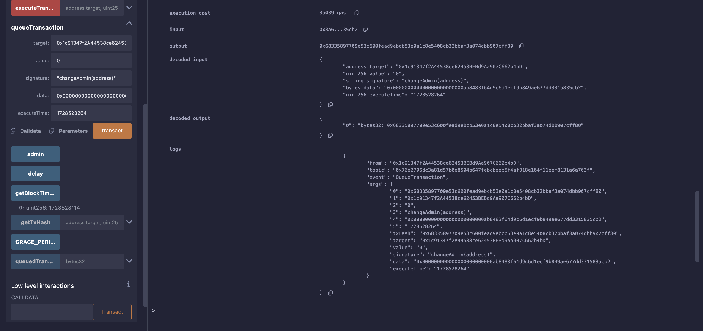
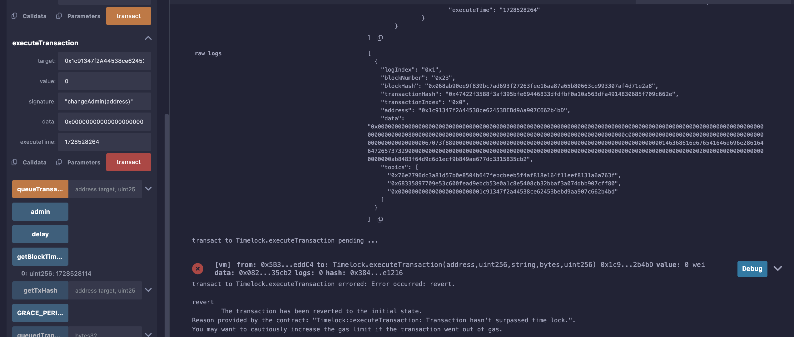
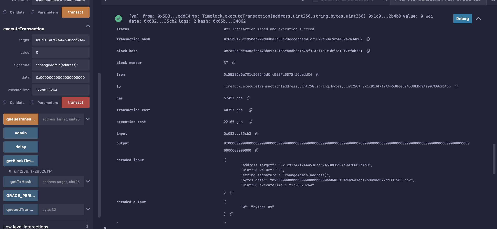

### 45. 時間鎖

介紹時間鎖和時間鎖合約。程式碼由`Compound`的`Timelock`合約簡化而來。


#### 時間鎖介紹

時間鎖的機制是，是確保在預設時間被打開前，的延遲動作。就算知道密碼，也是會有時間的延遲，讓想保護的東西晚點被打開。

在區塊鏈，時間鎖被`DeFi`和`DAO`大量採用。

它是一段程式碼，他可以將智慧合約的某些功能鎖定一段時間。它可以大大改善智能合約的安全性

舉例：

假如一個黑客黑了`Uniswap`的多簽，準備提走金庫的錢，

但金庫合約加了2天鎖定期的時間鎖，那麼黑客從創建提錢的交易，到實際把錢提走，需要2天的等待期。

在這段時間，專案方可以找應對辦法，投資人可以提前拋售代幣減少損失。

#### 時間鎖合約


在建立`Timelock 合約`時，專案方可以設定鎖定期，並把合約的管理員設為自己。

時間鎖主要有三個功能：
  - 建立交易，並加入到時間鎖佇列。
  - 在交易的鎖定期滿後，執行交易。
  - 後悔了，取消時間鎖定佇列中的某些交易。

專案方一般會把時間鎖合約設為重要合約的管理員，例如金庫合約，再透過時間鎖操作他們。

時間鎖合約的管理員一般為專案的多簽錢包，保證去中心化。

[完整合約代碼](TimeLock.sol)

這邊簡化說一下重點邏輯：

```solidity
  mapping (bytes32 => bool) public queuedTransactions; // 交易hash -> 是否已加入時間鎖佇列
```

以上如果提領的話都是先進入序列產生一個鎖(這個鎖，的簽名帶著時間)。

所以說接下來都是控制這個  `queuedTransactions` 這個序列的操作。


實作：

1. 部署Timelock合約，鎖定期設為120秒



2. 直接呼叫changeAdmin()將報錯。



3.填入 queueTransaction
  有一個比較特殊的 data 參數，可以利用 [hasxhex](https://abi.hashex.org/) 轉碼

  

  參數說明：

  - `address target`: 執行合約地址 0x1c91347f2A44538ce62453BEBd9Aa907C662b4bD 
  - `uint256 value`：0 (沒有要轉錢)
  - `string memory signature`: "changeAdmin(address)" (要執行的函數)
  - `bytes memory data`: 0x000000000000000000000000ab8483f64d9c6d1ecf9b849ae677dd3315835cb2
  - `uint256 executeTime`: block.timestamp + 150 (150秒後執行)

  

  執行成功：

  

4. 150秒前執行交易執行失敗



5. 150秒後執行交易執行成功




重點：
  個人感覺把序列的概念用到合約裡面形成一個時間鎖真的很特別，還特別使用了前幾節教到的 `keccak256`,`abi.encode` 這些函數。讓我有總靈活應用 jwt 的感覺 XD。