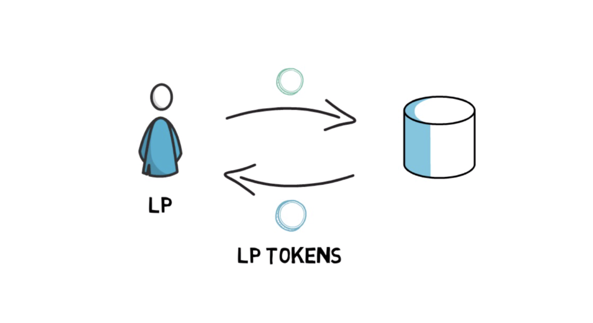
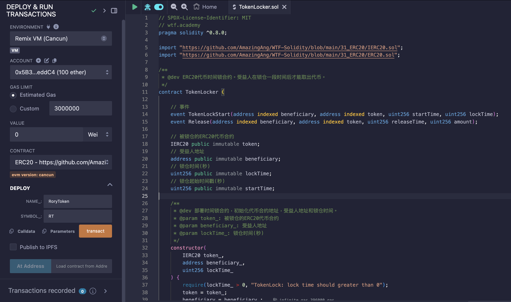
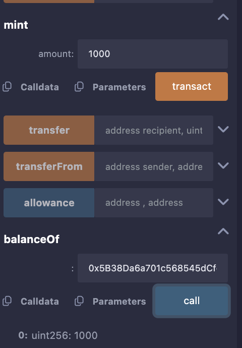
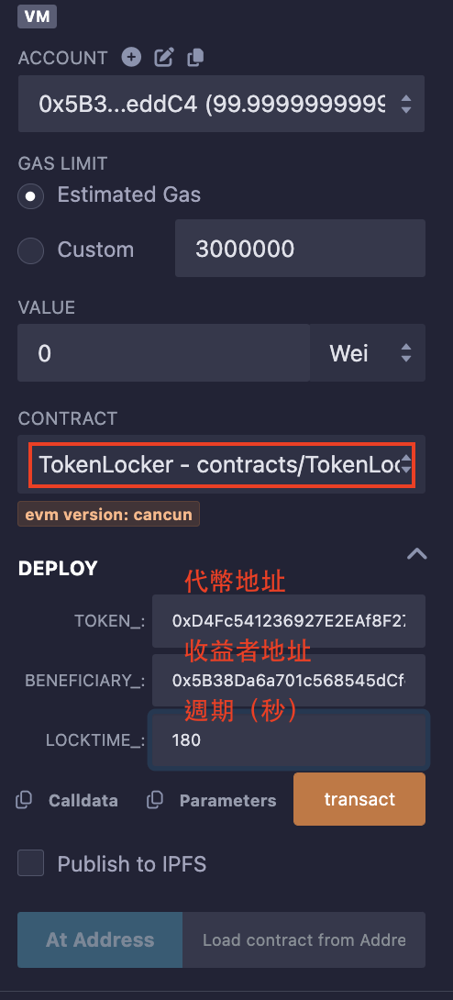
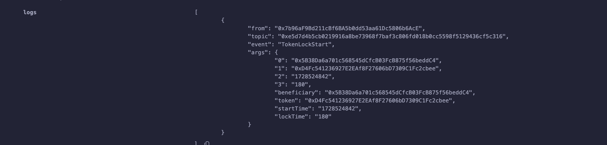
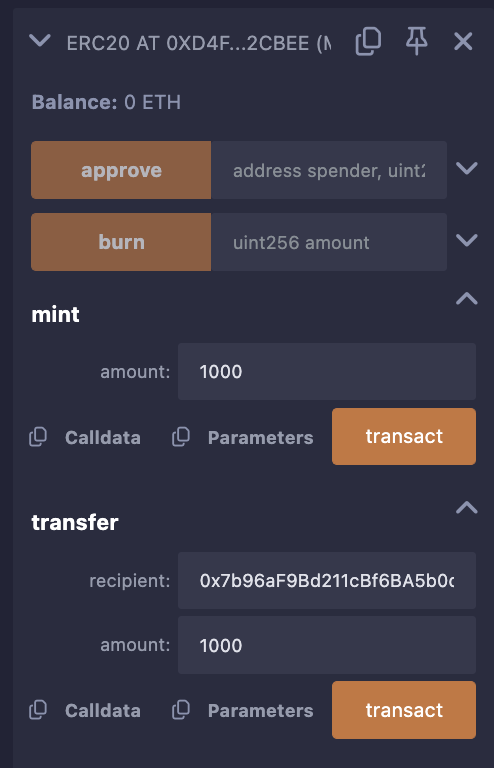
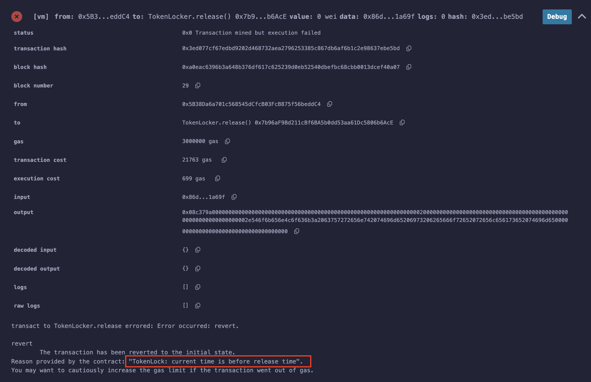
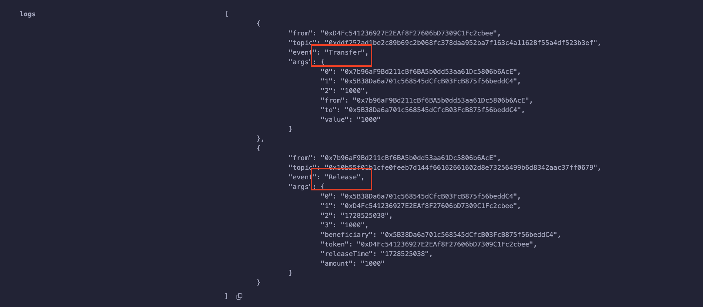

### 44. 代币锁

介紹流動性提供者 LP 代幣，為什麼要鎖定丟動性，並完成鎖定流程。

#### TokenLocker 介紹

TokenLocker 是一種時間鎖合約，代幣鎖倉一段時間，受益人在鎖倉時間期滿可以把代幣提取出來。

代幣鎖一般是用來鎖倉流動性提供者LP代幣的。

#### LP 代幣？

區塊鏈中，用戶在去中心化交易所DEX上交易代幣，例如`Uniswap`交易所。

DEX和中心化交易所(CEX)不同，去中心化交易所使用自動做市商(AMM)機制，需要使用者或專案方提供資金池，以使得其他使用者能夠即時買賣。

簡單來說，用戶/專案方需要質押相應的幣對（例如ETH/DAI）到資金池中，作為補償，`DEX會給他們鑄造相應的流動性提供者LP代幣憑證，證明他們質押了相應的份額，供他們收取手續費。`

如下圖：



#### 為什麼要鎖定流動性？

當然是要防止札盤啊！

如果專案方毫無徵兆的撤出流動性池中的LP代幣，那麼投資者手中的代幣就無法變現，直接歸零了。這種行為也叫`rug-pull`，光是2021年，各種rug-pull騙局從投資者那裡騙取了價值超過28億美元的加密貨幣。

但如果LP代幣是鎖倉在代幣鎖合約中，在鎖倉期結束以前，專案方無法撤出流動性池，也沒辦法rug pull。因此代幣鎖可以防止專案方過早跑路（要小心鎖倉期滿跑路的情況）。

#### TokenLocker 合約

下面，我們就寫一個鎖倉ERC20代幣的合約TokenLocker。它的邏輯很簡單：

- 開發者在部署合約時規定鎖倉的時間，受益人地址，以及代幣合約。
- 開發者將代幣轉入TokenLocker合約。
- 在鎖倉期滿，受益人可以取走合約裡的代幣。

##### 事件

- `TokenLockStart` 鎖倉開始事件(記錄受益人地址，代幣地址，鎖倉起始時間，和結束時間。)


- `Release` 代幣釋放事件(記錄記錄受益人地址，代幣地址，釋放代幣時間，和代幣數量。)

```solidity
    // 事件
    event TokenLockStart(address indexed beneficiary, address indexed token, uint256 startTime, uint256 lockTime);
    event Release(address indexed beneficiary, address indexed token, uint256 releaseTime, uint256 amount);
```

##### 狀態變數

- `token`：鎖倉代幣地址。
- `beneficiary`：受益人地址。
- `locktime`：鎖倉時間(秒)。
- `startTime`：鎖倉起始時間戳(秒)。

```solidity
    // 被锁仓的ERC20代币合约
    IERC20 public immutable token;
    // 受益人地址
    address public immutable beneficiary;
    // 锁仓时间(秒)
    uint256 public immutable lockTime;
    // 锁仓起始时间戳(秒)
    uint256 public immutable startTime;
```

##### 函數

```
    /**
     * @dev 部署时间锁合约，初始化代币合约地址，受益人地址和锁仓时间。
     * @param token_: 被锁仓的ERC20代币合约
     * @param beneficiary_: 受益人地址
     * @param lockTime_: 锁仓时间(秒)
     */
    constructor(
        IERC20 token_,
        address beneficiary_,
        uint256 lockTime_
    ) {
        require(lockTime_ > 0, "TokenLock: lock time should greater than 0");
        token = token_;
        beneficiary = beneficiary_;
        lockTime = lockTime_;
        startTime = block.timestamp;

        emit TokenLockStart(beneficiary_, address(token_), block.timestamp, lockTime_);
    }

    /**
     * @dev 在锁仓时间过后，将代币释放给受益人。
     */
    function release() public {
        require(block.timestamp >= startTime+lockTime, "TokenLock: current time is before release time");

        uint256 amount = token.balanceOf(address(this));
        require(amount > 0, "TokenLock: no tokens to release");

        token.transfer(beneficiary, amount);

        emit Release(msg.sender, address(token), block.timestamp, amount);
    }
```

- 構建函數：初始化 代幣地址，受益人地址，鎖倉周期(秒)。可以看到還有一個 `startTime` 變數，記錄鎖倉開始時間。利用 `block.timestamp` 獲取當前區塊時間戳。做一個 log 事件，記錄鎖倉開始時間。

- 鎖倉釋放其實相對簡單，只需要在鎖倉時間過後，將合約裡的代幣轉給受益人即可。這裡使用 `token.transfer(beneficiary, amount)` 函數轉帳，並記錄釋放事件。


操作：

1. 部署`ERC20`代幣合約，獲取代幣地址，並且發放代幣 10000





2. 部署`TokenLocker`合約，初始化 token 合約，受益人地址，鎖倉期為 180 秒



事件觸法：



3. 轉代幣到`TokenLocker`合約



4. 180秒前，無法提取代幣測試



5. 180秒後，受益人提取代幣




這是一個簡單的實現實際上有可能是雙代幣，取得流動性代幣作為質押獎勵，並且鎖定一段時間，以防止提前撤回。