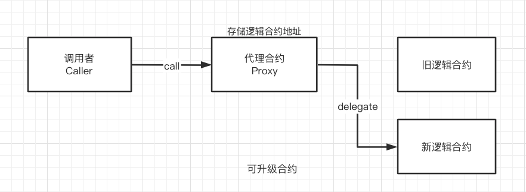
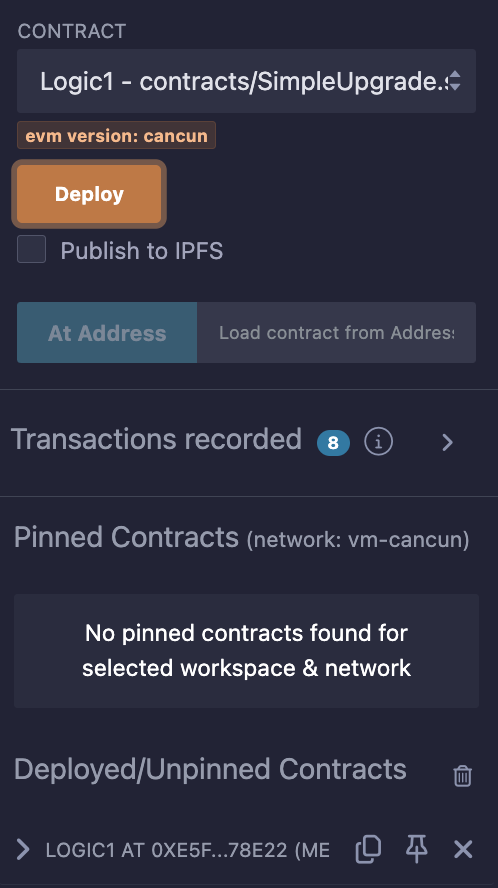
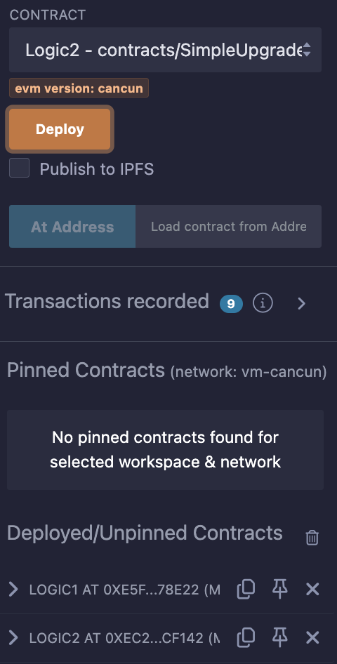
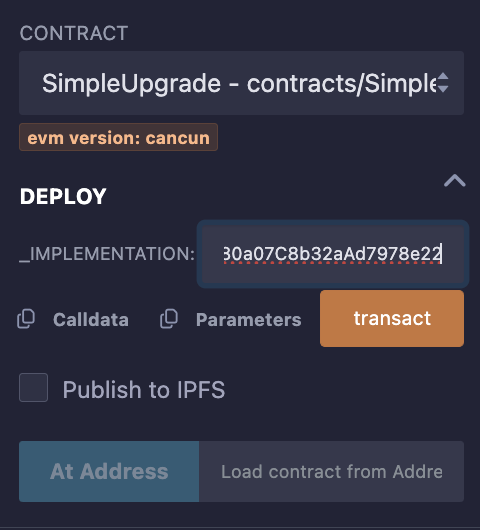
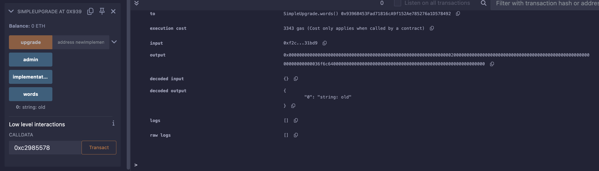
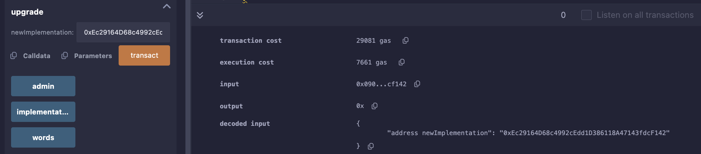
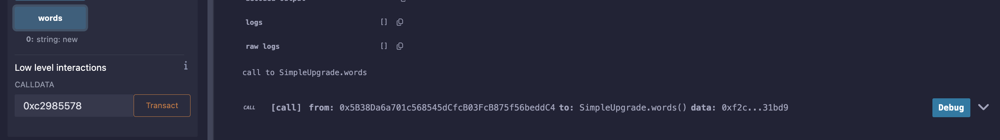

### 47. 代理合約

這一講，我們將介紹可升級合約（Upgradeable Contract）。



直接實作會是這樣
  - 舊邏輯合約
  - 新邏輯合約
  - 代理合約

#### 程式

  - 舊邏輯合約
    ```solidity
    contract Logic1 {
        // 状态变量和proxy合约一致，防止插槽冲突
        address public implementation; 
        address public admin; 
        string public words; // 字符串，可以通过逻辑合约的函数改变

        // 改变proxy中状态变量，选择器： 0xc2985578
        function foo() public{
            words = "old";
        }
    }
    ```
  - 新邏輯合約
    ```solidity
    contract Logic2 {
        // 状态变量和proxy合约一致，防止插槽冲突
        address public implementation; 
        address public admin; 
        string public words; // 字符串，可以通过逻辑合约的函数改变

        // 改变proxy中状态变量，选择器：0xc2985578
        function foo() public{
            words = "new";
        }
    }
    ```
  - 升級合約
    ```
    contract SimpleUpgrade {
        address public implementation; // 逻辑合约地址
        address public admin; // admin地址
        string public words; // 字符串，可以通过逻辑合约的函数改变

        // 构造函数，初始化admin和逻辑合约地址
        constructor(address _implementation){
            admin = msg.sender;
            implementation = _implementation;
        }

        // fallback函数，将调用委托给逻辑合约
        fallback() external payable {
            (bool success, bytes memory data) = implementation.delegatecall(msg.data);
        }

        // 升级函数，改变逻辑合约地址，只能由admin调用
        function upgrade(address newImplementation) external {
            require(msg.sender == admin);
            implementation = newImplementation;
        }
    }
      ```
實作：

  1.部署 logic1, logic2 合約

    
    

  2. 部署 SimpleUpgrade 合約，並設定 logic1 合約地址

    

  3. 執行 選擇器 0xc2985578 ，其實就是 foo() 函數（但不能這樣傳遞，所以要用選擇器），並且看一下 words 的值 `old`

    

  4. 升級合約，將 logic2 合約地址設定到 SimpleUpgrade 合約中

    

  5. 再次執行 選擇器 0xc2985578 ，並且看一下 words 的值 `new`

      

總結：
```
 address public implementation; // 逻辑合约地址
    address public admin; // admin地址
    string public words; // 字符串，可以通过逻辑合约的函数改变
```

這幾個變數不管是代理合約或者邏輯都要一樣的命名不要不一樣
