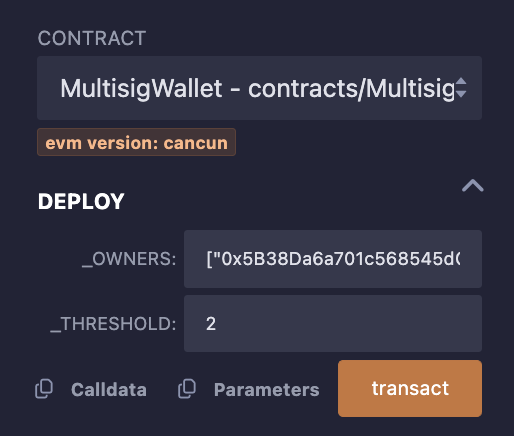
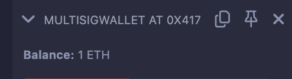
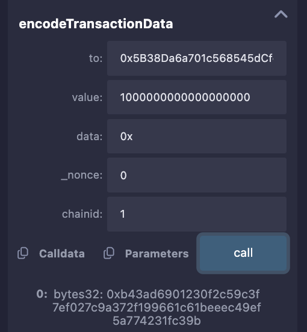
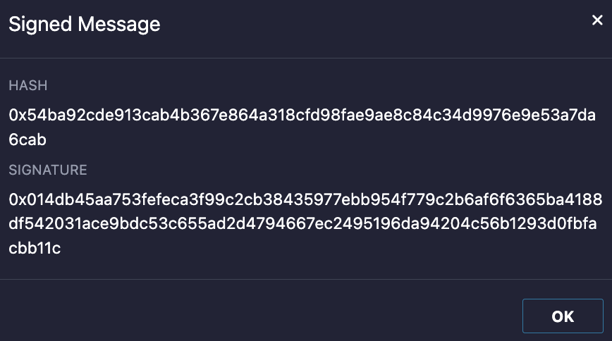
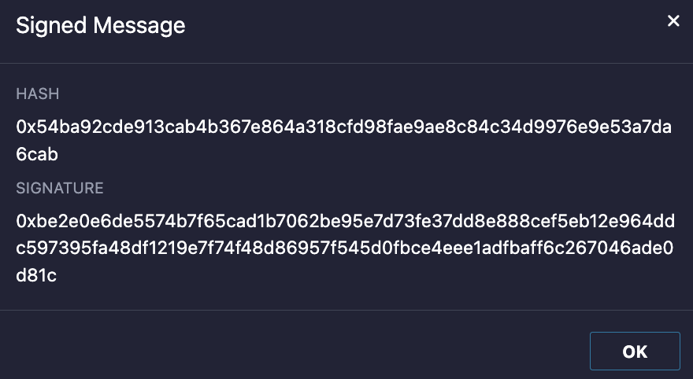
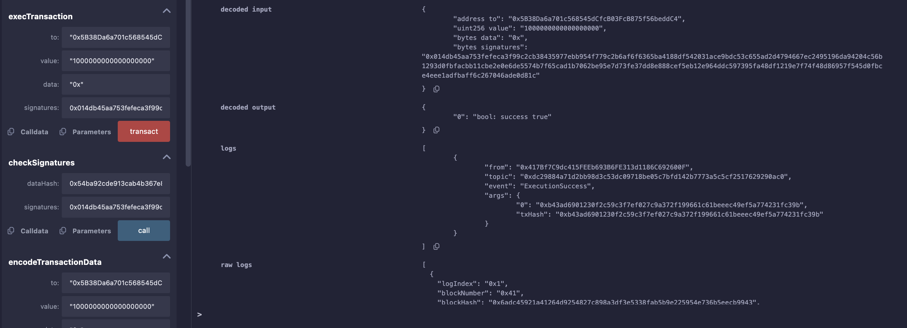

### 50. 多簽錢包

多簽錢包是一種電子錢包，特點是交易被多個私鑰持有者（多簽人）授權後才能執行。

EX:錢包由 3 個多簽人管理，每筆交易需要至少2人簽名授權。

多簽錢包可以防止單點故障（私鑰遺失，單人作惡），更加去中心化，更加安全，被許多DAO採用。

Gnosis Safe多簽錢包是以太坊最受歡迎的多簽錢包

#### 多簽錢包合約

在以太坊上的多簽錢包其實是智能合約，屬於合約錢包。

實作極簡版多簽錢包合約 MultisigWallet


1. 設定多簽人和門檻（鏈上）：部署多簽合約時，我們需要初始化`多簽人清單`和`執行門檻`（至少n個多簽人簽名授權後，交易才能執行）。

2. 創建交易（鏈下）：一筆待授權的交易包含以下內容

  - to：目標合約。
  - value：交易發送的以太坊數量。
  - data：calldata，包含呼叫函數的選擇器和參數。
  - nonce：初始為0，隨著多簽合約每筆成功執行的交易遞增的值，可以防止簽章重播攻擊。
  - chainid：鏈id，防止不同鏈的簽章重播攻擊。

3. 收集多簽簽（鏈下）：將上一步驟的交易ABI編碼併計算哈希，得到交易哈希，然後讓多簽人簽名，並拼接到一起的到打包簽名。

Ex:
```
交易哈希: 0xc1b055cf8e78338db21407b425114a2e258b0318879327945b661bfdea570e66

多签人A签名: 0x014db45aa753fefeca3f99c2cb38435977ebb954f779c2b6af6f6365ba4188df542031ace9bdc53c655ad2d4794667ec2495196da94204c56b1293d0fbfacbb11c

多签人B签名: 0xbe2e0e6de5574b7f65cad1b7062be95e7d73fe37dd8e888cef5eb12e964ddc597395fa48df1219e7f74f48d86957f545d0fbce4eee1adfbaff6c267046ade0d81c

打包签名：
0x014db45aa753fefeca3f99c2cb38435977ebb954f779c2b6af6f6365ba4188df542031ace9bdc53c655ad2d4794667ec2495196da94204c56b1293d0fbfacbb11cbe2e0e6de5574b7f65cad1b7062be95e7d73fe37dd8e888cef5eb12e964ddc597395fa48df1219e7f74f48d86957f545d0fbce4eee1adfbaff6c267046ade0d81c
```


4. 呼叫多簽合約的執行函數，驗證簽名並執行交易（鏈上）。

#### - 事件

```
    event ExecutionSuccess(bytes32 txHash);    // 交易成功事件
    event ExecutionFailure(bytes32 txHash);    // 交易失败事件
```

#### - 狀態變數

1. `owners`：多簽持有人數組
2. `isOwner`：address => bool的映射，記錄一個地址是否為多簽持有人。
3. `ownerCount`：多簽持有人數量
4. `threshold`：多簽執行門檻，交易至少有n個多簽人簽名才能被執行。
5. `nonce`：初始為0，隨著多簽合約每筆成功執行的交易遞增的值，可以防止簽章重播攻擊。

```solidity
    address[] public owners;                   // 多签持有人数组 
    mapping(address => bool) public isOwner;   // 记录一个地址是否为多签持有人
    uint256 public ownerCount;                 // 多签持有人数量
    uint256 public threshold;                  // 多签执行门槛，交易至少有n个多签人签名才能被执行。
    uint256 public nonce;                      // nonce，防止签名重放攻击
```

#### - 函數

1. 建構函數：調用_setupOwners()，初始化和`多簽持有人`和`執行門檻`相關的變數。

```solidity
// 构造函数，初始化 `owners, isOwner, ownerCount, threshold`
constructor(        
    address[] memory _owners,
    uint256 _threshold
) {
    _setupOwners(_owners, _threshold);
}
```

2. `_setupOwners()`：在合約部署時被構造函數調用，初始化`owners，isOwner，ownerCount，threshold`狀態變數。
傳入的參數中，執行門檻需`大於等於1且小於等於多簽人數`；
多簽地址不能為0地址且不能重複。

```solidity
/// @dev 初始化owners, isOwner, ownerCount,threshold 
/// @param _owners: 多签持有人数组
/// @param _threshold: 多签执行门槛，至少有几个多签人签署了交易
function _setupOwners(address[] memory _owners, uint256 _threshold) internal {
    // threshold没被初始化过
    require(threshold == 0, "WTF5000");
    // 多签执行门槛 小于 多签人数
    require(_threshold <= _owners.length, "WTF5001");
    // 多签执行门槛至少为1
    require(_threshold >= 1, "WTF5002");

    for (uint256 i = 0; i < _owners.length; i++) {
        address owner = _owners[i];
        // 多签人不能为0地址，本合约地址，不能重复
        require(owner != address(0) && owner != address(this) && !isOwner[owner], "WTF5003");
        owners.push(owner);
        isOwner[owner] = true;
    }
    ownerCount = _owners.length;
    threshold = _threshold;
}
```

3. `execTransaction()`：在收集足夠的多簽簽名後，驗證簽名並執行交易。

    傳入的參數為目標位址to，發送的以太坊金額value，數據data，以及打包簽名signatures。

    打包簽名就是將收集的多簽人對交易哈希的簽名，按多簽持有人地址從小到大順序，打包到一個[bytes]資料中。

    這一步驟調用了`encodeTransactionData()`編碼交易，調用了`checkSignatures()` 檢驗簽名是否有效、數量是否達到執行門檻。

    ```solidity
    /// @dev 在收集足够的多签签名后，执行交易
    /// @param to 目标合约地址
    /// @param value msg.value，支付的以太坊
    /// @param data calldata
    /// @param signatures 打包的签名，对应的多签地址由小到达，方便检查。 ({bytes32 r}{bytes32 s}{uint8 v}) (第一个多签的签名, 第二个多签的签名 ... )
    function execTransaction(
        address to,
        uint256 value,
        bytes memory data,
        bytes memory signatures
    ) public payable virtual returns (bool success) {
        // 编码交易数据，计算哈希
        bytes32 txHash = encodeTransactionData(to, value, data, nonce, block.chainid);
        nonce++;  // 增加nonce
        checkSignatures(txHash, signatures); // 检查签名
        // 利用call执行交易，并获取交易结果
        (success, ) = to.call{value: value}(data);
        require(success , "WTF5004");
        if (success) emit ExecutionSuccess(txHash);
        else emit ExecutionFailure(txHash);
    }
    ```
4. `checkSignatures()`：檢查簽章和交易資料的雜湊是否對應，數量是否達到門檻，若否，交易會`revert`。單一簽名長度為65字節，因此打包簽名的長度要長於threshold * 65。呼叫了`signatureSplit()`分離出單一簽名。這個函數的大致思路：

    - 用ecdsa取得簽名地址.
    - 利用currentOwner > lastOwner確定簽章來自不同多簽（多簽位址遞增）。
    - 利用isOwner[currentOwner]確定簽名者為多簽持有人。

    ```solidity
    /**
    * @dev 检查签名和交易数据是否对应。如果是无效签名，交易会revert
    * @param dataHash 交易数据哈希
    * @param signatures 几个多签签名打包在一起
    */
    function checkSignatures(
        bytes32 dataHash,
        bytes memory signatures
    ) public view {
        // 读取多签执行门槛
        uint256 _threshold = threshold;
        require(_threshold > 0, "WTF5005");

        // 检查签名长度足够长
        require(signatures.length >= _threshold * 65, "WTF5006");

        // 通过一个循环，检查收集的签名是否有效
        // 大概思路：
        // 1. 用ecdsa先验证签名是否有效
        // 2. 利用 currentOwner > lastOwner 确定签名来自不同多签（多签地址递增）
        // 3. 利用 isOwner[currentOwner] 确定签名者为多签持有人
        address lastOwner = address(0); 
        address currentOwner;
        uint8 v;
        bytes32 r;
        bytes32 s;
        uint256 i;
        for (i = 0; i < _threshold; i++) {
            (v, r, s) = signatureSplit(signatures, i);
            // 利用ecrecover检查签名是否有效
            currentOwner = ecrecover(keccak256(abi.encodePacked("\x19Ethereum Signed Message:\n32", dataHash)), v, r, s);
            require(currentOwner > lastOwner && isOwner[currentOwner], "WTF5007");
            lastOwner = currentOwner;
        }
    }
    ```

5. `signatureSplit()`：將單一簽章從打包的簽章分離出來，參數分別為打包簽章signatures和要讀取的簽章位置pos。利用了內聯彙編，將簽名的r，s，和v三個值分開出來。

    ```solidity
        /// 将单个签名从打包的签名分离出来
    /// @param signatures 打包签名
    /// @param pos 要读取的多签index.
    function signatureSplit(bytes memory signatures, uint256 pos)
        internal
        pure
        returns (
            uint8 v,
            bytes32 r,
            bytes32 s
        )
    {
        // 签名的格式：{bytes32 r}{bytes32 s}{uint8 v}
        assembly {
            let signaturePos := mul(0x41, pos)
            r := mload(add(signatures, add(signaturePos, 0x20)))
            s := mload(add(signatures, add(signaturePos, 0x40)))
            v := and(mload(add(signatures, add(signaturePos, 0x41))), 0xff)
        }
    }
    ```

6. `encodeTransactionData()`：將交易資料打包併計算哈希，利用了`abi.encode()`和`keccak256()`函數。這個函數可以計算出一個交易的哈希，然後在鏈下讓多簽人簽署並收集，再呼叫`execTransaction()`函數執行。

    ```solidity
    /// @dev 编码交易数据
    /// @param to 目标合约地址
    /// @param value msg.value，支付的以太坊
    /// @param data calldata
    /// @param _nonce 交易的nonce.
    /// @param chainid 链id
    /// @return 交易哈希bytes.
    function encodeTransactionData(
        address to,
        uint256 value,
        bytes memory data,
        uint256 _nonce,
        uint256 chainid
    ) public pure returns (bytes32) {
        bytes32 safeTxHash =
            keccak256(
                abi.encode(
                    to,
                    value,
                    keccak256(data),
                    _nonce,
                    chainid
                )
            );
        return safeTxHash;
    }
    ```
練習：

1. 部署合約，設定多簽人和門檻。

    多簽人：
    
      0x5B38Da6a701c568545dCfcB03FcB875f56beddC4, 0xAb8483F64d9C6d1EcF9b849Ae677dD3315835cb2

    門檻設定 =2

    

2. 轉帳到合約 1 ETH，並執行交易。

    

3.調用`encodeTransactionData()`，編碼併計算向多簽地址1轉帳1 ETH的交易哈希。

```
参数
to: 0x5B38Da6a701c568545dCfcB03FcB875f56beddC4
value: 1000000000000000000
data: 0x
_nonce: 0
chainid: 1

结果
交易哈希： 0xb43ad6901230f2c59c3f7ef027c9a372f199661c61beeec49ef5a774231fc39b
```


4.利用Remix中ACCOUNT旁邊的筆記圖案的按鈕進行簽名，內容輸入上面的交易哈希，獲得簽名，兩個錢包都要簽。

    

    

    打包把上面留下第一個 0x 拿掉合併在一起
    ```
    0x014db45aa753fefeca3f99c2cb38435977ebb954f779c2b6af6f6365ba4188df542031ace9bdc53c655ad2d4794667ec2495196da94204c56b1293d0fbfacbb11cbe2e0e6de5574b7f65cad1b7062be95e7d73fe37dd8e888cef5eb12e964ddc597395fa48df1219e7f74f48d86957f545d0fbce4eee1adfbaff6c267046ade0d81c
    ```


5. 呼叫`execTransaction()`函數執行交易，將第3步驟中的交易參數和打包簽名作為參數傳入。可以看到交易執行成功，ETH被轉出多簽。


    

總結：
    多個帳號使用簽章，利用個人的私鑰做出簽名，然後再利用交易的內容和簽章做出交易
    然後 2 個帳號都簽名後，就可以執行交易。很佩服能想到這樣的方式。但多簽大致都會三個因為兩個的話，一個人就可以。