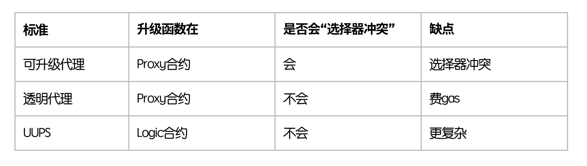
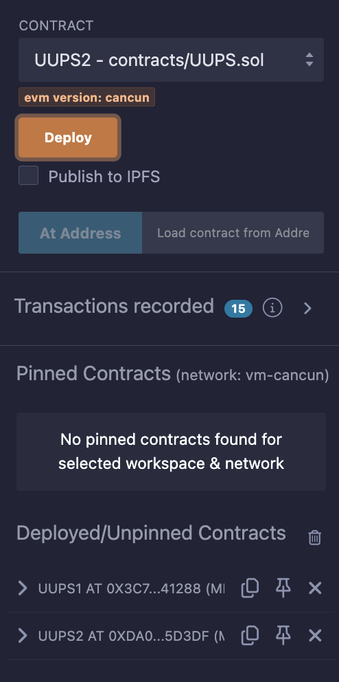
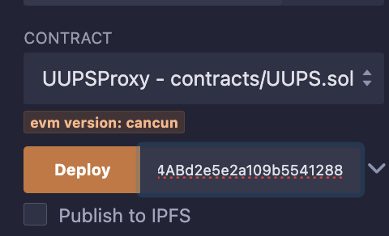
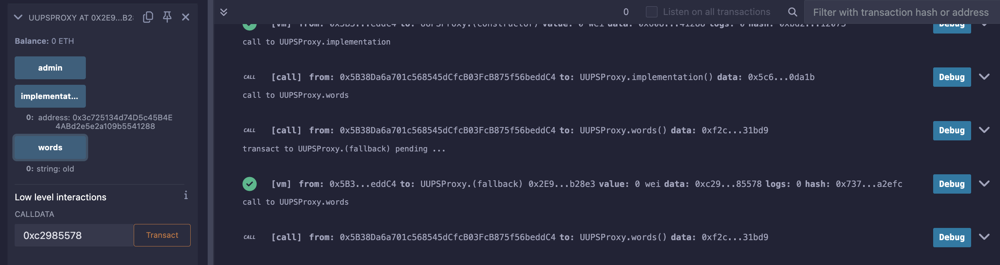
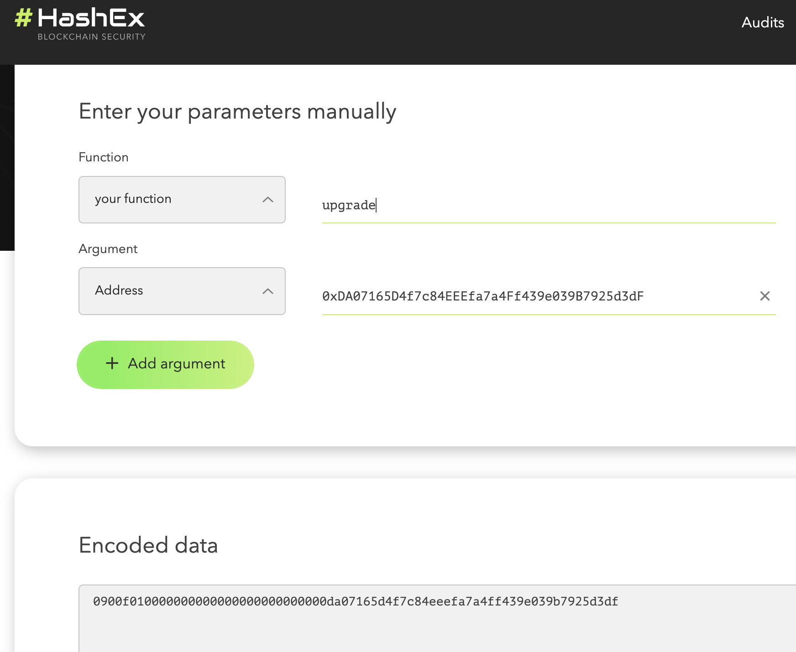
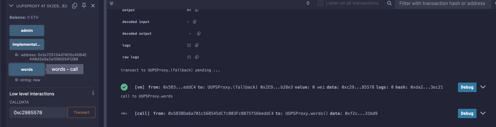

### 49. 通用可升級代理

這是另一個解決選擇器衝突的方法

`UUPS（universal upgradeable proxy standard，通用可升級代理）`將升級函數放在邏輯合約中。這樣一來，如果有其它函數與升級函數存在“選擇器衝突”，編譯時就會報錯。

統計：




#### UUPS的代理合約

基本上就是把升級合約放到邏輯的合約裡

```solidity
contract UUPSProxy {
    address public implementation; // 逻辑合约地址
    address public admin; // admin地址
    string public words; // 字符串，可以通过逻辑合约的函数改变

    // 构造函数，初始化admin和逻辑合约地址
    constructor(address _implementation){
        admin = msg.sender;
        implementation = _implementation;
    }

    // fallback函数，将调用委托给逻辑合约
    fallback() external payable {
        (bool success, bytes memory data) = implementation.delegatecall(msg.data);
    }
}
```

#### UUPS 邏輯合約

```solidity
// UUPS逻辑合约（升级函数写在逻辑合约内）
contract UUPS1{
    // 状态变量和proxy合约一致，防止插槽冲突
    address public implementation; 
    address public admin; 
    string public words; // 字符串，可以通过逻辑合约的函数改变

    // 改变proxy中状态变量，选择器： 0xc2985578
    function foo() public{
        words = "old";
    }

    // 升级函数，改变逻辑合约地址，只能由admin调用。选择器：0x0900f010
    // UUPS中，逻辑合约中必须包含升级函数，不然就不能再升级了。
    function upgrade(address newImplementation) external {
        require(msg.sender == admin);
        implementation = newImplementation;
    }
}

// 新的UUPS逻辑合约
contract UUPS2{
    // 状态变量和proxy合约一致，防止插槽冲突
    address public implementation; 
    address public admin; 
    string public words; // 字符串，可以通过逻辑合约的函数改变

    // 改变proxy中状态变量，选择器： 0xc2985578
    function foo() public{
        words = "new";
    }

    // 升级函数，改变逻辑合约地址，只能由admin调用。选择器：0x0900f010
    // UUPS中，逻辑合约中必须包含升级函数，不然就不能再升级了。
    function upgrade(address newImplementation) external {
        require(msg.sender == admin);
        implementation = newImplementation;
    }
}
```

#### 操作

1. 部署UUPS新舊邏輯合約UUPS1和UUPS2。



2. 部署 proxy 指定 UUPS1



3. 透過 proxy 呼叫 UUPS1 的 foo 函數，使用低代碼呼叫 `0xc2985578`。



4. 使用 proxy 升級到 UUPS2。 透過 HashEx 來轉換傳輸代碼




5. 再次透過 proxy 呼叫 UUPS2 的 foo 函數，使用低代碼呼叫 `0xc2985578`。

