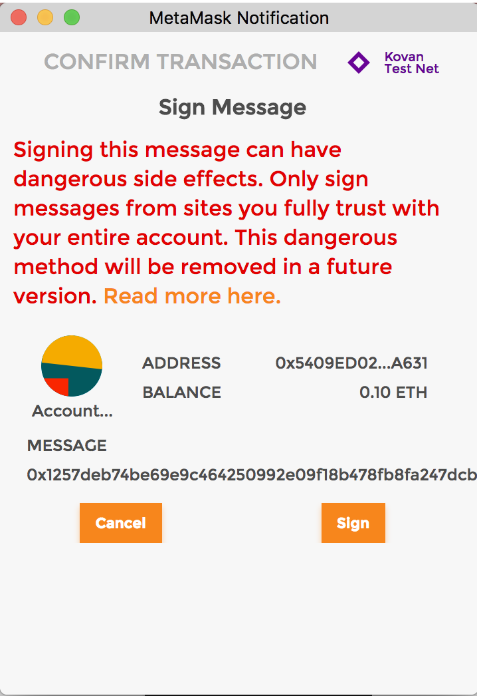
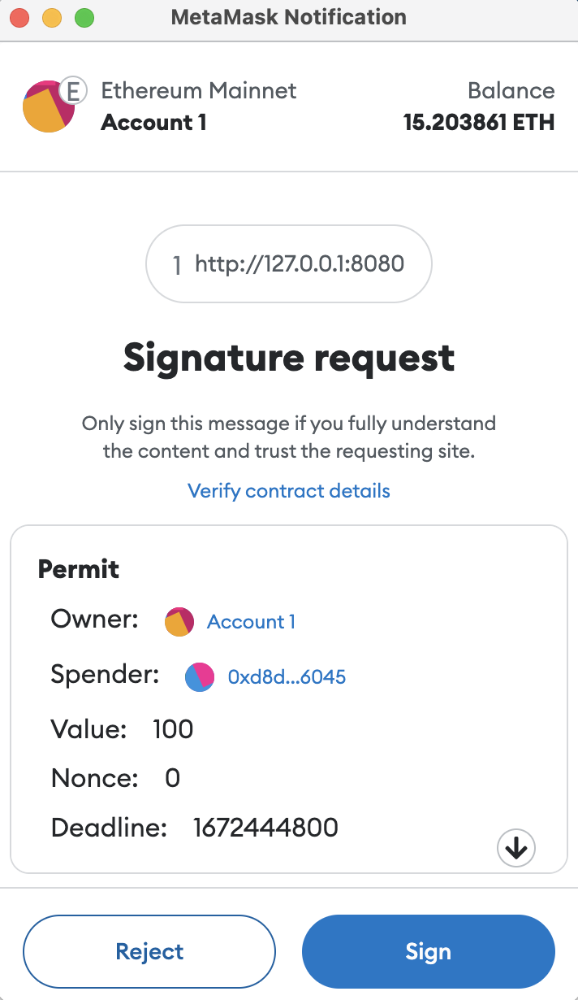

### 52. EIP712 類型化資料簽名

前個章節學會的簽章大概會是這樣子



這個章節的安全增強的簽章會是



當支援EIP712 的Dapp 請求簽署時，錢包會顯示簽署訊息的原始數據，用戶可以在驗證數據符合預期之後簽署。

#### EIP712 使用方法

`EIP712` 的應用一般包含鏈下簽章（前端或腳本）和鏈上驗證（合約）兩部分，

以下我們用一個簡單的例子`EIP712Storage`來介紹`EIP712` 的使用方法。

`EIP712Storage合約`有一個狀態變量`number`，需要驗證`EIP712` 簽名才可以更改。

#### 鏈下簽名

1. `EIP712` 簽名必須包含一個`EIP712Domain`部分，它包含了合約的`name，version`（一般約定為「1」），`chainId`，和`verifyingContract`（驗證簽名的合約位址）。

```solidity
EIP712Domain: [
    { name: "name", type: "string" },
    { name: "version", type: "string" },
    { name: "chainId", type: "uint256" },
    { name: "verifyingContract", type: "address" },
]
```

這些資訊會在使用者簽名時顯示，並確保只有特定鏈的特定合約才能驗證簽名。你需要在腳本中傳入對應參數。

```
const domain = {
    name: "EIP712Storage",
    version: "1",
    chainId: "1",
    verifyingContract: "0xf8e81D47203A594245E36C48e151709F0C19fBe8",
};
```

2. 你需要根據使用場景自訂一個簽署的資料類型，他要與合約相符。
在`EIP712Storage`例子中，我們定義了一個`Storage`類型，它有兩個成員:`address`類型的`spender`，指定了可以修改變數的呼叫者；uint256類型的number，指定了變數修改後的值。

```solidity
const types = {
    Storage: [
        { name: "spender", type: "address" },
        { name: "number", type: "uint256" },
    ],
};
```
3. 建立一個message變量，傳入要被簽署的類型化資料。
```
const message = {
    spender: "0x5B38Da6a701c568545dCfcB03FcB875f56beddC4",
    number: "100",
};
```

4. 呼叫錢包物件的signTypedData()方法，傳入前面步驟中的domain，types，和message變數進行簽名（這裡使用ethersjs v6）。

```javascript
// 获得provider
const provider = new ethers.BrowserProvider(window.ethereum)
// 获得signer后调用signTypedData方法进行eip712签名
const signature = await signer.signTypedData(domain, types, message);
console.log("Signature:", signature);
```


#### 鏈上驗證

```solidity

// SPDX-License-Identifier: MIT
// By 0xAA 
pragma solidity ^0.8.0;

import "@openzeppelin/contracts/utils/cryptography/ECDSA.sol";

contract EIP712Storage {
    using ECDSA for bytes32;

    bytes32 private constant EIP712DOMAIN_TYPEHASH = keccak256("EIP712Domain(string name,string version,uint256 chainId,address verifyingContract)");
    bytes32 private constant STORAGE_TYPEHASH = keccak256("Storage(address spender,uint256 number)");
    bytes32 private DOMAIN_SEPARATOR;
    uint256 number;
    address owner;

    constructor(){
        DOMAIN_SEPARATOR = keccak256(abi.encode(
            EIP712DOMAIN_TYPEHASH, // type hash
            keccak256(bytes("EIP712Storage")), // name
            keccak256(bytes("1")), // version
            block.chainid, // chain id
            address(this) // contract address
        ));
        owner = msg.sender;
    }

    /**
     * @dev Store value in variable
     */
    function permitStore(uint256 _num, bytes memory _signature) public {
        // 检查签名长度，65是标准r,s,v签名的长度
        require(_signature.length == 65, "invalid signature length");
        bytes32 r;
        bytes32 s;
        uint8 v;
        // 目前只能用assembly (内联汇编)来从签名中获得r,s,v的值
        assembly {
            /*
            前32 bytes存储签名的长度 (动态数组存储规则)
            add(sig, 32) = sig的指针 + 32
            等效为略过signature的前32 bytes
            mload(p) 载入从内存地址p起始的接下来32 bytes数据
            */
            // 读取长度数据后的32 bytes
            r := mload(add(_signature, 0x20))
            // 读取之后的32 bytes
            s := mload(add(_signature, 0x40))
            // 读取最后一个byte
            v := byte(0, mload(add(_signature, 0x60)))
        }

        // 获取签名消息hash
        bytes32 digest = keccak256(abi.encodePacked(
            "\x19\x01",
            DOMAIN_SEPARATOR,
            keccak256(abi.encode(STORAGE_TYPEHASH, msg.sender, _num))
        )); 
        
        address signer = digest.recover(v, r, s); // 恢复签名者
        require(signer == owner, "EIP712Storage: Invalid signature"); // 检查签名

        // 修改状态变量
        number = _num;
    }

    /**
     * @dev Return value 
     * @return value of 'number'
     */
    function retrieve() public view returns (uint256){
        return number;
    }    
}
```

這方法很巧妙：
```
bytes32 private constant EIP712DOMAIN_TYPEHASH = keccak256("EIP712Domain(string name,string version,uint256 chainId,address verifyingContract)");
    bytes32 private constant STORAGE_TYPEHASH = keccak256("Storage(address spender,uint256 number)");

```

鏈上鏈下利用資料來做核對。