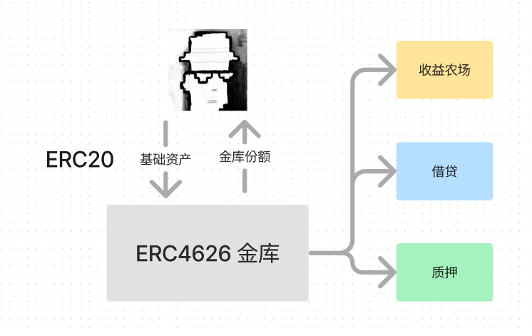
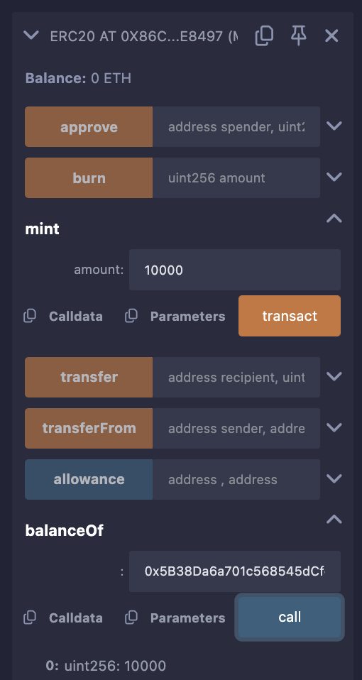
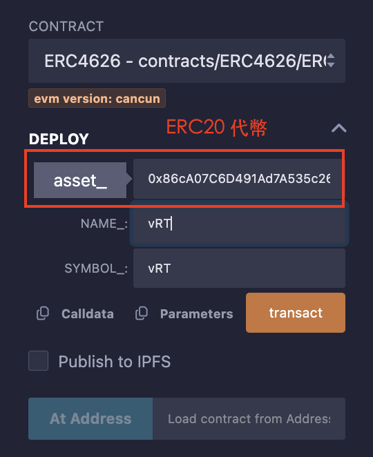
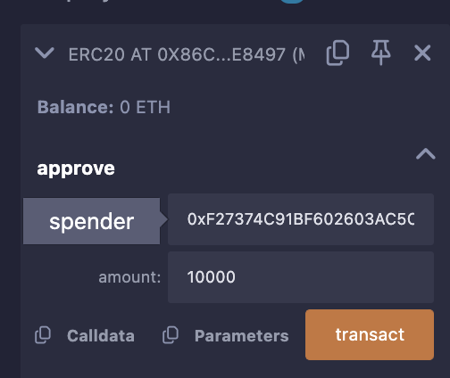
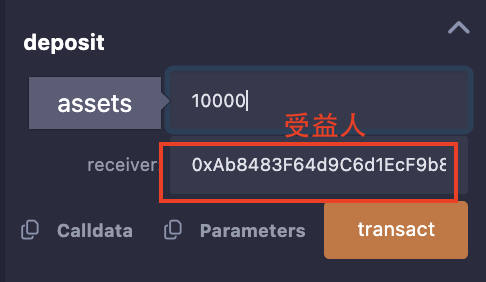
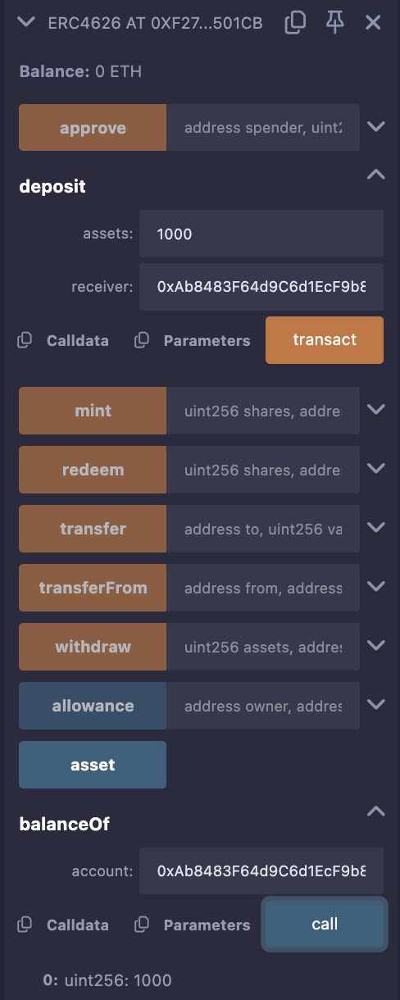
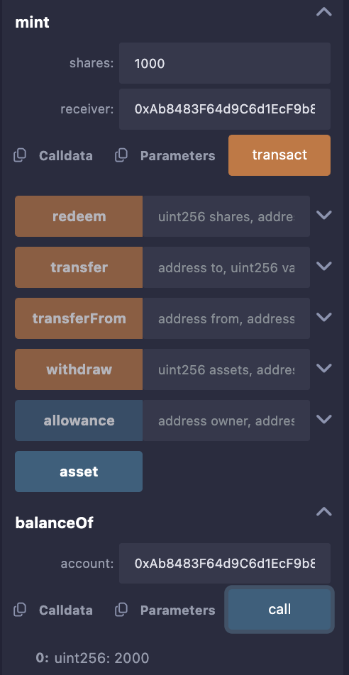
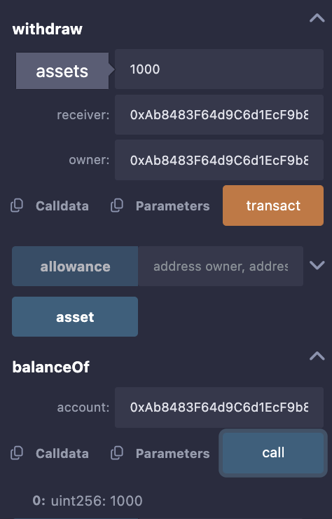
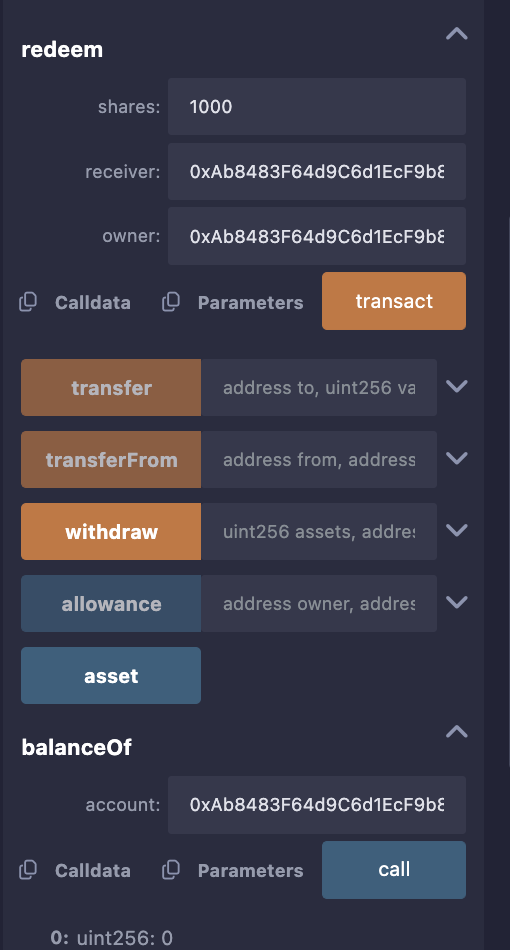

### 51. ERC4626 代幣化金庫標準

`ERC4626` 擴展了`ERC20` 代幣標準，旨在推動收益金庫的標準化

它允許你把基礎資產（代幣）質押到合約中，換取一定收益，包括以下應用場景:

- 收益農場: 在 `Yearn Finance` 中，你可以質押USDT取得利息。
- 借貸: 在AAVE 中，你可以出借ETH取得存款利息和貸款。
- 質押: 在Lido 中，你可以質押ETH參與ETH 2.0 質押，得到可以生息的stETH。

- ERC4626 代幣化金庫標準（Tokenized Vault Standard）橫空出世，讓DeFi 輕鬆擴充。它具有以下優點:

    - 代幣化: ERC4626 繼承了ERC20，向金庫存款時，將得到同樣符合ERC20 標準的金庫份額，例如質押ETH，自動獲得stETH。

    - 更好的流通性: 由於代幣化，你可以在不取回基礎資產的情況下，利用金庫份額做其他事情。拿Lido 的stETH 為例，你可以用它在Uniswap 上提供流動性或交易，而不需要取出其中的ETH。

    - 更好的可組合性: 有了標準之後，用一套介面可以和所有ERC4626 金庫交互，讓基於金庫的應用、插件、工具開發更容易。

#### ERC4626 設計重點：

`ERC4626` 標準主要實作了一下幾個邏輯：

- `ERC20`: ERC4626 繼承了ERC20，金庫份額是用ERC20 代幣代表的：用戶將特定的ERC20 基礎資產（例如WETH）存進金庫，合約會給他鑄造特定數量的金庫份額代幣；當用戶從金庫中提取基礎資產時，會銷毀相應數量的金庫份額代幣。asset()函數會傳回金庫的基礎資產的代幣地址。

- `存款邏輯`：讓使用者存入基礎資產，並鑄造相應數量的金庫份額。相關函數為`deposit()`和`mint()`。`deposit(uint assets, address receiver)`函數讓使用者存入`assets`單位的資產，並鑄造相應數量的金庫份額給`receiver地址。mint(uint shares, address receiver)`與它類似，只不過是以將鑄造的金庫份額作為參數。

- `提款邏輯`：讓使用者銷毀金庫份額，並提取金庫中相應數量的基礎資產。相關函數為`withdraw()`和`redeem()`，前者以取出基礎資產數量為參數，後者以銷毀的金庫份額為參數。

- `會計和限額邏輯`：ERC4626 標準中其他的函數是為了統計金庫中的資產，存款/提款限額，和存款/提款的基礎資產和金庫份額數量。

#### IERC4626 介面合約

`IERC4626` 介面合約共包含2個事件:

- Deposit事件: 存款時觸發。
- Withdraw事件: 提款時觸發。

`IERC4626` 介面合約也包含16個函數，依功能分為4大類：元數據，存款/提款邏輯，會計邏輯，和存款/提款限額邏輯。

- 元數據

    - `asset()`: 返回金庫的基礎資產代幣地址，用於存款，提款。

- 存款/提款邏輯

    - `deposit()`: 存款函數，使用者向金庫存入assets單位的基礎資產，然後合約鑄造shares單位的金庫額度給receiver地址。會釋放Deposit事件。

    - `mint()`: 鑄造函數（也是存款函數），使用者指定想取得的shares單位的金庫額度，函數經過計算後得出需要存入的`assets`單位的基礎資產數量，然後合約從使用者帳戶轉出`assets`單位的基礎資產，再給`receiver`地址鑄造指定數量的金庫額度。會釋放`Deposit`事件。

    - `withdraw()`: 提款函數，owner地址銷毀share單位的金庫額度，然後合約將相應數量的基礎資產發送給receiver地址。

    - `redeem()`: 贖回函數（也是提款函數），owner地址銷毀shares數量的金庫額度，然後合約將對應單位的基礎資產發給receiver地址

- 會計邏輯

    - `totalAssets()`: 傳回金庫中管理的基礎資產代幣總額。
    - `convertToShares()`: 回傳利用一定金額基礎資產可以換取的金庫額度。
    - `convertToAssets()`: 傳回利用一定金額金庫額度可以換取的基礎資產。
    - `previewDeposit()`: 用於使用者在當前鏈上環境模擬存款一定金額的基礎資產能夠獲得的金庫額度。
    - `previewMint()`: 用於使用者在當前鏈上環境模擬鑄造一定金額的金庫額度需要存款的基礎資產數量。
    - `previewWithdraw()`: 用於使用者在目前鏈上環境模擬提款一定金額的基礎資產需要贖回的金庫份額。
    - `previewRedeem()`: 用於鏈上和鏈下用戶在當前鏈上環境模擬銷毀一定數額的金庫額度能夠贖回的基礎資產數量。

- 存款/提款限額邏輯

    - `maxDeposit()`: 傳回某個用戶地址單次存款可存的最大基礎資產金額。
    - `maxMint()`: 返回某個使用者地址單次鑄造可以鑄造的最大金庫額度。
    - `maxWithdraw()`: 傳回某個使用者位址單次提款可以提取的最大基礎資產額度。
    - `maxRedeem()`: 傳回某個使用者地址單次贖回可以銷毀的最大金庫額度。

[IERC4626.sol 完整合約代碼](IERC4626.sol)

#### ERC4626 合約

下面，我們實現一個極簡版的代幣化金庫合約：

- 構造函數初始化基礎資產的合約地址，金庫份額的代幣名稱和符號。

  注意，金庫份額的代幣名稱和符號要和基礎資產有關聯，例如基礎資產叫WTF，金庫份額最好叫vWTF。

- 存款時，當使用者向金庫存x單位的基礎資產，會鑄造x單位（等量）的金庫份額。
- 提款時，當使用者銷毀x單位的金庫份額，會提取x單位（等量）的基礎資產。

- 實作

1. 部署ERC20代幣合約，將代幣名稱和符號均設為WTF，並為自己鑄造10000代幣。

2. 部署ERC4626代幣合約，將基礎資產的合約地址設為 rorytoken 的地址，名稱和符號均設為vRT。

3. 呼叫ERC20合約的approve()函數，將代幣授權給ERC4626合約。

4. 呼叫ERC4626合約的deposit()函數，存款1000枚代幣。然後呼叫balanceOf()函數，查看自己的金庫份額變成1000。

5. 呼叫ERC4626合約的mint()函數，存款1000枚代幣。然後呼叫balanceOf()函數查看自己的金庫份額變成2000。

6. 呼叫ERC4626合約的withdraw()函數，取款1000枚代幣。然後呼叫balanceOf()函數查看自己的金庫份額變成1000。

7. 呼叫ERC4626合約的redeem()函數，取款1000枚代幣。然後呼叫balanceOf()函數查看自己的金庫份額變成0。

