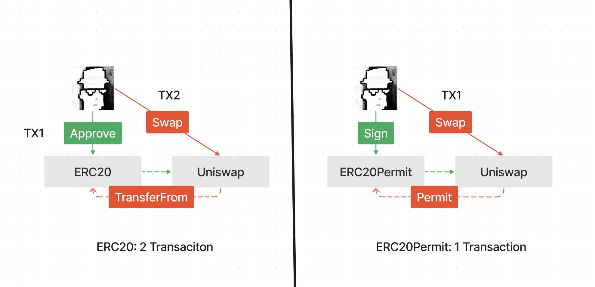

### 53. ERC-2612 ERC20Permit

ERC20Permit，支援使用簽章進行授權，改善使用者體驗。它在EIP-2612 中被提出，已納入以太坊標準，並被USDC，ARB等代幣使用。

ERC20，以太坊最受歡迎的代幣標準。
它流行的一個主要原因是`approve`和`transferFrom`兩個函數搭配使用，使得代幣不僅可以在外部擁有帳戶（EOA）之間轉移，還可以被其他合約使用。

但是，ERC20的`approve`函數限制了只有代幣所有者才能調用，這意味著所有ERC20代幣的初始操作必須由EOA執行。

舉個例子，用戶A 在去中心化交易所使用USDT交換ETH，必須完成兩個交易：

- 第一步用戶A 呼叫approve將USDT授權給合約
- 第二步用戶A 呼叫合約進行交換。

非常麻煩，而且用戶必須持有ETH用於支付交易的gas。


`EIP-2612` 提出了`ERC20Permit`，擴展了`ERC20` 標準，增加了一個`permit`函數，讓使用者可以透過`EIP-712` 簽章修改授權，而不是透過`msg.sender`。這有兩點好處：

1. 授權此步驟僅需用戶在鏈下簽名，減少一筆交易。
2. 簽署後，用戶可以委託第三方進行後續交易，不需要持有ETH：用戶A 可以將簽章傳送給擁有gas的第三方B，委託B 來執行後續交易。




### IERC20Permit 介面

首先，讓我們學習下ERC20Permit 的介面合約，它定義了3 個函數：

- `permit()`: 根據owner的簽名, 將owenr的ERC20代幣餘額授權給spender，數量為value。要求：

    - `spender`不能是零地址。
    - `deadline`必須是未來的時間戳記。
    - v，r和s必須是owner對EIP712 格式的函數參數的有效secp256k1簽章。
簽名必須使用owner當前的nonce

- `nonces()`: 返回owner的當前nonce。每次為permit()函數產生簽章時，都必須包含此值。每次成功呼叫permit()函數都會將owner的nonce 增加1，防止多次使用同一個簽章。

- DOMAIN_SEPARATOR(): 傳回用於編碼permit()函數的簽章的域分隔符號（domain separator），如EIP712所定義。

```solidity
// SPDX-License-Identifier: MIT
pragma solidity ^0.8.0;

/**
 * @dev ERC20 Permit 扩展的接口，允许通过签名进行批准，如 https://eips.ethereum.org/EIPS/eip-2612[EIP-2612]中定义。
 */
interface IERC20Permit {
    /**
     * @dev 根据owner的签名, 将 `owenr` 的ERC20余额授权给 `spender`，数量为 `value`
     */
    function permit(
        address owner,
        address spender,
        uint256 value,
        uint256 deadline,
        uint8 v,
        bytes32 r,
        bytes32 s
    ) external;

    /**
     * @dev 返回 `owner` 的当前 nonce。每次为 {permit} 生成签名时，都必须包括此值。
     */
    function nonces(address owner) external view returns (uint256);

    /**
     * @dev 返回用于编码 {permit} 的签名的域分隔符（domain separator）
     */
    // solhint-disable-next-line func-name-mixedcase
    function DOMAIN_SEPARATOR() external view returns (bytes32);
}
```

將擁有者的授權方式在有效的時間內授權給spender，而不是通過`msg.sender`，這樣可以提高用戶體驗，減少交易成本。

#### ERC20Permit 合約

下面，讓我們寫一個簡單的ERC20Permit 合約，它實作了IERC20Permit 定義的所有介面。合約包含2 個狀態變數:

- _nonces:address -> uint的映射，記錄了所有使用者目前的nonce 值，
- _PERMIT_TYPEHASH: 常數，記錄了permit()函數的型別雜湊。

- 合約包含5 個函數:

    - `構造函數`: 初始化代幣的name和symbol。
    - `permit()`: ERC20Permit 最核心的函數，實作了IERC20Permit 的permit()。它首先檢查簽章是否過期，然後用_PERMIT_TYPEHASH, owner, spender, value, nonce,deadline還原簽章訊息，並驗證簽章是否有效。如果簽章有效，則呼叫ERC20的_approve()函數進行授權操作。
    - `nonces()`: 實作了IERC20Permit 的nonces()函數。
DOMAIN_SEPARATOR(): 實作了IERC20Permit 的DOMAIN_SEPARATOR()函數。
    - `_useNonce()`: 消費nonce的函數，回傳用戶當前的nonce，並增加1。

```solidity
// SPDX-License-Identifier: MIT

pragma solidity ^0.8.0;

import "./IERC20Permit.sol";
import "@openzeppelin/contracts/token/ERC20/ERC20.sol";
import "@openzeppelin/contracts/utils/cryptography/ECDSA.sol";
import "@openzeppelin/contracts/utils/cryptography/EIP712.sol";

/**
 * @dev ERC20 Permit 扩展的接口，允许通过签名进行批准，如 https://eips.ethereum.org/EIPS/eip-2612[EIP-2612]中定义。
 *
 * 添加了 {permit} 方法，可以通过帐户签名的消息更改帐户的 ERC20 余额（参见 {IERC20-allowance}）。通过不依赖 {IERC20-approve}，代币持有者的帐户无需发送交易，因此完全不需要持有 Ether。
 */
contract ERC20Permit is ERC20, IERC20Permit, EIP712 {
    mapping(address => uint) private _nonces;

    bytes32 private constant _PERMIT_TYPEHASH =
        keccak256("Permit(address owner,address spender,uint256 value,uint256 nonce,uint256 deadline)");

    /**
     * @dev 初始化 EIP712 的 name 以及 ERC20 的 name 和 symbol
     */
    constructor(string memory name, string memory symbol) EIP712(name, "1") ERC20(name, symbol){}

    /**
     * @dev See {IERC20Permit-permit}.
     */
    function permit(
        address owner,
        address spender,
        uint256 value,
        uint256 deadline,
        uint8 v,
        bytes32 r,
        bytes32 s
    ) public virtual override {
        // 检查 deadline
        require(block.timestamp <= deadline, "ERC20Permit: expired deadline");

        // 拼接 Hash
        bytes32 structHash = keccak256(abi.encode(_PERMIT_TYPEHASH, owner, spender, value, _useNonce(owner), deadline));
        bytes32 hash = _hashTypedDataV4(structHash);
        
        // 从签名和消息计算 signer，并验证签名
        address signer = ECDSA.recover(hash, v, r, s);
        require(signer == owner, "ERC20Permit: invalid signature");
        
        // 授权
        _approve(owner, spender, value);
    }

    /**
     * @dev See {IERC20Permit-nonces}.
     */
    function nonces(address owner) public view virtual override returns (uint256) {
        return _nonces[owner];
    }

    /**
     * @dev See {IERC20Permit-DOMAIN_SEPARATOR}.
     */
    function DOMAIN_SEPARATOR() external view override returns (bytes32) {
        return _domainSeparatorV4();
    }

    /**
     * @dev "消费nonce": 返回 `owner` 当前的 `nonce`，并增加 1。
     */
    function _useNonce(address owner) internal virtual returns (uint256 current) {
        current = _nonces[owner];
        _nonces[owner] += 1;
    }
}
```

### 安全注意
這個方法其實挺危險的，因為如果有人拿到你的簽名，就可以隨意操作你的資產，所以在使用的時候要非常小心。


簽名時，一定要謹慎的閱讀簽名內容！

同時，有些合約在整合permit時，也會帶來DoS（拒絕服務）的風險。因為permit在執行時會用掉目前的nonce值，如果合約的函數中包含permit操作，則攻擊者可以透過搶跑執行permit從而使得目標交易因為nonce被佔用而回滾。