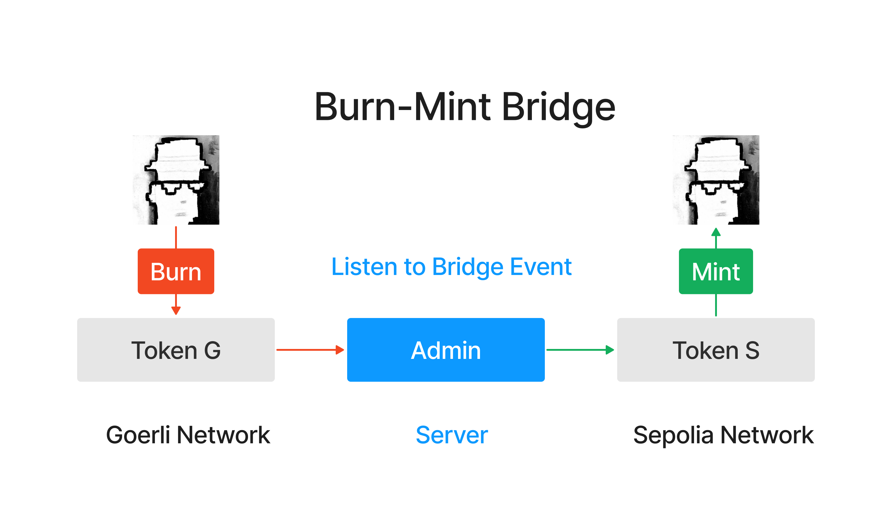
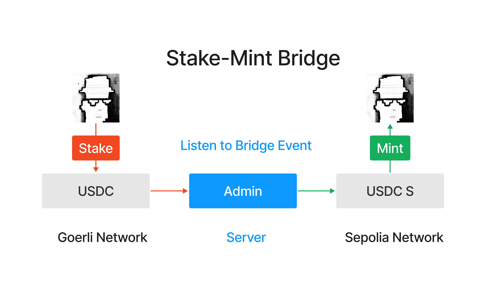
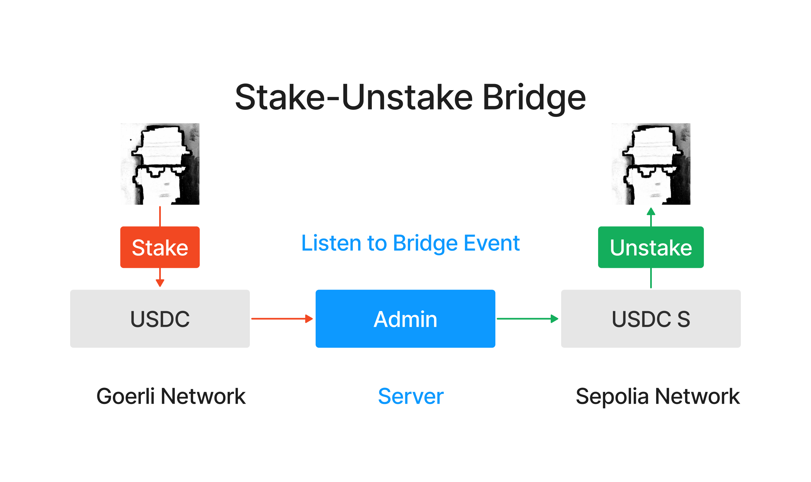

### 54. 跨鏈橋

介紹跨鏈橋，能將資產從一條區塊鏈轉移到另一條區塊鏈的基礎設施，並實現一個簡單的跨鏈橋。

1. 什麼是跨鏈橋？

跨鏈橋是一種區塊鏈協議，它允許在兩個或多個區塊鏈之間移動數位資產和資訊。例如，一個在以太坊主網上運行的ERC20代幣，可以透過跨鏈橋轉移到其他相容以太坊的側鍊或獨立鏈。

同時，跨鏈橋不是區塊鏈原生支援的，跨鏈操作需要可信任第三方來執行，這也帶來了風險。近兩年，針對跨鏈橋的攻擊已造成超過20億美元的用戶資產損失。

2. 跨鏈橋的總類：

大致分三種：

- Burn/Mint：在來源鏈上銷毀（burn）代幣，然後在目標鏈上建立（mint）同等數量的代幣。此方法好處是代幣的總供應量保持不變，但是需要跨鏈橋擁有代幣的鑄造權限，適合專案方搭建自己的跨鏈橋。



- Stake/Mint：在來源鏈上鎖定（stake）代幣，然後在目標鏈上建立（mint）同等數量的代幣（憑證）。源鏈上的代幣被鎖定，當代幣從目標鏈移回源鏈時再解鎖。這是一般跨鏈橋使用的方案，不需要任何權限，但是風險也較大，當源鏈的資產被駭客攻擊時，目標鏈上的憑證將變為空氣。



- Stake/Unstake：在源鏈上鎖定（stake）代幣，然後在目標鏈上釋放（unstake）同等數量的代幣，在目標鏈上的代幣可以隨時兌換回源鏈的代幣。這個方法需要跨鏈橋在兩條鏈上都有鎖定的代幣，門檻較高，一般需要激勵用戶在跨鏈橋鎖倉。



### 跨鏈代幣合約

```
// SPDX-License-Identifier: MIT
pragma solidity ^0.8.20;

import "@openzeppelin/contracts/token/ERC20/ERC20.sol";
import "@openzeppelin/contracts/access/Ownable.sol";

contract CrossChainToken is ERC20, Ownable {
    
    // Bridge event
    event Bridge(address indexed user, uint256 amount);
    // Mint event
    event Mint(address indexed to, uint256 amount);

    /**
     * @param name Token Name
     * @param symbol Token Symbol
     * @param totalSupply Token Supply
     */
    constructor(
        string memory name,
        string memory symbol,
        uint256 totalSupply
    ) payable ERC20(name, symbol) Ownable(msg.sender) {
        _mint(msg.sender, totalSupply);
    }

    /**
     * Bridge function
     * @param amount: burn amount of token on the current chain and mint on the other chain
     */
    function bridge(uint256 amount) public {
        _burn(msg.sender, amount);
        emit Bridge(msg.sender, amount);
    }

    /**
     * Mint function
     */
    function mint(address to, uint amount) external onlyOwner {
        _mint(to, amount);
        emit  Mint(to, amount);
    }
}
```

### 實作流程:

1. 在兩條鏈上(EVM) 系列的鏈例如測試的 Sepolia 和 holesky 鏈上部署上面的合約。

2. 然後再寫一個監聽服務，監聽 Sepolia 鏈上的合約事件，當有人觸發 Bridge 事件時，就在 holesky 鏈上的合約 mint 一個對應的數量。

程式碼如下：

```javascript
import { ethers } from "ethers";

// 初始化两条链的provider
const providerHolesky = new ethers.JsonRpcProvider("Holesky_Provider_URL");
const providerSepolia = new ethers.JsonRpcProvider("Sepolia_Provider_URL://eth-sepolia.g.alchemy.com/v2/RgxsjQdKTawszh80TpJ-14Y8tY7cx5W2");

// 初始化两条链的signer
// privateKey填管理者钱包的私钥
const privateKey = "Your_Key";
const walletHolesky = new ethers.Wallet(privateKey, providerHolesky);
const walletSepolia = new ethers.Wallet(privateKey, providerSepolia);

// 合约地址和ABI
const contractAddressHolesky = "0xa2950F56e2Ca63bCdbA422c8d8EF9fC19bcF20DD";
const contractAddressSepolia = "0xad20993E1709ed13790b321bbeb0752E50b8Ce69";

const abi = [
    "event Bridge(address indexed user, uint256 amount)",
    "function bridge(uint256 amount) public",
    "function mint(address to, uint amount) external",
];

// 初始化合约实例
const contractHolesky = new ethers.Contract(contractAddressHolesky, abi, walletHolesky);
const contractSepolia = new ethers.Contract(contractAddressSepolia, abi, walletSepolia);

const main = async () => {
    try{
        console.log(`开始监听跨链事件`)

        // 监听chain Sepolia的Bridge事件，然后在Holesky上执行mint操作，完成跨链
        contractSepolia.on("Bridge", async (user, amount) => {
            console.log(`Bridge event on Chain Sepolia: User ${user} burned ${amount} tokens`);

            // 在执行burn操作
            let tx = await contractHolesky.mint(user, amount);
            await tx.wait();

            console.log(`Minted ${amount} tokens to ${user} on Chain Holesky`);
        });

        // 监听chain Holesky的Bridge事件，然后在Sepolia上执行mint操作，完成跨链
        contractHolesky.on("Bridge", async (user, amount) => {
            console.log(`Bridge event on Chain Holesky: User ${user} burned ${amount} tokens`);

            // 在执行burn操作
            let tx = await contractSepolia.mint(user, amount);
            await tx.wait();

            console.log(`Minted ${amount} tokens to ${user} on Chain Sepolia`);
        });
    } catch(e) {
        console.log(e);
    } 
}

main();
```


意外的簡單，但這個只是一個簡單的跨鏈橋，實際上跨鏈橋的實現是非常複雜的，需要考慮到安全性、可靠性、效率等多方面的問題。還有很多跨鏈橋的方案，但幾乎很都被攻擊過，所以不要拿這個代碼去實作，這只是一個簡單的例子。
