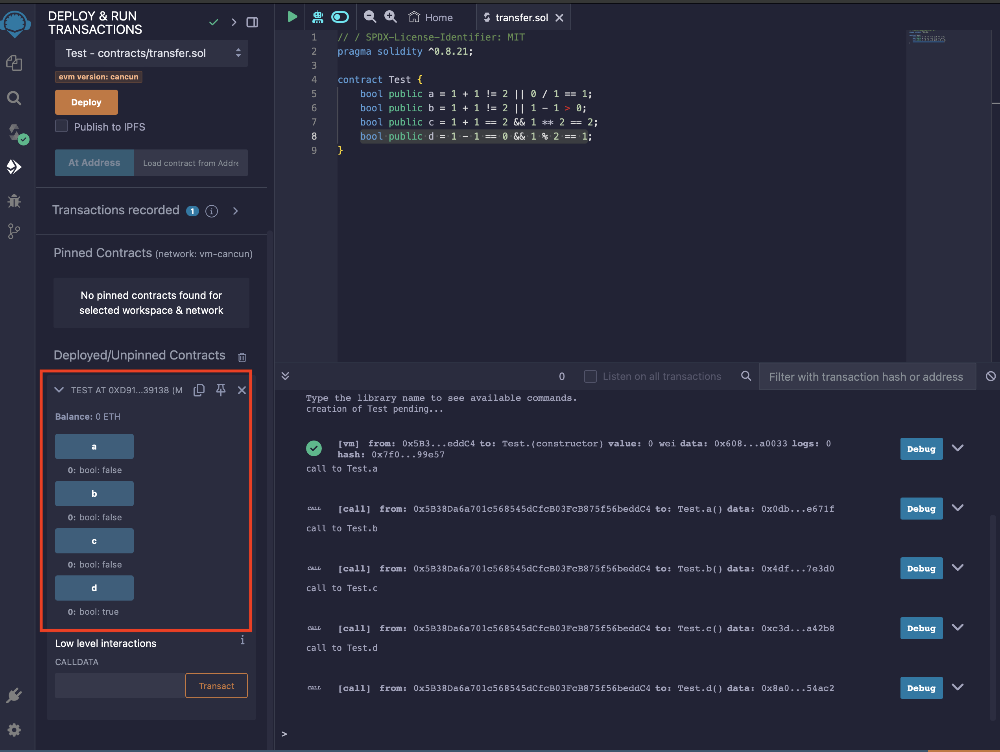

# WTF Solidity 極簡入門：2. 值類型

## 重點內容

> [!NOTE]
> 認識 solidity 中的變量類型以及值類型

## 隨筆

### 變量類型

1. **值類型（Value Type）** : 包含布爾型別、整數等，賦值直接傳值

2. **引用類型（Reference Type）** : 包含數組和結構體，佔空間大，賦值直接傳址

3. **映射類型（Mapping Type）** : 存儲件值對的數據結構，可以理解為哈希表

### 值類型

1. **布爾（bool）**
   > **注意** : && 和 || 運算符遵循短路規則

2. **整型** : int、uint、uint256 等

3. **地址類型**
   * 普通地址 : 存儲 單一個 20 字節的值
   * payable address

4. **字節數組**
   * 定長數組（值類型）：bytes1、bytes8、bytes32 等，最多存 32 bytes 數據（bytes32）
   * 不定長數組（引用類型）

5. **枚舉 enum** : 用於為 uint 分配名稱，使用名稱來代替從 0 開始的 uint

## 題目練習

1. **Q: 以下屬於 solidity 變量類型的是？**  
   **A:** 以上皆是

2. **Q: solidity中数值类型(Value Type)不包括？**  
   **A:** float

3. **Q: 请解释下面这段代码的意思？**

   ```solidity
      address payable addr;
      addr.transfer(1);
   ```

   **A:** 合約向 addr 轉帳 1 wei

> [!TIP]
> **參考後面章節**: [20. SendETH](https://www.wtf.academy/docs/solidity-102/SendETH/)

5. **Q: bytes4類型具有幾個 16 進制位？**  
   **A:** 8

> [!TIP]
> bytes4 是固定長度的字節數組，表示 4 個字節（4 bytes）。每個字節由 2 個 16 進制位組成，所以總共有 4（字節） x 2（16 進制位/字節） = 8 個 16 進制位。

6. **Q: 以下运算能使a返回true的是？**  
   **A:** bool a = 1 - 1 == 0 && 1 % 2 == 1

> [!TIP]
> 

<!--
 ___     ___     ____      ___      _     _     _
|_ _|   / _ \   | ___|    / _ \    | |   | |   | |
 | |   | | | |  |___ \   | | | |   | |   | |   | |
 | |   | |_| |   ___) |  | |_| |   |_|   |_|   |_|
|___|   \__\_\  |____/    \___/    (_)   (_)   (_)

::::::::::::::::::::::::::::::::::::::::::::::::::::::::::::::::::::::::::::::::::::::::::::::::::::::::::::::::::::::::::::
::::::::::::::::::::::::::::::::::::::::::::::::::::::::::::::::::::::::::::::::::::::::::::::::::::::::::::::::::::::::::::
:;;;::::::::::::::::::::::::::::::::::::::::::::::::::::::::::::::::::::::::::::::::::::::::::::::::::::::::::::::::::::::::
:;;;::::::::::::::::::::::::::::::::::::::::::::::::::::::::::::::::::::::::::::::::::::::::::::::::::::::::::::::::::::::::
::::::::::::::::::::::::::::::::::::::::::::::::::::::::::::::::::::::::::::::::::::::::::::::::::::::::::::::::::::::::::::
::::::::::;;::::::::::::::::::::::::::::::::::::::::::::::::::::::::::::::::::;:::::::::::::::::::::::::::::::::::::::::::::
:;;;:::::::::::::::::::::::::::::::::::::::::::::::::::::;::::::::::::::::::;;;;::::::::::::::::::::::::::::::::::::::::::::
::::::::::::::::::::::::::::::::::::::::::::::::::;,;;;;;,,;::::;::::;;;:::;',,,;,;;,,;:;:::;:::::::::::::::::::::::::::::::
::::::::::::::::::::::::::::::::::::::::::::::::;,;''..,';::,,,,::::;,''.'c,:ol';c:'.';;;::;::;:::::::::::::::::::::::::::::
::::::::::::::::::::::::::::::::::::::::::::;,,;;'.;lcdOdlOWKxc'.',;cdOOl0MXNMWXNMW0:::'.';;::::::::::::::::::::::::::::::::
::::::::::::::::::::::::::::::::::::::::::::;;,..:dONK0000KMMMMXOlcd0NWWWXMMMMMMMMMXKWWNx..,;:::::::::::::::::::::::::::::::
:::::::::::::::::::::::::::::::::::::::::::::,;x0K0KNMMMMMMMMMMMMMWKxxxxdkWMMMMMMMMMMMMMW0,'::::::::::::::::::::::::::::::::
:::::::::::::::::::::::::::::::::::::::::::;'cXMMMMMMMMMMMMMMMMMMMMMMMMMMMMMMMMMMMMMMMMMMMo.::::::::::::::::::::::::::::::::
::::::::::::::::::::::::::::::::::::::::::;'cXMMMMMMMMMMMMMMMMMMMMMMMMMMMMMMMMMMMMMMMMMMMMO.;;;:::::::::::::::::::::::::::::
::::::::::::::::::::::::::::::::::::::::::,;XMMMMMMMMMMMMMMMMMMMMMMMMMMMMMMMMMMMMMMMMMMMMMK';:::::::::::::::::::::::::::::::
:::::::::::::::::::::::::::::::::::::::::;.dMMMMMMMMMMMMMMMMMMMMMMMMMMMMMMMMMMMMMMMMMMMMMMW:.;::::::::::::::::::::::::::::::
:::::::::::::::::::::::::::::::::::::::;;.'XMMMMMMMMMMMMMMWNXXK0000OOOOKWMMMMMMMMMMMMMMMMMMK;.;:::::::::::::::::::::::::::::
:::::::::::::::::::::::::::::::::::::::;..OMMMMMMMMMX000000000000000K00OOOOO0000000000000O0WK''::::;::::::::::::::::::::::::
::::::::::::::::::::::::::::::::::;::;:,.kMMMMMMMMMMMMMMMMMMMMMMMMMMMMMMMMMWNXXXXXXXNNWWWXOXMo.,::::::::::::::::::::::::::::
::::::::::::::::::::::::::::::::::;:;:;.;WMMMMMMMMMMMMMMMMMMMWNKOkkOkkkO0NMMMMMMMMMMMMMMMMMMMk '::::::::::::::::::::::::::::
::::::::::::::::::::::::::::::::::::::'.xMMMMMMMMMMMMMMMWKkkkkkkOXWMMWX0kkkkO0000000KXNNNNWMMk '::::::::::::::::::::::::::::
::::::::::::::::::::::::::::::::::::::.:NMMMMMMMX0000OOO00XWMMMMMMMMMMMMMMMN000000000000000NMO.'::::::::::::::::::::::::::::
::::::::::::::::::::::::::::::::::;:;;,KMMMMMMMMMMMMMMMMMMMMMMMMMMMMMMMMMMMMMMMMMMMMMMMMMMMMMO.'::::::::::::::::::::::::::::
:::::::::::::::::::::::::::::::::::::'cMMMMMMMMMMMMMMMMMMMMMMMMMMMMMMMMMMMMMMMMMMMMMMMMMMMMMM0.'::::::::::::::::::::::::::::
::::::::::::::::::::;:::;:;:::::::::,,KMMMMMMMMMMMMMMMMMMMMMMMMMMMMMMMMMMMMMMMMMMMMMMMMMMMMMMX,'::::::::::::::::::::::::::::
::::::::::::::::::::;::::;;,''',;;;,:OMMMMMMMMMMMMMMMMMMMMMMMMMMMMMMMMMMMMMMMNoKMMMMMMMMMMMMMMx':::::::::;::::::::::::::::::
:::::::::::::::::::::::;.,:lxkkd:'.oWMMMMMMMMMMMMMMMMMMMMMMMMMMMMMMMMMMMMMMMMX,oWMMMMMMMMMMMMMN:;:;'.,,',:::::::::::::::::::
:::::::::::::::::::;:;',oKMMMMMMMN0NMMMMMMMMMMMMMMMMMMMMMMMMMMMMMMMMMMMMMMMMMWl.kMMMMMMMMMMMMMMl..'ckXXO;.,:::::::::::::::::
::::::::::::::::::::,.lNMMMWWWWWWMMMMMMWWMMMMMMMMMMMMMMMMMMMMMMMMMMMMMMMMMMMMMX:,KMMMMMMMMMMMMMXO0NMMMMMNx,';;::::::::::::::
::::::::::::::::::::.:NMWKooOx,..:ok0XWKxkNMMMMMMMMMMMMMMMMMMMMMMMMMMMMMMMMMMMMWOcckWMMMMMMMMKkWMMMMMMMMMMk.':::::::::::::::
::::::::::::::::::::.lMMMWxlXO.    ;.lKMWxkMMMMMMMMMMMMMMMMMMMMMMMMMMMMMMMMMMMMMMW0:,dWMMMMMMxcWMWXK0OO0WMNc.;::::::::::::::
::::::::::::::::::::.lWMMMW0do,''',ooKMMMWWMMMMMMMMMMMMMMMMMW0kxoxWMMMMMMMMMMMMMMMMWo.0MMMMMMxo0ook:   'KMMk';::::::::::::::
::::::::::::::::::::'.kWMMMMMMMMMMMMMMMMMMMMMMMMMMMMMMMMMMMMx'dxkKMMMMMMMMMMMMMMMMMO'cNMMMMMMWWXxOOd,.'oMMO'':::::::::::::::
:::::::::::::::::::::,'dXWMMMMMMMMMMMMMMMMMMMMMMMMMMMMMMMMMMk'0WMMMMMMWNNWMMMMMMMNd'oNMMMMMMMMMMMMMMMWNNkl',::::::::::::::::
::::::::::::::::::::::;''clxXMMMMMMMMMMMMMMMMMMMMMMMMMMMMMMMWl.cxOXMMWdcl0MMMW0OXk oMMMMMMMMMMMMMMMMN0d;.,;:::::::::::::::::
:::::::::::::::::::;::::;;,''d0NMMMMMMMMMMMMMMMMMMMMMMMMMMMMMWKxoo0MMMWMMMMMMNxc;,,0MMMMMMMMMMMMN0dc,'',;:::;;::::::::::::::
::::::::::::::::::::::::;:::,.'KMMMMMMMMMMMMMMMMMMMMMMMMMMMMMMMMMMMMMMMMMMMMMMMMWNWMMMMMMMMMMMNk;'';;:::::::::::::::::::::::
::::::::::::::::::::::::::;:, lMMMMMMMMMMMMMMMMMMMMMMMMMMMMMMMMXXWMMMMMMMMMMMMMWXOkdcxMMMMMMWk..;;::::::::::::::::::::::::::
::::::::::::::::::::::::;::;.;KMMMMMMMMMMMMMMMMMMMMMMMMMMMMMMMWo;::clodxdolcc::;;:cokXMMMMW0c.';::::::::::::::::::::::::::::
::::::::::::::::::::::::;;;',XMMMMMMMMMMMMMMMMMMMMMMMMMMMMMMMMMMWXkxdolllodkkO0XWMMMMMMMXOl.';::::::::::::::::::::::::::::::
:::::::::::::::::::::::::;:.lMMMMMMMMMMMMMMMMMMMMMMMMMMMMMMMMMMMMMMMMMMMMMMMMMMMMMMMW0l:,',;::;:::::::::::::::::::::::::::::
:::::::::::::::::::;::::::;.dMMMMMMMMMMMMMMMMMMMMMMMMMMMMMMMMMMMMMMMMMMMMMMMMMMMMMMK;.,;::::::::::::::::::::::::::::::::::::
:::::::::::::::::::;:::::,.'XMMMMMMMMMMMMMMMMMMMMMMMMMMMMMMMMMMMMMMMMMMMMMMMMMMMMNk,.,:;;;::::::::::::::::::::::::::::::::::
:::::::::::::::::::::::;,.'0MMMMMMMMMMMMMMMMMMMMMMMMMMMMMMMMMMMMMMMMMMMMMMMMMWXOo,.';:;;:;::::::::::::::::::::::::::::::::::
:::::::::::::::::::::::'.cXMMMMMMMMMMMMMMMMMMMMMMMMMMMMMMMMMMMMMMMMMMWNWWNKkc;,'';::::::::::::::::::::::::::::::::::::::::;;
:::::::::::::::::::;::,.dWMMMMMMMMMMMMMMMMMMMMMMMMMMMMMMMMMMMMMMMMW0l'.,;,..,:::::::::::::::::::::::::::::::::::::::::::::::
::::::::::::::::::;:;.'kWMMMMMMMMMMMMMMMMMMMMMMMMMMMMMMMMMMMMMMMMM0ld..:::;;::::::::::::::::::::::::::::::::::::::::::::::::
::::::::::::::::::;,,oXMMMMMMMMMMMMMMMMMMMMMMMMMMMMMMMMMMMMMMMMMMMMMNo.;::;:::::::::::::::::::::::::::::::::::::::::::::::::
:::::::::::::::;;',oXMMMMMMMMMMMMMMMMMMMMMMMMMMMMMMMMMMMMMWXWMMMMMMMMWc.;:::::::::::::::::::::::::::::::::::::::::::::::::::
:::::::::::::;,.,oXMMMMMMMMMMMMMMMMMMMMMMMMMMMMMMMMMMMMMMMO.kMMMMMMMMMX:.,::::::::::::::::::::::::::::::::::::::::::::::::::
::::::::;::;..:xXWMMMMMMMMMMMMMMMMMMMMMMMMMMMMMMMMMMMMMMMWd kMMMMMMMMMMXl.,;::;:::::::::::::::::::::::::::::::::::::::::::::
:::;;,'',;:,':oodxKMMMMMMMMMMMMMMMMMMMMMMMMMMMMMMMMMMMMMMNx0WMMMMMMMMMMMMO;',,,,;;;;::;:::::::::::::::::::::::::::::::::;;::
,.',:ldONWMMMMMMMMMMMMMMMMMMMMMMMMMMMMMMMMMMMMMMMMMMMMMMMMMMMMMMMMMMMMMMMMW0ooollc:;'.',;;::::::::::::::::::::::::::::::;;;:
:xKWMMMMMMMMMMMMMMMMMMMMMMMMMMMMMMMMMMMMMMMMMMMMMMMMMMMMMMMMMMMMMMMMMMMMMMMMMMMMMMMWX0dc,.,;:::::::::::::::::::::::::::::;::
WMMMMMMMMMMMMMMMMMMMMMMMMMMMMMMMMMMMMMMMMMMMMMMMMMMMMMMMMMMMMMMMMMMMMMMMMMMMMMMMMMMMMMMMXkc.';::::::::::::::::::::::::;:::;;
MMMMMMMMMMMMMMMMMMMMMMMMMMMMMMMMMMMMMMMMMMMMMMMMMMMMMMMMMMMMMMMMMMMMMMMMMMMMMMMMMMMMMMMMMMWKdl;,;:::::::::::::::::::::::::::
MMMMMMMMMMMMMMMMMMMMMMMMMMMMMMMMMMMMMMMMMMMMMMMMMMMMMMMMMMMMMMMMMMMMMMMMMMMMMMMMMMMMMMMMMMMMMMWO;.;::::::::::::::::::;;:::::
MMMMMMMMMMMMMMMMMMMMMMMMMMMMMMMMMMMMMMMMMMMMMMMMMMMMMMMMMMMMMMMMMMMMMMMMMMMMMMMMMMMMMMMMMMMMMMMMNk:,;:;::::::::::::::;;;::::
MMMMMMMMMMMMMMMMMMMMMMMMMMMMMMMMMMMMMMMMMMMMMMMMMMMMMMMMMMMMMMMMMMMMMMMMMMMMMMMMMMMMMMMMMMMMMMMMMMXc';;::::::::::::::;;;::::
MMMMMMMMMMMMMMMMMMMMMMMMMMMMMMMMMMMMMMMMMMMMMMMMMMMMMMMMMMMMMMMMMMMMMMMMMMMMMMMMMMMMMMMMMMMMMMMMMMMWx',;:::::::::::::;;:::::
MMMMMMMMMMMMMMMMMMMMMMMMMMMMMMMMMMMMMMMMMMMMMMMMMMMMMMMMMMMMMMMMMMMMMMMMMMMMMMMMMMMMMMMMMMMMMMMMMMMMMO,':::::::::::::;;:::::
MMMMMMMMMMMMMMMMMMMMMMMMMMMMMMMMMMMMMMMMMMMMMMMMMMMMMMMMMMMMMMMMMMMMMMMMMMMMMMMMMMMMMMMMMMMMMMMMMMMMMWO,::::::::::::;;;;::::

-->
