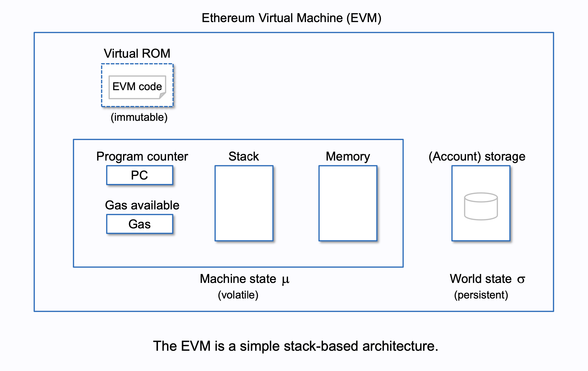

# WTF Solidity 極簡入門：5. 變量數據儲存和作用域

## 重點內容

> [!NOTE]
> **storage、memory、calldata**

## 隨筆

> [!TIP]
> **EVM Architecture**
> [](<https://takenobu-hs.github.io/downloads/ethereum_evm_illustrated.pdf>)
> [參考來源](<https://takenobu-hs.github.io/downloads/ethereum_evm_illustrated.pdf>)

### 數據儲存位置

Solidity 數據儲存位置有三類：**storage**、**memory** 和 **calldata**，不同儲存位置的 `gas` 成本不同。  
**storage** 類型數據存在鏈上，類似計算機的硬碟，消耗 `gas` 多。  
**memory** 和 **calldata** 類型的臨時存在內存裡，消耗 `gas` 少。

#### storage

合約裡的**狀態變量**默認都是 `storage`，儲存在鏈上

#### memory

函數裡的**參數**和**臨時變量**一般用 `memory`，儲存在內存中不上鏈。  
尤其是返回數據類型是**變長**的情況下，必須加 `memory` 修飾詞。  
例如：`string`、`bytes`、`array` 和**自訂義結構**

#### calldata

和 `memory` 類似，儲存在內存中不上鏈。  
與 `memory` 的不同點在於 `calldata` 變量**不能修改 (immutable)**，一般用於函數的參數。  
舉例：

```solidity
  function fCalldata(uint[] calldata _x) public pure returns(uint[] calldata){
    // 參數為 calldata 陣列，不能被修改
    // _x[0] = 0 // 這樣修改會噴錯
    return(_x);
  }
```

#### 數據位置和賦值規則

- 以下兩種**賦值**本質上是創建**引用**指向本體，因此修改本體或者引用，變化會被同步
  - `storage` (合約的**狀態變量**) 賦值給本地 `storage` (函數裡) 時，會創建引用，改變新變量會影響原變量

  ```solidity
    uint[] x = [1,2,3]; // 狀態變量：陣列 x

    function fStorage() public{
        //聲明storage的變量 xStorage，指向x。修改xStorage也會影響x
        uint[] storage xStorage = x;
        xStorage[0] = 100;
    }
  ```

  - `memory` 賦值給 `memory`，會創建引用，改變新變量會影響原變量
- 其他狀況賦值創建的是本體的副本，二者之一的修改不會影響到另一方

### 變量的作用域

#### 狀態變量

狀態變量的數據除**存在鏈上**，所有合約內部函數都可以訪問，`gas` 消耗高。  
狀態變量在**合約內**，**函數外部**聲明

```solidity
  contract Variables {
    uint public x = 1;
    uint public y;
    string public z;
  }
```

#### 局部變量

局部變量是僅在函數執行過程中有效的變量，函數退出後變量無效。  
局部變量的數據儲存在內存裡，**不上鏈**， `gas` 消耗低。  
局部變量在**函數內部**聲明

```solidity
  function bar() external pure returns(uint){
    uint xx = 1;
    uint yy = 3;
    uint zz = xx + yy;
    return(zz);
  }
```

#### 全局變量

全局變量是全局範圍工作的變量，都是 solidity 預留的關鍵字。  
可以在函數內不聲明直接使用

```solidity
  function global() external view returns(address, uint, bytes memory){
    address sender = msg.sender;
    uint blockNum = block.number;
    bytes memory data = msg.data;
    return(sender, blockNum, data);
  }
```

常見的全局變量有 `msg.sender`、`block.number` 和 `msg.data` 等

> [!TIP]
> Cancun升级新增的全局變量  
> `block.blobbasefee`: (uint) 當前區塊的 blob 基礎費用。  
> `blobhash(uint index)`: (bytes32) 返回跟當前交易關聯的第 index 個 blob的版本化哈希

### 以太單位和時間單位

#### 以太單位

Solidity 中不存在小數點，以 `0` 代替小數點，來確保交易的精確度，並且防止精度的丟失

- `wei`：1
- `gwei`：1e9 = 1000000000
- `ether`：1e18 = 1000000000000000000

#### 時間單位

- `seconds`：1
- `minutes`：60 seconds = 60
- `hours`：60 minutes = 3600
- `days`：24 hours = 86400
- `weeks`：7 days = 604800

## 題目練習

1. **Q: 引用類型(Reference Type)包含以下？**  
   **A:** array、struct、mapping

2. **Q: Solidity数据存储位置的类型不包含以下？**  
   **A:** stack

3. **Q: 合约中状态变量默认的存储位置类型为以下的？**  
   **A:** storage

4. **Q: 不同类型的引用变量相互赋值时，修改其中一个的值，不会导致另一个的值随之改变的是以下哪种情况：？**  
   **A:** 合約中的 storage 賦值給本地的 memory

5. **Q: Solidity中变量按作用域划分，可分为？**  
   **A:** 狀態 state、局部 local、全局 global

6. **Q: 消耗gas最多的变量类型为？**  
   **A:** 狀態變量

7. **Q: 下列表示“请求发起地址”的为？**  
   **A:** msg.sender

8. **Q: 下列表示“当前区块的矿工地址”的为？**  
   **A:** block.coinbase

<!--

__        __    _             __        __    _             _    _
\ \      / /_ _| | ___   _    \ \      / /_ _| | ___   _   | |  | |
 \ \ /\ / / _` | |/ / | | |    \ \ /\ / / _` | |/ / | | |  | |  | |
  \ V  V / (_| |   <| |_| |     \ V  V / (_| |   <| |_| |  |_|  |_|
   \_/\_/ \__,_|_|\_\\__,_|      \_/\_/ \__,_|_|\_\\__,_|  (_)  (_)

XXXXXXXXXXXXXXXXXKlkOOOXXXXXXXXXX0xddxddoooodkOKxWWxXXXXOXXX0Ox:llo0XXXXXXXXXXXXXXXXXXX
XXXXXXXXXXXXXXXXXXKONWNK00KX0xxO0XNWMMMMMMMWWXK0OOolooxx:llc::;,'';lXXXXXXXXXXXXXXXXXXX
XXXXXXXXXXXXXXXXXXXXkOWMMW0ocKMMMMMMMMMMMMMMMMMMMX;l:KW0o,..      .l00KXXXXXXXXXXXXXXXX
OOOOOOOOOO0XXXXXXXX0Ok0XWMMMNXMMMMMMMMMMMMMMMMMMMMx;;:NMN.        .lXOkXXXXXXXXXXXXXXXX
000OOOOOOOkkkkkkxcdKWWNXKNMMMWMMMMMMMMMMMMMMMMMMMMMk. .dWWX.       :OOkOOOOOOOOOOOOOOOO
MMMMMMMMMMMMMMW0ONMMNNWMMMMMMMMMMWXKXWMMMMMMMMMMMMMMX,  .kWWN:.    lMMMMMMMMMMMMMMMMMMM
MMMMMMMMMMMMM0xNMMMXNMMMMWNXXK0OOOOkxodxk0KKXNMMMMMMMW0:  .c0WWWl:ccWMMMMMMMMMMMMMMMMMM
        ....,OWMMMXWMWNKOxxxxxxxxxxddxddooodddk0XWMMMMWNKd,  .;lx0K,...................
           .XMMMMWNX0kxxxxxxxxxxxxxxxxxxxxdlodddddOXWMMMWNXXx;.    .d:                 
          .XMMMMWKkxxxxxxxxxxxxxxxxxxxdxxdxxdoddddddx0NMMMNXXWMNOl:l0Wk                
          0MMMWKkxxxxxxxxxxxxxxxxxxxxxxxxxdddddddddddddONMWNNKXMMMXKNMMK.              
        'oMMMNOkkxxkxxxxxxxxxxxxxxxxxxxxxxxxxdddodddddddd0WNNMXOWMMMXKNMN:             
     .,olWMMXkkkkkkkkxxxxxxxxxxxxxxxxxxxxxxxxdddddddddddddkXXWMW0NMMMWKXWWd            
   .;,,OdMWKkkkkkkkkkkkxxxxxxxxxxxxxdxxxxxxxxxxxdxdodddddddx0XMMWKKMMMMWXNWO           
  ..  kd0MXkkkkkkkkkkkkkkkkxxxxxxxxxxxxxxxxxxxxxxxxdodxxdddddxNMMMXKWMMMMXKW0.         
   .  dlWMOkkkkkkkxkkkkkkkkkkkkxxxxxxxxdxxxxxxxxxdxxdodxdddddoxKWMMN0WMMMMXKWX'        
    . OlMWkkkkkkkkkxkkkkkkkkkkxkkxxxxxxxddxxxxxxxddxxdoddddddodd0WMMW0NMMMMXNMX'       
     .llMXxkOOkkkkkxxkkkkkkkkkxxkkxxxxxxxxddxxxxxxdoxxdldddddoodxONMMMKWMMMMXWWK.      
      .oMKxkOOkkkOkkxxkkkkkkkkkxdxkxdxxxxxxxdodxxxxdoxxccxdxddoxxxkNMMMKWMMMWKWWK.     
       dW0kxOOOkkOkkkkxkkkkkkkkkkddkkxoclxxxxxdoodxxdox;.oxxxdodxxxkNMMWKWMMMXKMMN:    
       dWOOxOOOOdxkxkkkxxkkkkkkkkkxodkxxc',lllooollllco;l:xxxdodddxdkNMMW0WMMM0NMMWk.  
       oNOOdOOOOOxxOxxkkkxkkkkkkkkkkdclxkkoccoxxxxdooc.':'oxxddxxxxxxkWMMW0MMMN0MMMMX; 
       lNOOdOOOOOOxckOkkkOkxxkkkkkkkkkoccldddxddooc:cox0o,;xxdxxxxxxxdOWMMNXMMM0XMMMMMk
       lN00kxOOOOOOldodkkkxkxxxxxxkkkxxxdddddl::odONXkocdx,cxdxxxxxxxxxKMMMKNMMXKWMMMMM
       cN000x00OxOOOcxOxddxxddddxdddddkkxl:,. ;XXOxocoxdddd,xdxxxxxxxxxxNMMWOWMXKXMMMMM
       ,N000kk00lldxOdxOkkxxxkkkOkkkkkkkc:ooldxdoxxdddoddxx'ldxxxxxxxxxxOMMMX0MXXKMMMMM
       .N0000xO0oOOxxxoxOOOOkkdockOOkkkkkkkkkkkkkkxxxxxxxxx,cxxxxxxxxxxxxKMMMONXNKNMMMM
        KK000Od0xOxk00OkkxlldxxooOOOOkkkkkkkkkkkkkkkkkddoxx;lxxxxxxxxxxxxxWMMN0KWNXMMMM
        k00000kdOOOOxl;ldkK0kddOOOOOOOOOOOkkkkkkkkkkkxddkkx.xxxxxxxxxxxxxoXMMM0XMWKMMMM
        oK0KKK0xxloo;,lkkxdkOOOOOOOOkdOOOOOkkkkkkkkkxocxkko,kxxxxxxxxxxxdxKMMMKXMWKMMMM
        ;XO0KKK0xxddoxxO0000OOOOOOOOOOOOOOOOkkkkkxoodkkkkk:dkkkkkxxxxxxxdxOMMMNXMNXMMMM
        .X0OKKKK0xO0OOO0000000OOOOOOOOOOOOkkOkddodkkkkkkkk:kkkkkkkkxxxxxdxkWMMWXMXWMMMM
         000OKKKKKkO000000000000OOOOOOOOOkddddxkOkkkkkkkkd:kkkkkkkkkxxxdxxkWMMWXWXMMMMM
         dX00O0KKKKOk0K0000000000000OxxxxxxxxxxOOOOOOkkkx,ckkkkkkkkkkkddkxOMMMNNNWMMMMM
        .xKXK000KKKK0kOKK0000000OkkkxkOkkkkOOOOOOOOOOx:'  lkkkkkkkkkkklkkxKMMMOk0WMMMMM
         KkXXK00OKKKKKxd0KKK0000000000000OOOOOOOOxc,.   .;lkkkkkkkkkkoxkkkNMMW;..,ldkXM
         XkOXXX0000KKKKOccd0KKK00000000000Okdc;.      .lkolkkkkkkkkkdxkkkOWMMd    .cc;c
         ONdXXXXKO00KKKKKk,;oxdxxkxxxdoddol        .:kOOOx:OOkkkkkkoxkkkOWMMk     .,..:
         lW0kXXXXXKOO0KKKK0cl000KKK0OOk0Oo,:l'::cokOOOOOOO;kOOOOkkoxkkkkNMMO      ..   
         .WNO0XXXXXX0O0KKKKKOcOOKKK0kkko.;O00koO0OOOOOOOOOolOOOOkdkkkkONMWd      ..    
  .kKo    ONXO0XXXXXXX00KXKKKKdxKKKkko, o00000OO000OOOOOkxdcoOOxdOkOOKWWk'       ,     
  '0KKd   .NNXkKXXXXXXXXK00KKKKOxKKx. .kKK000000000000kxOOOx,oxkOO0XXOc.        ..     
   ,KXXk.  ;NNXOOXXXXXXXXXKO00KK0o:   d0KKK000OO000000Oxl,. .d00kdc.            '      
    ,0KOo   'KNN0OXXXXXXXXXXXKOkOO.  .K0OOOO0O0000xo:.     .'..                 .      
     'OKKd.   lKNXO0XXXXXXXXXXXXKOk;. :odddolc;'.                              ..      
      .KXXk     ckXKOKXXXXXXXXXXXXXKX0c                ...''''...              .       
       'KXNk       .'.'lkXXXXXXXXXXOo,        .coc:ok00K000000000Okl,                  
        'KKNk.            .;ccc:,.       .';cc0KKxOOkO00000000000000x                  
      ,dxd00N0.                      'lkO0000dkKKk0KKKKKKKKK00000000:                  
    .0MWWWWXK0O,:cll:.            .oKXXX00000KxKKkkxkkOOOOOOOOOOOO0O.                  
    dMWWWWWWWW0dkNNNNNK,         .KXXXXXXXK00kol,cKKx0O;.',:coxkOkl.                   
    0MWWNWWWWWWNxl0NNNNd         cNXXXXK0000OxK' :XXO0KK,                              
  .0WWWWNKKXWWWWW0lNNNNk         oNXKKKXKk0X0Kl  :XXkKOKK,                            .
  0MWWWWWWXxkNWWNX0k0XXk         l00XXd,,KXOKK.  cXXOXKKKK;       .;cool:'             
 ,NMWNWWWWWWNkkONWWKkXXx         .xo'  ;XNXXXl   cXX0KXXXXK;..'ckXXXXXXKXWNxol;.       
;WMWWXKKNWWWWWWOookkoo;.              :NNNNNK.   :XXXXK00K00KKXKKK0000KKK0K000K0xodxkxO
xMMMWWWWkONWWWWWWoXXWK.               KNNNNNd    :XXXkKXX0xOk0XK0k0KKKKK0OOOOkK00KXXX0o

-->