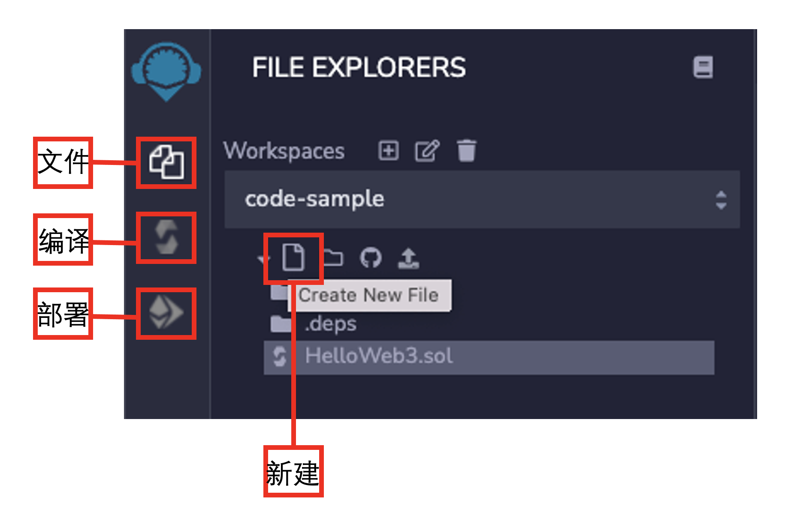

#### Solidity 简介

`Solidity` 是一种用于编写以太坊虚拟机（`EVM`）智能合约的编程语言

#### Remix

- `Remix` 是以太坊官方推荐的智能合约集成开发环境（IDE）

- 创建文件-》编写文件-》编译-》部署

  


- ​	第一个solidity程序

  ```solidity
  // SPDX-License-Identifier: MIT
  pragma solidity ^0.8.26;
  
  contract HelloWorld {
  
      string public hi = "helloWorld";
  }
  ```

  - 以下是这段代码的解释：
    1. **// SPDX-License-Identifier: MIT**：这是代码所使用到的软件许可，这里是用的MIT许可
    2. **pragma solidity ^0.8.26;** ：这行是指定Solidity编译器版本号，`^`表示要大于0.8.26的版本号。通常我们会选择最新版本的前一版
    3. **contract HelloWorld {……}**：`contract`合约声明关键字，`HelloWorld `合约名称
    4. **string public hi = "helloWorld";**：声明变量为string 类型的变量hi,并赋值为helloWorld

  - 运行结果

    


#### Solidity中的变量类型

1. **值类型(Value Type)**：包括布尔型，整数型等等，这类变量赋值时候直接传递数值。
2. **引用类型(Reference Type)**：包括数组和结构体，这类变量占空间大，赋值时候直接传递地址（类似指针）。
3. **映射类型(Mapping Type)**: Solidity中存储键值对的数据结构，可以理解为哈希表

#### 值类型

1. ​	布尔值

  ```solidity
  // 布尔运算
  bool public _bool1 = !_bool; // 取非
  bool public _bool2 = _bool && _bool1; // 与
  bool public _bool3 = _bool || _bool1; // 或
  bool public _bool4 = _bool == _bool1; // 相等
  bool public _bool5 = _bool != _bool1; // 不相等
  ```

2. 整数：`int`、`uint`、`uint` ( 一般使用uint)

3. 地址类型：

- 普通地址（address）: 存储一个 20 字节的值（以太坊地址的大小）。
- payable address: 比普通地址多了 `transfer` 和 `send` 两个成员方法，用于接收转账。

4. 定长字节数组
   - 字节数组分为定长和不定长两种：
     - 定长字节数组: 属于值类型，数组长度在声明之后不能改变。根据字节数组的长度分为 `bytes1`, `bytes8`, `bytes32` 等类型。定长字节数组最多存储 32 bytes 数据，即`bytes32`。
     - 不定长字节数组: 属于引用类型（之后的章节介绍），数组长度在声明之后可以改变，包括 `bytes` 等。

5. 枚举（`enum`）

补充：1byte = 8bit = 1111 1111 = 0xff

