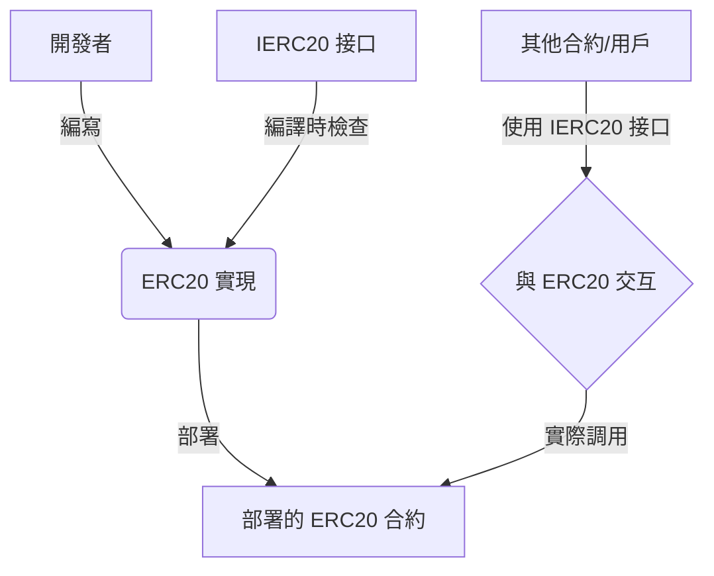
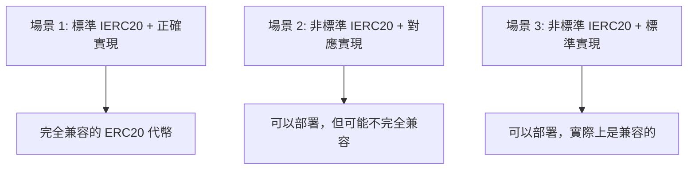
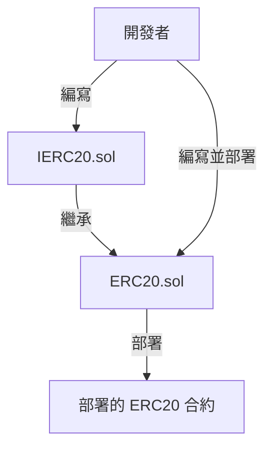

# jasonch1u

1. 自我介绍：無開發經驗，參加XREX區塊鍊課程後，不想再當web2的佃農。最近很幸運的錄取了資安BOOTCAMP，希望這段時間學習後，有機會投身web3的行列。
2. 你认为你会完成本次残酷学习吗？ 一開始覺得不好說，不過這段時間提前自學，期許自己還是可以完成。

## Notes
<!-- Content_START -->
### 2024.09.19
因為從未接觸過Solidity，這週提前開始課程，大概了解自學難度、個人目標、及殘酷共學的願景。

### 2024.09.23
#### 01_HelloWeb3
* Solidity 是智能合約語言，主要用於以太坊。
* Remix 是官方推薦的開發工具(https://remix.ethereum.org) ，可在瀏覽器中開發和部署 Solidity 合約。建議可以開啟自動編譯，省步驟。

Solidity 程序結構包含：
1. License 註釋
```solidity
// SPDX-License-Identifier: MIT
```
2. 版本聲明：跟編譯器要一致，在Remix輸入"pragma..."會跳出"License註釋"一起寫完，最後記得填入 version
```solidity
pragma solidity 0.8.26;
```
3. 合約內容
```solidity
contract HelloWorld { }
```
* 第一個合約示例：HelloWeb3 合約，定義一個字符串變量，值為 "Hello Web3!"。每行代碼用分號；結尾

#### 02_ValueTypes
不填寫可見性說明符時
* 狀態變數(state variables)：預設可見性是 internal。
* 函數(functions)：預設可見性是 internal。

值的寫法：
```solidity
<value types> {internal|public|private} <_value name>;
<value types> {internal|public|private} <_value name> = 數值、字串或判斷式;
```
狀態變量不能使用 external！  
如果狀態變數是 external，那麼就不能在合約內部被讀取，這違背了狀態變數的基本用途。  
external 僅用於函數，表示只能從合約外部調用  

如果寫public，會自動產生getter函數(可以理解成自動產生一個查找對應數值的函數功能)，寫其他或不寫可見性說明符，就不會有自動生成getter函數，會需要自己寫getter函數才能查找對應數值。

ex.
```solidity
uint8 public _apple = 255;
//會自動產生getter函數，部屬後直接點_apple會知道uint8: 255

uint256 _banana = 20;
//不會自動產生getter函數，部屬後沒有_banana可以點，要另外自己寫function找_banana
```

數值類型概述
* 布爾型 (bool)：只有兩個值，true 和 false。
   * 基本運算符號：`!`(不是), `&&`(和), `||`(或), `==`(等於), `!=`(不等於)
   * 短路規則（Short-circuiting）：
      * &&：如果前者為 false，後者不再執行。f(x) && g(y)，若f(x)為false，g(y)不執行
      * ||：如果前者為 true，後者不再執行。f(x) || g(y)，若f(x)為true，g(y)不執行
* 整數型 (uint)：
   * uint（無符號整數）常用於區塊鏈，因為不需要負數，默認為 uint256。也沒有小數點。位數表達是二進制的位數，即256bits。
   * 數學運算：`+`, `-`, `*`, `/`(取商), `%`(取餘), `**`(平方)
   * 比較判斷：`<=`,`<`, `==`, `!=`, `>=`, `>`
* 地址型 (address)：
    * 用於儲存 Ethereum 地址。
    * 佔用 20 bytes，即 40 個 16 進位字符。
    * address加上`payable`可用於接收轉帳。
    * 支援轉帳操作方法：`transfer`、`send` 和 `call`。
* 字節型 (bytes)：
    * 分為定長（如 bytes32）和不定長版本。
    * 定長字節型聲明長度後不可變；不定長字節數組有機會儲存更多數據。
    * 1 byte = 8 bits，可以由 2 個 16 進位字符表示。
        * 每個 16 進位字符代表 4 bits。例如：1111 1111（二進位） = FF（16 進位）。
        * bytes32：能存 32 bytes，即 64 個 16 進位字符。
        * 0x只是用來表示16進制，不佔字符數。
* 枚舉 enum：冷門，方便辨識程式碼的寫法。類似自定義```X, Y, X = 0, 1, 2```的概念

#### 03_Function
函數的基本結構
```solidity
function <function name>(<parameter types>) {internal|external|public|private} [pure|view|payable] [returns (<return types>)]
```
* 可見性：函數的可見性決定誰可以調用該函數：
   * public：內外部都可訪問，會自動生成 getter 函數。
   * private：僅限合約內部調用。
   * internal：內部和子合約可調用。
   * external：僅外部調用，內部需透過 this.f() 調用。
* 修飾詞
   * pure：不讀取或修改狀態，完全依賴傳入的參數。
   * view：僅讀取狀態，不修改。
   * payable：允許函數接收以太幣，常用於資金接收。
   * 不寫：可以讀取和修改狀態，改變鍊上數據會消耗 Gas。

### 2024.09.24
#### 04_Return
returns：跟在函數名後面，用於宣告傳回的變數類型及變數名。

```solidity
function returnMultiple() public pure returns(uint256, bool, uint256[3] memory){
```

return：用於函數主體中，傳回指定的變數
```solidity
return(1, true, [uint256(1),2,5]);
}
```

命名式返回：returns裡面聲明變數類型及變數名稱，並在函數內部為各個變數賦值
```solidity
function returnNamed() public pure returns(uint256 _number, bool _bool, uint256[3] memory _array){
_number = 2;
_bool = false;
_array = [uint256(3),2,1];
}
```

命名式返回也可以在returns先聲明變數類型及變數名稱，並在下方用return返回值
```solidity
function returnNamed2() public pure returns(uint256 _number, bool _bool, uint256[3] memory _array){
    return(1, true, [uint256(1),2,5]);
}
```
解構式賦值：Solidity 中的解構式賦值(Destructuring Assignment)是一種允許你從數組或結構體中提取多個值並同時賦給多個變數的語法特性。這個概念源自於其他現代編程語言，如 JavaScript。 

原講義看不懂，參考小礦工Wade介紹才理解一點，大概是：要先取得變數A跟對應值，然後設定新變數，可以透過解構式賦值的寫法，決定要不要把所有變數A賦值給新變數

```solidity
// 读取返回值，解构式赋值
function readReturn() public pure{

// 读取全部返回值
uint256 _number;
bool _bool;
bool _bool2;
uint256[3] memory _array;
(_number, _bool, _array) = returnNamed();
```

如果不想要全部變數都賦值，可以直接把那個變數幹掉；不過被幹掉的新變數，原本聲明的地方應該也要幹掉?
```solidity
// 读取部分返回值，解构式赋值
(, _bool2, ) = returnNamed();
}
```

#### 05_DataStorage

storage: 存在鍊上數據，gas貴  
memory: 用於函數內的臨時變量。存在内存，不上鍊。string, bytes, array和自訂結構需加memory。  
calldata: 用於接收外部調用的數據。存在内存，不上鍊。但是calldata初始化賦值後不得改變變量。更省gas。  

這邊要再確認一下calldata的作用，不知道為什麼calldata重新賦值後，點aa就變成新數據了，不過做myMemoery確實沒改變[0]，做myStorage有改變[0]，不能理解為什麼做calldata後會改變aa？ aa不是鍊上數據嗎?
```solidity
// SPDX-License-Identifier: MIT
pragma solidity 0.8.26;

contract DataStorage {

uint[] public aa = [1,2,3]; 

function myCallData(uint[] calldata _x) external {
aa = _x;
}

function myMemory() external view {
uint[] memory xMemory = aa;
xMemory[0] = 100;
}

function myStorage() external {
uint[] storage xMemory = aa;
xMemory[0] = 100;    
}
}
```

狀態變量  
局部變量  
全局變量  
全局變量: 乙太單位、時間單位  

#### 06_ArrayAndStruct

array
固定長度數組
```solidity
// 固定長度 Array
uint[8] array1;
bytes1[5] array2;
address[100] array3;
```

可變長度數組
```solidity
// 可變長度 Array
uint[] array4;
bytes1[] array5;
address[] array6;
bytes array7;
````
在Solidity中，如果一個值沒有指定type的話，會根據上下文推斷出元素的類型，預設就是最小單位的type，這裡預設最小單位類型是uint8  

對於memory修飾的動態數組，可以用new運算元來創建，但是必須聲明長度，且聲明後長度不能改變。  
主要是讓memory的變量，聲明一個新變量名稱，讓系統知道這個memory對應的不是鍊上數據，而是另外一個暫存的新值?  
這邊提到memory修飾動態數組，可用new創建，這件事應該不只局限於動態數組，而是有用memory修飾的變量，都有一樣可以用new的概念對吧?  
new 操作符的使用： 您是對的，new 操作符的使用不僅限於動態數組。在 Solidity 中，new 可以用於創建多種類型的 memory 變量，包括：
* 動態數組
* 靜態數組
* 結構體
* 合約
* uint, string這些如果用到memory修飾，直接定義新變量即可，不需要用到new

如果建立的是動態數組，則需要一個元素的賦值。

```solidity
function getArray() public pure returns (uint[] memory) {
uint[] memory result = new uint[](3);
result[0] = 1;
result[1] = 2;
result[2] = 3;
return result;
}
```

數組成員
* length: 陣列有一個包含元素數量的length成員，memory陣列的長度在建立後是固定的。
* push(): 動態陣列擁有push()成員，可以在陣列最後加上一個0元素，並傳回該元素的參考。
* push(x): 動態陣列擁有push(x)成員，可以在陣列最後加上一個x元素。
* pop(): 動態陣列擁有pop()成員，可以移除陣列最後一個元素。

struct
```solidity
// 結構體
struct Student{
    uint256 id;
    uint256 score; 
}

Student student; // 初始一個student結構體，後面小寫的student可以看做是命名Student這個結構體
```
有四種賦值方法
方法1:在函數中建立一個storage的struct引用
```solidity
//  给结构体赋值
function initStudent1() external{
    Student storage _student = student; // assign a copy of student
    _student.id = 11;
    _student.score = 100;
}
```
方法2:直接引用状态变量的struct
```solidity
function initStudent2() external{
    student.id = 1;
    student.score = 80;
}
```

方法3:构造函数式
```solidity
function initStudent3() external {
    student = Student(3, 90);
}
```

方法4:key value
```solidity
function initStudent4() external {
    student = Student({id: 4, score: 60});
}
```
getter函數寫法
* 數組：數組在返回時，Solidity 編譯器會自動處理存儲位置，允許你直接返回 storage 中的數組，並自動將其轉換為 memory。
* 結構體：當返回結構體時，你需要創建一個 memory 的副本，因為編譯器要求這樣來確保數據的安全性和完整性。
```solidity

//array：gettter函數 可以不用寫出memory副本，由系統自動編譯
function getmyArray3() external view returns(uint[] memory){
    return myArray3;
}

//array：getter函數 也可以這樣寫，手動寫出memory副本
function getmyArray3() external view returns(uint[] memory){
    uint[] memory xmyArray3 = myArray3;
    return xmyArray3;
}

//struct，生成一個People getter函數，一定要手動寫出memory副本
function getPeople() external view returns(People memory){ 
    People memory xPeople = people;
    return xPeople;
}
```

### 2024.09.25

#### 07_Mapping
* 規則1：映射的_KeyType只能選擇Solidity內建的值類型，例如uint，address等，不能用自訂的結構體。而_ValueType可以使用自訂的類型。
* 規則2：映射的儲存位置必須是storage，因此可以用於合約的狀態變量，函數中的storage變數和library函數的參數（見例子）。不能用於public函數的參數或傳回結果中，因為mapping記錄的是一種關係 (key - value pair)。
* 規則3：如果映射宣告為public，那麼Solidity會自動為你建立一個getter函數，可以透過Key來查詢對應的Value。
* 規則4：新增給映射的鍵值對的語法為_Var[_Key] = _Value，其中_Var是映射變數名，_Key和_Value對應新增的鍵值對。
  
```solidity
// SPDX-License-Identifier: MIT
pragma solidity 0.8.26;

contract _7mapping{

    mapping (address => int) public balanceOF;

    function mint() external {
        balanceOF[msg.sender]=100 ether;
    }

    function burn() external {
        balanceOF[msg.sender]=50 ether;

    }
}
```
* 原理1: 映射不儲存任何按鍵（Key）的資訊，也沒有length的資訊。
* 原理2: 映射使用keccak256(abi.encodePacked(key, slot))當成offset訪問value，其中slot是映射變數定義所在的插槽位置。
* 原理3: 因為Ethereum會定義所有未使用的空間為0，所以未賦值（Value）的鍵（Key）初始值都是各個type的預設值，如uint的預設值是0。

#### 08_InitialValue

值類型初始值

delete操作符  
delete a會讓變數a的值變成初始值。不是刪除該數值！

#### 09_Constant
只有數值變數可以宣告constant和immutable；string和bytes可以宣告為constant，但不能為immutable。
constant, immutable 變數宣告後再也不能改變。嘗試改變的話，編譯不通過。
constant：初始化即聲明
immutable：初始化即聲明 或 在建構子裡面聲明

```solidity
uint public constant money = 1; //初始化即聲明數值
uint public immutable point = 2; //初始化即聲明數值
uint public immutable point2; //先不聲明數值，在建構子裡面聲明

constructor(){
    point2 = 3;
}
```

#### 10_InsertionSort
* if else：條件如果符合，就這樣，不然就那樣
```solidity
function a(uint256 _number) public pure returns(bool){
   if(_number == 0){
      return(true);
   }else{
      return(false);
   }
}
```
* for
* 另外還有continue（立即進入下一個循環）和break（跳出目前循環）關鍵字可以使用。
```solidity
function forLoopTest() public pure returns(uint256){
   uint sum = 0; /// 一開始 sum = 0
      for(uint i = 0; i < 10; i++){ // 一開始 i = 0，如果 i < 10 的話，i = i + 1
         sum += i; //sum = sum + i
      }
   return(sum);
}

//拆解步驟：i = 0 時，sum =  0 + 0 得到  0，i = 0 + 1 得到 1
//         i = 1 時，sum =  0 + 1 得到  1，i = 1 + 1 得到 2
//         i = 2 時，sum =  1 + 2 得到  3，i = 2 + 1 得到 3
//         i = 3 時，sum =  3 + 3 得到  6，i = 0 + 1 得到 4
//         i = 4 時，sum =  6 + 4 得到 10，i = 1 + 1 得到 5
//         i = 5 時，sum = 10 + 5 得到 15，i = 2 + 1 得到 6
//         i = 6 時，sum = 15 + 6 得到 21，i = 2 + 1 得到 7
//         i = 7 時，sum = 21 + 7 得到 28，i = 0 + 1 得到 8
//         i = 8 時，sum = 28 + 8 得到 36，i = 1 + 1 得到 9
//         i = 9 時，sum = 36 + 9 得到 45，i = 2 + 1 得到 10
//         i = 10 時，跳出 for 迴圈
//
//簡單來說就是，0 + 1 + 2 + 3 + 4 + 5 + 6 + 7 + 8 + 9 = 45
```
* while
```solidity
    function whileTest() public pure returns(uint256){
        uint sum = 0;
        uint i = 0;
        while(i < 10){
            sum += i;
            i++;
        }
        return(sum);
    }
```
* do while
```solidity
// do-while
function doWhileTest() public pure returns(uint256){
   uint sum = 0;
   uint i = 0;
   do{
      sum += i;
      i++;
   }while(i < 10);
   return(sum);
}
```
* 三元運算符
```solidity
function ternaryTest(uint256 x, uint256 y) public pure returns(uint256){
   // return the max of x and y
   return x >= y ? x: y; 
}
```

* 插入排序：前後兩位比大小，後面小於前面就對調位置
```solidity
// 插入排序 正確版
function insertionSort(uint[] memory a) public pure returns(uint[] memory) {
    // note that uint can not take negative value
    for (uint i = 1;i < a.length;i++){ 
        uint temp = a[i];
        uint j=i;
        while( (j >= 1) && (temp < a[j-1])){
            a[j] = a[j-1];
            j--;
        }
        a[j] = temp;
    }
    return(a);
}

//拆解步驟：舉例 [5,4,1,3,2]，a.length = 5
//            第 0 1 2 3 4 位
//         i = 1 < a.length = 5，做第1次for迴圈
//         i = 1，a[1] 即第1位是 4，所以 temp = a[1] = 4，temp表達做該次for迴圈時的對應數值
//         j = i = 1，接著進入while迴圈條件判斷，j = 1 >= 1 而且 temp = 4 < a[j-1] = 第0位的 5，while迴圈條件判斷通過
//         所以 a[j] = a[j-1]，即 a[1] = a[0]，所以第1位數變成 5，數組變成 [5,5,1,3,2]
//         j = j - 1 = 0，再次進入while迴圈條件判斷 (j >= 1 && (temp < a[j-1])，j = 0 不是>= 1，不符合while迴圈條件，退出while迴圈
//         回到第1次for迴圈的剩餘步驟，a[j] = temp，即 a[0] = temp = 4，數組變成 [4,5,1,3,2]
//         i = i + 1 = 2，結束第1次for迴圈
//
//         可以看出while這段是確定第一位可以跟第0位比較，而且第0位小於第1位的情況下，用很難直接看懂的方式做前後數值對調
//
//         現在數組是 [4,5,1,3,2]
//                 第 0 1 2 3 4 位
//         i = 2 < a.length = 5，做第2次for迴圈
//         i = 2，a[2] 即第2位是 1，所以 temp = a[2] = 1
//         j = i = 2，接著進入while迴圈條件判斷，j = 2 >= 1 而且 temp = 1 < a[j-1] = 第1位的 5，while迴圈條件判斷通過
//         所以 a[j] = a[j-1]，即 a[2] = a[1]，所以第2位數變成 5，數組變成 [4,5,5,3,2]
//         j = j - 1 = 1，再次進入while迴圈條件判斷 (j >= 1 && (temp < a[j-1])，j = 1 >= 1, temp = 1 < a[0] = 4，符合while迴圈條件，繼續while迴圈 
//         a[1] = a[0] = 4，數組變成 [4,4,5,3,2]
//         j = j - 1 = 0，再次進入while迴圈條件判斷 (j >= 1 && (temp < a[j-1])，j = 0 不是>= 1，不符合while迴圈條件，退出while迴圈
//         a[0] = temp = 1，數組變成 [1,4,5,3,2]
//         i = i + 1 = 3，結束第2次for迴圈
//
//         可以看出第2次for迴圈，while做2次，用一個很麻煩的方式，讓數組變成 [1,4,5,3,2]，不過目前順序還是對的
//
//         現在數組是 [1,4,5,3,2]
//                 第 0 1 2 3 4 位
//         i = 3 < a.length = 5，做第3次for迴圈
//         i = 3，a[3] 即第3位是 3，所以 temp = a[3] = 3
//         j = i = 3，接著進入while迴圈條件判斷，j = 3 >= 1 而且 temp = 3 < a[j-1] = 第2位的 5，while迴圈條件判斷通過
//         所以 a[j] = a[j-1]，即 a[3] = a[2]，所以第3位數變成 5，數組變成 [1,4,5,5,2]
//         j = j - 1 = 2，再次進入while迴圈條件判斷 (j >= 1 && (temp < a[j-1])，j = 2 >= 1, temp = 3 < a[1] = 4，符合while迴圈條件，繼續while迴圈 
//         a[2] = a[1] = 4，數組變成 [1,4,4,5,2]
//         j = j - 1 = 1，再次進入while迴圈條件判斷 (j >= 1 && (temp < a[j-1])，j = 1 >= 1, temp = 3 不是< a[0] = 1，不符合while迴圈條件，退出while迴圈
//         a[1] = temp = 3，數組變成 [1,3,4,5,2]         
//         i = i + 1 = 4，結束第3次for迴圈
//
//         第3次for迴圈，while做2次，讓數組變成 [1,3,4,5,2]
//
//         現在數組是 [1,3,4,5,2]
//                 第 0 1 2 3 4 位
//         i = 4 < a.length = 5，做第4次for迴圈
//         i = 4，a[4] 即第4位是 2，所以 temp = a[4] = 2
//         j = i = 4，接著進入while迴圈條件判斷，j = 4 >= 1 而且 temp = 2 < a[j-1] = 第3位的 5，while迴圈條件判斷通過
//         所以 a[j] = a[j-1]，即 a[4] = a[3]，所以第3位數變成 5，數組變成 [1,3,4,5,5]
//         j = j - 1 = 3，再次進入while迴圈條件判斷 (j >= 1 && (temp < a[j-1])，j = 3 >= 1, temp = 2 < a[2] = 4，符合while迴圈條件，繼續while迴圈 
//         a[3] = a[2] = 4，數組變成 [1,3,4,4,5]
//         j = j - 1 = 2，再次進入while迴圈條件判斷 (j >= 1 && (temp < a[j-1])，j = 2 >= 1, temp = 2 < a[1] = 3，符合while迴圈條件，繼續while迴圈 
//         a[2] = a[1] = 3，數組變成 [1,3,3,4,5]       
//         j = j - 1 = 1，再次進入while迴圈條件判斷 (j >= 1 && (temp < a[j-1])，j = 1 >= 1, temp = 2 不是< a[0] = 1，不符合while迴圈條件，退出while迴圈
//         a[1] = temp = 2，數組變成 [1,2,3,4,5]         
//         i = i + 1 = 5，結束第4次for迴圈
//
//         第4次for迴圈，while做3次，讓數組變成 [1,2,3,4,5] 
//
//         1 = 5 < a.lenght = 5，不符合for迴圈條件，結束for迴圈
//
//         return(a);
```

### 2024.09.26

#### 11_Modifier

* Constructor：每個合約可以定義一個，並在部署合約的時候自動執行一次。它可以用來初始化合約的一些參數，例如初始化合約的owner位址，下屬時會要求出入initialOwner

```solidity
address owner; // 定义owner变量

// 构造函数
constructor(address initialOwner) { //()聲明輸入值
    owner = initialOwner; // 在部署合约的时候，将owner设置为传入的initialOwner地址
}

// getter
function getOwner() external view returns(address _address){
    _address = owner;
}
```

* modifier

```solidity
// 定义modifier
modifier onlyOwner {
require(msg.sender == owner); // 检查调用者是否为owner地址
_; // 如果是的话，继续运行函数主体；否则报错并revert交易
}
```
上面是一個modifier，下面是一個叫onlyOwner modifier修飾的function，當這個function看到modifier之後，才會跑去執行modifier的內容，去判斷检查调用者是否为owner地址，如果是的话，继续运行changeOwner這個function
```solidity
function changeOwner(address _newOwner) external onlyOwner{
owner = _newOwner; // 只有owner地址运行这个函数，并改变owner
}
```
#### 12_Event
* 監聽事件，方便被找出來
* 省gas fee，用事件儲存資料，比直接存鍊上數據，gas fee便宜10倍

聲明事件
```solidity
event Transfer(address indexed from, address indexed to, uint256 value); //正確通用

keccak256("Transfer(address,address,uint256)") //事件簽名要這樣寫
//0xddf252ad1be2c89b69c2b068fc378daa952ba7f163c4a11628f55a4df523b3ef

keccak256("Transfer(address,address,uint)") //uint不寫256，事件簽名hashed會跟上面不一樣
```
釋放事件：
```solidity
// 释放事件
emit Transfer(from, to, amount);
```

EVM日志 Log (etherscan)  
topic
* 除了事件哈希，主题还可以包含至多3个indexed参数，也就是Transfer事件中的from和to。總共四個東西

* 關於 indexed 關鍵字： 主要用於優化事件的過濾和搜索。
* 作用：
   * 允許外部應用程序（如 dApps 或區塊鏈瀏覽器）更高效地過濾和查詢特定事件。
   * 被標記為 indexed 的參數會被存儲在事件的 topics 中，而不是data部分。
* 限制：
   * 每個事件最多可以有 3 個 indexed 參數。
   * address 和 uint 類型特別有用，因為它們可以直接被搜索。

完全可以將 indexed 加在 amount 上。例如： 
```solidity
event Transfer(address indexed from, address indexed to, uint256 indexed amount);
```
但是通常不會這麼做，因為一點都不實用，原因如下： 
* 搜索模式：大多數情況下，用戶和應用程序更傾向於搜索特定地址的轉賬記錄（發送或接收），而不是特定金額的轉賬。
* 數據類型考慮：address 類型特別適合用 indexed，因為它們可以直接被搜索和過濾。而 uint256 類型（如 amount）在作為 indexed 參數時，實際上是將其哈希值存儲在 topic 中，這可能不如直接存儲在數據部分有用。
* 靈活性：不將 amount 標記為 indexed 允許更靈活的金額查詢。例如，您可以很容易地在鏈下計算總轉賬金額或查找特定範圍內的轉賬。
* 三個 indexed 參數的限制： 雖然技術上可以有三個 indexed 參數，但通常保留一個非 indexed 參數可以提供更多的靈活性，特別是對於可能需要存儲更複雜或大量數據的事件。
* 效率和成本考慮： indexed 參數會增加燃氣成本，因為它們被單獨存儲為日誌主題。對於頻繁發生的事件（如代幣轉賬），保持合理的燃氣成本很重要。

data
* 事件中不带 indexed的参数会被存储在 data 部分中。
* data 部分的变量在存储上消耗的gas相比于 topics 更少。

完整程式碼  
關於 _balances[from] 的語法：  
_balances 是一個映射（mapping）。  
_balances[from] 表示訪問以 from 地址為鍵的映射元素。  
```solidity
// SPDX-License-Identifier: MIT
pragma solidity ^0.8.21;
contract Events {
    // 定义_balances映射变量，记录每个地址的持币数量
    mapping(address => uint256) public _balances;

    // 定义Transfer event，记录transfer交易的转账地址，接收地址和转账数量
    event Transfer(address indexed from, address indexed to, uint256 value);


    // 定义_transfer函数，执行转账逻辑
    function _transfer(
        address from,
        address to,
        uint256 amount
    ) external {

        _balances[from] = 10000000; // 给转账地址一些初始代币

        _balances[from] -=  amount; // from地址减去转账数量
        _balances[to] += amount; // to地址加上转账数量

        // 释放事件
        emit Transfer(from, to, amount);
    }
}
```
### 2024.09.27
* 建立ERC20合約 `bootcamp`
```solidity
// SPDX-License-Identifier: MIT
pragma solidity ^0.8.20;

import "@openzeppelin/contracts/token/ERC20/ERC20.sol"; //import

contract DefiHackLabsToken is ERC20 { //繼承ERC20

   //設定初始發行量的變數
   uint256 public initialSupply = 1000; 

    //constructor() 後面接 ERC20("代幣名稱","代幣符號")
   constructor() ERC20("DefiHackLabs", "HACK") { 

         // 合約部屬後，鑄造給 "地址" 多少的 "代幣量"，通常寫法是_mint(地址,代幣量)
         _mint(msg.sender, initialSupply * 10**decimals()); //合約部屬後，鑄造給部屬者的地址，發幣自爽 (?
    }
}
```
### 2024.09.28
* 測試合約 `bootcamp`  
終端機指令
```
forge test --match-contract MyTokenTest -vvvvv //測試MyTokenTest這個合約，合約名稱可替換
forge test --match-test testTransferAcrossMultipleEOA -vvvvv //測試testTransferAcrossMultipleEOA這個函數，函數名稱可替換
forge test --match-test testIsResister -f https://ethereum-sepolia-rpc.publicnode.com //去抓Sepolia鏈上狀態
```
-v 是 --verbosity 的簡寫。每多加一個 v，輸出的詳細程度就會增加。級別：
   * -v：基本詳細信息
   * -vv：更多詳細信息
   * -vvv：非常詳細
   * -vvvv：超級詳細
   * -vvvvv：最高詳細度

-f 參數加上 sepolia 的 rpc url，這樣 foundry 會去抓 sepolia 鏈的狀態

測試假裝用戶 `bootcamp`
```solidity
vm.prank() //模擬用戶操作，Forge 標準庫中的 vm.prank() 函數來模擬不同用戶的操作。
```
以下幾個是源自 ERC20 標準函數，在 OpenZeppelin 的 ERC20 實現中定義。

* token.transfer (接收的地址, 數量); 
```solidity
//從調用者的賬戶向指定的接收地址轉移指定數量的代幣。
function transfer(address to, uint256 amount) public virtual returns (bool) {
    address owner = _msgSender();
    _transfer(owner, to, amount);
    return true;
}
```
* token.approve (被授權地址B, 數量); 這是授權者（調用者，通常稱為A）
```solidity
//授權另一個地址可以從調用者賬戶轉出特定數量的代幣。給予B地址權限，允許B最多可以從A的賬戶中轉走指定數量的代幣。
function approve(address spender, uint256 amount) public virtual returns (bool) {
    address owner = _msgSender();
    _approve(owner, spender, amount);
    return true;
}
```
* token.transferFrom (發送地址, 接收地址, 數量); 
```solidity
//這是由被授權的地址B調用的函數。B可以將指定數量的代幣從發送地址（通常是之前授權的A）轉移到接收地址。轉移的數量不能超過之前通過 approve 設置的限額。前提是轉移者有足夠的授權
function transferFrom(address from, address to, uint256 amount) public virtual returns (bool) {
    address spender = _msgSender();
    _spendAllowance(from, spender, amount);
    _transfer(from, to, amount);
    return true;
}
```
* token.allowance (授權地址A, 被授權地址B); 
```solidity
//查詢一個地址授權給另一個地址的代幣數量。這個函數返回的是B還被允許從A那裡轉走的剩餘數量。它不會顯示B已經轉走了多少，只顯示還剩下多少可以轉。例如，如果A最初授權B 100 個代幣，B已經轉走了 30 個，那麼 allowance 會返回 70。
function allowance(address owner, address spender) public view virtual returns (uint256) {
    return _allowances[owner][spender];
}
```
### 2024.09.29
* 如何用foundryup在鍊上互動 `bootcamp`  

設定私鑰方式
1. 建立.env(如下) > source .env(套用環境變數)
```
PRIVATE_KEY=私鑰
SEPOLIA_RPC_URL=https://ethereum-sepolia-rpc.publicnode.com
```
   srcipt中要寫
```solidity
uint256 PrivateKey = vm.envUint("PRIVATE_KEY"); //uint256 PrivateKey是變數名稱
vm.startBroadcast(PrivateKey);
```
2. cast wallet import
```
cast wallet import 錢包名稱 --interactive //設定錢包、私鑰、自訂密碼
//forge script的後面加上--account 錢包名稱，可以讀取私鑰

//這種方式就不用寫vm.envUint這行
uint256 PrivateKey = vm.envUint("PRIVATE_KEY"); //這行不用寫
vm.startBroadcast(); //這行()內不用放
```
後續步驟：
* 要跟鍊上互動的內容寫在srcipt中的
* 終端機下broadcast指令進行鍊上互動
```
forge script script/DeFiHackLabsBootcamp.s.sol:DeFiHackLabsBootcampScript --rpc-url $SEPOLIA_RPC_URL --broadcast --account 錢包名稱

forge script:這是 Forge 工具的子命令，用於執行 Solidity 腳本。
script/xxx123.s.sol:xxx123Script:
指定要執行的腳本文件路徑和腳本名稱。文件位於 script/xxx123.s.sol。要執行的具體腳本是 xxx123Script。

--rpc-url $SEPOLIA_RPC_URL:指定要連接的以太坊網絡 RPC URL。
$SEPOLIA_RPC_URL 是一個環境變量，存儲了 Sepolia 測試網的 RPC URL。

--broadcast:指示 Forge 實際廣播交易到指定的網絡。
如果沒有這個選項，Forge 只會模擬交易而不實際發送。

--account hw1:指定用於簽署和發送交易的賬戶。
hw1 是一個預先配置的賬戶別名。
```
延伸學習 ecrecover：Ethereum 虛擬機內建函數，用來從消息哈希和簽名恢復簽名者地址，使用橢圓曲線加密技術。
* 工作原理：
   * 接收四個參數：消息哈希 (32字節)、簽名的 v (1字節)、r (32字節)、s (32字節)。
   * 從簽名導出公鑰，然後計算出 Ethereum 地址。
* v, r, s 的作用：
   * r、s 由私鑰和消息哈希生成，v 用來確定候選公鑰。
* 合約中使用：
   * 利用 ecrecover(hash, v, r, s) 恢復簽名者地址，驗證是否來自特定地址。
   * 安全性：基於橢圓曲線加密，公鑰無法反推出私鑰，確保數字簽名的安全性。
* 應用場景：
   * 實現鏈下簽名、鏈上驗證，廣泛用於需要身份驗證的智能合約中。
* 流程：
   * 創建消息哈希：keccak256(abi.encode(number, name, time))
   * 使用 vm.sign 簽名，得到 v, r, s
   * 合約內使用相同哈希與簽名 (v, r, s) 驗證簽名者地址是否匹配

* 生成指定錢包 0x1234
```
cast wallet vanity --starts-with 1234 
```
#### 13_Inheritance
* 基本語法: contract 子合約 is 父合約
* virtual: 父合約中可被重寫的函數
* override: 子合約中重寫的函數
* 多重繼承:順序: 最高輩分到最低
* 函數調用:直接調用: 父合約名.函數名()

#### 14_Interface
接口（Interface）定義：接口是一種特殊的合約類型，只定義函數簽名，不包含實現。

目的：
   * 定義標準（如 ERC20、ERC721）
   * 實現合約間的安全交互
   * 提供類型檢查和編譯時錯誤捕捉

使用方法：

a. 定義接口：
```solidity

interface IERC20 { //聲明接口，聲明如何調用ERC20的transfer, balanceOf函數功能，要輸入什麼之類的
    function transfer(address to, uint256 amount) external returns (bool);
    function balanceOf(address account) external view returns (uint256);
}
```
b. 使用接口與合約交互：

```solidity
contract MyContract {
    IERC20 public token; //聲明一個變數叫token，他是的變數類型是ERC20
    
    constructor(address _tokenAddress) { //在建構子中一開始就聲明要輸入一個 _tokenAddress，這個地址應該要是ERC合約的地址
        token = IERC20(_tokenAddress); //token可以看成是要去 _tokenAddress 地址調用ERC20合約的功能
                                       //更精確的說是將 _tokenAddress 轉換為 IERC20 接口類型，使 token 可以通過接口與該地址的 ERC20 合約交互。
    }
    
    function transferTokens(address to, uint256 amount) public {
        token.transfer(to, amount); //token.transfer可以看成去_tokenAddress地址調用ERC20合約的transfer函數功能
    }
}
```
延伸寫法：

a. 直接調用：
```solidity
IERC20(tokenAddress).transfer(to, amount); //一步寫法直接調用

IERC20 token = IERC20(tokenAddress); //兩步寫法
token.transfer(to, amount);
```
b. 接口繼承：(看起來很複雜，建議另外找說明)
```solidity
interface ICompound is IERC20 {
    function mint(uint256 amount) external returns (uint256);
}
```
接口的產生：
* 由合約開發者或標準制定者創建、
* 可以從現有合約中提取、
* 可以根據需要自行定義

如何產生接口：
a. 從現有合約提取：識別所有 public 和 external 函數，創建只包含這些函數簽名的接口
b. 根據需求自定義：定義您需要與之交互的函數，確保函數簽名正確匹配目標合約

接口的特點：
* 不能包含狀態變量
* 不能包含構造函數
* 所有函數必須是 external
* 不能繼承其他合約（但可以繼承其他接口）

實際應用示例：
```solidity
interface IUniswapV2Router {
    function swapExactTokensForTokens(
        uint256 amountIn,
        uint256 amountOutMin,
        address[] calldata path,
        address to,
        uint256 deadline
    ) external returns (uint256[] memory amounts);
}

contract MyDeFiProject {
    IUniswapV2Router public uniswapRouter;

    constructor(address _routerAddress) {
        uniswapRouter = IUniswapV2Router(_routerAddress);
    }

    function performSwap(uint256 amount) public {
        address[] memory path = new address[](2);
        path[0] = address(tokenA);
        path[1] = address(tokenB);

        uniswapRouter.swapExactTokensForTokens(
            amount,
            0,
            path,
            msg.sender,
            block.timestamp
        );
    }
}
```
注意事項：
* 確保接口與實際合約函數完全匹配
* 接口可以提高代碼的模塊化和可維護性
* 使用接口可以與未知實現的合約安全交互

接口是智能合約開發中非常重要的工具，它允許不同合約之間進行標準化和類型安全的交互。通過接口，您可以與各種遵循特定標準的合約進行交互，而不需要了解這些合約的具體實現細節。

### 2024.09.30
#### 15_Errors
1. Error
* Solidity 0.8.4版本新增
* 高效省gas
* 可攜帶參數,有助於調試
* 可在contract外定義
使用方法: 
```solidity
error TransferNotOwner(); // 無參數
error TransferNotOwner(address sender); // 帶參數

// 使用時需配合revert
if (condition) {
    revert TransferNotOwner();
    // 或 revert TransferNotOwner(msg.sender);
}
```
2. Require
* Solidity 0.8版本前的常用方法
* 可提供錯誤描述,但gas隨描述長度增加
使用方法: 
```solidity
require(condition, "Error message");
```
3. Assert
* 主要用於開發者調試
* 不提供錯誤描述
使用方法: 
```solidity
assert(condition);
```
Gas消耗比較 (Solidity 0.8.17)
1. Error: 24457 (帶參數: 24660)
2. Require: 24755
3. Assert: 24473

注意事項
* Error方法gas消耗最少,推薦使用
* Solidity 0.8.0之前,assert會消耗所有剩餘gas
* 具體gas消耗可能因部署時間而略有不同

總結：Error方法既可提供錯誤信息,又能節省gas,是最佳選擇。在編寫智能合約時,應優先考慮使用Error來處理異常情況。

#### 16_Overloading
函數重載定義:
* Solidity允許同名，但輸入參數類型不同的函數同時存在
* 這些函數被視為不同的函數
* 修飾器(modifier)不允許重載

函數重載示例:
```solidity
function saySomething() public pure returns(string memory){
    return("Nothing");
}

function saySomething(string memory something) public pure returns(string memory){
    return(something);
}
```

* 重載函數編譯:
編譯後,重載函數會因輸入參數類型不同而有不同的函數選擇器(selector)

* 什麼是函數選擇器?
實參匹配:
調用時會將輸入的實際參數與函數參數的變量類型做匹配
如果出現多個匹配的重載函數，會報錯

實參匹配示例:
```solidity
function f(uint8 _in) public pure returns (uint8 out) {
    out = _in;
}

function f(uint256 _in) public pure returns (uint256 out) {
    out = _in;
}
```
調用f(50)會報錯，因為50既可以轉換為uint8也可以轉換為uint256

uint8最大值255

uint256最大值2^256-1

這個案例如果輸入256是不是就不會報錯了? 因為會跑到uint256的參數去執行?
>YES

當一個值可以無損地轉換為多種類型時，才會出現報錯?
>YES


#### 17_Library
庫合約(Library)筆記
1. 定義: 
    * 庫合約是一種特殊的合約,用於提升代碼複用性和減少gas消耗。
    * 它是一系列函數的集合,由開發者或項目方創建,供其他合約使用。

2. 特點: 
    * 不能存在狀態變量
    * 不能繼承或被繼承
    * 不能接收以太幣
    * 不可被銷毀

3. 函數可見性: 
    * public/external: 調用時觸發delegatecall
    * internal: 不觸發delegatecall
    * private: 僅在庫合約內可見

4. 使用方法: 
    a. using for 指令: 
        * 語法: using A for B;
        * 將庫A的函數附加到類型B上
        * 例: using Strings for uint256;

    b. 直接通過庫名調用: 
        * 例: Strings.toHexString(_number);

* 常用庫合約: 
    * Strings: uint256轉String
    * Address: 判斷地址是否為合約地址
    * Create2: 安全使用Create2 EVM opcode
    * Arrays: 數組相關操作

案例 - Strings庫: 
   * 主要函數: 
        * toString(): uint256轉string
        * toHexString(): uint256轉16進制string
   * 使用示例: 

```solidity
// 方法1: using for
using Strings for uint256;
function getString1(uint256 _number) public pure returns(string memory){
    return _number.toHexString();
}

// 方法2: 直接調用
function getString2(uint256 _number) public pure returns(string memory){
    return Strings.toHexString(_number);
}
```
* 優點: 
    * 提高代碼複用性
    * 減少gas消耗
    * 利用經過審計的代碼,提高安全性
    * 簡化開發過程

* 注意事項: 
    * 大多數開發者不需要自己編寫庫合約
    * 重點在於了解何時使用哪種庫合約
    * 使用前應確保理解庫合約的功能和限制

#### 18_Import
作用:在一個文件中引用另一個文件的內容，提高代碼的可重用性和組織性

import的位置:
1. 在聲明版本號之後
2. 在其餘代碼之前

import的用法:
```solidity
a. 通過源文件相對位置導入:
solidityCopyimport './Yeye.sol';
b. 通過源文件網址導入:
solidityCopyimport 'https://github.com/OpenZeppelin/openzeppelin-contracts/blob/master/contracts/utils/Address.sol';
c. 通過npm的目錄導入:
solidityCopyimport '@openzeppelin/contracts/access/Ownable.sol';
d. 通過指定全局符號導入特定的全局符號:
solidityCopyimport {Yeye} from './Yeye.sol';
```
文件結構示例:
```solidity
├── Import.sol
└── Yeye.sol
```
測試導入結果:
可以通過以下代碼測試是否成功導入外部源代碼:
```solidity
solidityCopy// SPDX-License-Identifier: MIT
pragma solidity ^0.8.21;
```
```solidity
import './Yeye.sol';
import {Yeye} from './Yeye.sol';
import 'https://github.com/OpenZeppelin/openzeppelin-contracts/blob/master/contracts/utils/Address.sol';
import '@openzeppelin/contracts/access/Ownable.sol';
```
```solidity
contract Import {
    using Address for address;
    Yeye yeye = new Yeye();

    function test() external{
        yeye.hip();
    }
}
```
優點:
* 可以引用自己寫的其他文件中的合約或函數
* 可以直接導入他人寫好的代碼
* 提高開發效率
* 促進代碼模塊化和重用

注意事項:
* 確保導入的代碼來源可靠
* 注意版本兼容性
* 避免循環依賴
* 合理組織項目結構,便於管理導入

常見用途:
* 導入標準庫(如OpenZeppelin)
* 導入接口定義
* 導入共用的工具函數或合約

總結：import語句是Solidity中重要的代碼組織工具，能夠有效提高開發效率和代碼質量。開發者應熟練掌握不同的import方法，並在項目中合理使用，以實現代碼的模塊化和重用

### 2024.10.01
bootcamp預習 ERC20 ERC721 ERC1155
### 2024.10.02
bootcamp預習 ERC20 ERC721 ERC1155
### 2024.10.03
#### 19_Fallback
* receive()：接收 ETH
* fallback()：處理不存在的函數調用和接收 ETH

* receive() 函數：
用於接收 ETH 轉賬  
語法：receive() external payable { ... }  
不能有參數和返回值  
建議邏輯簡單，避免 Out of Gas 錯誤  

* fallback() 函數：
調用不存在的函數時觸發  
可用於接收 ETH 和代理合約  
語法：fallback() external payable { ... }  

* receive() 和 fallback() 的區別：
接收 ETH 時，msg.data 為空且存在 receive() 則觸發 receive()  
msg.data 不為空或不存在 receive() 則觸發 fallback()  

注意事項：
惡意合約可能在這些函數中嵌入有害代碼  
編寫包含退款邏輯的合約時需謹慎  
如果兩個函數都不存在，直接發送 ETH 到合約會報錯  

### 2024.10.04
bootcamp作業 ERC20 ERC721 ERC1155
  
### 2024.10.05
bootcamp作業 ERC20 ERC721 ERC1155

### 2024.10.07
bootcamp作業+助教課  
完成task1 + task2  
#### ERC20未依照openzepplin寫法時，可能會出現的問題 `bootcamp`
錯誤寫法
```solidity
// MagicWallet 的 transferFrom 函數（簡化版）
function transferFrom(address from, address to, uint256 amount) external {
    // ... (省略了一些檢查)

    uint256 fromBalance = balances[from];
    uint256 toBalance = balances[to];

    balances[from] = fromBalance - amount;
    balances[to] = toBalance + amount;

    // ... (省略了授權額度的更新)
}

// 漏洞演示
// 假設 Alice 的初始餘額是 100
// Alice 調用 transferFrom(Alice, Alice, 50)

// 執行前：
// balances[Alice] = 100

// 執行過程：
// fromBalance = 100
// toBalance = 100
// balances[Alice] = fromBalance - amount = 100 - 50 = 50
// balances[Alice] = toBalance + amount = 100 + 50 = 150

// 執行後：
// balances[Alice] = 150

// 結果：Alice 的餘額從 100 增加到了 150
```
正確寫法：遵守openzepplin ERC20
```solidity
function _transfer(address from, address to, uint256 amount) internal virtual {
    require(from != address(0), "ERC20: transfer from the zero address");
    require(to != address(0), "ERC20: transfer to the zero address");

    uint256 fromBalance = _balances[from];
    require(fromBalance >= amount, "ERC20: transfer amount exceeds balance");
    unchecked {
        _balances[from] = fromBalance - amount;
        _balances[to] += amount;
    }

    emit Transfer(from, to, amount);
}

// 使用示例
// 假設 Alice 的初始餘額是 100
// 調用 _transfer(Alice, Alice, 50)

// 執行前：
// _balances[Alice] = 100

// 執行過程：
// fromBalance = 100
// _balances[Alice] = fromBalance - amount = 100 - 50 = 50
// _balances[Alice] += amount = 50 + 50 = 100

// 執行後：
// _balances[Alice] = 100 (保持不變)
```

### 2024.10.08
#### openzepplin ERC20所有函數，建議還要跟講義比對功能正確性 `bootcamp`
```solidity
// SPDX-License-Identifier: MIT
pragma solidity ^0.8.0;

import "@openzeppelin/contracts/token/ERC20/IERC20.sol";
import "@openzeppelin/contracts/token/ERC20/extensions/IERC20Metadata.sol";
import "@openzeppelin/contracts/utils/Context.sol";

// ERC20 合約實現了 IERC20 和 IERC20Metadata 接口
contract ERC20 is Context, IERC20, IERC20Metadata {
    // 映射保存每個地址的代幣餘額
    mapping(address => uint256) private _balances;

    // 嵌套映射保存授權信息：所有者 => 被授權者 => 授權數量
    mapping(address => mapping(address => uint256)) private _allowances;

    // 代幣的總供應量
    uint256 private _totalSupply;

    // 代幣的名稱和符號
    string private _name;
    string private _symbol;

    // 構造函數，初始化代幣的名稱和符號
    constructor(string memory name_, string memory symbol_) {
        _name = name_;
        _symbol = symbol_;
    }

    // 返回代幣的名稱
    function name() public view virtual override returns (string memory) {
        return _name;
    }

    // 返回代幣的符號
    function symbol() public view virtual override returns (string memory) {
        return _symbol;
    }

    // 返回代幣的小數位數，默認為18
    function decimals() public view virtual override returns (uint8) {
        return 18;
    }

    // 返回代幣的總供應量
    function totalSupply() public view virtual override returns (uint256) {
        return _totalSupply;
    }

    // 返回指定地址的代幣餘額
    function balanceOf(address account) public view virtual override returns (uint256) {
        return _balances[account];
    }

    // 轉移代幣的公共函數
    function transfer(address recipient, uint256 amount) public virtual override returns (bool) {
        _transfer(_msgSender(), recipient, amount);
        return true;
    }

    // 返回owner地址授權給spender地址的代幣數量
    function allowance(address owner, address spender) public view virtual override returns (uint256) {
        return _allowances[owner][spender];
    }

    // 授權spender地址使用指定數量的代幣
    function approve(address spender, uint256 amount) public virtual override returns (bool) {
        _approve(_msgSender(), spender, amount);
        return true;
    }

    // 從sender地址轉移代幣到recipient地址，需要預先授權
    function transferFrom(
        address sender,
        address recipient,
        uint256 amount
    ) public virtual override returns (bool) {
        _transfer(sender, recipient, amount);

        uint256 currentAllowance = _allowances[sender][_msgSender()];
        require(currentAllowance >= amount, "ERC20: transfer amount exceeds allowance");
        unchecked {
            _approve(sender, _msgSender(), currentAllowance - amount);
        }

        return true;
    }

    // 內部轉移函數，執行實際的代幣轉移邏輯
    function _transfer(
        address sender,
        address recipient,
        uint256 amount
    ) internal virtual {
        require(sender != address(0), "ERC20: transfer from the zero address");
        require(recipient != address(0), "ERC20: transfer to the zero address");

        _beforeTokenTransfer(sender, recipient, amount);

        uint256 senderBalance = _balances[sender];
        require(senderBalance >= amount, "ERC20: transfer amount exceeds balance");
        unchecked {
            _balances[sender] = senderBalance - amount;
        }
        _balances[recipient] += amount;

        emit Transfer(sender, recipient, amount);

        _afterTokenTransfer(sender, recipient, amount);
    }

    // 內部鑄造函數，用於創建新代幣
    function _mint(address account, uint256 amount) internal virtual {
        require(account != address(0), "ERC20: mint to the zero address");

        _beforeTokenTransfer(address(0), account, amount);

        _totalSupply += amount;
        _balances[account] += amount;
        emit Transfer(address(0), account, amount);

        _afterTokenTransfer(address(0), account, amount);
    }

    // 內部銷毀函數，用於銷毀代幣
    function _burn(address account, uint256 amount) internal virtual {
        require(account != address(0), "ERC20: burn from the zero address");

        _beforeTokenTransfer(account, address(0), amount);

        uint256 accountBalance = _balances[account];
        require(accountBalance >= amount, "ERC20: burn amount exceeds balance");
        unchecked {
            _balances[account] = accountBalance - amount;
        }
        _totalSupply -= amount;

        emit Transfer(account, address(0), amount);

        _afterTokenTransfer(account, address(0), amount);
    }

    // 內部授權函數，設置授權金額
    function _approve(
        address owner,
        address spender,
        uint256 amount
    ) internal virtual {
        require(owner != address(0), "ERC20: approve from the zero address");
        require(spender != address(0), "ERC20: approve to the zero address");

        _allowances[owner][spender] = amount;
        emit Approval(owner, spender, amount);
    }

    // 代幣轉移前的鉤子函數，可在派生合約中重寫以添加自定義邏輯
    function _beforeTokenTransfer(
        address from,
        address to,
        uint256 amount
    ) internal virtual {}

    // 代幣轉移後的鉤子函數，可在派生合約中重寫以添加自定義邏輯
    function _afterTokenTransfer(
        address from,
        address to,
        uint256 amount
    ) internal virtual {}
}
```
#### ERC20標準 vs OpenZeppelin ERC20 `bootcamp`
1. ERC20 標準的起源： 
    * ERC20 標準起源於 2015 年 11 月，由 Vitalik Buterin（V神）等人提出的 EIP-20。https://eips.ethereum.org/EIPS/eip-20 
    * ERC20 的核心標準自提出以來基本保持不變。
2. OpenZeppelin 的實現： 
    * OpenZeppelin 在保持與原始標準兼容的同時，增加了許多改進： 
        * 增強的安全性
        * 更多的錯誤檢查
        * 優化的 gas 使用
        * 擴展功能（如可升級性）
        * 與新的以太坊改進提案（EIPs）的兼容性
3. 標準vs實現： 
    * ERC20 標準定義了接口，即合約應該實現哪些函數。
    * OpenZeppelin 提供了這個標準的具體實現，並隨著時間的推移不斷改進其實現方式。
4. 社區貢獻： 
    * 儘管核心標準保持不變，但圍繞 ERC20 的最佳實踐和安全考慮不斷發展。
    * OpenZeppelin 的實現反映了這些evolving的最佳實踐。

OpenZeppelin 的實現確實在不斷進化，以適應不斷變化的以太坊生態系統和新發現的安全考慮。這就是為什么在實際開發中，使用像 OpenZeppelin 這樣經過充分測試和不斷更新的庫通常是更好的選擇。

詳細解釋 EIP 和 ERC 的關係和順序：
1. 順序： 
    * EIP（Ethereum Improvement Proposal）先於 ERC（Ethereum Request for Comments）。
2. 流程： 
    * 首先，有人提出一個 EIP。
    * 如果這個 EIP 涉及應用層面的標準（特別是代幣標準），它可能會被標記為 ERC。
    * 經過討論和可能的修改後，如果被社區接受，這個 EIP 就會成為一個 ERC 標準。
3. ERC20 的例子： 
    * 最初以 EIP-20 的形式提出。
    * 經過討論和接受後，成為了 ERC20 標準。
4. 編號一致性： 
    * 通常，ERC 的編號會與其源自的 EIP 編號保持一致。
    * 例如：EIP-20 變成了 ERC20。
5. 概念區別： 
    * EIP 是提案過程。
    * ERC 是最終的標準。
6. 使用習慣： 
    * 在日常討論中，人們通常直接使用 ERC 稱呼這些標準，因為它們已經被廣泛採用。
7. 其他例子： 
    * ERC721（非同質化代幣標準）最初也是作為 EIP-721 提出的。

總結：EIP 是整個過程的起點，它提出了新的想法或標準。如果這個 EIP 與應用層面的標準相關，特別是代幣標準，它可能會被標記為 ERC。一旦被社區接受並實施，我們就通常稱之為 ERC 標準。所以，EIP 在先，ERC 在後，但在最終採用的標準中，我們通常使用 ERC 這個術語。

#### 20_SendETH

接收ETH合約 (ReceiveETH)  
包含Log事件：記錄收到的ETH數量和剩餘gas  
receive()函數：接收ETH時觸發，發送Log事件  
getBalance()函數：查詢合約ETH餘額  

```solidity
contract ReceiveETH {
    event Log(uint amount, uint gas);
    
    receive() external payable{
        emit Log(msg.value, gasleft());
    }
    
    function getBalance() view public returns(uint) {
        return address(this).balance;
    }
}
```
發送ETH合約 (SendETH)  

基礎結構：
```solidity
contract SendETH {
    constructor() payable{}
    receive() external payable{}
}
```
三種發送ETH的方法  
* transfer  
語法：接收方地址.transfer(發送ETH數額)  
gas限制：2300  
失敗時自動revert  
```solidity
function transferETH(address payable _to, uint256 amount) external payable{
    _to.transfer(amount);
}
```
* send
語法：接收方地址.send(發送ETH數額)  
gas限制：2300  
失敗時不自動revert，返回bool值  
```solidity
function sendETH(address payable _to, uint256 amount) external payable{
    bool success = _to.send(amount);
    if(!success){
        revert SendFailed();
    }
}
```
* call
語法：接收方地址.call{value: 發送ETH數額}("")  
無gas限制  
失敗時不自動revert，返回(bool, bytes)  
```solidity
function callETH(address payable _to, uint256 amount) external payable{
    (bool success,) = _to.call{value: amount}("");
    if(!success){
        revert CallFailed();
    }
}
```

總結  
* call：最靈活，無gas限制，推薦使用
* transfer：有2300 gas限制，失敗自動revert，次優選擇
* send：有2300 gas限制，失敗不自動revert，不推薦使用
注意：發送ETH時，確保amount <= msg.value，否則交易會失敗。

#### 21_CallContract

合約調用方式比較：CallContract vs Interface

1. 相同點
   1. 基本原理： 兩種方法都允許一個合約調用另一個已部署的合約的函數。
   2. 調用語法： 基本調用語法相似： 
CallContract: 这个注释基本正确，但可以更精确： "已知合约类型(合约地址).要调用的函数名称"
```solidity
OtherContract(_Address).functionName() //要調動的合約名稱(要調動的合約地址).要調動的函數名稱
```
Interface: 这个注释也基本正确，但同样可以更精确： "接口名称(实现该接口的合约地址).要调用的函数名称"
```solidity
IERC20(_tokenAddress).transfer() //要調動的合約名稱(要調動的合約地址).要調動的函數名稱
```
2. 地址轉換： 兩種方法都將地址轉換為特定的合約類型。
3. 發送 ETH： 兩種方法都支持調用 payable 函數並發送 ETH。
4. 差異點
    1. 接口定義：  
        * Interface 方法明確定義了接口  
        * CallContract 方法可能直接使用合約名稱，不一定需要預先定義接口   
    2. 代碼可見性： 
        * Interface 方法只需要知道函數簽名  
        * CallContract 方法可能需要完整的合約代碼（但不是必須的）    
    3. 靈活性： 
        * Interface 方法更靈活，特別是在處理未知合約或第三方合約時  
        * CallContract 方法可能更直接，但可能受限於已知合約   
    4. 代碼組織： 
        * Interface 方法通常將接口定義與使用分開  
        * CallContract 方法可能將所有邏輯寫在同一個合約中    
    5. 示例比較  
CallContract 方式：
```solidity
function callSetX(address _Address, uint256 x) external {
    OtherContract(_Address).setX(x);
}
```
Interface 方式：
```solidity
interface IOtherContract {
    function setX(uint256 x) external;
}

function callSetX(address _Address, uint256 x) external {
    IOtherContract(_Address).setX(x);
}
```

合約互動方式
1. CallContract（高級調用）
    * 最安全但最不靈活
    * 需要提前知道目標合約的接口
    * 編譯時進行類型檢查

2. Interface（接口調用）
    * 在安全性和靈活性之間取得平衡
    * 需要定義接口，但不需要完整的合約代碼

3. call 方式（低级调用 Low-level Call）低級調用是 Solidity 中最靈活但風險最高的合約交互方法，允許與任何地址進行自定義數據交換。
    * 最靈活，但也最不安全
    * 可以調用任何函數，甚至是未知的合約
    * 沒有編譯時類型檢查，更容易出錯

```solidity
address(_Address).call(abi.encodeWithSignature("functionName(uint256)", _value)) //合约地址.call(编码后的函数签名和参数)
```
选择哪种方法取决于您的具体需求和对目标合约的了解程度。在大多数情况下，如果可能，应优先使用 CallContract 或 Interface 方法。

#### 22_Call

案例 1: 發送 ETH
* 目的：純粹發送 ETH，不調用任何具體函數
* 不需要 ABI 編碼，使用 call 的特殊語法 {value: _amount} 來發送 ETH。
* 使用空字符串作為調用數據，所以傳入空字符串 "" 作為調用數據。

```solidity
_to.call{value: _amount}("");
```

案例 2: 調用合約函數
* 目的：調用特定函數，需要提供函數簽名和參數
* 需要使用 abi.encodeWithSignature 進行數據編碼
* 編碼包括函數選擇器和參數的 ABI 編碼
```solidity
_contract.call(abi.encodeWithSignature(_func, _arg));
```
為什麼案例 1 不需要 abi.encode：
* 當你只想發送 ETH 而不調用任何函數時，你可以使用空字符串 "" 作為調用數據。
* Solidity 允許使用 {value: amount} 語法直接在 call 中指定要發送的 ETH 數量。

為什麼案例 2 需要 abi.encode：
* 當你想調用一個特定函數時，你需要提供該函數的簽名和參數。
* abi.encodeWithSignature 用於將函數名和參數編碼為以太坊虛擬機（EVM）能夠理解的格式。
* 這個編碼包括函數選擇器（函數簽名的前 4 字節）和參數的 ABI 編碼。

舉例說明： 如果案例 2 想調用一個名為 setValue(uint256) 的函數，並傳入值 123，編碼後的數據可能看起來像這樣：
```solidity
0x55241077000000000000000000000000000000000000000000000000000000000000007b
```
其中：
* 55241077 是 setValue(uint256) 的函數選擇器
* 後面的 64 個十六進制字符代表編碼後的參數 123

#### 如果我又想送錢，又想調用函數，會發生什麼事?
在以太坊中，我們確實可以同時發送 ETH 和調用函數。這種情況在實際應用中相當常見。

同時發送 ETH 和調用函數的語法：
* 可以在一個交易中完成 ETH 轉移和函數調用
* 目標合約必須是 payable
* 如果任何步驟失敗，整個交易都會回滾
```solidity
(bool success, bytes memory data) = _to.call{value: _amount}(abi.encodeWithSignature("functionName(uint256)", _someParameter));
```
* 發生的過程：  
    1. ETH 轉移：首先，指定數量的 ETH 會從調用合約轉移到目標地址。  
    2. 函數調用：然後，指定的函數會在目標合約中被調用。  

* 可能的情況：   
    1. 成功案例：   
        * ETH 成功轉移，函數也成功執行。  
        * success 將返回 true，data 包含函數的返回值（如果有）。    
    2. 失敗案例：   
        * 如果 ETH 轉移或函數調用中的任何一步失敗，整個交易都會回滾。  
        * success 將返回 false，交易被回滾，ETH 不會被轉移。  

* 注意事項：
    1. 接收合約必須是 payable：目標合約必須有能力接收 ETH（即有 payable 函數或 fallback/receive 函數）。
    2. 函數存在性：如果調用的函數在目標合約中不存在，將觸發 fallback 函數（如果存在）。 
    3. Gas 限制：需要確保提供足夠的 gas 來完成 ETH 轉移和函數調用。

實際例子：
```solidity
contract Sender {
    function sendEthAndCall(address payable _to, uint256 _amount, uint256 _someValue) public payable {
        (bool success, bytes memory data) = _to.call{value: _amount}(
            abi.encodeWithSignature("setValue(uint256)", _someValue)
        );
        require(success, "Transaction failed");
        // 可以處理 data，如果需要的話
    }
}

contract Receiver {
    uint256 public value;
    event Received(address sender, uint256 amount, uint256 newValue);

    function setValue(uint256 _value) public payable {
        value = _value;
        emit Received(msg.sender, msg.value, _value);
    }

    // 確保合約可以接收 ETH
    receive() external payable {}
}
```
在這個例子中：

* Sender 合約的 sendEthAndCall 函數同時發送 ETH 和調用 Receiver 合約的 setValue 函數。
* Receiver 合約可以接收 ETH 並更新其 value 狀態變量。

1. 潛在風險： 
    * 重入攻擊：如果不小心處理，這種模式可能容易受到重入攻擊。
    * 邏輯錯誤：確保在發送 ETH 和調用函數時的邏輯順序正確。
總結： 同時發送 ETH 和調用函數是完全可行的，而且在某些場景下非常有用。但是，它需要仔細的設計和實現，以確保安全性和正確性。在使用這種模式時，務必考慮所有可能的情況，並進行充分的測試。

* 這種做法常用嗎?
這種同時發送 ETH 和調用函數的做法在某些特定場景下確實很常用，但並不是所有智能合約交互都需要這樣做。讓我們來探討一下這種做法的使用情況：
常見應用場景：

支付型服務：  
例如，在購買數字資產時，同時發送支付並調用鑄造或轉移函數。

質押機制：  
用戶質押 ETH 並同時調用一個函數來記錄他們的質押狀態。

參與眾籌：  
發送資金到眾籌合約的同時，調用一個函數來記錄參與者信息。

遊戲或賭博合約：  
玩家下注並同時觸發遊戲邏輯。

分潤機制：  
發送資金並同時更新分潤比例或觸發分潤計算。

流動性提供：  
在 DeFi 協議中，提供流動性並同時調用必要的設置函數。

使用頻率：
* 在一般的 DApp 開發中，這種模式並不是最常見的交互方式。
* 在複雜的 DeFi 協議或需要原子性操作的場景中，這種模式更為普遍。

優勢：
1. 原子性：確保資金轉移和狀態更新在同一交易中完成。
2. Gas 效率：比分開執行兩個交易更節省 gas。
3. 用戶體驗：簡化了用戶交互，只需一次交易即可完成複合操作。

注意事項：
1. 安全性：需要特別注意防範重入攻擊和其他安全漏洞。
2. 複雜性：增加了合約邏輯的複雜性，可能使審計和維護變得更困難。
3. 錯誤處理：需要仔細考慮所有可能的失敗情況。

替代方案：
* 在許多情況下，分開執行資金轉移和函數調用可能更簡單、更安全。
* 使用 transfer 或 send 函數來轉移 ETH，然後單獨調用其他函數，這種方式更直觀且易於理解。

總結：
同時發送 ETH 和調用函數的做法在特定場景下很有用，尤其是在需要原子性操作的複雜 DeFi 協議中。然而，它並不是每個智能合約都需要使用的模式。開發者應該根據具體需求和安全考慮來決定是否採用這種方法。對於簡單的應用或不需要嚴格原子性的場景，分開處理資金轉移和函數調用可能是更好的選擇。

### 2024.10.09
#### Solidity 測試合約執行順序與繼承筆記 `bootcamp`
1. 測試合約執行順序
  - `setUp()`: 在每個測試函數前執行，用於初始化測試環境。
  - `test` 開頭的函數: 自動執行，被視為測試函數。
  - 其他函數: 只在被測試函數調用時執行。
執行順序: `setUp()` + `testA()`, 然後 `setUp()` + `testB()`, 以此類推。
* 好處
  - 測試隔離
  - 獨立性
  - 可重複性
  - 調試便利
  - 允許並行執行

2. 測試合約繼承
* 結構
- `MyTokenTest` 繼承 `MyTokenBaseTest`
- `MyTokenBaseTest` 繼承 Forge `Test` 合約

* 執行流程
  1. 執行 `MyTokenBaseTest.setUp()`
  2. 查找並執行 `MyTokenTest` 中的 `test` 函數
  3. 對每個測試函數:
     - 再次執行 `setUp()`
     - 執行測試函數
     - 應用修飾器（如 `checkChallengeSolved`）

3. 合約導入與訪問
  - `MyTokenBaseTest` 導入 `MyToken`
  - `MyTokenTest` 只導入 `MyTokenBaseTest`
`MyTokenTest` 仍可訪問 `MyToken` 功能，因為:
  - 繼承了 `MyTokenBaseTest` 的所有公共和內部成員
  - `MyTokenBaseTest` 中的 `internal token` 變量在繼承的 `MyTokenTest` 中可見

* 優點
  - 代碼模組化
  - 減少重複導入
  - 集中管理共享設置和變量

4. 關鍵概念
  - 測試隔離確保每個測試在乾淨環境中運行
  - 繼承允許代碼重用和結構化
  - Solidity 的 `internal` 成員在繼承的合約中可見
  - 修飾器（如 `checkChallengeSolved`）可以在測試前後執行額外檢查

---
#### 您提出了一個非常好的問題，這確實看起來有些矛盾。讓我解釋一下為什麼這兩種情況會有不同的結果。
兩種情況的關鍵區別：
1. MyToken 情況：
   - `MyTokenBaseTest` 導入並實例化了 `MyToken`
   - `MyTokenBaseTest` 聲明了一個 `MyToken` 類型的內部變量
   - `MyTokenTest` 繼承了 `MyTokenBaseTest`，因此可以訪問這個變量

2. DeFiHackLabsVault 情況：
   - `DeFiHackLabsVaultBaseTest` 導入了 `DeFiHackLabsVault`
   - `DeFiHackLabsVaultTest` 試圖使用 `DeFiHackLabsVault.Proposal` 類型
   - 這裡使用的是類型，而不是變量

解釋：
1. 變量的繼承：
   - 當一個合約繼承另一個合約時，它可以訪問父合約的內部和公共變量
   - 在 MyToken 的例子中，`MyTokenTest` 可以訪問 `MyTokenBaseTest` 中定義的 `token` 變量

2. 類型的可見性：
   - 然而，僅僅繼承一個合約並不會自動使該合約導入的所有類型對子合約可見
   - 在 DeFiHackLabsVault 的例子中，`DeFiHackLabsVaultTest` 試圖使用 `DeFiHackLabsVault.Proposal` 類型，而不是一個變量

3. 使用方式的區別：
   - `MyTokenTest` 使用的是 `token` 變量（這個變量在父合約中定義）
   - `DeFiHackLabsVaultTest` 試圖直接使用 `DeFiHackLabsVault.Proposal` 類型

解決方案：
對於 DeFiHackLabsVault 的情況，您需要：
1. 在 `DeFiHackLabsVaultTest` 中直接導入 `DeFiHackLabsVault`
2. 或者在 `DeFiHackLabsVaultBaseTest` 中重新導出 `DeFiHackLabsVault` 類型

總結：
- 繼承允許訪問父合約的變量和函數
- 但不會自動使父合約導入的類型對子合約可見
- 使用變量（如 `MyToken` 的例子）和直接使用類型（如 `DeFiHackLabsVault.Proposal`）在 Solidity 中的行為是不同的

這就是為什麼在一種情況下可以工作，而在另一種情況下會出現錯誤。理解這種區別對於編寫和調試 Solidity 合約非常重要。

---
您的觀察非常敏銳。讓我詳細解釋一下 Solidity 中結構體（struct）的可見性規則。

您的理解基本上是正確的，但讓我們更深入地探討一下：

1. 結構體的可見性規則：
   - 在 Solidity 中，結構體本身不能直接用 public、private、internal 或 external 等關鍵字修飾。
   - 結構體的可見性實際上是由它被聲明的位置決定的。

2. 結構體的默認可見性：
   - 如果結構體定義在合約內部，它默認是 internal 的。
   - 這意味著它可以被定義它的合約及其派生的合約訪問。

3. 結構體的作用域：
   - 合約內部定義的結構體：只能在該合約及其派生合約中使用。
   - 合約外部定義的結構體：可以被多個合約使用（類似於 "public"，但不完全相同）。

4. 示例：

   ```solidity
   // 這個結構體可以被多個合約使用
   struct ExternalStruct {
       uint256 value;
   }

   contract MyContract {
       // 這個結構體只能在 MyContract 及其派生合約中使用
       struct InternalStruct {
           string name;
       }

       // 使用結構體
       ExternalStruct public exStruct;
       InternalStruct internal inStruct;
   }

   contract DerivedContract is MyContract {
       // 可以使用 InternalStruct，因為它是從 MyContract 繼承的
       InternalStruct internal anotherInStruct;
   }

   contract UnrelatedContract {
       // 可以使用 ExternalStruct，因為它在合約外部定義
       ExternalStruct public someStruct;

       // 不能使用 InternalStruct，因為它定義在 MyContract 內部
       // InternalStruct internal cannotUseThis; // 這行會導致編譯錯誤
   }
   ```

5. 訪問控制：
   - 雖然結構體本身沒有 public 或 external 修飾符，但可以通過公共函數來暴露結構體的數據。
   - 這種方法允許你控制對結構體數據的訪問和修改。

6. 最佳實踐：
   - 在合約內部定義只在該合約中使用的結構體。
   - 如果多個合約需要使用同一個結構體，考慮將其定義在合約外部。
   - 使用公共函數來控制對結構體數據的訪問和修改。

總結：
結構體本身indeed沒有 public 或 external 修飾符。它們默認是 internal 的（當定義在合約內部時），或者可以被多個合約訪問（當定義在合約外部時）。這種設計允許靈活地控制數據結構的可見性和訪問性，同時保持代碼的模塊化和安全性。

### 2024.10.10
# ERC20 實現方法討論總結（含流程圖）

## 1. IERC20 接口的作用和使用

**問題**：IERC20 接口是否給別人使用？

**解答**：
- IERC20 接口有雙重作用：
  1. 編譯時：確保您的實現符合 ERC20 標準。
  2. 運行時：其他合約/用戶使用它來了解如何與您的合約交互。
- 其他開發者不直接使用您合約中的 IERC20，而是使用接口定義來知道如何調用您的函數。

### IERC20 使用流程圖



## 2. IERC20 接口的定義來源

**問題**：IERC20 接口內容是由我定義的嗎？還是哪邊已經定義好了？

**解答**：

- IERC20 接口內容不是由個人開發者定義的，而是由以太坊社區通過 EIP-20 標準化的。
- 開發者通常使用預定義的 IERC20 接口（如 OpenZeppelin 提供的版本）。
- 開發者的責任是正確實現這個接口中定義的所有函數和事件。

## 3. 非標準 IERC20 實現的可能性

**問題**：如果我寫的 IERC20 不符合 EIP20 標準，但 ERC20 有實現 IERC20 的內容，是否可以部署 ERC20？

**解答**：
- 技術上可以部署，只要您的 ERC20 合約實現了您定義的 IERC20 接口中的所有函數。
- 但這可能導致兼容性問題：
  - 可能無法與某些平台或工具正常交互。
  - 影響代幣的可用性和價值。
- 最佳實踐是遵循 EIP-20 定義的標準 IERC20 接口。

### ERC20 實現場景分析



## 4. ERC20 實現方法比較

**問題**：接口法和使用 OpenZeppelin 的比較？

**解答**：
1. 接口法（自定義實現）：
   - 優點：高度自定義性，可添加特殊功能。
   - 缺點：需要更多開發時間，可能引入安全漏洞。
   - 適用：需要高度自定義或特殊功能的項目。

2. 使用 OpenZeppelin：
   - 優點：快速實現，更安全，確保兼容性。
   - 缺點：自定義性相對較低。
   - 適用：大多數標準 ERC20 代幣項目。

### ERC20 部署流程



## 總結

- 接口法允許高度自定義，但建議遵循 EIP20 標準以確保兼容性和安全性。
- 使用 OpenZeppelin 是最快速、安全的方法，適合大多數標準 ERC20 項目。
- 選擇方法時需考慮項目需求、時間限制、技術能力和安全性。

### 2024.10.11
#### 23_Delegatecall
1. delegate call 概述:
   - 是Solidity中地址類型的低級成員函數
   - 用於在合約間進行委託調用
   - 執行目標合約的函數,但在調用合約的上下文中執行

2. delegate call vs call:
   主要區別在於執行上下文:
   - call: 執行目標合約的函數,上下文為目標合約
   - delegate call: 執行目標合約的函數,但上下文為調用合約

3. delegate call 的特點:
   - msg.sender 是原始調用者的地址
   - 狀態變量的修改會影響調用合約,而非目標合約
   - 可以指定gas,但不能指定ETH數額

4. 使用語法:
   ```solidity
   目標合約地址.delegatecall(abi.encodeWithSignature("函數簽名", 參數1, 參數2, ...));
   ```

5. 注意事項:
   - 調用合約和目標合約的狀態變量結構必須相同
   - 存在安全隱患,需確保目標合約安全

6. 主要應用場景:
   - 代理合約(Proxy Contract):用於合約升級
   - EIP-2535 Diamonds:構建模塊化智能合約系統

7. 優點:
   - 靈活性高,可實現合約邏輯的動態更新
   - 有助於實現合約的模塊化和可擴展性

8. 風險:
   - 如使用不當,可能導致嚴重的安全問題
   - 需謹慎處理存儲佈局,避免數據損壞
   - 
#### 24_Create
#### 25_Create2
# Solidity中create和create2的比較與介紹

## 1. create

### 1.1 基本介紹
`create`是Solidity中用於創建新合約的基本方法。它在EVM（以太坊虛擬機）中通過`CREATE`操作碼實現。

### 1.2 工作原理
- 當使用`create`時,新合約的地址是通過以下方式計算的:
  ```
  新合約地址 = keccak256(rlp.encode([創建者地址, 創建者的nonce]))
  ```
  這裡,`創建者地址`是部署新合約的賬戶地址,`nonce`是該賬戶的交易計數。

### 1.3 特點
- 地址不可預測: 由於nonce的變化,無法提前知道確切的合約地址。
- 每次部署都會產生不同的地址: 即使使用相同的代碼和參數,由於nonce的增加,地址也會不同。

### 1.4 使用示例
```solidity
contract Factory {
    function createContract() public returns (address) {
        MyContract newContract = new MyContract();
        return address(newContract);
    }
}
```

## 2. create2

### 2.1 基本介紹
`create2`是在以太坊Constantinople硬分叉中引入的新方法,通過`CREATE2`操作碼實現。它提供了一種確定性的方式來計算和預測新合約的地址。

### 2.2 工作原理
- 使用`create2`時,新合約的地址是通過以下方式計算的:
  ```
  新合約地址 = keccak256(0xff ++ 創建者地址 ++ salt ++ keccak256(初始化代碼))
  ```
  這裡,`創建者地址`是部署合約的地址,`salt`是一個32字節的值,`初始化代碼`是合約的創建代碼。

### 2.3 特點
- 地址可預測: 只要知道創建者地址、salt和初始化代碼,就可以提前計算出合約地址。
- 可重複使用地址: 如果之前的合約被銷毀,可以在相同地址上部署新合約。
- 允許離線計算地址: 無需實際部署就可以知道合約地址。

### 2.4 使用示例
```solidity
contract Factory {
    function createContract(bytes32 salt) public returns (address) {
        return address(new MyContract{salt: salt}());
    }

    function predictAddress(bytes32 salt) public view returns (address) {
        return address(uint160(uint(keccak256(abi.encodePacked(
            bytes1(0xff),
            address(this),
            salt,
            keccak256(type(MyContract).creationCode)
        )))));
    }
}
```

## 3. 主要差異

| 特性 | create | create2 |
|------|--------|---------|
| 地址計算 | 基於創建者地址和nonce | 基於創建者地址、salt和初始化代碼 |
| 地址可預測性 | 不可預測 | 可預測 |
| 地址唯一性 | 每次部署都不同 | 可重複使用相同地址 |
| 離線計算 | 不支持 | 支持 |
| Gas消耗 | 相對較少 | 略高於create |
| 引入時間 | 以太坊創世 | Constantinople硬分叉 |

## 4. 使用場景

### 4.1 create適用場景
- 標準合約部署: 當不需要預知合約地址時。
- 簡單部署流程: 不需要複雜的地址計算和管理。

### 4.2 create2適用場景
- 狀態通道: 允許離線計算未來可能需要的合約地址。
- 多簽錢包: 可以在已知地址上部署新的多簽錢包。
- 工廠合約: 在預定義的地址上創建合約實例。
- 升級模式: 允許在相同地址上部署新版本的合約。

## 5. 安全考慮

使用`create2`時需要注意以下安全問題：

1. 重入攻擊: 如果在同一個交易中銷毀並重新部署合約,可能導致重入攻擊。
2. 狀態保持: 新部署的合約不會繼承舊合約的狀態,需要額外的機制來管理狀態遷移。
3. salt碰撞: 需要仔細管理salt值,避免意外的地址碰撞。

## 6. 結論

`create`和`create2`都是Solidity中創建新合約的重要方法。`create`提供了簡單直接的部署方式,而`create2`則為開發者提供了更多的靈活性和可預測性。選擇使用哪種方法取決於具體的應用場景和需求。理解這兩種方法的差異和適用場景,對於開發高效且安全的智能合約至關重要。

### 2024.10.12
#### 26_DeleteContract
坎昆升級後的變化
* 主要功能：僅用於將合約中的ETH轉移到指定地址
* 刪除功能限制：只有在同一筆交易中創建並SELFDESTRUCT時才能生效
* 已部署的合約無法被SELFDESTRUCT

使用方法
```solidity
selfdestruct(_addr);
_addr：接收剩餘ETH的地址（不需要有receive()或fallback()函數）
```
### 2024.10.13
#### 27_ABIEncode
ABI (Application Binary Interface) 是與以太坊智能合約互動的標準。數據根據類型進行編碼,解碼時需要指定類型。

## ABI編碼函數

Solidity提供了4種ABI編碼函數:

1. **abi.encode**
   - 將參數按ABI規則編碼
   - 每個參數填充為32字節
   - 用於與智能合約互動

2. **abi.encodePacked**
   - 根據最低所需空間編碼參數
   - 省略填充的零,結果更緊湊
   - 適用於節省空間,不與合約互動時(如計算哈希)

3. **abi.encodeWithSignature**
   - 類似`abi.encode`,但首個參數為函數簽名
   - 用於調用其他合約

4. **abi.encodeWithSelector**
   - 類似`abi.encodeWithSignature`,但使用函數選擇器
   - 選擇器是函數簽名Keccak哈希的前4字節

## ABI解碼函數

Solidity提供了1個ABI解碼函數:

- **abi.decode**
  - 用於解碼`abi.encode`生成的二進制編碼
  - 將編碼數據還原為原始參數

## 使用場景

1. 配合`call`實現對合約的底層調用
2. 在ethers.js中用於合約導入和函數調用
3. 調用不開源合約中無法查到函數簽名的函數

## 程式碼示例

```solidity
// 編碼示例
function encode() public view returns(bytes memory result) {
    result = abi.encode(x, addr, name, array);
}

// 解碼示例
function decode(bytes memory data) public pure returns(uint dx, address daddr, string memory dname, uint[2] memory darray) {
    (dx, daddr, dname, darray) = abi.decode(data, (uint, address, string, uint[2]));
}
```

## 注意事項

- 編碼後的數據不包含類型信息,解碼時需要指定正確的類型
- `abi.encodePacked`結果更緊湊,但不適用於與合約互動
- 使用ABI函數選擇器可以調用未知函數簽名的合約函數

#### 28_Hash
#### 29_Selector
#### 30_TryCatch
<!-- Content_END -->

