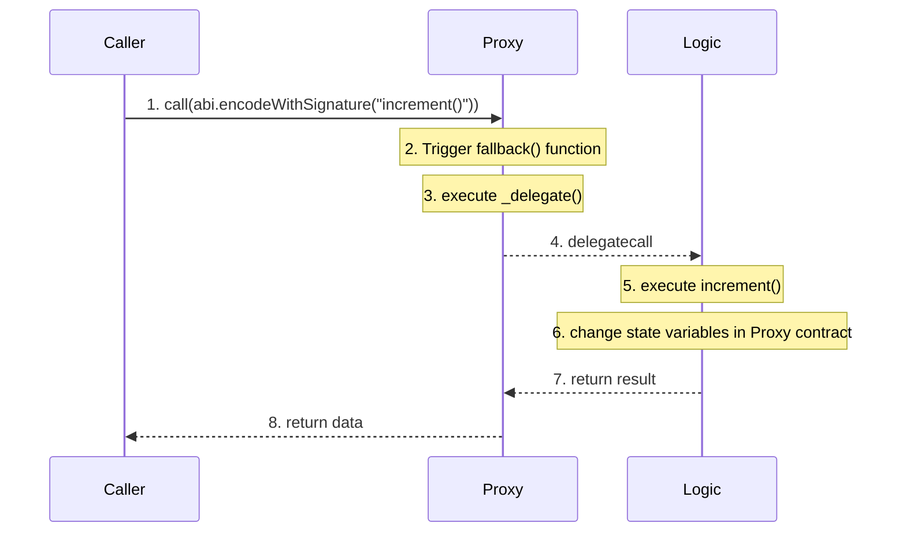
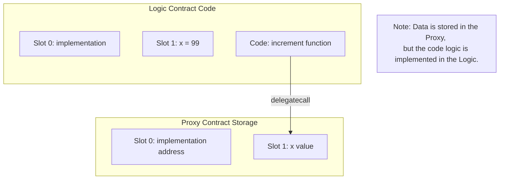
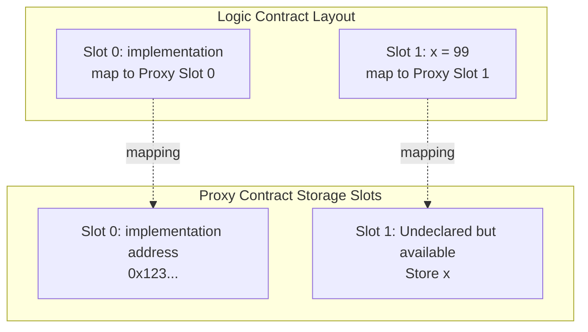
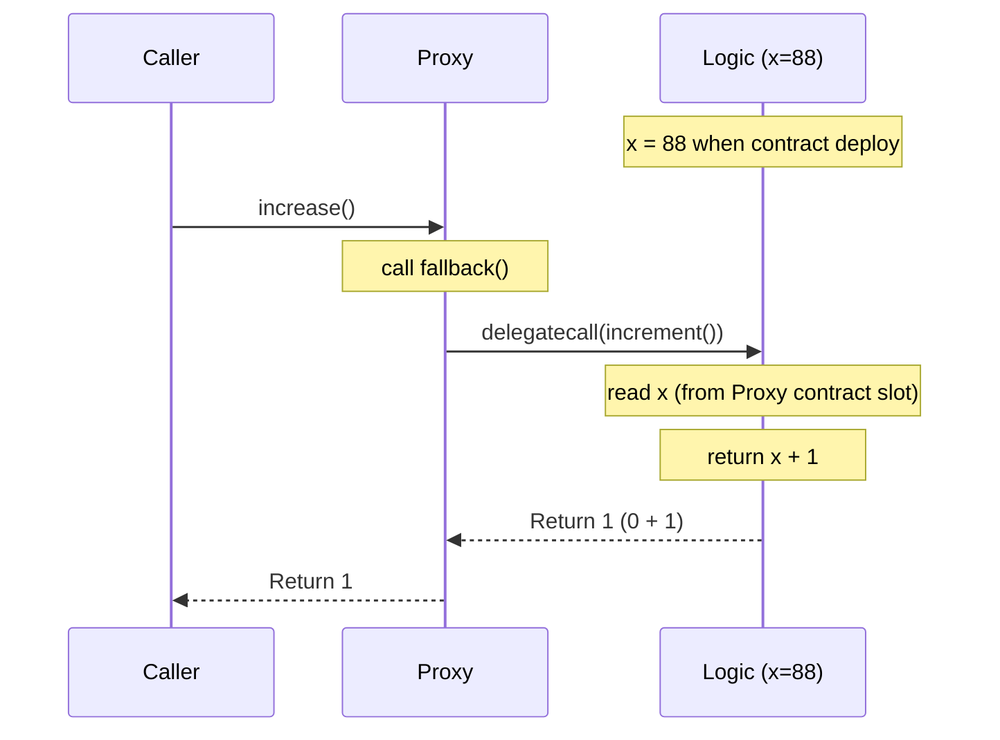
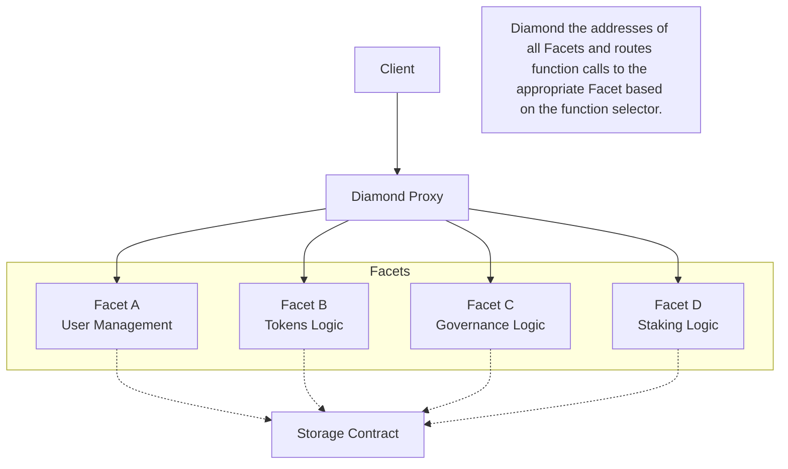

> 请在上边的 timezone 添加你的当地时区，这会有助于你的打卡状态的自动化更新，如果没有添加，默认为北京时间 UTC+8 时区
> 时区请参考以下列表，请移除 # 以后的内容

timezone: Pacific/Honolulu # 夏威夷-阿留申标准时间 (UTC-10)

timezone: America/Anchorage # 阿拉斯加夏令时间 (UTC-8)

timezone: America/Los_Angeles # 太平洋夏令时间 (UTC-7)

timezone: America/Denver # 山地夏令时间 (UTC-6)

timezone: America/Chicago # 中部夏令时间 (UTC-5)

timezone: America/New_York # 东部夏令时间 (UTC-4)

timezone: America/Halifax # 大西洋夏令时间 (UTC-3)

timezone: America/St_Johns # 纽芬兰夏令时间 (UTC-2:30)

timezone: Asia/Dubai # 海湾标准时间 (UTC+4)

timezone: Asia/Kolkata # 印度标准时间 (UTC+5:30)

timezone: Asia/Dhaka # 孟加拉国标准时间 (UTC+6)

timezone: Asia/Bangkok # 中南半岛时间 (UTC+7)

timezone: Asia/Shanghai # 中国标准时间 (UTC+8)

timezone: Asia/Tokyo # 日本标准时间 (UTC+9)

timezone: Australia/Sydney # 澳大利亚东部标准时间 (UTC+10)

---

# YourName

1. 自我介绍
   
   学习 Solidity，想成为一名 Smart contract Auditor。

2. 你认为你会完成本次残酷学习吗？
   
   会。
   
## Notes

<!-- Content_START -->
### 2024.10.16

Day 21

WTF Academy Solidity 101 51_ERC4626

**Round up and Round down in accounting logic**

Recommendation

Follow this.

- previewMint(uint256 shares) - Round Up ⬆
- previewWithdraw(uint256 assets) - Round Up ⬆
- previewRedeem(uint256 shares) - Round Down ⬇
- previewDeposit(uint256 assets) - Round Down ⬇
- convertToAssets(uint256 shares) - Round Down ⬇
- convertToShares(uint256 assets) - Round Down ⬇


---

### 2024.10.15

Day 20

WTF Academy Solidity 101 50_MultisigWallet

**ecrecover**
from signature to address
```
function ecrecover(bytes32 hash, uint8 v, bytes32 r, bytes32 s) returns (address)

```
Input:
- `hash`
- `v`, `r`, `s` 
  
Return:
- `Addess`


```
   require(
         currentOwner > lastOwner && isOwner[currentOwner],
         "WTF5007"
   );
```

- It ensures that each signature comes from a different address. If there were duplicate signatures, the second identical address would not be greater than the previous one.
- It allows the contract to use less gas when verifying signatures. Signatures can be submitted sorted by address, and the contract only needs to scan linearly once to verify all signatures.
- It prevents potential replay attacks, as the same set of signatures must be submitted in the same order


```
    assembly {
        let signaturePos := mul(0x41, pos)
        r := mload(add(signatures, add(signaturePos, 0x20)))
        s := mload(add(signatures, add(signaturePos, 0x40)))
        v := and(mload(add(signatures, add(signaturePos, 0x41))), 0xff)
    }
```
- `let signaturePos := mul(0x41, pos)`
  - Calculate the starting position of the target signature. Each signature occupies 65 bytes ( `0x41` in hexadecimal).
  - `pos` is the index of the signature, so `0x41 * pos` gives the offset of the signature.
- `r := mload(add(signatures, add(signaturePos, 0x20)))`
  - Load the `r` value. `0x20(32 in decimal)` is to skip the length prefix of the bytes type.
  - `mload` loads 32 bytes (256 bits) from a given address
- `s := mload(add(signatures, add(signaturePos, 0x40)))`
  - Load the `s` value. `0x40` is because `s` is located after `r` (32 bytes + 32 bytes = 64 bytes = 0x40)
- `v := and(mload(add(signatures, add(signaturePos, 0x41))), 0xff)`
  - Load the `v` value. `0x41` is because `v` is located after `r` and `s` (65 bytes).
  - and (..., 0xff) ensures that only the last byte is taken because `v` is `uint8`.

---
### 2024.10.14

Day 19

WTF Academy Solidity 101 49_UUPS

**UUPS (Universal Upgradeable Proxy Standard)**
| Standard | Upgrade function lies in | Selector-clashable|Drawbacks|
|:--:|:--:|:--:|:--:|
| Upgradeable Proxy | in Proxy contract | yes | selector clash |
| TransparentProxy | in Proxy contract | no | cost more gas |
| UUPS| in Logic contract| no | more complex |

---
### 2024.10.12

Day 18

WTF Academy Solidity 101 48_TransparentProxy

TransparentProxy

- "selector clash" in proxy contract and logic contracts
- The admin can only upgrade the contract by calling the upgradable function of the proxy contract, without calling the fallback function to call the logic contract.
- Other users cannot call the upgradable function but can call functions of the logic contract.

---
### 2024.10.11

Day 17

WTF Academy Solidity 101 46_ProxyContract, 47_Upgrade

**Deep dive into proxy contracts**

Procee of WTF Proxy Example code

1. Initially, the Caller contract calls the increase() function.
2. The call is forwarded to the Proxy contract. Since the Proxy doesn't have an increment() function, the fallback() function is triggered.
3. The _delegate() function uses inline assembly to perform the following:
   - Reads the logic contract address (implementation).
   - Copies the call data (calldatacopy).
   - Calls the logic contract using delegatecall.
   - Processes the return data.

**Slots in Proxy contract**
```solidity
contract Proxy {
    address public implementation; // Slot 0
    // Slot 1: Undeclared but exist and available
}

contract Logic {
    address public implementation; // Slot 0
    uint public x = 99;           // Slot 1
}
```

Process and Slots



Slot mapping


Process of Proxy contract



**About Data and Logic sparate using Proxy contract pattern**

```solidity
// Logic Contract A
contract LogicA {
    address public implementation;
    uint public x;
    mapping(address => uint) public balances; 

    function initialize() external {
        x = 88;
        // Although the initialization logic is here
        // the data is actually stored in the Proxy's storage
    }
    
    function deposit() external payable {
        balances[msg.sender] += msg.value;
        // The data for this mapping is also stored in the Proxy.
    }
}

// Logic contract B (upgraded new logic)
contract LogicB {
    address public implementation;
    uint public x;
    mapping(address => uint) public balances;
    
    function withdraw(uint amount) external {
        require(balances[msg.sender] >= amount, "Insufficient balance");
        balances[msg.sender] -= amount;
        payable(msg.sender).transfer(amount);
        // Note: The data read and modified here is still stored in the Proxy's storage
    }
}

// Proxy 合约
contract Proxy {
    address public implementation;
    // The actual storage space is here
    // Even though it's not explicitly declared, both x and balances data are stored here.
}
```

**Key Points of Data and Logic Separation**

1. Storage Location
   * All data is actually stored in the storage of the Proxy contract.*
   * The Logic contract merely provides instructions on how to manipulate this data.*

2. Data Persistence
```
// Assuming the following operations:
1. A user deposits 100 ETH via the Proxy by calling deposit()
2. The admin upgrades the implementation to LogicB
3. A user withdraws their funds via the Proxy by calling withdraw()
// The user's balance data remains in the Proxy's storage, even though the logic contract has changed.
```

1. How Storage Actually Works
```
contract Proxy {
    // The storage layout is as follows:
    // slot0: implementation address
    // slot1: x
    // slot2-n: mapping data for balances
    // Although these variables are not explicitly declared, the storage is indeed present.
}
```

1. Tracking Data Flow with an Example
```
// 1. User calls deposit
User -> Proxy.fallback() -> LogicA.deposit()
// Data is written to: Proxy's storage

// 2. Contract upgrade
Admin -> Proxy.upgrade(LogicB_address)
// Data remains unchanged, only the implementation address is modified

// 3. User calls withdraw
User -> Proxy.fallback() -> LogicB.withdraw()
// Data is read from: Still the Proxy's storage
```

Summary

1. The Proxy contract provides the storage space to hold all state data.
2. The Logic contract provides the methods to operate on this data.
3. Through delegatecall, the Logic contract's code executes in the context of the Proxy's storage.
4. The Logic contract can be replaced to change how the data is manipulated without affecting the data itself.

Key Points Explained:
* Data and logic separation: The Proxy contract stores the data, while the Logic contracts define how to interact with that data.
* Data persistence: Once data is stored in the Proxy, it remains there even if the Logic contract is upgraded.
* Storage layout: The Proxy contract has a specific storage layout to store the implementation address and other data.
* Delegatecall: This mechanism allows the Logic contract to execute in the context of the Proxy, providing access to the Proxy's storage.
* Upgradeability: By changing the implementation address, the behavior of the contract can be modified without deploying a new contract.

**47_Upgrade**

An other important upgrade contract protocol

[Diamonds, Multi-Facet Proxy (EIP-2535)](https://eips.ethereum.org/EIPS/eip-2535)

[Diamond Implementations](https://github.com/mudgen/Diamond)

[Awesome Diamonds](https://github.com/mudgen/awesome-diamonds)



---
### 2024.10.10

Day 16

WTF Academy Solidity 101 44_TokenLocker, 45_Timelock

Token Locker
1. Sprcifically designed for locking tokens
2. Commonly used for:
   - Project team token locking to increase investor confidence
   - Token locking after ICO/IDO
   - Liquidity mining rewards locking
3. Functional chatacteristics:
   - Can set linear release
   - Can set batch unlocking
   - Usually only locks ERC20 tokens
   - Generally cannot modify lock time

Time Lock
1. More general time-locking mechanism
2. Main uses:
   - Delayed execution of DAO governance proposals
   - Delayed implementation of DeFi protocol parameter updates
   - Delayed execution of smart contract upgrades
3. Functional characteristics:
   - Can lock any contract all
   - Usually includes cancellation mechanism
   - Can set multiple administrators
   - Supports queue management for multiple operations

Key Differences:
1. Code structure:
   - TokenLocker focuses on token locking and unlocking logic
   - TimeLock focuses on delayed execution mechanism for general transactions
2. Flexbility:
   - TokenLocker specializes in token locking, relatively single-purpose
   - TimeLock can execute any contract calls, more flexible

---

### 2024.10.09

Day 15

WTF Academy Solidity 101 42_PaymentSplit, 43_TokenVesting

**Pull Payment**

Advantages

1. **Reduced Risk of Denial of Service (DOS)**: IF sending payments to multiple recipients, a single failing transfer won't block the entire operation since each recipient withdraws independently.
2. **Reentrancy Protection**: In the Push Payment approach, the contract directly transfers funds, which can be vulnerable to re-entrancy attacks if the recipient’s fallback or receive function attempts to call back into the contract. With Pull Payments, the recipient initiates the transfer, reducing this attack surface.
3. **Prevents Failed Transactions from Halting Payment Distribution**: If the contract uses a loop to pay multiple recipients in a push-style approach, a single failed transaction can halt the entire loop, preventing other recipients from being paid. With Pull Payments, each recipient’s withdrawal is handled individually, so one recipient’s failure does not impact others.
4. **Reduces Gas Costs on Payment Execution**
5. **Better Fund Management** Recipients can choose when to withdraw their funds, which can be advantageous for tax planning or gas price optimization.

Common use cases:

- Marketplaces where sellers receive payments
- Reward distribution systems
- Dividend payments

Reference:
[Openzeppelin PaymentSplitter](https://docs.openzeppelin.com/contracts/4.x/api/finance#PaymentSplitter)
[Openzeppelin PullPayment](https://docs.openzeppelin.com/contracts/4.x/api/security#PullPayment)


**TokenVesting**

Reference:
[Openzeppelin VestingWallet](https://docs.openzeppelin.com/contracts/4.x/api/finance#VestingWallet)

**Cliff Vesting**

Cliff vesting is a token release strategy where tokens are completely locked during an initial period (cliff period). Once the cliff period ends, a predetemined portion of tokens is immediately released, and the remaining tokens.

Example:

1. Cliff Period

   - Initial period where tokens are completely locked
   -  No tokens can be withdrawn during this time
   -  Typically 6-12 months for team tokens

2. Cliff Release

   - Immediate release of a predetermined amount when cliff ends
   - Usually 20-25% of total tokens
   - Provides initial liquidity to beneficiaries

3. Linear Vesting

   - Remaining tokens are released linearly over time
   - Smooth release curve reduces market impact
   - Continuous incentive for long-term participation

```
   Total Amount: 1,000,000 tokens
   Cliff Period: 6 months
   Cliff Release: 200,000 tokens (20%)
   Total Duration: 12 months

   Timeline:
   Months 0-6: 0 tokens (locked)
   Month 6: 200,000 tokens (cliff release)
   Months 7-12: ~133,333 tokens/month (linear)
   Month 12: All tokens released
```

Types of Vesting:

- With time-based vesting, tokens are progressively released to holders over a set amount of time.

- Milestone-based vesting releases tokens upon the achievement of certain project milestones.

- Hybrid vesting combines elements of both time-based and milestone-based vesting.

- Reverse vesting involves tokens being released all at once, with the potential for them to be repurchased if certain conditions are not met.

---
### 2024.10.08

Day 14

WTF Academy Solidity 101 40_ERC1155, 41_WETH

**ERC1155**
- Allows sending multiple different tokens in a single trancation. Commonly used in blockchain games.

**WETH**

`WETH9` is a commonly used implementation of Wrapped Ether (`WETH`) on the Ethereum blockchain. It’s essentially an ERC-20 compliant contract that allows users to convert their native Ether (`ETH`) into an ERC-20 token (`WETH`).

- `WETH9` is the ninth version of the `WETH` contract and is widely used in Ethereum applications.

`WETH9` well-known issues:

  1. Silent Fallback Method
  2. no `permit` function: 1 + 2 = attack [https://medium.com/zengo/without-permit-multichains-exploit-explained-8417e8c1639b](https://medium.com/zengo/without-permit-multichains-exploit-explained-8417e8c1639b)
  3. Inefficient Common Patterns

- [https://ethereum-magicians.org/t/rfc-improving-weth9-moving-to-a-better-wrapped-ether-implementation/12487](https://ethereum-magicians.org/t/rfc-improving-weth9-moving-to-a-better-wrapped-ether-implementation/12487)

----
### 2024.10.07

Day 13

WTF Academy Solidity 101 38_NFTSwap, 39_Random

**NFT Exchange**

- There are two main contract
  - NFT contract: `WTFApe.sol`
  - NFT exchange contract: `NFTSwap.sol`
- first: The NFT owner need `approve` NFT exchange contract to list the NFT for sale in NFT contract.
- All trancations recorded in the NFT contract.

**Random**

Migrating Code from Chainlink VRF V2 to V2.5

```Solidity
// SPDX-License-Identifier: MIT
pragma solidity ^0.8.21;

import "https://github.com/AmazingAng/WTF-Solidity/blob/main/34_ERC721/ERC721.sol";
import {VRFConsumerBaseV2Plus} from "@chainlink/contracts/src/v0.8/vrf/dev/VRFConsumerBaseV2Plus.sol";
import {VRFV2PlusClient} from "@chainlink/contracts/src/v0.8/vrf/dev/libraries/VRFV2PlusClient.sol";

contract Random is ERC721, VRFConsumerBaseV2Plus{
    // NFT parameters
    uint256 public totalSupply = 100; // total supply
    uint256[100] public ids; // used to calculate tokenId that can be mint
    uint256 public mintCount; // the number of mint, the default value is 0

    // VRF events
    event RequestSent(uint256 requestId, uint numWords);
    event RequestFulfilled(uint256 requestId, uint256[] randomWords);
    event DebugLog(string message);
    event ErrorLog(string message);

    // NFT mint event
    event NFTMinted(address indexed to, uint256 indexed tokenId, uint256 requestId);

    // Request status struct
    struct RequestStatus {
        bool fulfilled; // 0: Request not fulfilled, 1: fulfilled
        bool exists; // 0: Request Id not exists, 1: exists
        uint256[] randomWords;
        uint256 tokenId;
    }

    mapping(uint256 => RequestStatus) public s_requests; // requestId --> requestStatus
    mapping(uint256 => address) public requestToSender; // requestId --> minter address
    mapping(address => uint256[]) public userMints;


    // chainlink VRF parameters
    
    uint256 public s_subscriptionId; // VRF subscription id
    uint256[] public requestIds; // history subscription ids
    uint256 public  lastRequestId; // last request Id

    // Sepolia testnet settings
    bytes32 public keyHash = 0x787d74caea10b2b357790d5b5247c2f63d1d91572a9846f780606e4d953677ae;
    uint32 public callbackGasLimit = 2_000_000;
    uint16 public requestConfirmations = 3;
    uint32 public numWords = 1;

        
    ///// No need to declare a coordinator variable /////
    ///// Use the `s_vrfCoordinator` from VRFConsumerBaseV2Plus.sol /////
    constructor(
        uint256 subscriptionId
    ) VRFConsumerBaseV2Plus(0x9DdfaCa8183c41ad55329BdeeD9F6A8d53168B1B) // Sepolia VRF Coordinator
        ERC721("WTF Random", "WTF"){
            s_subscriptionId = subscriptionId;
            emit DebugLog("Contract initialized with subscription ID");
    }

    /** 
    * Input a uint256 number and return a tokenId that can be mint
    */
    function pickRandomUniqueId(uint256 random) private returns (uint256 tokenId) {
        // Calculate the subtraction first, then calculate ++, pay attention to the difference between (a++, ++a)
        uint256 len = totalSupply - mintCount++; // mint quantity
        require(len > 0, "mint close"); // all tokenIds are mint finished
        uint256 randomIndex = random % len; // get the random number on the chain

        // Take the modulus of the random number to get the tokenId as an array subscript, and record the value as len-1 at the same time. If the value obtained by taking the modulus already exists, then tokenId takes the value of the array subscript
        tokenId = ids[randomIndex] != 0 ? ids[randomIndex] : randomIndex; // get tokenId
        ids[randomIndex] = ids[len - 1] == 0 ? len - 1 : ids[len - 1]; // update ids list
        ids[len - 1] = 0; // delete the last element, can return gas
    }

    /**
    * On-chain pseudo-random number generation
    * keccak256(abi.encodePacked() fill in some global variables/custom variables on the chain
    * Convert to uint256 type when returning
    */
    function getRandomOnchain() public view returns(uint256){
    /*
        * In this case, randomness on the chain only depends on block hash, caller address, and block time,
        * If you want to improve the randomness, you can add some attributes such as nonce, etc., but it cannot fundamentally solve the security problem
        */
        bytes32 randomBytes = keccak256(abi.encodePacked(blockhash(block.number-1), msg.sender, block.timestamp));
        return uint256(randomBytes);
    }

    // Use the pseudo-random number on the chain to cast NFT
    function mintRandomOnchain() public {
        uint256 _tokenId = pickRandomUniqueId(getRandomOnchain()); // Use the random number on the chain to generate tokenId
        _mint(msg.sender, _tokenId);
    }
    
    function mintRandomVRFWithLINK() public returns (uint256 requestId) {
        return  mintRandomVRF(false);
    }

    /**
    * Call VRF to get random number and mintNFT
    * To call the requestRandomness() function to obtain, the logic of consuming random numbers is written in the VRF callback function fulfillRandomness()
    * Before calling, transfer LINK tokens to this contract
    */
    ///// UPDATE TO NEW V2.5 REQUEST FORMAT /////
    // To enable payment in native tokens, set nativePayment to true.
    // Use the `s_vrfCoordinator` from VRFConsumerBaseV2Plus.sol
    function mintRandomVRF(bool enableNativePayment) public returns (uint256 requestId) {
        requestId = s_vrfCoordinator.requestRandomWords(
            VRFV2PlusClient.RandomWordsRequest({
                keyHash: keyHash,
                subId: s_subscriptionId,
                requestConfirmations: requestConfirmations,
                callbackGasLimit: callbackGasLimit,
                numWords: numWords,
                extraArgs: VRFV2PlusClient._argsToBytes(
                    VRFV2PlusClient.ExtraArgsV1({
                        nativePayment: enableNativePayment
                    })
                )
            })
        );

        s_requests[requestId] = RequestStatus({
            randomWords: new uint256[](0),
            exists: true,
            fulfilled: false,
            tokenId: 0
        });
        requestToSender[requestId] = msg.sender; // record sender
        requestIds.push(requestId);
        lastRequestId = requestId;
        emit RequestSent(requestId, numWords);
        emit DebugLog("Random number requested successfully");
        return requestId;
    }

    /**
    * VRF callback function, called by VRF Coordinator
    * The logic of consuming random numbers is written in this function
    */
    function fulfillRandomWords(
        uint256 _requestId, 
        uint256[] calldata _randomWords
    ) internal override{
        //require(s_requests[_requestId].exists, "request not found");
        emit DebugLog("Fulfilling random words");

        s_requests[_requestId].fulfilled = true;
        s_requests[_requestId].randomWords = _randomWords; // Update the request status
        
        address sender = requestToSender[_requestId]; // Get minter user address from requestToSender
        uint256 tokenId = pickRandomUniqueId(_randomWords[0]); // Use the random number returned by VRF to generate tokenId
        _mint(sender, tokenId); // mint NFT

        s_requests[_requestId].tokenId = tokenId;
        userMints[sender].push(tokenId);

        emit RequestFulfilled(_requestId, _randomWords);
        emit NFTMinted(sender, tokenId, _requestId);
        emit DebugLog("Random words fulfilled and NFT minted");
    }

    /**
    *
    */
    function getRequestStatus(
        uint256 _requestId
    ) external view  returns (
        bool fufilled, 
        uint256[] memory randomWords,
        uint256 tokenId
    ){
        require(s_requests[_requestId].exists, "request not found");
        RequestStatus memory request = s_requests[_requestId];
        return (request.fulfilled, request.randomWords, request.tokenId);
    }

    function getUserMints(address user) external view returns (uint256[] memory) {
        return userMints[user];
    }

    function getLastMintResult() external view returns (
        uint256 requestId,
        bool fulfilled,
        uint256 tokenId
    ) {
        require(lastRequestId != 0, "No minting history");
        RequestStatus memory request = s_requests[lastRequestId];
        return (lastRequestId, request.fulfilled, request.tokenId);
    }

    function getContractState() external view returns (
        uint256 currentSubscriptionId,
        uint256 totalMinted,
        uint256 remainingSupply,
        uint256 lastRequestIdentifier
    ) {
        return (
            s_subscriptionId,
            mintCount,
            totalSupply - mintCount,
            lastRequestId
        );
    }       

}
```
### 2024.10.05

Day 12

WTF Academy Solidity 101 36_MerkleTree, 37_Signature


WTF Merkle Tree lib (Modified from OpenZepplin)

```
   library MerkleProof {
      /**
      * @dev Returns `true` when the `root` reconstructed from `proof` and `leaf` equals to the given `root`, meaning the data is valid.
      * During reconstruction, both the leaf node pairs and element pairs are sorted.
      */
      function verify(
         bytes32[] memory proof,
         bytes32 root,
         bytes32 leaf
      ) internal pure returns (bool) {
         return processProof(proof, leaf) == root;
      }

      /**
      * @dev Returns the `root` of the Merkle tree computed from a `leaf` and a `proof`.
      * The `proof` is only valid when the reconstructed `root` equals to the given `root`.
      * During reconstruction, both the leaf node pairs and element pairs are sorted.
      */
      function processProof(bytes32[] memory proof, bytes32 leaf) internal pure returns (bytes32) {
         bytes32 computedHash = leaf;
         for (uint256 i = 0; i < proof.length; i++) {
               computedHash = _hashPair(computedHash, proof[i]);
         }
         return computedHash;
      }

      // Sorted Pair Hash
      function _hashPair(bytes32 a, bytes32 b) private pure returns (bytes32) {
         return a < b ? keccak256(abi.encodePacked(a, b)) : keccak256(abi.encodePacked(b, a));
      }
   }
```

[Solady MerkleProofLib](https://github.com/vectorized/solady/blob/main/src/utils/MerkleProofLib.sol)

- Gas optimized
- Midified from Solamte, OpenZeppelin

```
    function verify(bytes32[] memory proof, bytes32 root, bytes32 leaf)
        internal
        pure
        returns (bool isValid)
    {
        /// @solidity memory-safe-assembly
        assembly {
            if mload(proof) {
                // Initialize `offset` to the offset of `proof` elements in memory.
                let offset := add(proof, 0x20)
                // Left shift by 5 is equivalent to multiplying by 0x20.
                let end := add(offset, shl(5, mload(proof)))
                // Iterate over proof elements to compute root hash.
                for {} 1 {} {
                    // Slot of `leaf` in scratch space.
                    // If the condition is true: 0x20, otherwise: 0x00.
                    let scratch := shl(5, gt(leaf, mload(offset)))
                    // Store elements to hash contiguously in scratch space.
                    // Scratch space is 64 bytes (0x00 - 0x3f) and both elements are 32 bytes.
                    mstore(scratch, leaf)
                    mstore(xor(scratch, 0x20), mload(offset))
                    // Reuse `leaf` to store the hash to reduce stack operations.
                    leaf := keccak256(0x00, 0x40)
                    offset := add(offset, 0x20)
                    if iszero(lt(offset, end)) { break }
                }
            }
            isValid := eq(leaf, root)
        }
    }
```

[Solmate MekleProofLib](https://github.com/transmissions11/solmate/blob/main/src/utils/MerkleProofLib.sol)

- Gas optimized than others
  - `calldata` is more gas efficient than `memory`
- Midified from Solady
  
```
   library MerkleProofLib {
      function verify(
         bytes32[] calldata proof,
         bytes32 root,
         bytes32 leaf
      ) internal pure returns (bool isValid) {
         /// @solidity memory-safe-assembly
         assembly {
               if proof.length {
                  // Left shifting by 5 is like multiplying by 32.
                  let end := add(proof.offset, shl(5, proof.length))

                  // Initialize offset to the offset of the proof in calldata.
                  let offset := proof.offset

                  // Iterate over proof elements to compute root hash.
                  // prettier-ignore
                  for {} 1 {} {
                     // Slot where the leaf should be put in scratch space. If
                     // leaf > calldataload(offset): slot 32, otherwise: slot 0.
                     let leafSlot := shl(5, gt(leaf, calldataload(offset)))

                     // Store elements to hash contiguously in scratch space.
                     // The xor puts calldataload(offset) in whichever slot leaf
                     // is not occupying, so 0 if leafSlot is 32, and 32 otherwise.
                     mstore(leafSlot, leaf)
                     mstore(xor(leafSlot, 32), calldataload(offset))

                     // Reuse leaf to store the hash to reduce stack operations.
                     leaf := keccak256(0, 64) // Hash both slots of scratch space.

                     offset := add(offset, 32) // Shift 1 word per cycle.

                     // prettier-ignore
                     if iszero(lt(offset, end)) { break }
                  }
               }

               isValid := eq(leaf, root) // The proof is valid if the roots match.
         }
      }
   }
```

[OpenZeppelin MerkelProof lib](https://github.com/OpenZeppelin/openzeppelin-contracts/blob/master/contracts/utils/cryptography/MerkleProof.sol)

```
   // Check link above
```


|Gas | WTF Version | Solady version | Solmate Version |
| -- | -- | -- | -- |
|Gas|109577|108433|108222|
|Transaction cost|95284|94289|94106|
|Execute cost|72420|71425|71242|

**Signature**

- [OpenZeppelin ECDSA](https://github.com/OpenZeppelin/openzeppelin-contracts/blob/master/contracts/utils/cryptography/ECDSA.sol)
- [Solady ECDSA (gas optimized)](https://github.com/vectorized/solady/blob/main/src/utils/ECDSA.sol)

---
### 2024.10.04

Day 11

WTF Academy Solidity 101 34_ERC721, 35_DutchAuction

ERC165 and ERC721

Solamte version

```
   function supportsInterface(bytes4 interfaceId) public view virtual returns (bool) {
         return
               interfaceId == 0x01ffc9a7 || // ERC165 Interface ID for ERC165
               interfaceId == 0x80ac58cd || // ERC165 Interface ID for ERC721
               interfaceId == 0x5b5e139f; // ERC165 Interface ID for ERC721Metadata
   }
```
OpenZepplion version

```
   function supportsInterface(bytes4 interfaceId) public view virtual override(ERC165, IERC165) returns (bool) {
        return
            interfaceId == type(IERC721).interfaceId ||
            interfaceId == type(IERC721Metadata).interfaceId ||
            super.supportsInterface(interfaceId);
    }
```
Dutch Aution

- In the best interests of the project party
- Avoid gas wars

Dutch Auction mechanism design:

1. Basic Parameters:
   - startAmount: Total auction quantity (e.g., number of NFTs)
   - startPrice: Starting/maximum price
   - reservePrice: Floor price/minimum price
     * Recommendation: reservePrice ≤ startPrice * 50% (floor price not higher than 50% of starting price)
   - duration: Total auction duration
     * Recommendation: Set minimum duration (e.g., 1 hour) to prevent flash sales
     * Recommendation: Set maximum duration (e.g., 7 days) to avoid indefinite extensions

2. Price Decay Mechanism:
   - decayInterval: Price update interval
     * Example: Every 5 minutes, hourly, etc.
     * Recommendation: Not too frequent (gas costs) nor too long (price smoothness)
   - minDecayPerInterval: Minimum price reduction per interval
     * Example: Minimum 2% reduction each time
     * Prevents minimal price drops to circumvent auction mechanism
   - priceFunction: Price decay function
     * Linear decay: (endPrice - startPrice) * (elapsedTime / duration)
     * Exponential decay: startPrice * (1 - decayRate)^(elapsedTime / decayInterval)

3. Constraints:
   
   ```solidity
   // Basic parameter checks
   require(startAmount > 0, "Invalid amount");
   require(startPrice > reservePrice, "Invalid price range");
   require(duration >= MIN_DURATION && duration <= MAX_DURATION, "Invalid duration");

   // Price reduction check
   require(
      reservePrice <= startPrice * 50 / 100,
      "Reserve price too high"
   );

   // Decay interval check
   require(
      decayInterval >= MIN_DECAY_INTERVAL,
      "Decay interval too short"
   );

   // Minimum decay rate check
   require(
      minDecayPerInterval >= MIN_DECAY_RATE,
      "Decay rate too small"
   );
   ```

---
### 2024.10.03

Day 10

WTF Academy Solidity 101 32_Faucet, 33_Airdrop


Mitigate DOS Attack for `Airdrop.sol`

1. Removed the direct transfer logic in the `multiTransferETH` function, replacing it with a record of the ETH amount due to each address.
2. Added a `withdrawETH` function, impllement the **pull payment pattern**. This allows recipients to withdraw their ETH themselves, rather than the contract actively sending it.
3. In the `multiTransferToken` function, we now check the success of each transfer and emit an event if it fails.
4. Added events `TransferFailed` and `WithdrawnFromFailedList` to log important state changes.
5. Added a `receive` function to enable the contract to receive ETH.
6. Renamed `failTransferList` to `failedTransfers` and made it public for easier querying.
7. In `multiTransferToken`, changed `>` to `>=` to allow for exact allowance amounts.

```
// SPDX-License-Identifier: MIT
// By 0xAA (Improved by Assistant)
pragma solidity ^0.8.21;

import "./IERC20.sol";

/// @notice Contract for airdropping ERC20 tokens and ETH to multiple addresses
contract Airdrop {
    mapping(address => uint) public failedTransfers;
    
    event TransferFailed(address indexed recipient, uint256 amount);
    event WithdrawnFromFailedList(address indexed recipient, address indexed to, uint256 amount);

    /// @notice Transfer ERC20 tokens to multiple addresses, requires prior approval
    ///
    /// @param _token Address of the ERC20 token to transfer
    /// @param _addresses Array of recipient addresses
    /// @param _amounts Array of token amounts to transfer (corresponds to each address)
    function multiTransferToken(
        address _token,
        address[] calldata _addresses,
        uint256[] calldata _amounts
    ) external {
        require(
            _addresses.length == _amounts.length,
            "Lengths of Addresses and Amounts NOT EQUAL"
        );
        IERC20 token = IERC20(_token);
        uint _amountSum = getSum(_amounts);
        require(
            token.allowance(msg.sender, address(this)) >= _amountSum,
            "Insufficient allowance"
        );

        for (uint256 i; i < _addresses.length; i++) {
            bool success = token.transferFrom(msg.sender, _addresses[i], _amounts[i]);
            if (!success) {
                emit TransferFailed(_addresses[i], _amounts[i]);
            }
        }
    }

    /// @notice Initiate ETH transfer to multiple addresses
    /// @dev Uses pull payment pattern to avoid DOS attacks
    function multiTransferETH(
        address[] calldata _addresses,
        uint256[] calldata _amounts
    ) public payable {
        require(
            _addresses.length == _amounts.length,
            "Lengths of Addresses and Amounts NOT EQUAL"
        );
        uint _amountSum = getSum(_amounts);
        require(msg.value == _amountSum, "Transfer amount error");

        for (uint256 i = 0; i < _addresses.length; i++) {
            failedTransfers[_addresses[i]] += _amounts[i];
        }
    }

    /// @notice Allows recipients to withdraw their ETH
    /// @param _to Address to receive the withdrawn ETH
    function withdrawETH(address payable _to) public {
        uint amount = failedTransfers[msg.sender];
        require(amount > 0, "No ETH to withdraw");
        
        failedTransfers[msg.sender] = 0;
        
        (bool success, ) = _to.call{value: amount}("");
        require(success, "ETH transfer failed");
        
        emit WithdrawnFromFailedList(msg.sender, _to, amount);
    }

    /// @notice Function to sum an array of uint256
    function getSum(uint256[] calldata _arr) public pure returns (uint sum) {
        for (uint i = 0; i < _arr.length; i++) {
            sum += _arr[i];
        }
    }

    /// @notice Allows the contract to receive ETH
    receive() external payable {}
}
```
(Claude helped with code modification)


---
### 2024.10.02

Day 9

WTF Academy Solidity 101 30_TryCatch, 31_ERC20

Try Catch
- `external` or `public` function
- call `constructor` when creating contracts

ERC20

- User's `ERC20Token` store in `mapping(address => uint256) public override balanceOf;` in the ERC20 contract
  - Any transaction of erc20 tokens is an increase or decrease of this mapping `balanceOf`.

- first `appprover` next `transferFrom`

---
### 2024.10.01

Day 8

WTF Academy Solidity 101 27_ABIEncode, 28_Hash, 29_Selector

ABI encode
- has 4 parameters, can use only some of them
- `abi.encode`: 32-bytes
- `abi.encodePacked`: compacts encoding
- `abi.encodeWithSignature`: first parameter - `function signatures`
- `abi.encodeWithSelector`: first parameter - `function selector`
- `abi.encodeCall`: Syntactic sugar vesion of `abi.encodeWithSelector` and `abi.encodeWithSignature`

ABI decode
- `abi.decode`: decode the data of `abi.encode`

ABI Scenarios:

1. low-level call

   ```solidity
      bytes4 selector = contract.getValue.selector;

      bytes memory data = abi.encodeWithSelector(selector, _x);
      (bool success, bytes memory returnedData) = address(contract).staticcall(data);
      require(success);

      return abi.decode(returnedData, (uint256));
   ```
2. enthers.js

   ```
      const wavePortalContract = new ethers.Contract(contractAddress, contractABI, signer);
      /*
         * Call the getAllWaves method from your Smart Contract
         */
      const waves = await wavePortalContract.getAllWaves();
   ```

3. non-open contract, call non signature functions
   
   ```
      bytes memory data = abi.encodeWithSelector(bytes4(0x533ba33a));

      (bool success, bytes memory returnedData) = address(contract).staticcall(data);
      require(success);

      return abi.decode(returnedData, (uint256));
   ```
4. The most commonly used method in projects is `abi.encodeCall`. 
   Its advantage is that, compared to `abi.encodeWithSignature` and `abi.encodeWithSelector`, `abi.encodeCall` automatically checks the function signature and parameters at compile time, preventing spelling mistakes and parameter type mismatches. `abi.encodeWithSignature` dynamically accepts a string to represent the function signature, so when you use `abi.encodeWithSignature`, the compiler does not check if the function name or parameters are correct, as it treats the string as regular input data.

   ```solidity
   // SPDX-License-Identifier: MIT
   pragma solidity ^0.8.26;

   interface IERC20 {
      function transfer(address, uint256) external;
   }

   contract Token {
      function transfer(address, uint256) external {}
   }

   contract AbiEncode {
      function test(address _contract, bytes calldata data) external {
         (bool ok,) = _contract.call(data);
         require(ok, "call failed");
      }

      function encodeWithSignature(address to, uint256 amount)
         external
         pure
         returns (bytes memory)
      {
         // Typo is not checked - "transfer(address, uint)"
         return abi.encodeWithSignature("transfer(address,uint256)", to, amount);
      }

      function encodeWithSelector(address to, uint256 amount)
         external
         pure
         returns (bytes memory)
      {
         // Type is not checked - (IERC20.transfer.selector, true, amount)
         return abi.encodeWithSelector(IERC20.transfer.selector, to, amount);
      }

      function encodeCall(address to, uint256 amount)
         external
         pure
         returns (bytes memory)
      {
         // Typo and type errors will not compile
         return abi.encodeCall(IERC20.transfer, (to, amount));
      }
   }


   ```

Hash

- Generate a uinque identifier of the data
  ```
      function hash(
         uint _num,
         string memory _string,
         address _addr
         ) public pure returns (bytes32) {
            return keccak256(abi.encodePacked(_num, _string, _addr));
         }
  ```

Selector

```solidity

    // 1. elementary parameters selector
    // Input：param1: 1，param2: 0
    // elementaryParamSelector(uint256,bool) : 0x3ec37834
    function elementaryParamSelector(uint256 param1, bool param2) external returns(bytes4       selectorWithElementaryParam){
        emit SelectorEvent(this.elementaryParamSelector.selector);
        return bytes4(keccak256("elementaryParamSelector(uint256,bool)"));
    }

    // 2. fixed size parameters selector
    // Input： param1: [1,2,3]
    // fixedSizeParamSelector(uint256[3]) : 0xead6b8bd
    function fixedSizeParamSelector(uint256[3] memory param1) external returns(bytes4 selectorWithFixedSizeParam){
        emit SelectorEvent(this.fixedSizeParamSelector.selector);
        return bytes4(keccak256("fixedSizeParamSelector(uint256[3])"));
    }

    // 3. non-fixed size parameters selector
    // Input： param1: [1,2,3]， param2: "abc"
    // nonFixedSizeParamSelector(uint256[],string) : 0xf0ca01de
    function nonFixedSizeParamSelector(uint256[] memory param1,string memory param2) external returns(bytes4 selectorWithNonFixedSizeParam){
        emit SelectorEvent(this.nonFixedSizeParamSelector.selector);
        return bytes4(keccak256("nonFixedSizeParamSelector(uint256[],string)"));
    }


   // 4.
   contract DemoContract {
       // empty contract
   }

   contract Selector{
       // Struct User
       struct User {
           uint256 uid;
           bytes name;
       }
       // Enum School
       enum School { SCHOOL1, SCHOOL2, SCHOOL3 }
       ...
       // mapping parmeters selector
       // Input：demo: 0x9D7f74d0C41E726EC95884E0e97Fa6129e3b5E99， user: [1, "0xa0b1"], count: [1,2,3], mySchool: 1
       // mappingParamSelector(address,(uint256,bytes),uint256[],uint8) : 0xe355b0ce
       function mappingParamSelector(DemoContract demo, User memory user, uint256[] memory count, School mySchool) external returns(bytes4 selectorWithMappingParam){
           emit SelectorEvent(this.mappingParamSelector.selector);
           return bytes4(keccak256("mappingParamSelector(address,(uint256,bytes),uint256[],uint8)"));
       }
       ...
   }
```

---

### 2024.09.30

Day 7

WTF Academy Solidity 101 24-26

- `Create2` is used more often than `Create`.

Opinion of `SELFDESTRUCT` change after Cancun Update

- `SELFDESTRUCT` was initially designed as a safety measure for emergency situations.
- As the ecosystem evolved, `SELFDESTRUCT` began to pose potential systemic risks.
- With increasing interdependence among contracts, the destruction of a single contract could potendially impact the entire eco.
- In most emergency situations, the primary concern is fund security.
- Simply transferring funds is often sufficient to mitigate risks, without the need to completely destroy the contract.
- The recent update represents a refinement of the `SELFDESTRUCT` functionality, striking a balance between risk migitgation and practical utility.

---
### 2024.09.28
Day 6
WTF Academy Solidity 101 20-23

20. Sending ETH

      Recommended:

      - Usage: `receiverAddress.call{value: value in Wei}("")`.
      
      Other:

      - Usage: `receiverAddress.send(value in Wei)`.
      - Usage: `receiverAddress.transfer(value in Wei)`.

21. Interact with other Contract
    
    ```solidity
       // 1. Pass the contract address
       function callSetX(address _Address, uint256 x) external {
            OtherContract(_Address).setX(x);
       }

       // 2. Pass the contract variable
       function callGetX(OtherContract _Address) external view returns(uint x){
            x = Address.getX();
       }

       // 3. Creat contract variable
       function callGetX2(address _Address) external view returns(uint x){
            OtherContract oc = OtherContract(_Address);
            x = oc.getX();
       }

       // 4. Interact with the contract and send `ETH`
       function setXTransferETH(address otherContract, uint256 x) payable external{
            OtherContract(otherContract).setX{value: msg.value}(x)
       }
    ```
22. Call

   - Recommend: Sending ETH  `receiverAddress.call{value: value in Wei}("")`. 
   - Not Recommend: Call other contract.

23. Delegatecall
    
    - Proxy Contract
    - EIP-2535 Diamond

---

### 2024.09.27
Day 5
WTF Academy Solidity 101 16-19

Library
1. State variables are not allowed
2. Cannot inherit or be inherited
3. Cannot receive ether
4. Cannot be destroyed.

Use library contracts
```solidity
   // Using the library with the "using for"
   using Strings for uint256;
   function getString1(uint256 _number) public pure returns(string memory){
      // Library functions are automatically added as members of uint256 variavles
      return _number.toHexSting();
   }
```

```solidity
    // Called directly by the library contract name
    function getString2(uint256 _number) public pure returns(string memory){
        return Strings.toHexString(_number);
    }
```

4 Ways of Import

```solidity
   Hierarchy
   |-- Import.sol
   |__ Yeye.sol

   // Import by relative location of source file
   import './Yeye.sol';
   
   // Import by URL
   import 'https://github.com/OpenZeppelin/openzeppelin-contracts/blob/master/contracts/utils/Address.sol';

   // Import via the npm
   import '@openzeppelin/contracts/access/Ownable.sol';


   // Import contract-specific global symbols by specifying global symbols.
   import {Yeye} from './Yeye.sol';

```

`receive()`
- revceiving `ETH` 
- Some malicious contracts intentionally add codes in `receive()`, which cosume massive `gas` or cause the transaction to get reversted. -- **Pull over push pattern**


`fallback()`

```
Execute fallback() or receive()?
         Receive ETH
              |
      msg.data is empty?
            /  \
          Yes   No
          /      \
Has receive()?   fallback()
        / \
      Yes  No
      /     \
receive()   fallback()
```
---

### 2024.09.26
Day 4 
WTF Academy Solidity 101 13-15

13. Inheritance
    
    - If a `public` state variable is labelled as `override`, it `getter` function will be overridden. For example:
  
      ```solidity
         mapping(address => uint256) public override balanceOf;
      ```
      `getter` function is `balanceOf(address)`

      Why:
      -  Unexpected behavior changes: Callers might expect the original getter behavior. but instead receive the overridden behavior.
      -  Security considerations: Overriding the getter could affect other contracts that depend on the original behavior.

14. Abstract and Interface
    
     Abstract

     - At least one unimplemented function (empty in `{}` )
     - A contract can be marked as abstract even if all functions have implementations
     
     Interface

     - no state variavles
     - no constructors
     - no inherit non-interface
     - must be external and empty in `{}`
     - Contract inherits interface must implement all functions

     - like " a manual of the contract "

15. Errors
    
    - `revert` => `error`
    - `require(condition, "error message");`


### 2024.09.25
Day 3
WTF Academy Solidity 101 9-12

**Key Points**

9. Constant and Immutable
   
    - `immutable` variable can be initialized in the **constructor**;

10. Control Flow
11. Constructor & Modifier
    
    Constructor in inheritance
    
      ```solidity
         // father contract

         contract ImmutableState {
            
            IPoolManager public immutable poolManager;

            constructor(IPoolManager _poolManager) {
               poolManager = _poolManager;
            }
         }
         
         // 
         contract SafeCallback is ImmutableState {
            ...
            //using father contract's constructor
            constructor(IPoolManager _poolManager) ImmutableState(_poolManager) {} 
            ...
         }
         

      ```

    Modifier

      ``` solidity
         modifier onlyOwner {
            require(msg.sender == owner);
            _;
         }

         function changeOwner(address _newOwner) external onlyOwner {
            owner = _newOwner;
         }
      ```
12. Event
    ```solidity
      // define event
      event Transfer(address indexed from, address indexed to, uint256 value);
    
      // define _transfer function， execute transfer logic
      function _transfer(
         address from,
         address to,
         uint256 amount
      ) external {

         _balances[from] = 10000000; // give some initial tokens to transfer address

         _balances[from] -=  amount; // "from" address minus the number of transfer
         _balances[to] += amount; // "to" address adds the number of transfer

         // emit event
         emit Transfer(from, to, amount);
      }
    
    ```
    
    - Events can be seen as a cheap way to store data on-chain, like a database.
    - EVM Log
      - Topics 0: event signature(hash)
      - Topics 1: event indexed parameter0
      - Topics 2: event indexed parameter1
      ...
      - Data: value parameter in event
  

---

### 2024.09.24

Class WTF Academy Solidity 101 5-8

**Key Points**

Data Storage and Scope

Reference Type: `array`, `struct`

| Data location| Usage | location| Others|
| -- | -- | -- |--|
| `storage` | state variables|on-chain||
| `memory`| function parameters | memory, not on-chain|`string`, `bytes`, `array`|
| `calldata`|function parameters, **cannot be modified** |memory, not on-chain||

Assignment behaviour

| Assignment behaviour | Affect the original? |
|--|--|
| State variable (`storage`) -> local `storage` (in a function) | Yes |
| `storage` -> `memory`| Not|
| `memory` -> `memory`| Yes |
| variable -> `storage`| Not |

Variable scope
- State variables (very very important)
- Useful Global variable
  - `msg.sender` (`address payable`): Message sender (current caller)
  - `msg.value` (`bytes4`): number of wei sent with the message
  - `block.number` (`uint`): Current block number
  - `block.timestamp` (`uint`): The timestamp of the current block
  - `wei`: 1
  - `gwei`: 1e9 = 1000000000
  - `ether`: 1e18 = 1000000000000000000
  - `seconds`: 1
  - `minutes`: 60
  - `hours`: 3600
  - `days`: 86400
  - `weeks`: 604800
  
Array

```solidity
   uint[8] array1;
   bytes1[5] array2;
   address[100] array3;

   uint[] array4;
   bytes1[] array5;
   address[] array6;
   bytes array7;

   uint[] memory array8 = new uint[](5);
   bytes memory array9 = new bytes(9);
```

Struct
   - Pay more attention to the changes and impacts of the status of each element in the `struct` within the contract

Mapping
  - Very useful in smart contracts

  -  `_KeyType` should be default types: `uint`, `address`
  -  `_ValueType` can be any type
  -  `storage` location
     -  can as the state variable or `storage` variable inside function
     -  can not in arguments or return results of `public` function
  -  adding a key-value pair `_Var[_Key] = _Value`

```solidity


    mapping(address owner => mapping(address operator => bool isOperator)) public isOperator; // Two levels

    mapping(address owner => mapping(address spender => mapping(uint256 id => uint256 amount))) public allowance; // Three levels


```

**The EVM can read and write to several places**

Write & Read:

- Stack
- Memory
- Storage
- Calldata
- Transient Storage
- Code
- Returndata

Write (not read):

- Logs

Read (not write):

- Chain Data
- Transaction data (& Blobhash)
- Gas data
- Program Counter
- (other)

---

### 2024.09.23

Class: WTF Academy Solidity 101 1-4

Key points：
- `address` size = 20 byte
- `address payable` with memebers `transfer` and `send`
- from `address` type to `payable address` type:  `payable(_address)`
- Fixed-length byte arrays: **value type**
- Variable-length byte arrays **reference type**
- Use cases of byte arrays
  1. Information encoding and decoding: Multiple pieces of information, suce as flags and status,can be encoded into a single byte arrays to save gas.
- Function
   ```solidity
         function <function name> (<parameter types>) [internal|external|public|private] [virtual|override|pure|view|payable] [returns (<return types>)]
   ```

   ```mermaid
      graph TD
         A[Start] --> B{Choose visibility modifier}
         B -->|Externally callable| C[external]
         B -->|Internally callable| D[internal]
         B -->|Callable both externally and internally| E[public]
         B -->|Only callable within current contract| F[private]
         
         C & D & E & F --> G{Requires Ether payment?}
         G -->|Yes| H[payable]
         G -->|No| I{Modifies state?}
         
         I -->|Yes| J[No additional modifier needed]
         I -->|No| K{Reads state?}
         
         K -->|Yes| L[view]
         K -->|No| M[pure]
         
         H & J & L & M --> N{Is it a base class function?}
         N -->|Yes| O[virtual]
         N -->|No| P{Overrides a base class function?}
         
         P -->|Yes| Q[override]
         P -->|No| R[End]
         
         O --> R
         Q --> R
   ```  
- return: Destructuring assignments
  
   ```
      // Named return, still support return
      function returnNamed2() public pure returns(uint256 _number, bool _bool, uint256[3] memory _array){
         return(1, true, [uint256(1),2,5]);
      }
      ...
      uint256 _number;
      bool _bool;
      uint256[3] memory _array;
      (_number, _bool, _array) = returnNamed();
      ...
      (, _bool2, ) = returnNamed();

  ```


<!-- Content_END -->
